# About Project
https://github.com/Ashfaque-9x/Scripts/blob/main/DevOps-Project-with-Jenkins-Maven-SonaQube-Docker-and-EKS

<!-- 
cat <<- "EOF" >> /etc/hosts
172.31.30.65 Jenkins-Master
172.31.17.219 Jenkins-Agent
EOF -->

<!-- cat <<- "EOF" >> /etc/hostname
Jenkins-Master
EOF -->

### on Jenkis-Master

Change the hostname:
```bash
sudo hostnamectl set-hostname new-hostname
```
Update the /etc/hosts file:
Open the file with a text editor, for example:
```bash
sudo nano /etc/hosts
```
Replace the old hostname with the new one where it appears in the file.

Apply the new hostname without rebooting:
```bash
sudo systemctl restart systemd-logind.service
```
Verify the change:
```bash
hostnamectl
```

Update the package
```bash
apt update 
```

install java
```powershell
sudo apt install openjdk-17-jre-headless -y
```
```powershell
java --version
```

```powershell
sudo wget -O /usr/share/keyrings/jenkins-keyring.asc \
https://pkg.jenkins.io/debian-stable/jenkins.io-2023.key
echo "deb [signed-by=/usr/share/keyrings/jenkins-keyring.asc]" \
https://pkg.jenkins.io/debian-stable binary/ | sudo tee \
/etc/apt/sources.list.d/jenkins.list > /dev/null
sudo apt-get update -y
sudo apt-get install jenkins -y
sudo systemctl enable jenkins
sudo systemctl start jenkins
```

Verify the Jenkins Status
```
sudo systemctl status jenkins
```


#### On Client Machine
```bash
sudo apt  install docker.io -y
```
```powershell
sudo apt  install docker.io -y

# To change the ownership to current user
sudo chown $USER /var/run/docker.sock

# Add your user to the Docker group:
sudo usermod -aG docker $USER

 sudo systemctl enable docker
 sudo systemctl start docker
systemctl status docker

```

### On both Jenkins (Master & Agent)
in the following file, will give ```/etc/ssh/sshd_config```
```sh
# uncomment both command from file.
PubkeyAuthetication yes
AuthorizedKeysFile 
```
reload the service
```
sudo systemctl reload ssh
```

Generate the sshkey On Jenkins-Master-
```bash
ssh-keygen -t ed25519
```
copy the pub key from ```master``` to ```client```.

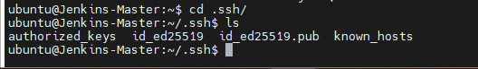

- on Client machine
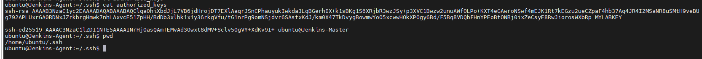


Open the public IP address from Jenkins Master and install the Jenkins GUI
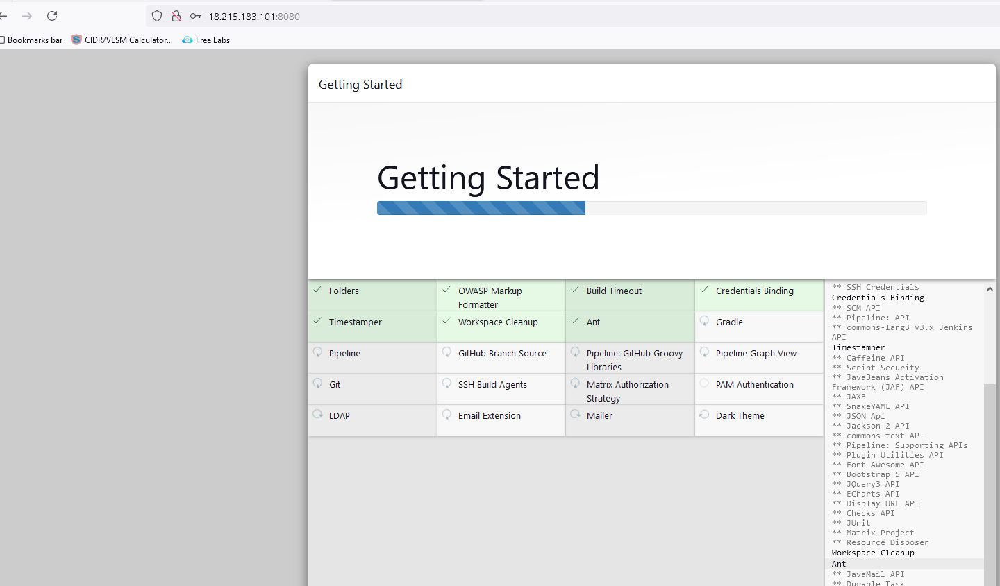


from GUI console
    Dashboard >     Nodes >     Built-In Node >     Configure
    change to ```0```from 2.
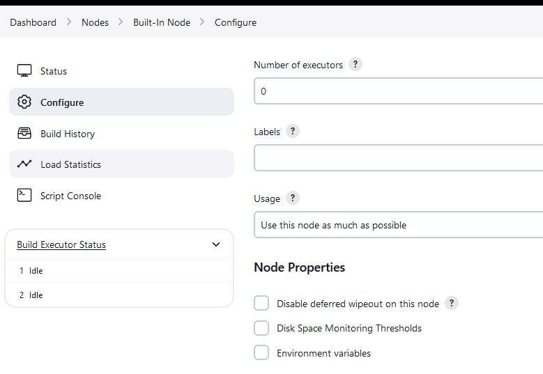


will configure the Jenkins agent
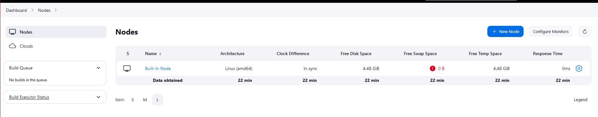
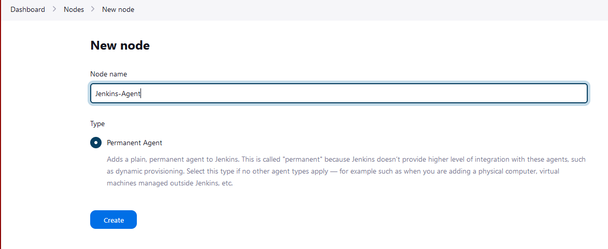


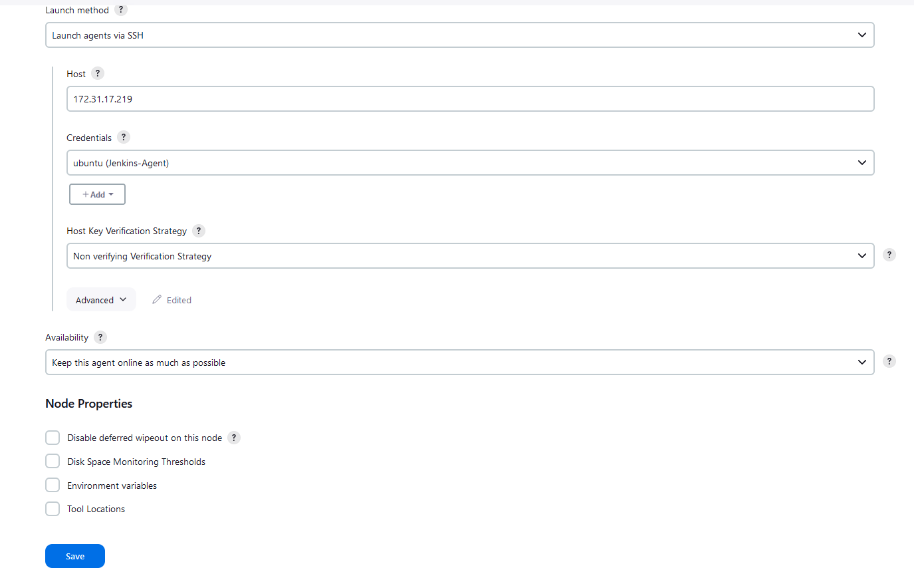

To verify that we will create a pipeline.

- create a test pipeline and select the hello world.
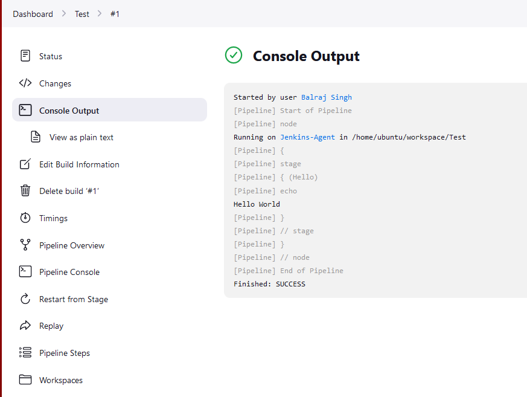

*Note*--will delete the test pipeline, it was created for test and verify (Jenkins agent) purpose only.

## 02. Integrate Maven to Jenkins and Add Github Credentails to Jenkins.

will install the plugins -

- Maven Integration
- Pipeline Maven Integration Version 
- Eclipse Temurin installer
- Stage View


Configure the plugins.
Dashboard
Manage Jenkins
Tools 
Maven installations 
add maven


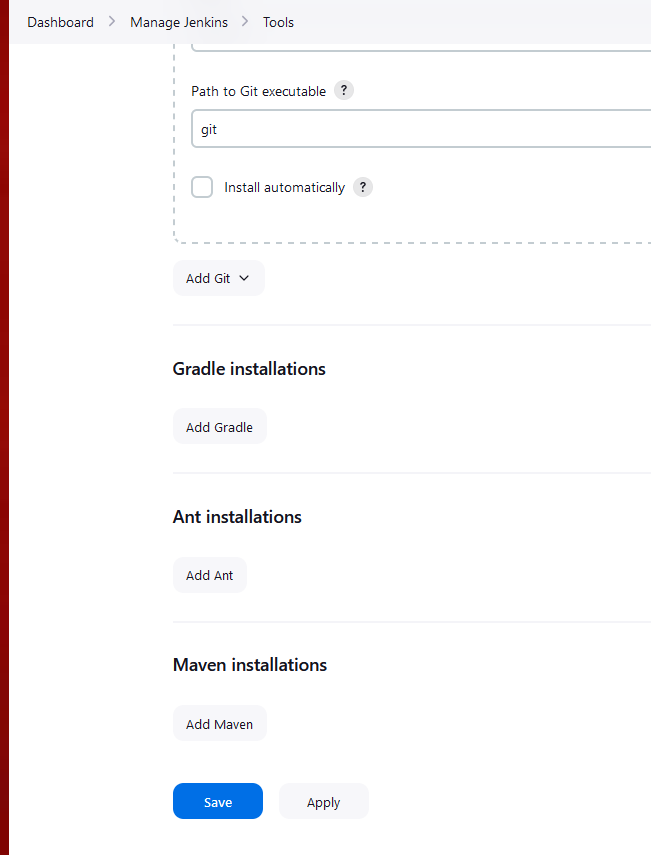
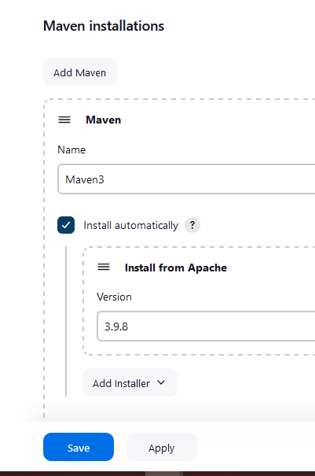

Dashboard
Manage Jenkins
Tools 
JDK installations 
add JDK

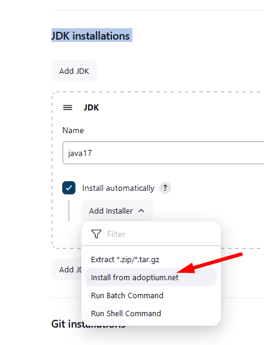
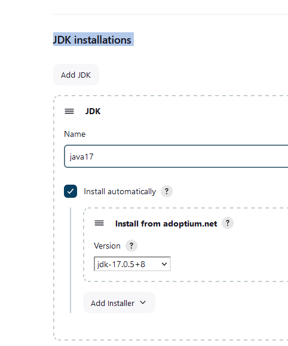

Now, we will configure the github credentail.

    Dashboard
    Manage Jenkins
    Credentials
    System
    Global credentials (unrestricted)


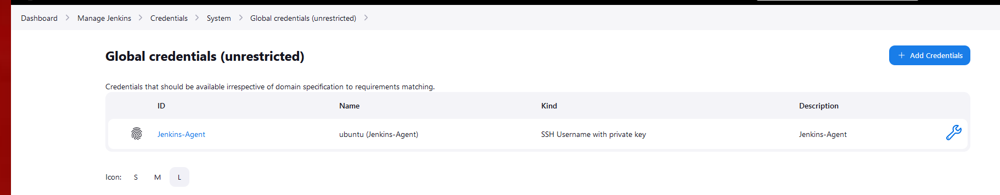

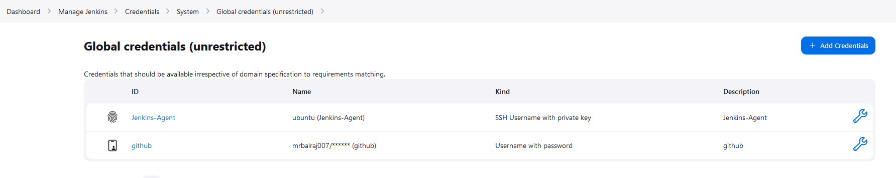


## 03.  Create Pipeline Script (Jenkinsfile) for Build & Test Artifacts and create CI job on Jenkins
will create a file ```Jenkinsfile``` in repo ```https://github.com/mrbalraj007/register-app```
```sh
pipeline {
    agent { label 'Jenkins-Agent' }
    tools {
        jdk 'Java17'
        maven 'Maven3'
    }
    stages{
        stage("Cleanup Workspace"){
                steps {
                cleanWs()
                }
        }

        stage("Checkout from SCM"){
                steps {
                    git branch: 'main', credentialsId: 'github', url: 'https://github.com/mrbalraj007/register-app' 
                }
        }

        stage("Build Application"){
            steps {
                sh "mvn clean package"
            }

       }

       stage("Test Application"){
           steps {
                 sh "mvn test"
           }
       }
    }
}
```
will create a pipeline and configure as below-
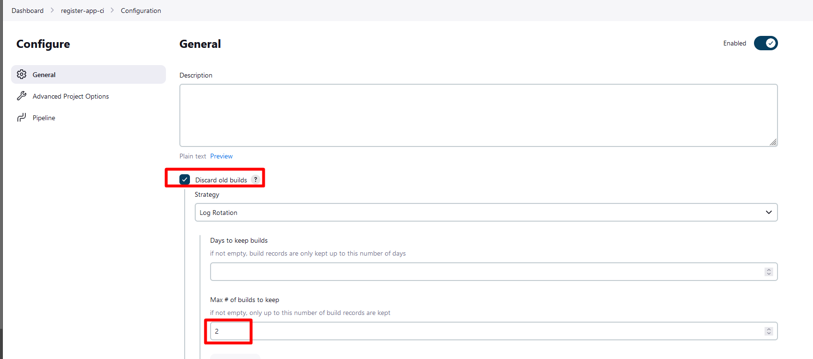
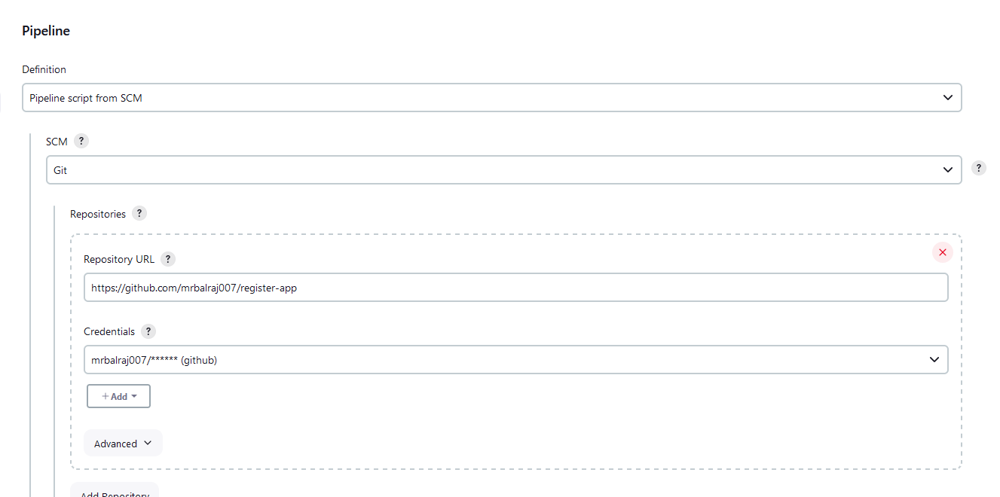
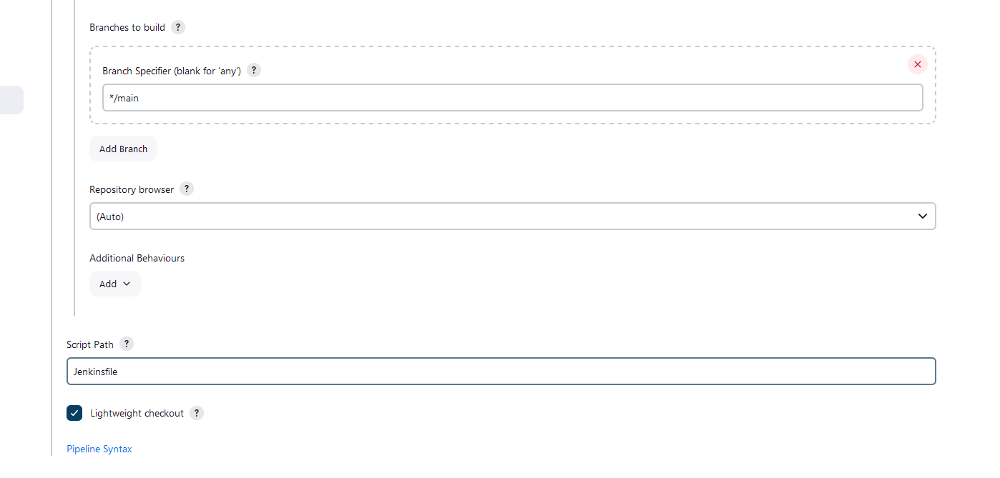


## 04.  Install and configure the SonarQube

create a new instance T3.medium
disk is 15Gb

sudo apt update

 #### Add PostgresSQL repository
 ```sh
 sudo sh -c 'echo "deb http://apt.postgresql.org/pub/repos/apt $(lsb_release -cs)-pgdg main" > /etc/apt/sources.list.d/pgdg.list'
 wget -qO- https://www.postgresql.org/media/keys/ACCC4CF8.asc | sudo tee /etc/apt/trusted.gpg.d/pgdg.asc &>/dev/null
```
#### Install PostgreSQL
```sh
sudo apt update
sudo apt-get -y install postgresql postgresql-contrib
sudo systemctl enable postgresql
```
#### Create Database for Sonarqube
```sh
 sudo passwd postgres   # password is "postgreys"
 su - postgres
 createuser sonar
 psql 
 ALTER USER sonar WITH ENCRYPTED password 'sonar';
 CREATE DATABASE sonarqube OWNER sonar;
 grant all privileges on DATABASE sonarqube to sonar;
 \q
 exit
```  
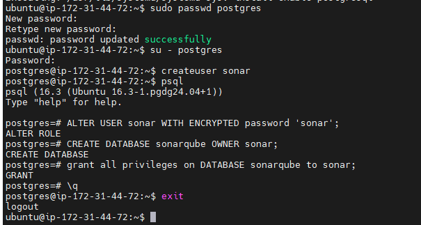

#### Add Adoptium repository
```sh
sudo bash
# wget -O - https://packages.adoptium.net/artifactory/api/gpg/key/public | tee c/apt/keyrings/adoptium.asc
# echo "deb [signed-by=/etc/apt/keyrings/adoptium.asc] https://packages.adoptium.net/artifactory/deb $(awk -F= '/^VERSION_CODENAME/{print$2}' /etc/os-release)in" | tee /etc/apt/sources.list.d/adoptium.list
sudo mkdir -p /etc/apt/keyrings
wget -O - https://packages.adoptium.net/artifactory/api/gpg/key/public | sudo tee /etc/apt/keyrings/adoptium.asc
VERSION_CODENAME=$(awk -F= '/^VERSION_CODENAME/{print $2}' /etc/os-release)
echo "deb [signed-by=/etc/apt/keyrings/adoptium.asc] https://packages.adoptium.net/artifactory/deb ${VERSION_CODENAME} main" | sudo tee /etc/apt/sources.list.d/adoptium.list
sudo apt update
```


#### install Java 17
```sh
apt update
apt install temurin-17-jdk
update-alternatives --config java
/usr/bin/java --version
exit 
```
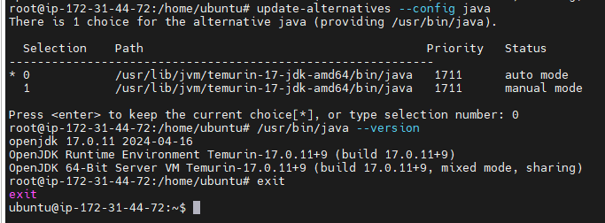

#### Linux Kernel Tuning
   01.  Increase Limits
```sh
sudo vim /etc/security/limits.conf

    # Paste the below values at the bottom of the file
    sonarqube   -   nofile   65536
    sonarqube   -   nproc    4096
```
##### Increase Mapped Memory Regions
```sh
sudo vim /etc/sysctl.conf
    # Paste the below values at the bottom of the file
    vm.max_map_count = 262144
```
```reboot``` the SonarQube 
meanwhile we have to open ```9000``` port is SG because SonarQube will be accessible on the same port.

## Sonarqube Installation 
#### Download and Extract
```sh
sudo wget https://binaries.sonarsource.com/Distribution/sonarqube/sonarqube-9.9.0.65466.zip
sudo apt install unzip
sudo unzip sonarqube-9.9.0.65466.zip -d /opt
sudo mv /opt/sonarqube-9.9.0.65466 /opt/sonarqube
```
#### Create user and set permissions
```sh
sudo groupadd sonar
sudo useradd -c "user to run SonarQube" -d /opt/sonarqube -g sonar sonar
sudo chown sonar:sonar /opt/sonarqube -R
```
#### Update Sonarqube properties with DB credentials
```sh
sudo vim /opt/sonarqube/conf/sonar.properties

#Find and replace the below values, you might need to add the sonar.jdbc.url
sonar.jdbc.username=sonar
sonar.jdbc.password=sonar
sonar.jdbc.url=jdbc:postgresql://localhost:5432/sonarqube
```
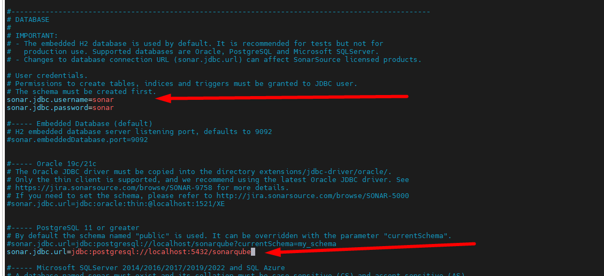

#### Create service for Sonarqube
```sh
$ sudo vim /etc/systemd/system/sonar.service

# Paste the below into the file
[Unit]
Description=SonarQube service
After=syslog.target network.target

[Service]
Type=forking

ExecStart=/opt/sonarqube/bin/linux-x86-64/sonar.sh start
ExecStop=/opt/sonarqube/bin/linux-x86-64/sonar.sh stop

User=sonar
Group=sonar
Restart=always
LimitNOFILE=65536
LimitNPROC=4096

[Install]
WantedBy=multi-user.target
```

#### Start Sonarqube and Enable service
```sh
sudo systemctl start sonar
sudo systemctl enable sonar
sudo systemctl status sonar
```
#### Watch log files and monitor for startup
```sh
sudo tail -f /opt/sonarqube/logs/sonar.log
```
will try to access SonarQube with help of Public IP of SonarQube Server on port ```9000```
user-admin
password- S0n@rQub$

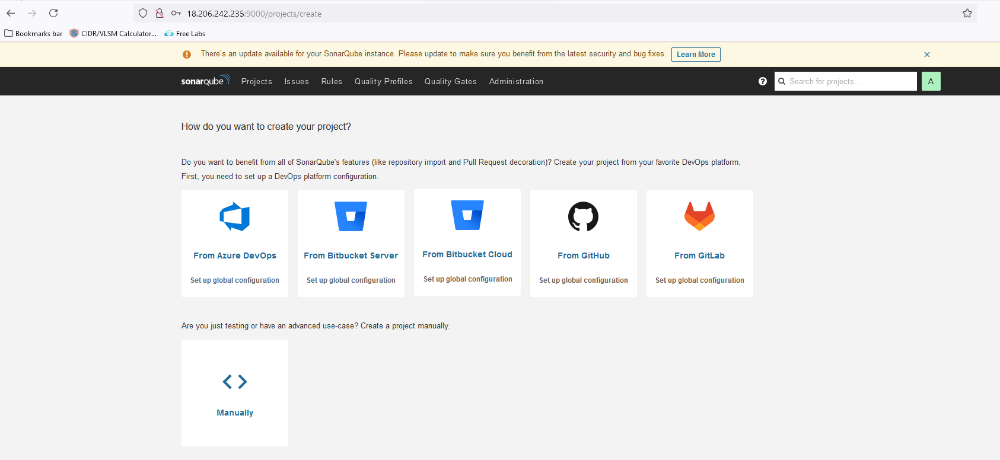

## 05. Integrate SonarQube with Jenkins
my account> Security>Generate new Token>
```bash
name: jenkins-sonarqube
Type:Global Analysis Token
expire: never
```
sqa_bec3a2fd0315a7858d892d625dc1840ff58e9177
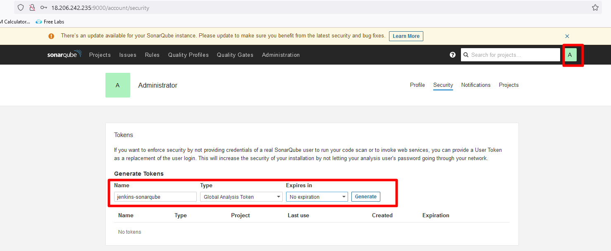


Now, we have to configure the sonar token in jenkins
    Dashboard
    Manage Jenkins
    Credentials
    System
    Global credentials (unrestricted)
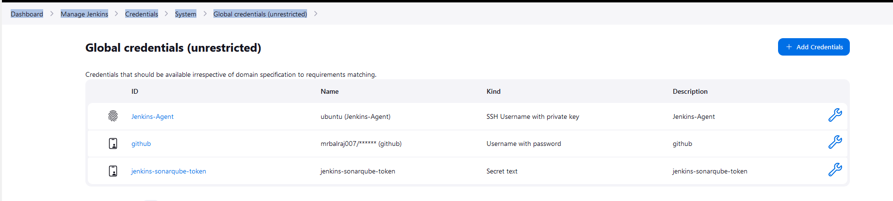

will install the plug-in
-SonarQube Scanner
-Sonar Quality Gates
-Quality Gates

now, we will configure the SonarQube
    Dashboard
    Manage Jenkins
    System
SonarQube installations > Add SonarQube
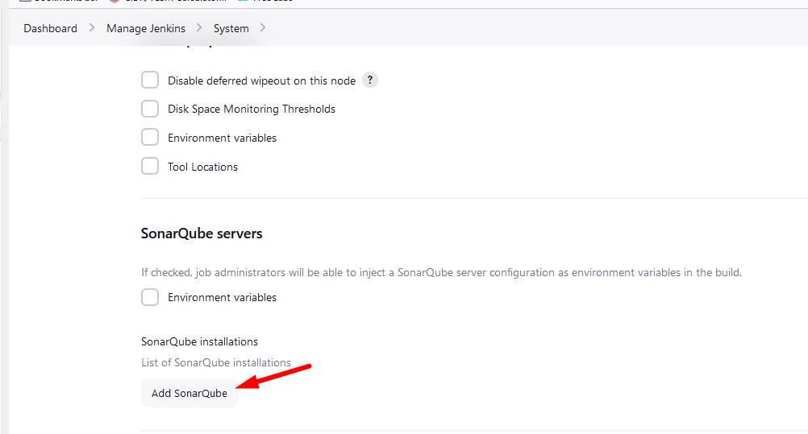
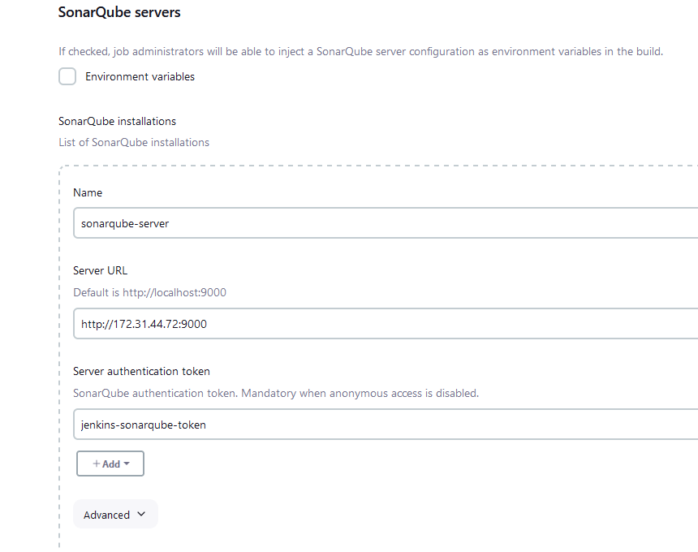

Dashboard
Manage Jenkins
Tools
SonarQube Scanner installations >Add SonarQube Scanner
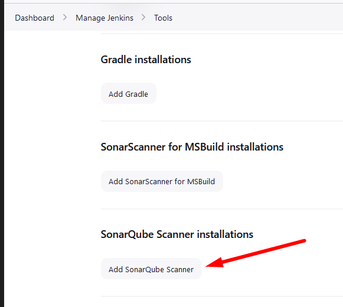
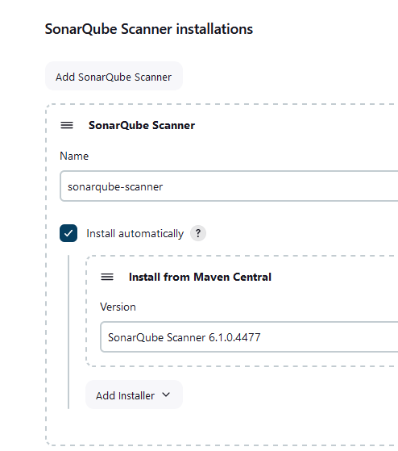

Now, we will add new state in ```Jenkinsfile``` in github
```sh
pipeline {
    agent { label 'Jenkins-Agent' }
    tools {
        jdk 'Java17'
        maven 'Maven3'
    }
    stages{
        stage("Cleanup Workspace"){
                steps {
                cleanWs()
                }
        }

        stage("Checkout from SCM"){
                steps {
                    git branch: 'main', credentialsId: 'github', url: 'https://github.com/mrbalraj007/register-app' 
                }
        }

        stage("Build Application"){
            steps {
                sh "mvn clean package"
            }

       }

       stage("Test Application"){
           steps {
                 sh "mvn test"
           }
       }
       stage("SonarQube Analysis"){
           steps {
	           script {
		        withSonarQubeEnv(credentialsId: 'jenkins-sonarqube-token') { 
                        sh "mvn sonar:sonar"
		        }
	           }	
           }
       }
    }
}
```
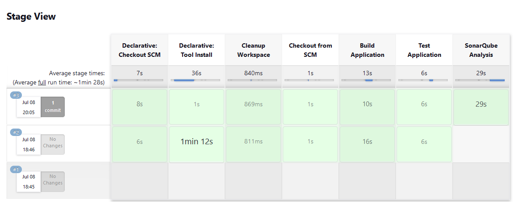
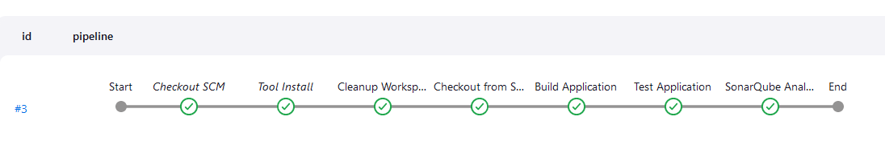

view from sonarqube
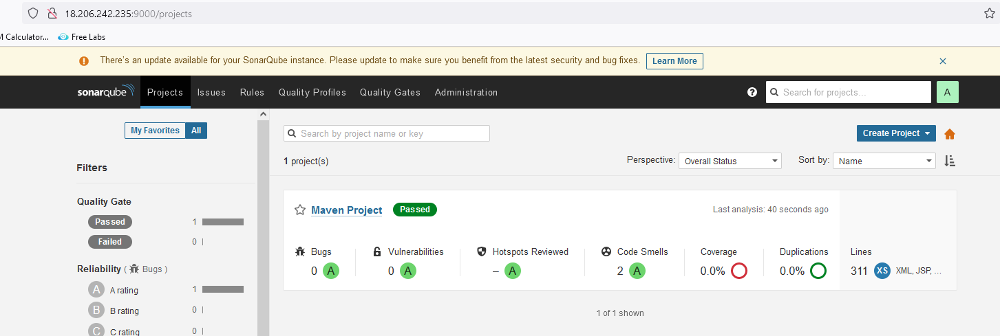

Now, we will be configuring the ```webhook``` in SonarQube
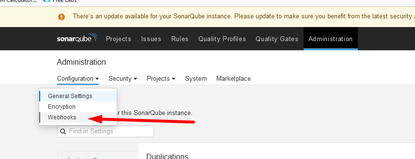
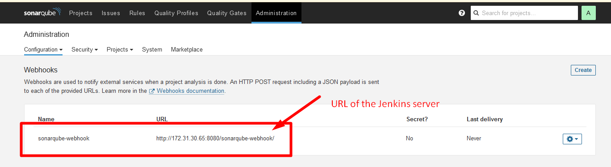

Now, we will add new state in ```Jenkinsfile``` in github
```sh
pipeline {
    agent { label 'Jenkins-Agent' }
    tools {
        jdk 'Java17'
        maven 'Maven3'
    }
    stages{
        stage("Cleanup Workspace"){
                steps {
                cleanWs()
                }
        }

        stage("Checkout from SCM"){
                steps {
                    git branch: 'main', credentialsId: 'github', url: 'https://github.com/mrbalraj007/register-app' 
                }
        }

        stage("Build Application"){
            steps {
                sh "mvn clean package"
            }

       }

       stage("Test Application"){
           steps {
                 sh "mvn test"
           }
       }
       stage("SonarQube Analysis"){
           steps {
	           script {
		        withSonarQubeEnv(credentialsId: 'jenkins-sonarqube-token') { 
                        sh "mvn sonar:sonar"
		        }
	           }	
           }
       }
       stage("Quality Gate"){
           steps {
               script {
                    waitForQualityGate abortPipeline: false, credentialsId: 'jenkins-sonarqube-token'
                }	
            }

        }

    }
}
```
Again, run the pipeline now.
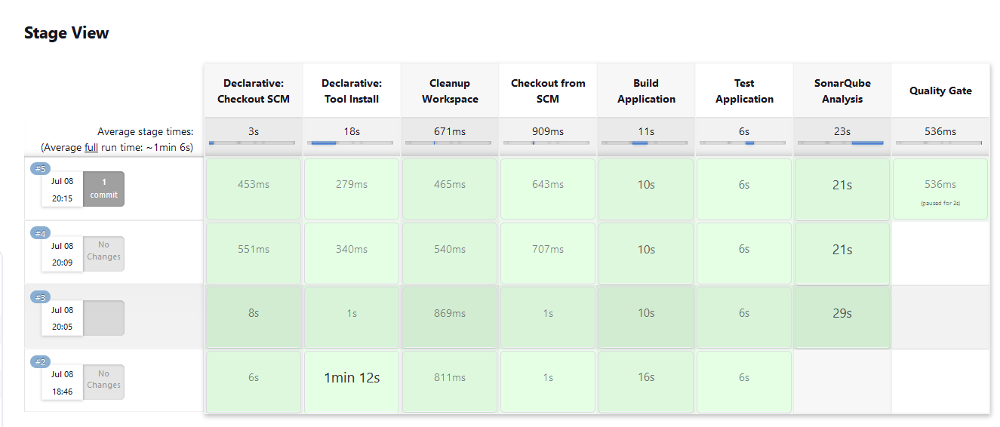

## 06. Build and Push Docker Image using Pipeline Script

Will install plug-in in Jenkins as below-
- Docker
- Docker Commons
- Docker Pipeline
- Docker API
- docker-build-step
- CloudBees Docker Build and Publish

+ add dockerhub cridential in Jenkins
    Dashboard
    Manage Jenkins
    Credentials
    System
    Global credentials (unrestricted)
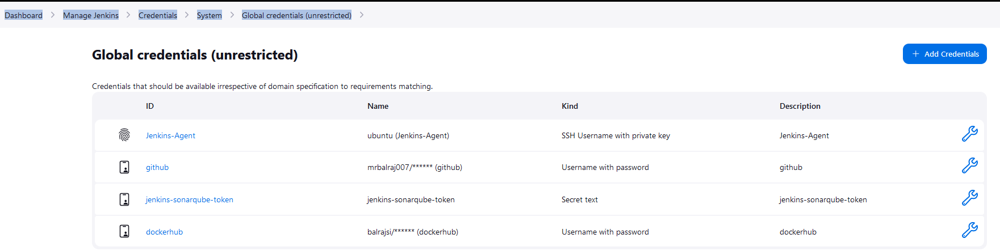

- will add the environment variable in Jenkins file.
```sh
pipeline {
    agent { label 'Jenkins-Agent' }
    tools {
        jdk 'Java17'
        maven 'Maven3'
    }
    environment {
	    APP_NAME = "register-app-pipeline"
            RELEASE = "1.0.0"
            DOCKER_USER = "balrajsi"
            DOCKER_PASS = 'dockerhub'
            IMAGE_NAME = "${DOCKER_USER}" + "/" + "${APP_NAME}"
            IMAGE_TAG = "${RELEASE}-${BUILD_NUMBER}"
	}
    stages{
        stage("Cleanup Workspace"){
                steps {
                cleanWs()
                }
        }

        stage("Checkout from SCM"){
                steps {
                    git branch: 'main', credentialsId: 'github', url: 'https://github.com/mrbalraj007/register-app' 
                }
        }

        stage("Build Application"){
            steps {
                sh "mvn clean package"
            }

       }

       stage("Test Application"){
           steps {
                 sh "mvn test"
           }
       }
       stage("SonarQube Analysis"){
           steps {
	           script {
		        withSonarQubeEnv(credentialsId: 'jenkins-sonarqube-token') { 
                        sh "mvn sonar:sonar"
		        }
	           }	
           }
       }
       stage("Quality Gate"){
           steps {
               script {
                    waitForQualityGate abortPipeline: false, credentialsId: 'jenkins-sonarqube-token'
                }	
            }

        }
       stage("Build & Push Docker Image") {
            steps {
                script {
                    docker.withRegistry('',DOCKER_PASS) {
                        docker_image = docker.build "${IMAGE_NAME}"
                    }

                    docker.withRegistry('',DOCKER_PASS) {
                        docker_image.push("${IMAGE_TAG}")
                        docker_image.push('latest')
                    }
                }
            }

       } 
    }
}
```
Rerun the build and see if image is pushed on docker hub or not.
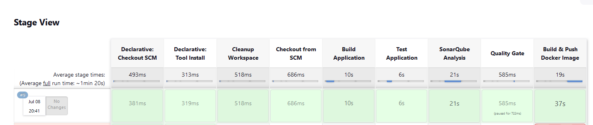

Image is visible in Docker hub
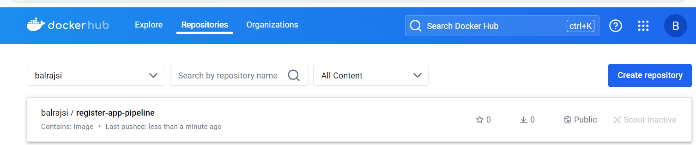


## 08. will add two more stage (Trivy + Cleanup Artifacts) using Pipeline Script
```sh
pipeline {
    agent { label 'Jenkins-Agent' }
    tools {
        jdk 'Java17'
        maven 'Maven3'
    }
    environment {
	    APP_NAME = "register-app-pipeline"
            RELEASE = "1.0.0"
            DOCKER_USER = "balrajsi"
            DOCKER_PASS = 'dockerhub'
            IMAGE_NAME = "${DOCKER_USER}" + "/" + "${APP_NAME}"
            IMAGE_TAG = "${RELEASE}-${BUILD_NUMBER}"
	}
    stages{
        stage("Cleanup Workspace"){
                steps {
                cleanWs()
                }
        }

        stage("Checkout from SCM"){
                steps {
                    git branch: 'main', credentialsId: 'github', url: 'https://github.com/mrbalraj007/register-app' 
                }
        }

        stage("Build Application"){
            steps {
                sh "mvn clean package"
            }

       }

       stage("Test Application"){
           steps {
                 sh "mvn test"
           }
       }
       stage("SonarQube Analysis"){
           steps {
	           script {
		        withSonarQubeEnv(credentialsId: 'jenkins-sonarqube-token') { 
                        sh "mvn sonar:sonar"
		        }
	           }	
           }
       }
       stage("Quality Gate"){
           steps {
               script {
                    waitForQualityGate abortPipeline: false, credentialsId: 'jenkins-sonarqube-token'
                }	
            }

        }
       stage("Build & Push Docker Image") {
            steps {
                script {
                    docker.withRegistry('',DOCKER_PASS) {
                        docker_image = docker.build "${IMAGE_NAME}"
                    }

                    docker.withRegistry('',DOCKER_PASS) {
                        docker_image.push("${IMAGE_TAG}")
                        docker_image.push('latest')
                    }
                }
            }

       }
       stage("Trivy Scan") {
           steps {
               script {
	            sh ('docker run -v /var/run/docker.sock:/var/run/docker.sock aquasec/trivy image balrajsi/register-app-pipeline:latest --no-progress --scanners vuln  --exit-code 0 --severity HIGH,CRITICAL --format table')
               }
           }
       }

       stage ('Cleanup Artifacts') {
           steps {
               script {
                    sh "docker rmi ${IMAGE_NAME}:${IMAGE_TAG}"
                    sh "docker rmi ${IMAGE_NAME}:latest"
               }
          }
       }
 
    }
}
```
Outcomes:
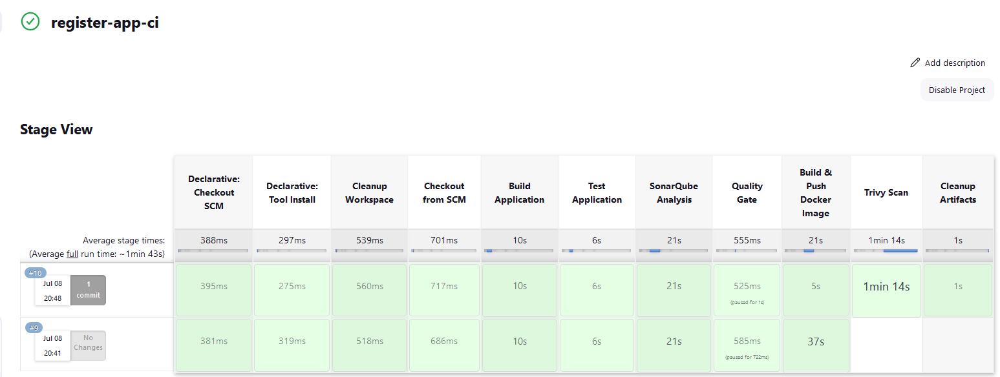
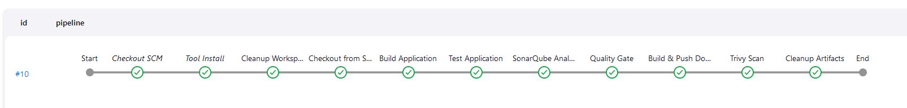

## 09. Setup Bootstrap Server for eksctl and Setup Kubernetes using eksctl
[Ref link](https://docs.aws.amazon.com/cli/latest/userguide/getting-started-install.html)

```sh
sudo su
curl "https://awscli.amazonaws.com/awscli-exe-linux-x86_64.zip" -o "awscliv2.zip"
apt install unzip && unzip awscliv2.zip
sudo ./aws/install
         OR
# sudo yum remove -y aws-cli
# pip3 install --user awscli

sudo ln -s $HOME/.local/bin/aws /usr/bin/aws
aws --version
```

## Installing kubectl
[Ref Link]()https://docs.aws.amazon.com/eks/latest/userguide/install-kubectl.html)
```sh
sudo su
curl -O https://s3.us-west-2.amazonaws.com/amazon-eks/1.27.1/2023-04-19/bin/linux/amd64/kubectl
ll # To list the permission.
chmod +x ./kubectl  #Gave executable permisions
mv kubectl /bin   #Because all our executable files are in /bin
kubectl version --output=yaml
```
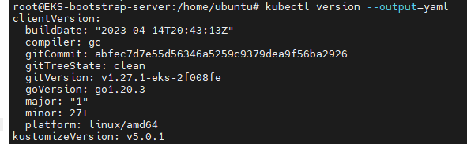


## Installing  eksctl
[Ref Link](https://github.com/eksctl-io/eksctl/blob/main/README.md#installation)

```sh
curl --silent --location "https://github.com/weaveworks/eksctl/releases/latest/download/eksctl_$(uname -s)_amd64.tar.gz" | tar xz -C /tmp
cd /tmp && ll
sudo mv /tmp/eksctl /bin
eksctl version
```
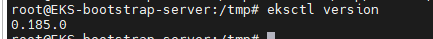

Now, we will create a new role and assign it to ```EKS-boot-strap``` EC2 instance.
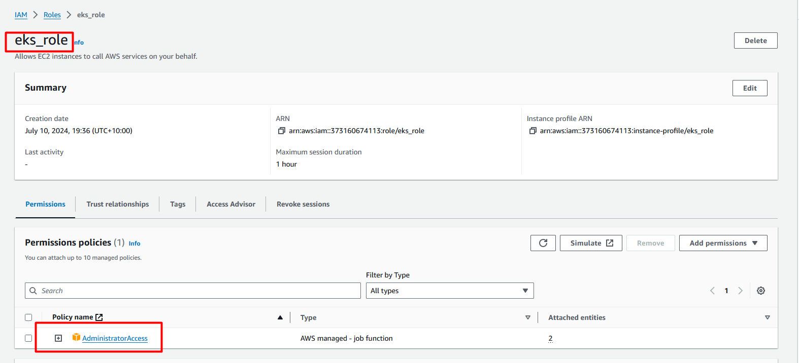
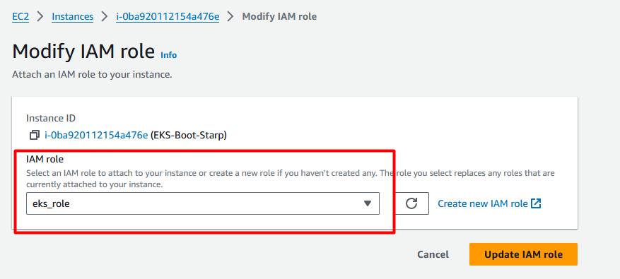

## Setup Kubernetes using eksctl

[Ref Link](https://github.com/aws-samples/eks-workshop/issues/734)

*To create a cluster it will take approx 20-30 min*
```sh
eksctl create cluster --name virtualtechbox-cluster \
--region us-east-1 \
--node-type t2.small \
--nodes 3
```
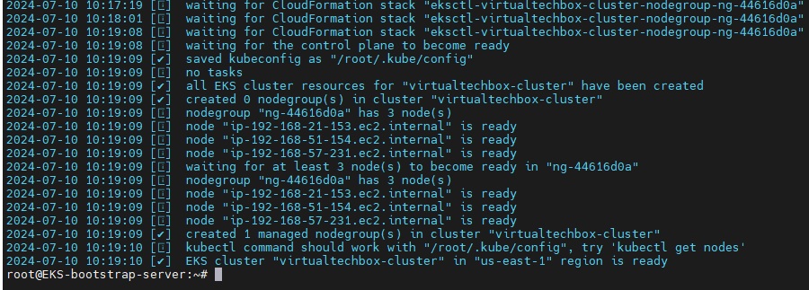

View from AWS GUI console:

CloudFormation:
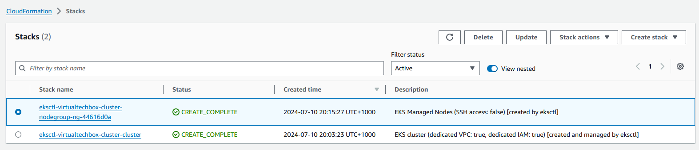

Amazon Elastic Kubernetes Service:
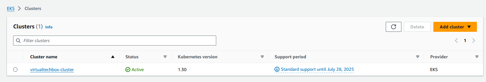


- Verify the nodes in EKS cluster
```sh
$ kubectl get nodes
```
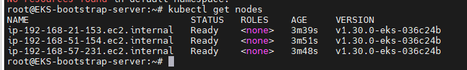

---
## 10. ```ArgoCD``` Installation on ```EKS cluster``` and add ```EKS cluster``` to ```ArgoCD``` 
---
+ Will create a ```argocd``` namespace
```sh
kubectl create namespace argocd
```
+ Apply the ```yaml configuration files``` for ArgoCd
```sh
kubectl apply -n argocd -f https://raw.githubusercontent.com/argoproj/argo-cd/stable/manifests/install.yaml
```
+ Get the ```pods``` details in the ArgoCD namespace.
```sh
kubectl get pods -n argocd
```
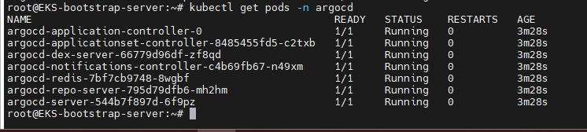

+ We need to deploy the ``CLI``` to interact with the API Server
```sh
curl --silent --location -o /usr/local/bin/argocd https://github.com/argoproj/argo-cd/releases/download/v2.4.7/argocd-linux-amd64

chmod +x /usr/local/bin/argocd
```
+ Expose argocd-server
```sh
kubectl patch svc argocd-server -n argocd -p '{"spec": {"type": "LoadBalancer"}}'
```

+ Wait about ```2 to 5``` minutes for the LoadBalancer creation
```sh
kubectl get svc -n argocd
```
```bash
root@EKS-bootstrap-server:~# kubectl get svc -n argocd
NAME                                      TYPE           CLUSTER-IP       EXTERNAL-IP                                                               PORT(S)                      AGE
argocd-applicationset-controller          ClusterIP      10.100.175.129   <none>                                                                    7000/TCP,8080/TCP            5m7s
argocd-dex-server                         ClusterIP      10.100.60.177    <none>                                                                    5556/TCP,5557/TCP,5558/TCP   5m6s
argocd-metrics                            ClusterIP      10.100.142.173   <none>                                                                    8082/TCP                     5m6s
argocd-notifications-controller-metrics   ClusterIP      10.100.176.219   <none>                                                                    9001/TCP                     5m6s
argocd-redis                              ClusterIP      10.100.241.138   <none>                                                                    6379/TCP                     5m6s
argocd-repo-server                        ClusterIP      10.100.219.125   <none>                                                                    8081/TCP,8084/TCP            5m6s
argocd-server                             LoadBalancer   10.100.236.79    ac8e71a8016854349ad07567995e663f-1145943002.us-east-1.elb.amazonaws.com   80:32549/TCP,443:32499/TCP   5m6s
argocd-server-metrics                     ClusterIP      10.100.68.224    <none>                                                                    8083/TCP                     5m6s
```
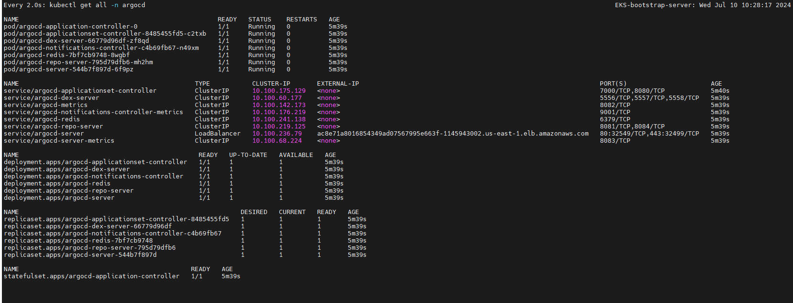

Note it down the EXTERNAL-IP ```ac8e71a8016854349ad07567995e663f-1145943002.us-east-1.elb.amazonaws.com``` details and try to open in browser and it will ask for login details. user name would be ```admin```
* - 

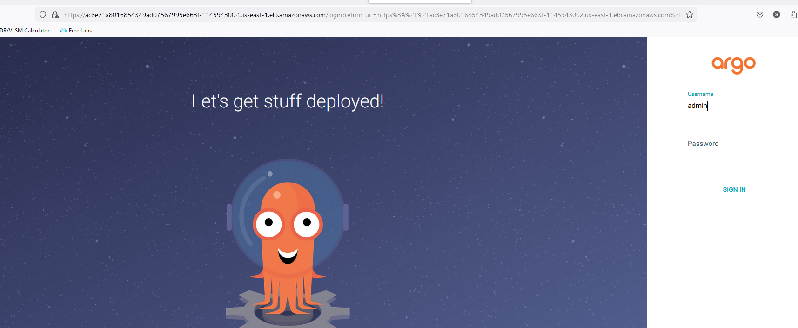

+ Get pasword for login and decode it.
```sh
kubectl -n argocd get secret argocd-initial-admin-secret -o jsonpath="{.data.password}" | base64 -d; echo
                      or
kubectl get secret argocd-initial-admin-secret -n argocd -o yaml
echo WXVpLUg2LWxoWjRkSHFmSA== | base64 --decode
```
To change the login password in argocd:<br>
UserInfo > UPDATE PASSWORD
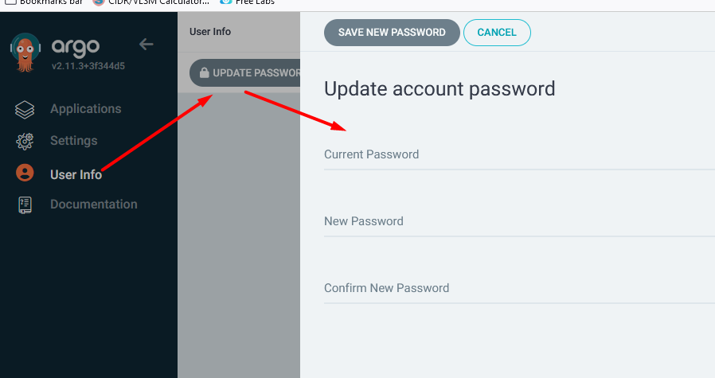

* Arg0CD@2024

## Add EKS Cluster to ArgoCD
+ login to ArgoCD from CLI
```sh
argocd login ac8e71a8016854349ad07567995e663f-1145943002.us-east-1.elb.amazonaws.com --username admin
```
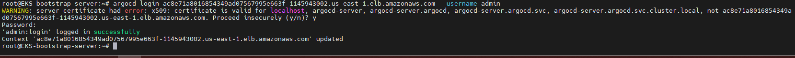

+ get the cluster details(list) 
```sh
argocd cluster list
```
```sh
argocd cluster list
SERVER                          NAME        VERSION  STATUS   MESSAGE                                                  PROJECT
https://kubernetes.default.svc  in-cluster           Unknown  Cluster has no applications and is not being monitored.
```

+ Below command will show the EKS cluster
```sh
kubectl config get-contexts
```
```bash
# kubectl config get-contexts
CURRENT   NAME                                                             CLUSTER                                      AUTHINFO                                                         NAMESPACE
*         i-0ba920112154a476e@virtualtechbox-cluster.us-east-1.eksctl.io   virtualtechbox-cluster.us-east-1.eksctl.io   i-0ba920112154a476e@virtualtechbox-cluster.us-east-1.eksctl.io

```
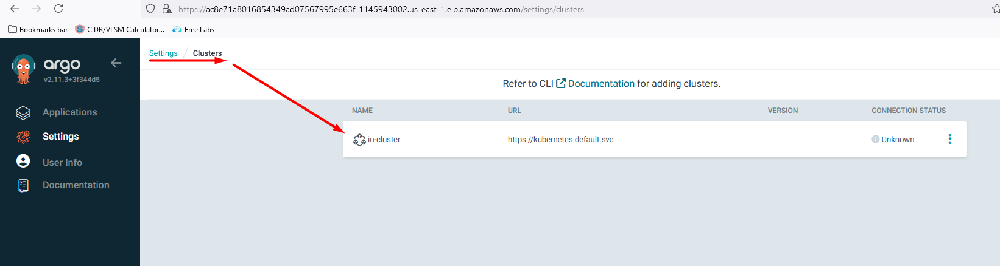

+ Add above EKS cluster to ArgoCD with below command
```sh
argocd cluster add i-0ba920112154a476e@virtualtechbox-cluster.us-east-1.eksctl.io --name virtualtechbox-eks-cluster
```
```bash
# argocd cluster list
SERVER                                                                    NAME                        VERSION  STATUS   MESSAGE                                                  PROJECT
https://8B0C21E17AF6494839E686D4A804CF45.gr7.us-east-1.eks.amazonaws.com  virtualtechbox-eks-cluster           Unknown  Cluster has no applications and is not being monitored.
https://kubernetes.default.svc                                            in-cluster                           Unknown  Cluster has no applications and is not being monitored.
```
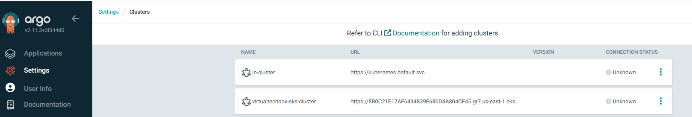


## 10. Configure ArgoCD to Deploy Pods on EKS and Automate ArgoCD Deployment Job using GitOps Github Repository.
Will use the following Repo for EKS cluster
https://github.com/mrbalraj007/gitops-register-app

Open the ArgoCd page
Setting>Repository>Connect Repo and will add the following settings.
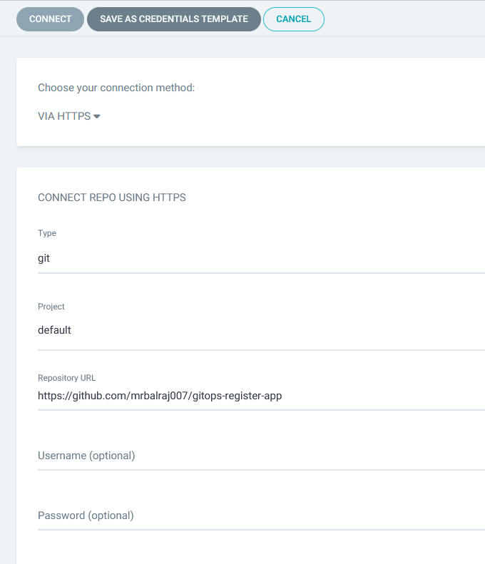

in the same repo: In deployment yml file, image name should be matched with dockerhub image.
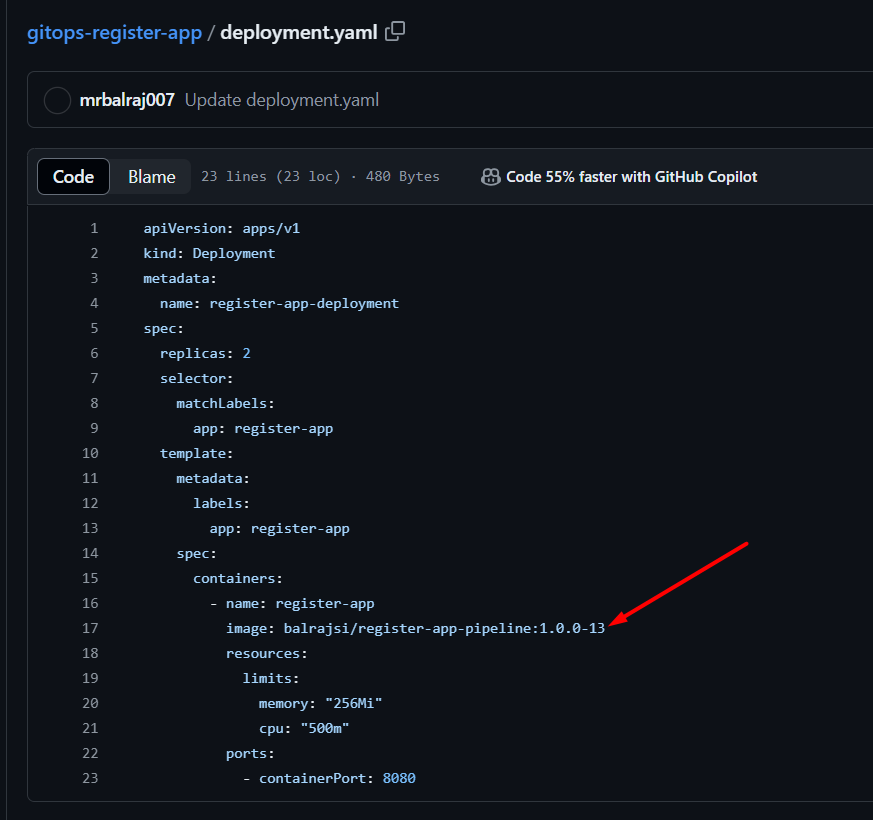
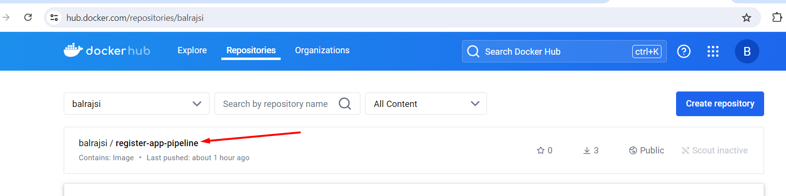
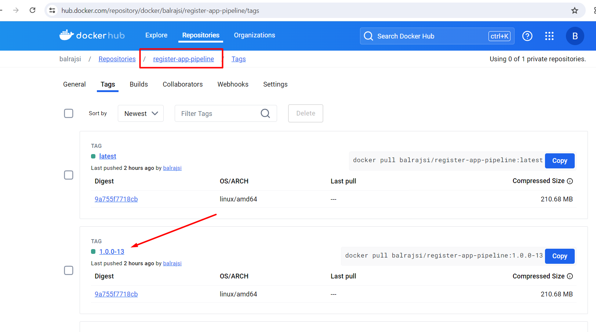

Open the argoCD page and create a new app
should be the following setting.

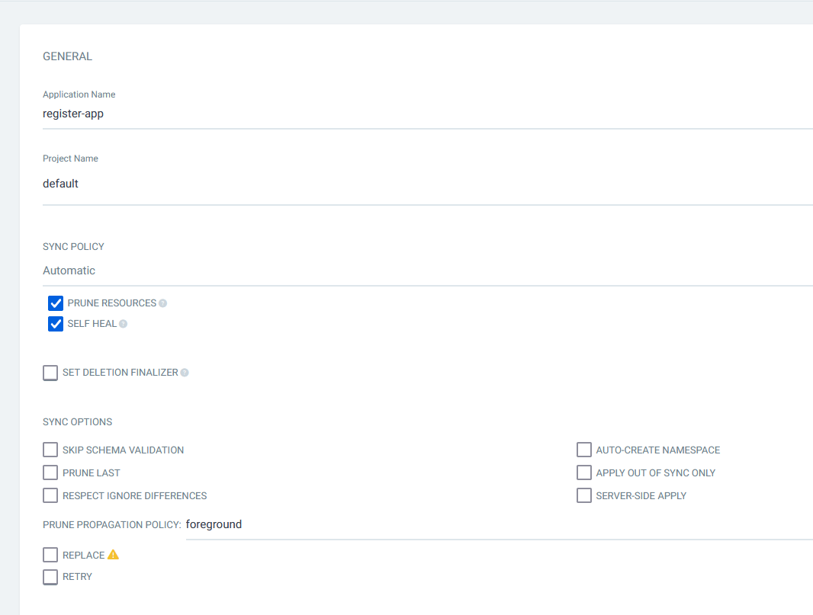
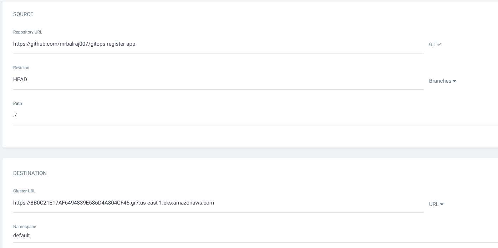

```sh
kubectl get pods
```
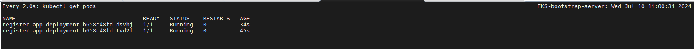

+ To Get the service
```sh
kubectl get svc
```
view from ArgoCD
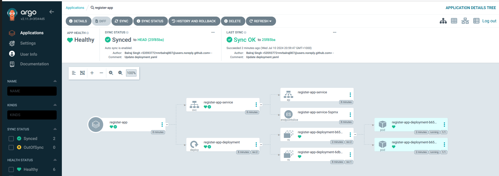

```sh
# kubectl get svc
NAME                   TYPE           CLUSTER-IP      EXTERNAL-IP                                                              PORT(S)          AGE
kubernetes             ClusterIP      10.100.0.1      <none>                                                                   443/TCP          51m
register-app-service   LoadBalancer   10.100.221.64   abe4cfd1f524742a1a8ff0b9b126e9ab-158383484.us-east-1.elb.amazonaws.com   8080:31014/TCP   6m56s
```

Will try to open in browser with EXTERNAL-IP ```abe4cfd1f524742a1a8ff0b9b126e9ab-158383484.us-east-1.elb.amazonaws.com:8080```

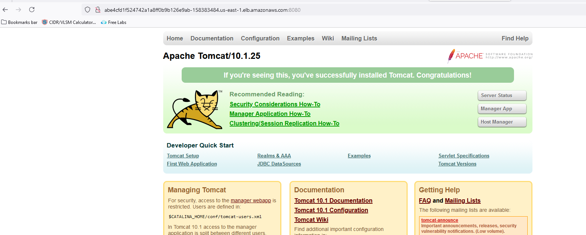

if we do```http://abe4cfd1f524742a1a8ff0b9b126e9ab-158383484.us-east-1.elb.amazonaws.com:8080/webapp``` do this then should be see the below page
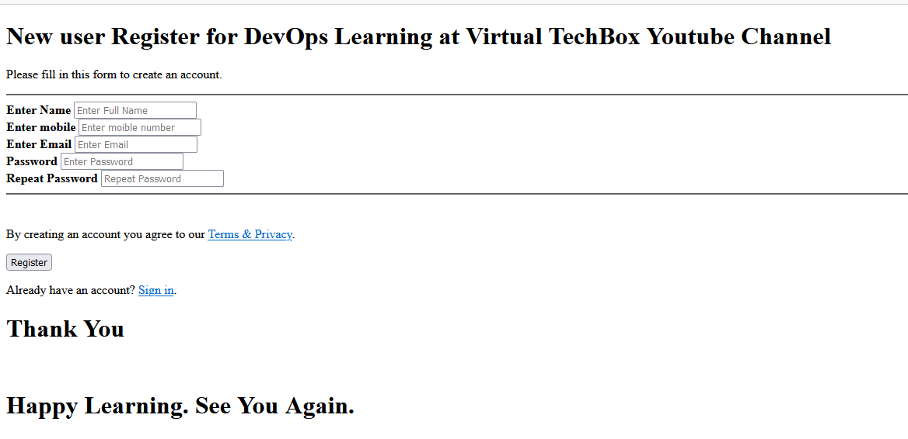

Now, we will automate it using Jenkins.

will create a new pipeline as below
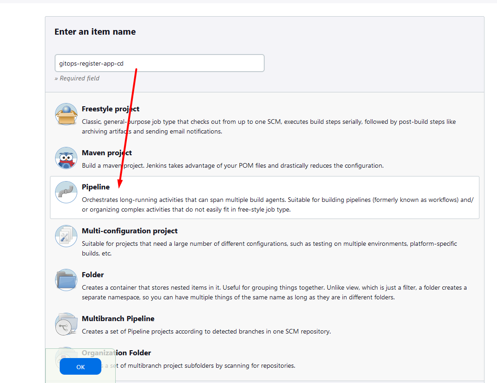
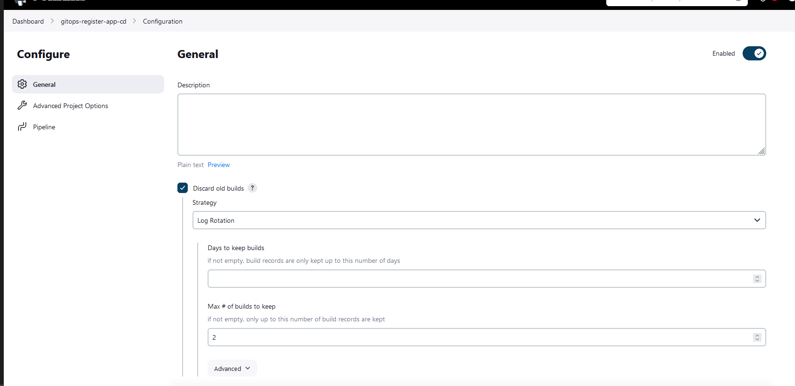
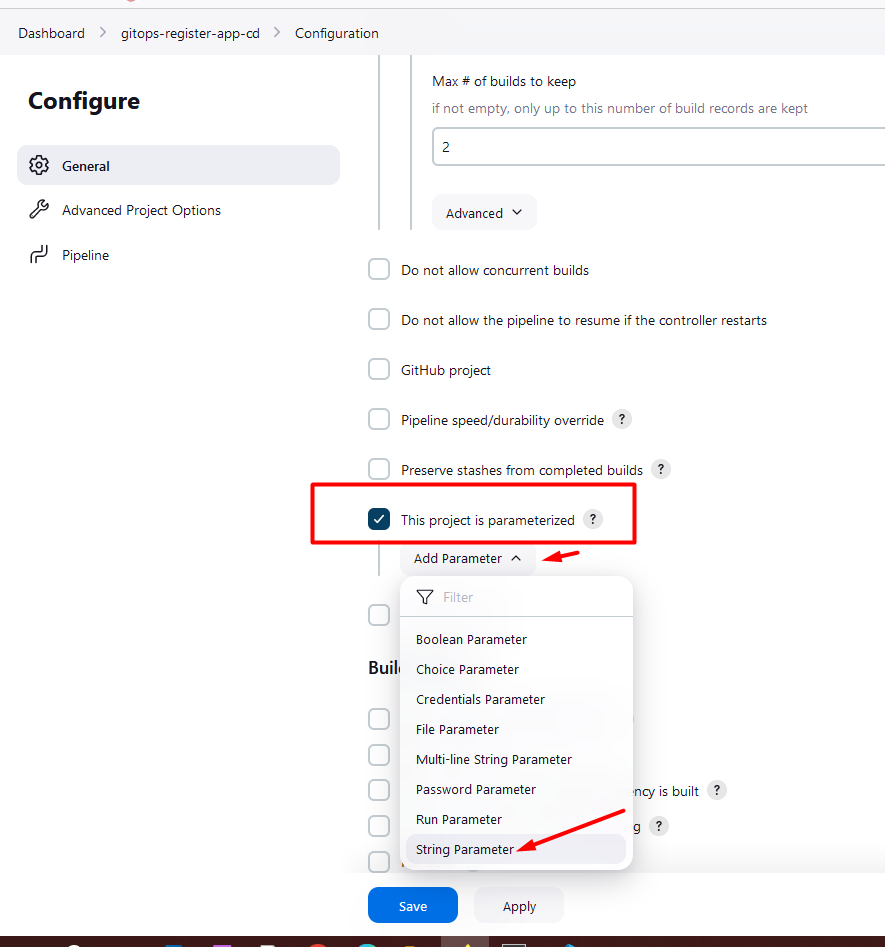

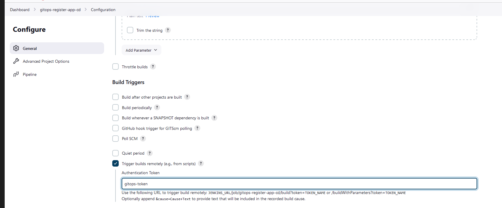


Go the jenkins and user name


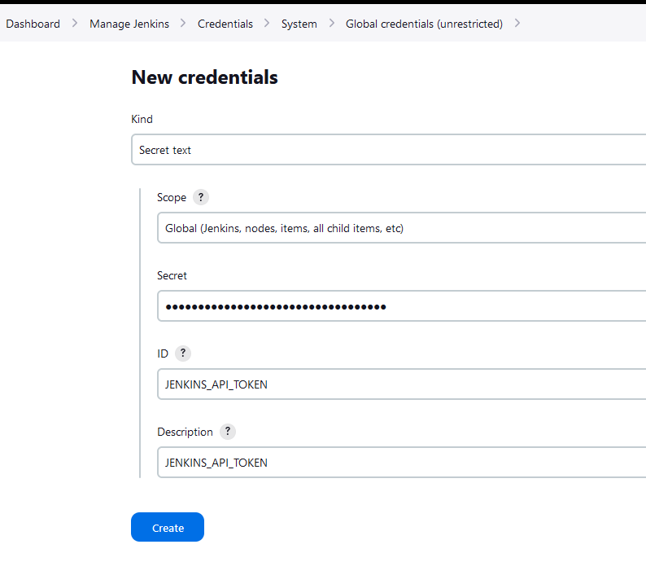
11fd6bec8b8123afc16bd9622f15eaf597

This is the pipeline script.
```sh
pipeline {
    agent { label 'Jenkins-Agent' }
    tools {
        jdk 'Java17'
        maven 'Maven3'
    }
    environment {
	    APP_NAME = "register-app-pipeline"
            RELEASE = "1.0.0"
            DOCKER_USER = "balrajsi"
            DOCKER_PASS = 'dockerhub'
            IMAGE_NAME = "${DOCKER_USER}" + "/" + "${APP_NAME}"
            IMAGE_TAG = "${RELEASE}-${BUILD_NUMBER}"
            JENKINS_API_TOKEN = credentials("JENKINS_API_TOKEN")
	}
    stages{
        stage("Cleanup Workspace"){
                steps {
                cleanWs()
                }
        }

        stage("Checkout from SCM"){
                steps {
                    git branch: 'main', credentialsId: 'github', url: 'https://github.com/mrbalraj007/register-app' 
                }
        }

        stage("Build Application"){
            steps {
                sh "mvn clean package"
            }

       }

       stage("Test Application"){
           steps {
                 sh "mvn test"
           }
       }
       stage("SonarQube Analysis"){
           steps {
	           script {
		        withSonarQubeEnv(credentialsId: 'jenkins-sonarqube-token') { 
                        sh "mvn sonar:sonar"
		        }
	           }	
           }
       }
       stage("Quality Gate"){
           steps {
               script {
                    waitForQualityGate abortPipeline: false, credentialsId: 'jenkins-sonarqube-token'
                }	
            }

        }
       stage("Build & Push Docker Image") {
            steps {
                script {
                    docker.withRegistry('',DOCKER_PASS) {
                        docker_image = docker.build "${IMAGE_NAME}"
                    }

                    docker.withRegistry('',DOCKER_PASS) {
                        docker_image.push("${IMAGE_TAG}")
                        docker_image.push('latest')
                    }
                }
            }

       }
       stage("Trivy Scan") {
           steps {
               script {
	            sh ('docker run -v /var/run/docker.sock:/var/run/docker.sock aquasec/trivy image balrajsi/register-app-pipeline:latest --no-progress --scanners vuln  --exit-code 0 --severity HIGH,CRITICAL --format table')
               }
           }
       }

       stage ('Cleanup Artifacts') {
           steps {
               script {
                    sh "docker rmi ${IMAGE_NAME}:${IMAGE_TAG}"
                    sh "docker rmi ${IMAGE_NAME}:latest"
               }
          }
       }
        stage("Trigger CD Pipeline") {
            steps {
                script {
                    sh "curl -v -k --user Balraj:${JENKINS_API_TOKEN} -X POST -H 'cache-control: no-cache' -H 'content-type: application/x-www-form-urlencoded' --data 'IMAGE_TAG=${IMAGE_TAG}' 'ec2-107-20-90-49.compute-1.amazonaws.com:8080/job/gitops-register-app-cd/buildWithParameters?token=gitops-token'"
                             # Jenkins login Name ="Balraj", define the tocken "JENKINS_API_TOKEN", "Jenkins Public DNS= ec2-107-20-90-49.compute-1.amazonaws.com", Pipename= "gitops-register-app-cd", define token name= gitops-token
                             

                }
            }
        }
    }
}
```
Now, we have to create a Jenkins file in repo ```gitops-register-app```
```sh
pipeline {
    agent { label "Jenkins-Agent" }
    environment {
              APP_NAME = "register-app-pipeline"
    }

    stages {
        stage("Cleanup Workspace") {
            steps {
                cleanWs()
            }
        }

        stage("Checkout from SCM") {
               steps {
                   git branch: 'main', credentialsId: 'github', url: 'https://github.com/balrajsi/gitops-register-app'
               }
        }

        stage("Update the Deployment Tags") {
            steps {
                sh """
                   cat deployment.yaml
                   sed -i 's/${APP_NAME}.*/${APP_NAME}:${IMAGE_TAG}/g' deployment.yaml
                   cat deployment.yaml
                """
            }
        }

        stage("Push the changed deployment file to Git") {
            steps {
                sh """
                   git config --global user.name "balrajsi"
                   git config --global user.email "mrbalraj@gmail.com"
                   git add deployment.yaml
                   git commit -m "Updated Deployment Manifest"
                """
                withCredentials([gitUsernamePassword(credentialsId: 'github', gitToolName: 'Default')]) {
                  sh "git push https://github.com/balrajsi/gitops-register-app main"
                }
            }
        }
      
    }
}
```
## Verify CI/CD Pileline by doing Test commit on Github Repo

in Ci job we will configure the ```poll SCM```
```
* * * * *
```

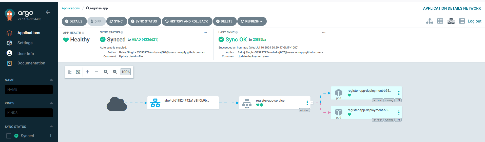


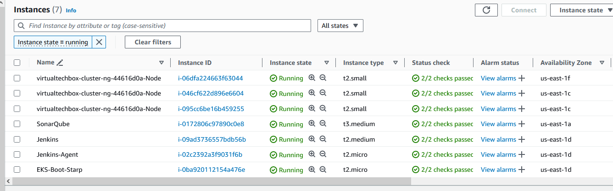


## Cleanup 
```sh
$ kubectl get all
$ kubectl delete deployment.apps/register-app-deployment  # it will delete the deployment
$ kubectl delete service/register-app-service    #it will delete the service
eksctl delete cluster virtualtechbox --region us-east-1     
                                 OR    
eksctl delete cluster --region=us-east-1 --name=virtualtechbox-cluster      #it will delete the EKS cluster
```