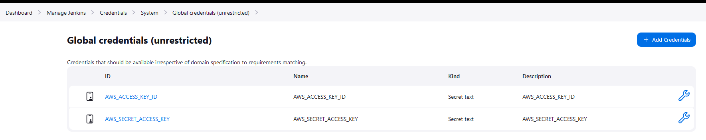
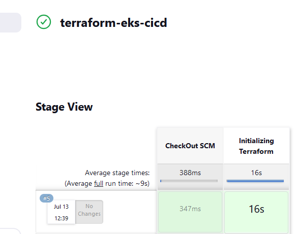
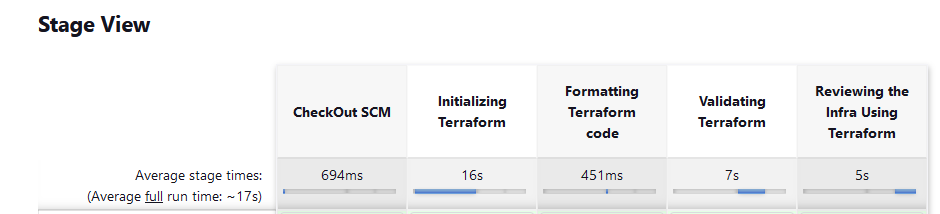
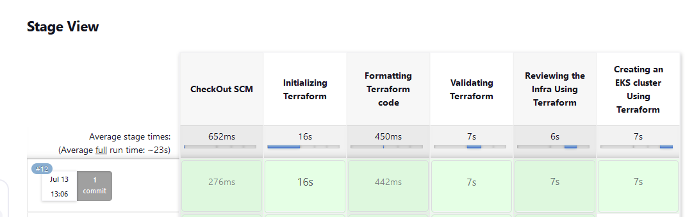
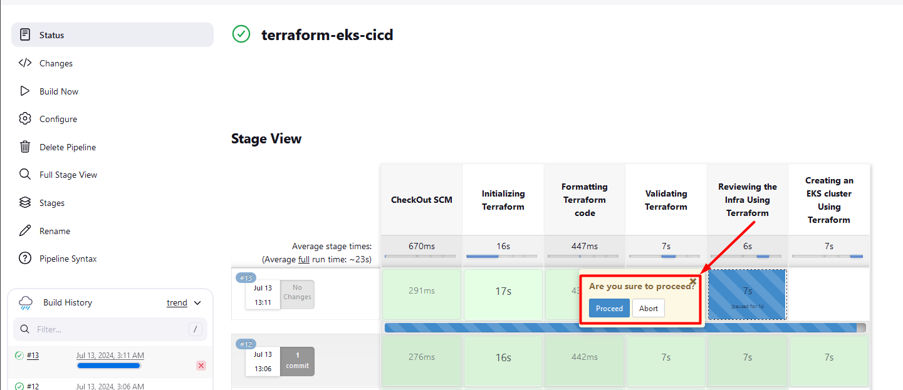
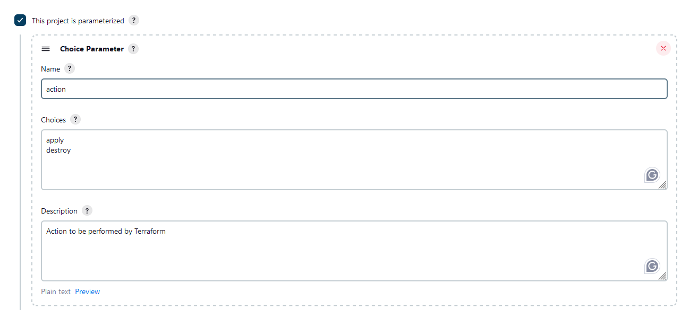
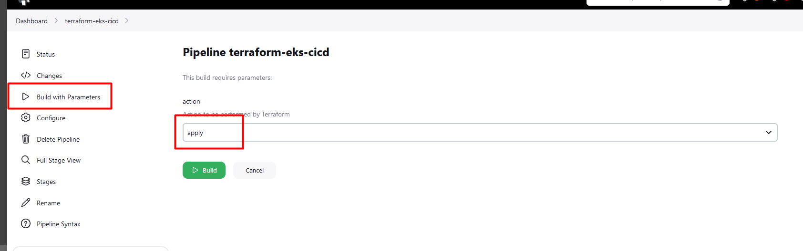
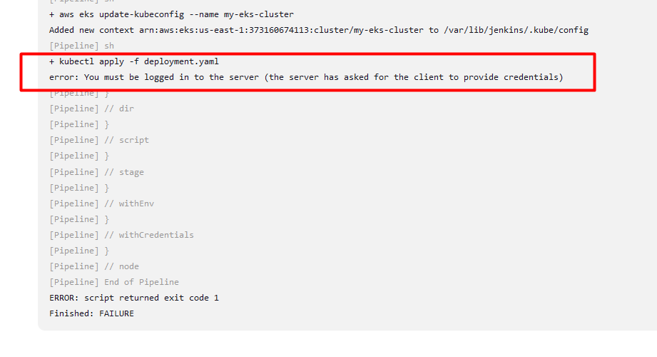

# Deploying an EKS Cluster with Terraform and Jenkins
 - *This pipeline demonstrates a secure and automated approach to creating and managing EKS clusters using Terraform within a CI/CD environment.*

pre-requisit

Terraform
kubernet
AWS account
Teraform installation
Accees Keys


action plan:
create an EC2 instansl + jenkins
write tf code- KES cluster
push the codde on github
create a jenkins like - KES cluster
deplpou the chances to aws
implement a deployment file . kubctl > nginex accessibility

* configure the AWS CLI

*To Verify
DNS Configuration: Verify that your DNS configuration is correct and that your machine can resolve the sts.us-east-1.amazonaws.com hostname. You can test this by running:
```sh
nslookup sts.us-east-1.amazonaws.com
```
AWS CLI Configuration: Make sure your AWS CLI is configured correctly and can access the AWS services. You can test this by running:
```sh
aws sts get-caller-identity
```
- will create a S3 bucket in advance
```mrsinghbucket080320222```

will create a tf files as below
- backend.tf
- data.tf
- main.tf
- provider.tf
- terraform.tfvars
- variables.tf

* in ```backend.tf``` file, value would be:
```sh
terraform {
  backend "s3" {
    bucket = "mrsinghbucket080320222"
    key    = "jenkins/terraform.tfstate"
    region = "us-east-1"
  }
}
```
* in ```data.tf``` file, value would be:
```sh
data "aws_ami" "example" {
    most_recent      = true
  
  owners           = ["amazon"]

  filter {
    name   = "name"
    values = ["amzn2-ami-kernel-*-hvm-*-x86_64-gp2"]
  }

  filter {
    name   = "root-device-type"
    values = ["ebs"]
  }

  filter {
    name   = "virtualization-type"
    values = ["hvm"]
  }
}

# Declare the aws_availability_zones data source
data "aws_availability_zones" "azs" {
  state = "available"
}
```
* in ```main.tf``` file, value would be:
```sh
# To Create a VPC

module "vpc" {
  source = "terraform-aws-modules/vpc/aws"

  name = "jenkins-vpc"
  cidr = var.vpc_cidr

  # Reference the data source in your module
  azs = data.aws_availability_zones.azs.names

  #private_subnets = var.private_subnets
  public_subnets = var.public_subnets

  enable_dns_hostnames = true
  #enable_nat_gateway   = true
  #single_nat_gateway   = true
  tags = {
    Name        = "jenkins-vpc"
    Terraform   = "true"
    Environment = "dev"
  }
}
```
* in ```provide.tf``` file, value would be:
```sh
terraform {
  required_providers {
    aws = {
      source  = "hashicorp/aws"
      version = "~> 5.0"
    }
  }
}
```

* in ```terraform.tfvar``` file, value would be:
```sh
vpc_cidr       = "10.0.0.0/16"
public_subnets = ["10.0.1.0/24"]
#private_subnets = ["10.0.1.0/24", "10.0.2.0/24", "10.0.3.0/24"]
#public_subnets  = ["10.0.4.0/24", "10.0.5.0/24", "10.0.6.0/24"]
```
* in ```variable.tfvar``` file, value would be:
```sh
variable "vpc_cidr" {
  description = "VPC CIDR"
  type        = string
}

variable "public_subnets" {
  description = "Subnets CIDR"
  type        = list(string)
}
```
* will run the following __Command__ to validate and create it.
```sh
terraform init
terraform fmt  
terraform validate
terraform plan
terraform apply
```

# To search in google 
- aws ami data source terraform
- terraform-aws-modules/security-group/aws
- terraform ec2 module
- terraform eks module
- terraform eks module

If you want to destroy and recreate the EC2 instance, you should first use the destroy command with the -target flag:

```sh
terraform destroy -target=module.ec2_instance
```
After destroying the EC2 instance, you can then run the apply command to recreate it:
```sh
terraform apply -target=module.ec2_instance
```
You can find the exact resource address by running:
```sh
terraform state list
```

terraform destroy -target=module.module_name.resource_type.resource_name
Replace module_name, resource_type, and resource_name with your actual module name and resource details. For example, if your module is named ec2_instance and you want to destroy an EC2 instance resource within it, you might use:

bash
Copy code
terraform destroy -target=module.ec2_instance.aws_instance.this[0]


# Open a Jenkins and do the following

- install the stage view plugin to veiw all of the stages.

- First define the credential.
    Dashboard >     Manage Jenkins >     Credentials >    System >    Global credentials (unrestricted)


Enter an item name : terraform-eks-cicd
choose: Pipeline

```sh
pipeline {
    agent any
    environment {
        AWS_ACCESS_KEY_ID = credentials('AWS_ACCESS_KEY_ID')
        AWS_SECRET_ACCESS_KEY = credentials('AWS_SECRET_ACCESS_KEY')
        AWS_DEFAULT_REGION = "us-east-1"
    }
    stages {
        stage('CheckOut SCM') {
            steps {
                script{
                    checkout scmGit(branches: [[name: '*/main']], extensions: [], userRemoteConfigs: [[url: 'https://github.com/mrbalraj007/DevOps_free_Bootcamp.git']])
                }
            }
        }
        stage ('Initializing Terraform'){
           steps{
               script{
                   dir('02.Real-Time-DevOps-Project/EKS_with_Terraform'){
                     sh 'terraform init'
                    }
                }
            }
        }
    }
}    
```

now validate the pipeline.


Now, we will add few more stages like format, validate, and plan
```sh
pipeline {
    agent any
    environment {
        AWS_ACCESS_KEY_ID = credentials('AWS_ACCESS_KEY_ID')
        AWS_SECRET_ACCESS_KEY = credentials('AWS_SECRET_ACCESS_KEY')
        AWS_DEFAULT_REGION = "us-east-1"
    }
    stages {
        stage('CheckOut SCM') {
            steps {
                script{
                    checkout scmGit(branches: [[name: '*/main']], extensions: [], userRemoteConfigs: [[url: 'https://github.com/mrbalraj007/DevOps_free_Bootcamp.git']])
                }
            }
        }
        stage ('Initializing Terraform'){
           steps{
               script{
                   dir('02.Real-Time-DevOps-Project/EKS_with_Terraform'){
                     sh 'terraform init'
                    }
                }
            }
        }
        stage ('Formatting Terraform code'){
           steps{
               script{
                   dir('02.Real-Time-DevOps-Project/EKS_with_Terraform'){
                     sh 'terraform fmt'
                    }
                }
            }
        }
        stage ('Validating Terraform'){
           steps{
               script{
                   dir('02.Real-Time-DevOps-Project/EKS_with_Terraform'){
                     sh 'terraform validate'
                    }
                }
            }
        }
        stage ('Reviewing the Infra Using Terraform'){
           steps{
               script{
                   dir('02.Real-Time-DevOps-Project/EKS_with_Terraform'){
                     sh 'terraform plan'
                    }
                }
            }
        }
    }
}    
```


Now, we will deploy the EKS cluster using terraform
```sh
pipeline {
    agent any
    environment {
        AWS_ACCESS_KEY_ID = credentials('AWS_ACCESS_KEY_ID')
        AWS_SECRET_ACCESS_KEY = credentials('AWS_SECRET_ACCESS_KEY')
        AWS_DEFAULT_REGION = "us-east-1"
    }
    stages {
        stage('CheckOut SCM') {
            steps {
                script{
                    checkout scmGit(branches: [[name: '*/main']], extensions: [], userRemoteConfigs: [[url: 'https://github.com/mrbalraj007/DevOps_free_Bootcamp.git']])
                }
            }
        }
        stage ('Initializing Terraform'){
           steps{
               script{
                   dir('02.Real-Time-DevOps-Project/EKS_with_Terraform'){
                     sh 'terraform init'
                    }
                }
            }
        }
        stage ('Formatting Terraform code'){
           steps{
               script{
                   dir('02.Real-Time-DevOps-Project/EKS_with_Terraform'){
                     sh 'terraform fmt'
                    }
                }
            }
        }
        stage ('Validating Terraform'){
           steps{
               script{
                   dir('02.Real-Time-DevOps-Project/EKS_with_Terraform'){
                     sh 'terraform validate'
                    }
                }
            }
        }
        stage ('Reviewing the Infra Using Terraform'){
           steps{
               script{
                   dir('02.Real-Time-DevOps-Project/EKS_with_Terraform'){
                     sh 'terraform plan'
                    }
                }
            }
        }
        stage ('Creating an EKS cluster Using Terraform'){
           steps{
               script{
                   dir('02.Real-Time-DevOps-Project/EKS_with_Terraform'){
                     sh 'terraform apply --auto-approve'
                    }
                }
            }
        }
    }
}    
```


Now, we will add a message whether we want to proceed or not then we will give promot on apply state.

```sh
pipeline {
    agent any
    environment {
        AWS_ACCESS_KEY_ID = credentials('AWS_ACCESS_KEY_ID')
        AWS_SECRET_ACCESS_KEY = credentials('AWS_SECRET_ACCESS_KEY')
        AWS_DEFAULT_REGION = "us-east-1"
    }
    stages {
        stage('CheckOut SCM') {
            steps {
                script{
                    checkout scmGit(branches: [[name: '*/main']], extensions: [], userRemoteConfigs: [[url: 'https://github.com/mrbalraj007/DevOps_free_Bootcamp.git']])
                }
            }
        }
        stage ('Initializing Terraform'){
           steps{
               script{
                   dir('02.Real-Time-DevOps-Project/EKS_with_Terraform'){
                     sh 'terraform init'
                    }
                }
            }
        }
        stage ('Formatting Terraform code'){
           steps{
               script{
                   dir('02.Real-Time-DevOps-Project/EKS_with_Terraform'){
                     sh 'terraform fmt'
                    }
                }
            }
        }
        stage ('Validating Terraform'){
           steps{
               script{
                   dir('02.Real-Time-DevOps-Project/EKS_with_Terraform'){
                     sh 'terraform validate'
                    }
                }
            }
        }
        stage ('Reviewing the Infra Using Terraform'){
           steps{
               script{
                   dir('02.Real-Time-DevOps-Project/EKS_with_Terraform'){
                     sh 'terraform plan'
                    }
                     input(message: "Are you sure to proceed?", ok: "Proceed")
                }
            }
        }
        stage ('Creating an EKS cluster Using Terraform'){
           steps{
               script{
                   dir('02.Real-Time-DevOps-Project/EKS_with_Terraform'){
                     sh 'terraform apply --auto-approve'
                    }
                }
            }
        }
    }
}    
```



If you want to destroy then you can do
Will open the pipeline and do the following setting.


* How it will looks.


```sh
pipeline {
    agent any
    environment {
        AWS_ACCESS_KEY_ID = credentials('AWS_ACCESS_KEY_ID')
        AWS_SECRET_ACCESS_KEY = credentials('AWS_SECRET_ACCESS_KEY')
        AWS_DEFAULT_REGION = "us-east-1"
    }
    stages {
        stage('CheckOut SCM') {
            steps {
                script {
                    checkout scmGit(branches: [[name: '*/main']], extensions: [], userRemoteConfigs: [[url: 'https://github.com/mrbalraj007/DevOps_free_Bootcamp.git']])
                }
            }
        }
        stage('Initializing Terraform') {
            steps {
                script {
                    dir('02.Real-Time-DevOps-Project/EKS_with_Terraform') {
                        sh 'terraform init'
                    }
                }
            }
        }
        stage('Formatting Terraform code') {
            steps {
                script {
                    dir('02.Real-Time-DevOps-Project/EKS_with_Terraform') {
                        sh 'terraform fmt'
                    }
                }
            }
        }
        stage('Validating Terraform') {
            steps {
                script {
                    dir('02.Real-Time-DevOps-Project/EKS_with_Terraform') {
                        sh 'terraform validate'
                    }
                }
            }
        }
        stage('Reviewing the Infra Using Terraform') {
            steps {
                script {
                    dir('02.Real-Time-DevOps-Project/EKS_with_Terraform') {
                        sh 'terraform plan'
                    }
                    input(message: "Are you sure to proceed?", ok: "Proceed")
                }
            }
        }
        stage('Creating an EKS cluster Using Terraform') {
            steps {
                script {
                    dir('02.Real-Time-DevOps-Project/EKS_with_Terraform') {
                        sh 'terraform apply --auto-approve'
                    }
                }
            }
        }
        stage('Deploying Nginx Application') {
            steps {
                script {
                    dir('02.Real-Time-DevOps-Project/EKS_with_Terraform/ConfigurationFiles') {
                        sh 'aws eks update-kubeconfig --name my-eks-cluster'
                        sh 'kubectl apply -f deployment.yaml'
                        sh 'kubectl apply -f service.yaml'
                    }
                }
            }
        }
    }
}
```
If the above job failed



https://repost.aws/knowledge-center/eks-cluster-connection
https://www.youtube.com/watch?v=o9MJP9U4Nk8&list=LL&index=1&t=221s
https://www.youtube.com/watch?v=BuBDYFet0hI&ab_channel=Avinashkumar-TheLearningDestination
