# Will create a Three EC2 Machine. (https://www.youtube.com/watch?v=LjXW-K7n5fk&list=PLJcpyd04zn7rZtWrpoLrnzuDZ2zjmsMjz&index=5)
```
Type: t2.Medium
Vendor: Amazon
Disk -20Gb
```
Set-Host name:
```sh
- controller    # Will manage EKS cluster from here
- Ansible  
- Jenkins
```
+ Change the hostname:
```bash
sudo hostnamectl set-hostname <new-hostname>
```

+ Apply the new hostname without rebooting:
```bash
sudo systemctl restart systemd-logind.service
```
+ Verify the change:
```bash
hostnamectl
```


Now, we will create a role and grant the following permission.
```sh
Role Name:jenkins-kubernates-project

Permission:

AmazonEC2FullAccess
AmazonRoute53FullAccess
AmazonS3FullAccess
IAMFullAccess
AmazonVPCFullAccess
AmazonSQSFullAccess
AmazonEventBridgeFullAccess
```
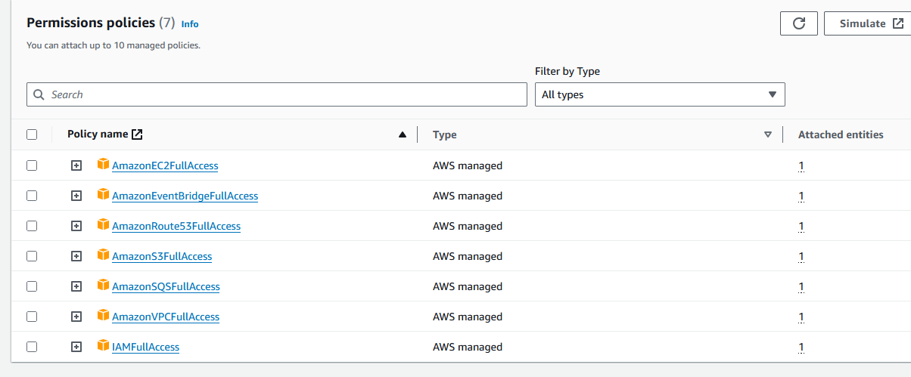

### On Controller Machine
will create a controller VM where we will be managing all the cluster and during creation of VM, we will add the custom role ```jenkins-kubernates-project``` and also configure the aws cli as below

```sh
[ec2-user@ip-172-31-39-87 ~]$ aws configure
AWS Access Key ID [None]:
AWS Secret Access Key [None]:
Default region name [None]: us-east-1
Default output format [None]: table
[ec2-user@ip-172-31-39-87 ~]$
```
*Note*-  only will configure the region and format.

- Will install the kubectl
search in google ```kops installation in aws```
[Ref Link01.](https://kops.sigs.k8s.io/install/) 
[Ref Link02.](https://kops.sigs.k8s.io/getting_started/aws/)
```sh
sudo -i
curl -Lo kubectl https://dl.k8s.io/release/$(curl -s -L https://dl.k8s.io/release/stable.txt)/bin/linux/amd64/kubectl
chmod +x ./kubectl
sudo mv ./kubectl /bin/kubectl
kubectl
```
- Will install the [KOPS](https://kops.sigs.k8s.io/install/)

```sh
curl -Lo kops https://github.com/kubernetes/kops/releases/download/$(curl -s https://api.github.com/repos/kubernetes/kops/releases/latest | grep tag_name | cut -d '"' -f 4)/kops-linux-amd64
chmod +x ./kops
sudo mv ./kops /bin/
```
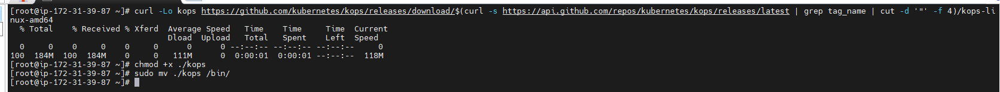

- Configure the private RouteS53

route53>create hosted zones>

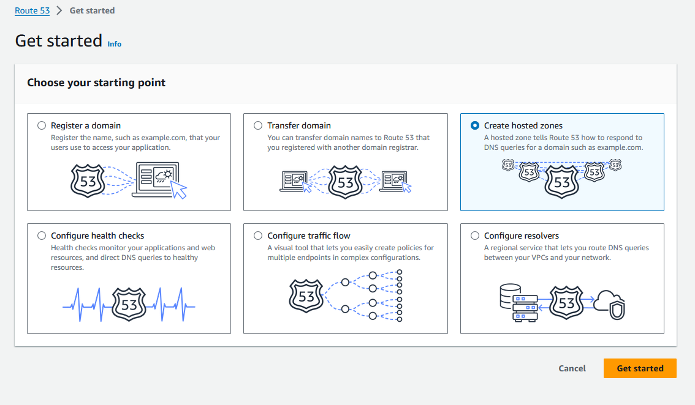

Domain name: balrajsingh.in
select the region and VPC ID and create the DNS.

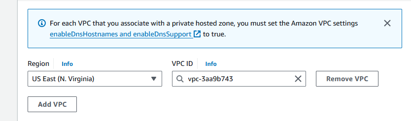

Create S3 buket to store the cluster state.

*note-* bucket name should be matched with the DNS name.

```sh
$ aws s3 mb s3://clusters.dev.balrajsingh.in
make_bucket: clusters.dev.balrajsingh.in
```
export the state
```sh
export KOPS_STATE_STORE=s3://clusters.dev.balrajsingh.in
```
will generate the ssh-key
```
ssh-keygen
```
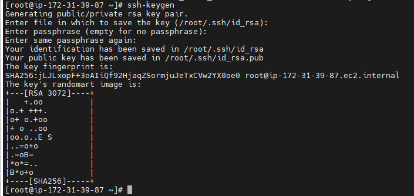

Build cluster configure

```sh
kops create cluster \
    --cloud=aws \
    --zones=us-east-1a \
    --name=clusters.dev.balrajsingh.in \
    --dns-zone=balrajsingh.in \
    --dns private    
```
### TO delete the cluster 
```sh
kops delete cluster --name clusters.dev.balrajsingh.in --yes
```
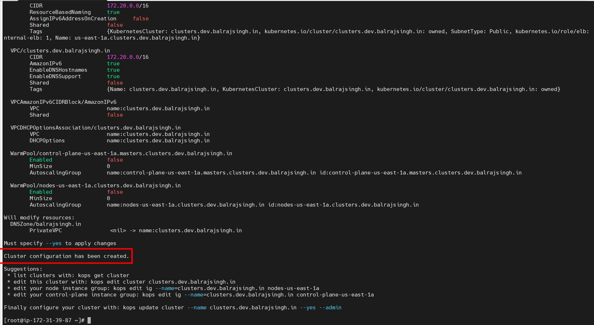

To make it final cluster 
```sh
kops update cluster --name clusters.dev.balrajsingh.in --yes --admin
```
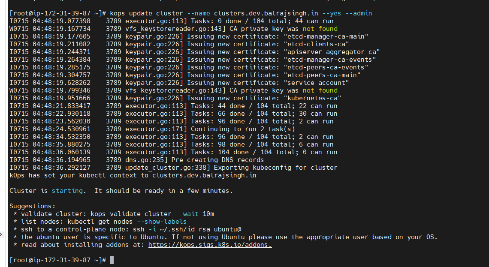

kops validate cluster --wait 10m

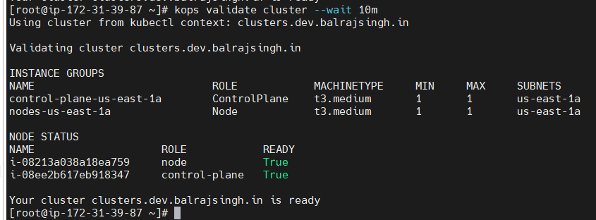

will create a two EC2 VMs, One is for Jenkins and second for Ansible.

### Jenkins Setup
- set the root password.
- generate the ssh-key and share with ansible.
Plug-in need to install
Publish Over SSH

- will setup the root password and configure the sshd file
```sh
cat /etc/ssh/sshd_config | grep "PasswordAuthentication"
echo "PasswordAuthentication yes" >> /etc/ssh/sshd_config
cat /etc/ssh/sshd_config | grep "PasswordAuthentication"

cat /etc/ssh/sshd_config | grep "PermitRootLogin"
echo "PermitRootLogin yes"  >> /etc/ssh/sshd_config
cat /etc/ssh/sshd_config | grep "PermitRootLogin"

# Append configurations to /etc/ssh/sshd_config
sed -i 's/PasswordAuthentication no/PasswordAuthentication yes/g' /etc/ssh/sshd_config
sed -i 's/#PermitRootLogin yes/PermitRootLogin yes/g' /etc/ssh/sshd_config

# Restart Network Services
systemctl restart NetworkManager

# Restart the sshd reservices.
systemctl restart sshd
systemctl daemon-reload
```

Now, we will configure the Jenkins and ansible in Jenkins.

    Dashboard >
    Manage Jenkins> System


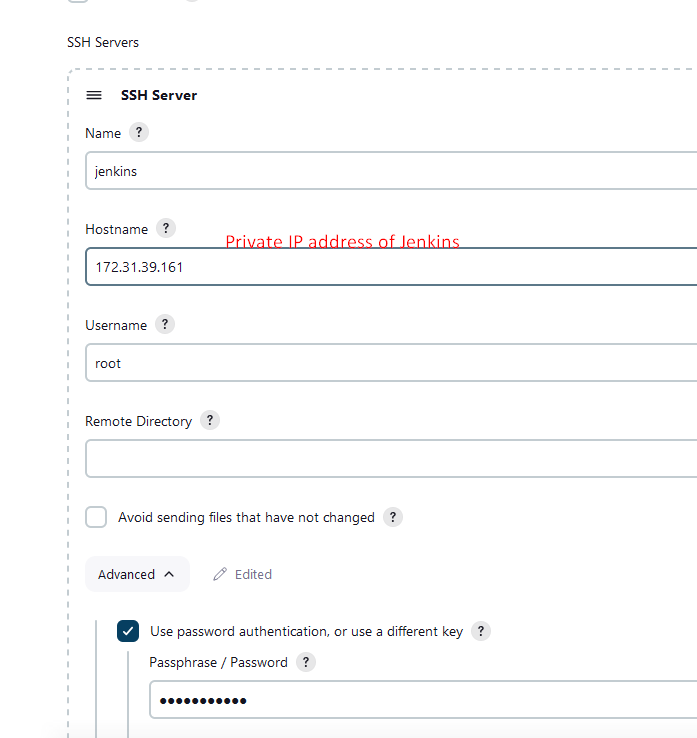
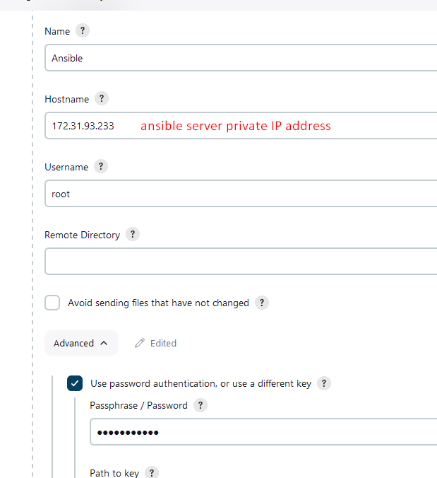

Now, we will generate the ssh-key from ansible server and add into controller vm so that cluster can be reachable.

```sh
ansible . 172.31.93.233
jenkins 172.31.39.161
controller 172.31.39.87
```
Generate the key from ansible 
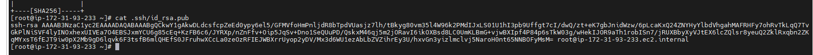

paste to controller
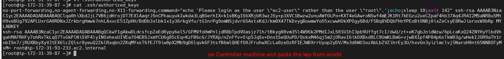


Verify the connectivity (Password less) from ansible to controller VM.
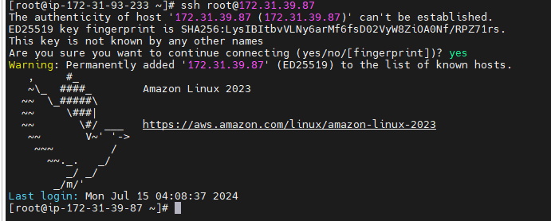

Install the docker package on ansible server
```
yum install docker -y
```
```
# systemctl enable docker
Created symlink /etc/systemd/system/multi-user.target.wants/docker.service → /usr/lib/systemd/system/docker.service.
[root@ip-172-31-93-233 ~]# systemctl start docker
[root@ip-172-31-93-233 ~]#
```
Project details:
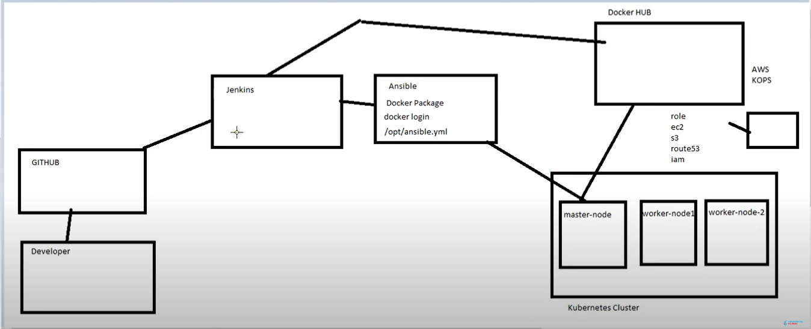

- password less authentication between Jenkins and ansible
ssh-keygen in jenkins server and share the pubkey to ansible.
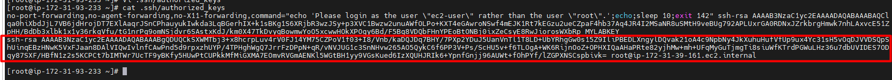


Verify the connectivity from jenkis to Ansible
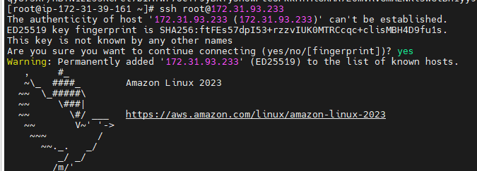

*Dockerhub login should be done on ansible server so that image can be created.*
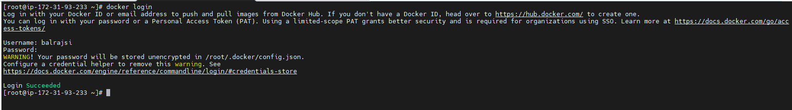

#On ansible server
will install the ansible 

 will create a yml file in /opt/ansible.yml

 ```sh
 - hosts: all
   become: true

   tasks:

   - name: create new deployment
     command: kubectl apply -f /opt/deployment.yml

   - name: create new service
     command: kubectl apply -f /opt/service.yml
 ```

Now, we will add controller VM IP address into inventory file.

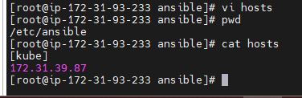

# On Controller VM
will create these two files on controller VM under directory ```/opt```.
- deployment.yml
- service.yml

```sh
#deployment.yml
apiVersion: apps/v1
kind: Deployment
metadata:
  name: cloudknowledges
spec:
  selector:
    matchLabels:
      app: cloudknowledges
  replicas: 2
  strategy:
    type: RollingUpdate
    rollingUpdate:
      maxSurge: 1
      maxUnavailable: 1
  template:
    metadata:
      labels:
        app: cloudknowledges
    spec:
      containers:
      - name: cloudknowledges
        image: balrajsi/kubernetesproject   # we can define the image name here
        imagePullPolicy: Always
        ports:
        - containerPort: 80
```

```sh
#service.yml
apiVersion: v1
kind: Service
metadata:
  name: cloudknowledges
  labels:
    app: cloudknowledges
spec:
  selector:
    app: cloudknowledges
  type: LoadBalancer
  ports:
    - port: 8080
      targetPort: 80
      nodePort: 31200
```

- will go to github and create a repo their.
Will create a webhook.

```sh
http://3.89.191.65:8080/github-webhook/
```
generate a token from jenkins 
userprofile>configure>generate the token.
119acf6bb4b356a13870ff7f8386683c09

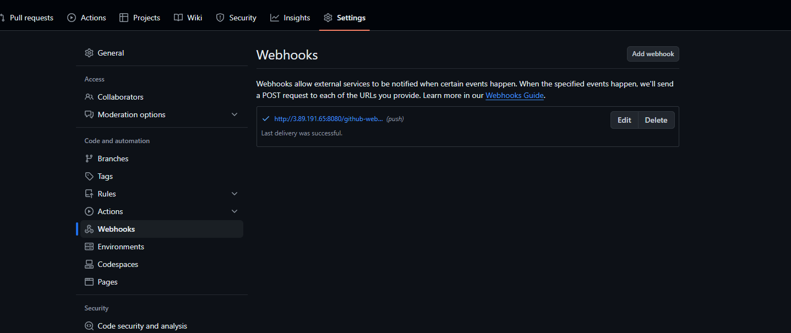

will create a new pipeline and give the name and choose freestyle.
*Note*- git should be install on Jenkins server
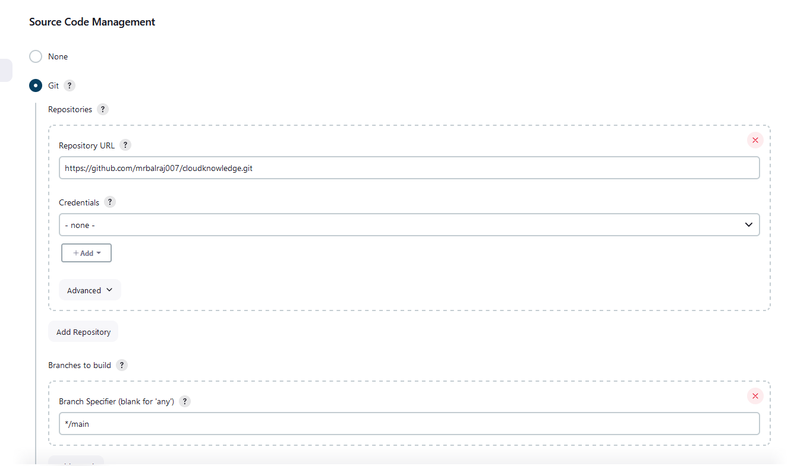

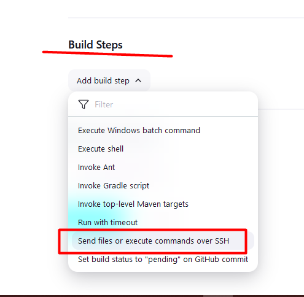

```sh
rsync -avh /var/lib/jenkins/workspace/kubernet*/* root@172.31.93.233:/opt
```

```sh
cd /opt
docker image build -t $JOB_NAME:$BUILD_ID .
docker image tag $JOB_NAME:$BUILD_ID balrajsi/$JOB_NAME:$BUILD_ID
docker image tag $JOB_NAME:$BUILD_ID balrajsi/$JOB_NAME:latest
docker image push balrajsi/$JOB_NAME:$BUILD_ID
docker image push balrajsi/$JOB_NAME:latest
docker image rmi $JOB_NAME:v1.$BUILD_ID balrajsi/$JOB_NAME:v1.$BUILD_ID balrajsi/$JOB_NAME:latest
```

```sh
cd /opt

# Build the Docker image
docker image build -t $JOB_NAME:$BUILD_ID .

# Tag the image with Docker Hub username
docker image tag $JOB_NAME:$BUILD_ID balrajsi/$JOB_NAME:$BUILD_ID
docker image tag $JOB_NAME:$BUILD_ID balrajsi/$JOB_NAME:latest

# Push the tagged images to Docker Hub
docker image push balrajsi/$JOB_NAME:$BUILD_ID
docker image push balrajsi/$JOB_NAME:latest

# Clean up old images (if needed)
docker image rm $JOB_NAME:$BUILD_ID balrajsi/$JOB_NAME:$BUILD_ID balrajsi/$JOB_NAME:latest
```

Now, we will add the post build task.
__Post-build Actions__
```sh
ansible-playbook /opt/ansible.yml
```
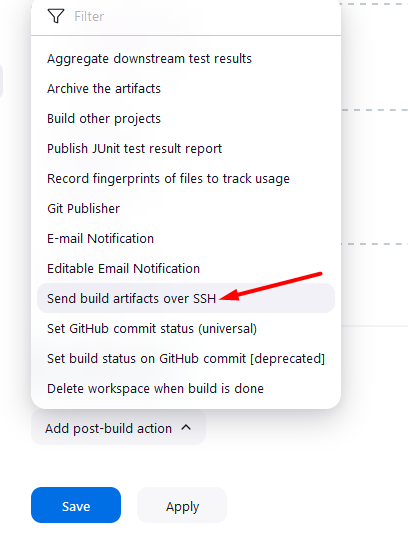
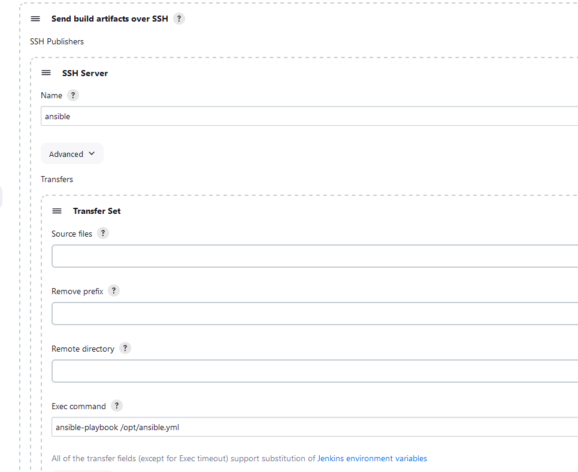

From Controller:
```
kubectl get all
```
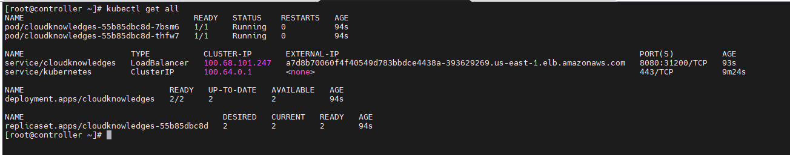


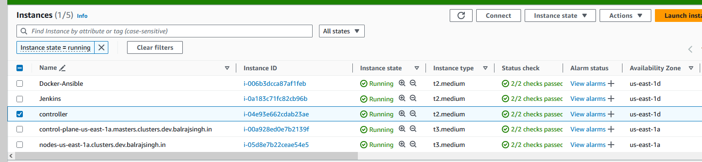

You will the test page
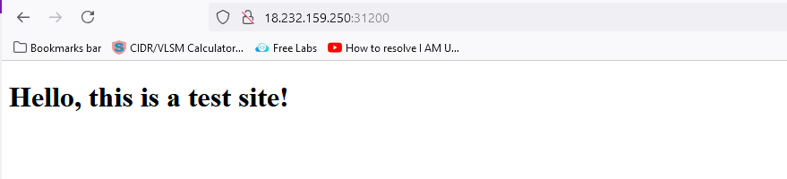

*note:* If site is not accessible then you should allow the port in SG from ```nodes.clusters.dev.balrajsingh.in```

```dockerfile
# Use the latest Nginx image
FROM nginx:latest

# Maintainer information
MAINTAINER x.y@gmail.com

# Copy the HTML file to the web server directory
COPY index.html /usr/share/nginx/html/index.html

# Expose port 80
EXPOSE 80

# Start the Nginx server
CMD ["nginx", "-g", "daemon off;"].
```

[Repo Link](https://github.com/mrbalraj007/cloudknowledge/blob/main/Dockerfile)

If you want to send the new conect then we have to define in playbook that delete the older deployment and push a new deployment.

new playbook
```sh
- hosts: all
  become: true

  tasks:
  - name: delete  old deployment
    command: kubectl delete  -f /opt/deployment.yml

  - name: delete old service
    command: kubectl delete -f /opt/deployment.yml

  - name: create new deployment
    command: kubectl apply -f /opt/deployment.yml

  - name: create new service
    command: kubectl apply -f /opt/service.yml
```
