# AWS DevOps CI-CD Project

Will create a two EC2 node with help of Terraform and do the passwordless authentication.
```sh
ACCESS_YOUR_JENKINS_HERE = "http://52.87.249.240:8080"
Jenkins_Initial_Password = "sudo cat /var/lib/jenkins/secrets/initialAdminPassword"

MASTER_SERVER_PRIVATE_IP = "172.31.19.195"
MASTER_SERVER_PUBLIC_IP = "52.87.249.240"

NODE_SERVER_PRIVATE_IP = "172.31.29.51"
NODE_SERVER_PUBLIC_IP = "34.229.81.44"
```
__Master Server__

__On Node Server__:

Set the user password in Node server
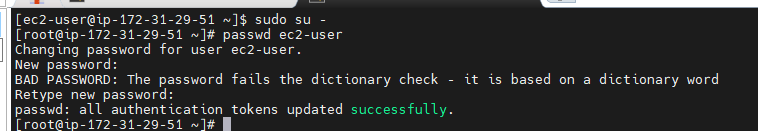


```sh
# To replace the keyword if required.
sed -i 's/PasswordAuthentication no/PasswordAuthentication yes/g' /etc/ssh/sshd_config
sed -i 's/#PermitRootLogin yes/PermitRootLogin yes/g' /etc/ssh/sshd_config
```

```sh
# Restart the service
systemctl restart sshd
```


On Master Server

- Generate the Keys and share to Node server.

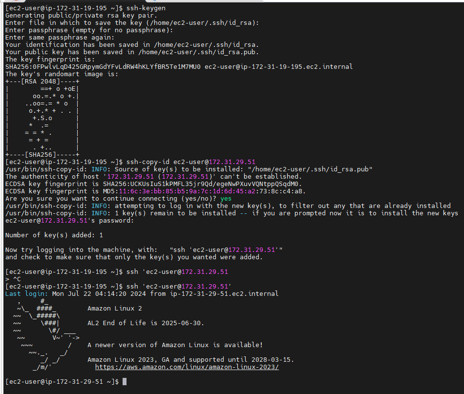

Now, we will install the plug-in
```sh
- SSH Agent
```

Now, we will add a docker credential in Jenkins
```sh
Docker
EC2 User and PEM Keys
Github username and Token
```
    Dashboard
    Manage Jenkins
    Credentials
    System
    Global credentials (unrestricted)

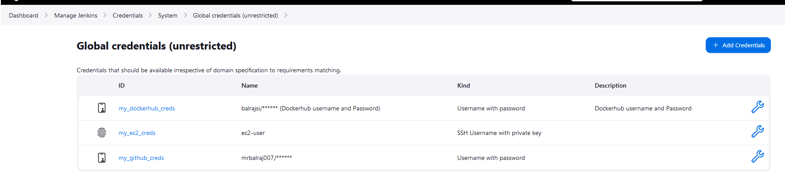

Now, we will create a pipeline.

name: CI-PIPELINE
pipeline

```sh
// JENKINS CI PIPELINE/
// Purpose: The Code will be built into executable file (.jar) & pushed to Dockerhub
// NOTE:
//  i. Store Dockerhub, EC2 pem key credentials in Jenkins Server
// ii. Install 'ssh agent' plugin in Jenkins

pipeline {
    agent any
    // DECLARE THE VARIABLES HERE:
    environment {
        DOCKER_USERNAME = "balrajsi"     // check the 'ID' in your Jenkins credentials
    }

    stages {
        stage("1. Cleanup") {
            // Clean workspace directory for the current build
            steps {
                deleteDir ()             
            }
        }

        stage ('2. Git Checkout') {
            // use pipeline syntax generator to generate below step
            // 'Pipeline syntax' --> Steps 'Smaple step' --> git (enter url & branch & generate)
            steps {
                script {
                    git branch: 'main', credentialsId: 'my_github_creds', url: 'https://github.com/mrbalraj007/04.Real-Time-DevOps-Project.git'
                  }
                
            }
        }
        }
    }
```
### Maven Verify in Pipeline.

```sh
// JENKINS CI PIPELINE/
// Purpose: The Code will be built into executable file (.jar) & pushed to Dockerhub
// NOTE:
//  i. Store Dockerhub, EC2 pem key credentials in Jenkins Server
// ii. Install 'ssh agent' plugin in Jenkins

pipeline {
    agent any
    // DECLARE THE VARIABLES HERE:
    environment {
        DOCKER_USERNAME = "balrajsi"     // check the 'ID' in your Jenkins credentials
    }

    stages {
        stage("1. Cleanup") {
            // Clean workspace directory for the current build
            steps {
                deleteDir ()             
            }
        }

        stage ('2. Git Checkout') {
            // use pipeline syntax generator to generate below step
            // 'Pipeline syntax' --> Steps 'Smaple step' --> git (enter url & branch & generate)
            steps {
                script {
                    git branch: 'main', credentialsId: 'my_github_creds', url: 'https://github.com/mrbalraj007/04.Real-Time-DevOps-Project.git'
                  }
                
            }
        }
        
        stage("3. Maven Unit Test") {  
            // Test the individual units of code 
            steps{
                sh 'mvn test'        
                
            }
        }
        
        stage('4. Maven Build') {
            // Build the application into an executable file (.jar)
            steps{
                sh 'mvn clean install'   
            }
        }
        
          stage("5. Maven Integration Test") {
            //  Test the interaction between different units of code
            steps{
                
                  sh 'mvn verify'          
            }
        }
        
        
        }
    }
```
#### Docker image build.

```sh
// JENKINS CI PIPELINE/
// Purpose: The Code will be built into executable file (.jar) & pushed to Dockerhub
// NOTE:
//  i. Store Dockerhub, EC2 pem key credentials in Jenkins Server
// ii. Install 'ssh agent' plugin in Jenkins

pipeline {
    agent any
    // DECLARE THE VARIABLES HERE:
    environment {
        DOCKER_USERNAME = "balrajsi"     // check the 'ID' in your Jenkins credentials
    }

    stages {
        stage("1. Cleanup") {
            // Clean workspace directory for the current build
            steps {
                deleteDir ()             
            }
        }

        stage ('2. Git Checkout') {
            // use pipeline syntax generator to generate below step
            // 'Pipeline syntax' --> Steps 'Smaple step' --> git (enter url & branch & generate)
            steps {
                script {
                    git branch: 'main', credentialsId: 'my_github_creds', url: 'https://github.com/mrbalraj007/04.Real-Time-DevOps-Project.git'
                  }
                
            }
        }
        
        stage("3. Maven Unit Test") {  
            // Test the individual units of code 
            steps{
                sh 'mvn test'        
                
            }
        }
        
        stage('4. Maven Build') {
            // Build the application into an executable file (.jar)
            steps{
                sh 'mvn clean install'   
            }
        }
        
        stage("5. Maven Integration Test") {
            //  Test the interaction between different units of code
            steps{
                
                  sh 'mvn verify'          
            }
        }
        stage('6. Docker Image Build') {
            // Build Docker Image 
            steps{
                script {
                      def JOB = env.JOB_NAME.toLowerCase()           // Convert Jenkins Job name to lower-case
                      sh "docker build -t ${JOB}:${BUILD_NUMBER} ."  // 'JOB_NAME' & 'BUILD_NUMBER' are Jenkins Global variable
                    }
                }
            }
           stage('7. Docker Image Tag') {
            // Rename the Docker Image before pushing to Dockerhub
            steps{
                script {
                    def JOB = env.JOB_NAME.toLowerCase() // Convert Jenkins Job name to lower-case
                    sh "docker tag ${JOB}:${BUILD_NUMBER} ${DOCKER_USERNAME}/${JOB}:v${BUILD_NUMBER}"
                    sh "docker tag ${JOB}:${BUILD_NUMBER} ${DOCKER_USERNAME}/${JOB}:latest"
                  }
                }
            } 
            
             stage('8. Trivy Image Scan') {
            // Scan Docker images for vulnerabilities 
            steps{
                script { 
                  def JOB = env.JOB_NAME.toLowerCase() // Convert Jenkins Job name to lower-case
                  sh "trivy image ${DOCKER_USERNAME}/${JOB}:v${BUILD_NUMBER} > scan.txt"
                }
            }
        }

        stage('9. Docker Image Push') {
            // Login to Dockerhub & Push the image to Dockerhub
            steps{
                script { 
                  withCredentials([usernamePassword(credentialsId: 'my_dockerhub_creds', usernameVariable: 'docker_user', passwordVariable: 'docker_pass')]) {
                    sh "docker login -u '${docker_user}' -p '${docker_pass}'"
                    def JOB = env.JOB_NAME.toLowerCase() // Convert Jenkins Job name to lower-case
                    sh "docker push ${DOCKER_USERNAME}/${JOB}:v${BUILD_NUMBER}"
                    sh "docker push ${DOCKER_USERNAME}/${JOB}:latest"
                  }
                }
            }
        }
              stage('10. Docker Image Cleanup') {
            // Remove the unwanted (dangling) images created in Jenkins Server to free-up space
            steps{
                script { 
                  sh "docker image prune -af"
                }
            }
        }
    }
}      
```
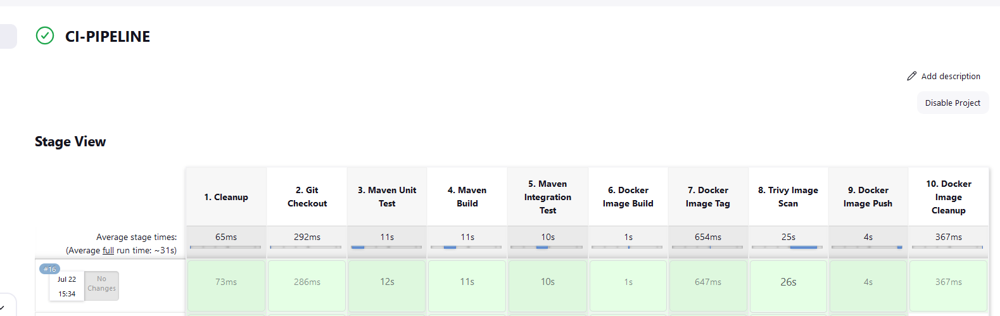

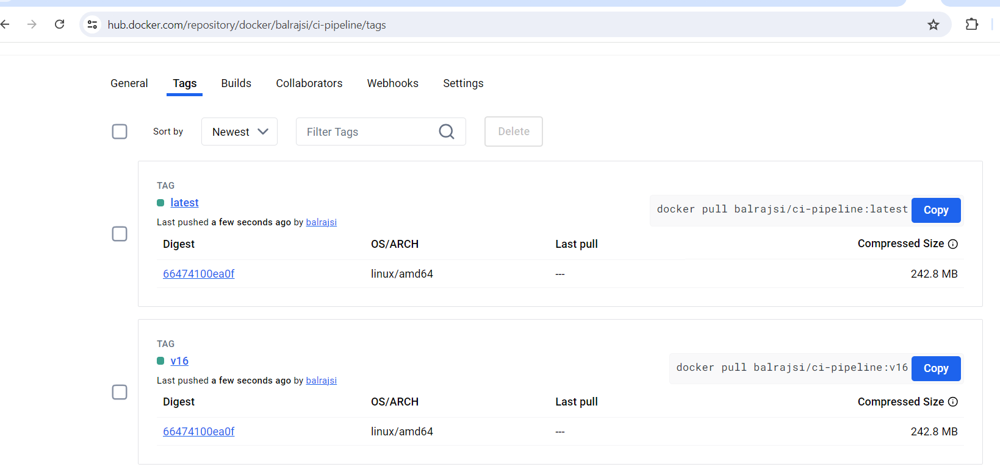


CI part done, Now, we will be performing CD part.

name: CD-PIPELINE
Type: pipeline.


```sh
// JENKINS CD PIPELINE
// Here the image stored in Dockerhub will be deployed using K8s
// IMP NOTE: Store your EC2 instance username & key in Jenkins credentials

pipeline {
    agent any
    environment {
        NODE_IP = '172.31.29.51'  // <Node_Server_Private_IP> paste your Node-Server private IP here
        EC2_NAME = "ec2-user"     // enter your AWS EC2 username
        PIPELINE_NAME = "CI-PIPELINE"  // enter your pipeline name here 
        }

    stages {
        stage("1. Pull Files") {
            steps {
                sshagent(['my_ec2_creds']) {  // ensure this credential ID exists in Jenkins
                    // Copy K8s manifest files from Master-Server workspace to Node-server
                    sh """
                    scp -o StrictHostKeyChecking=no /var/lib/jenkins/workspace/${PIPELINE_NAME}/deployment.yaml ${EC2_NAME}@${NODE_IP}:/home/ec2-user/
                    scp -o StrictHostKeyChecking=no /var/lib/jenkins/workspace/${PIPELINE_NAME}/service.yaml ${EC2_NAME}@${NODE_IP}:/home/ec2-user/
                    """
                }
            }
        }
      stage('2. Approval') {
          // If 'manual approval' is required, then it is called 'Continuous Delivery'
          // If it is totally automated, then it is called 'Continuous Deployment'
            steps {
                input message: 'Approve deployment?'
            }
        }
      stage("3. Deployment") {
          // K8s Deployment using Ansible
            // i. Ensure to establish passwordless connection between Master & Node first
           // ii. Your deployment.yaml file must contain the Dockerhub image within the container block
            steps {
              sshagent(['my_ec2_creds']) {          // store EC2 username & pem-key in Jenkins credentials
                sh "ssh -o StrictHostKeyChecking=no ${EC2_NAME}@${NODE_IP}"   // enter your Node-Server private IP here
                sh "ssh -o StrictHostKeyChecking=no ${EC2_NAME}@${NODE_IP} kubectl apply -f deployment.yaml"
                sh "ssh -o StrictHostKeyChecking=no ${EC2_NAME}@${NODE_IP} kubectl apply -f service.yaml"
                sh "ssh -o StrictHostKeyChecking=no ${EC2_NAME}@${NODE_IP} kubectl rollout restart deploy"
                sh "ssh -o StrictHostKeyChecking=no ${EC2_NAME}@${NODE_IP} kubectl get service"
              }
            }
        }
    }
}
```

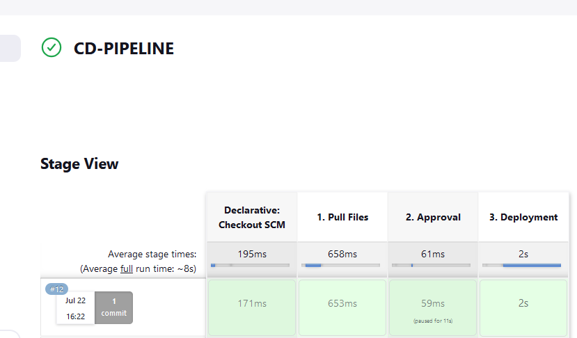
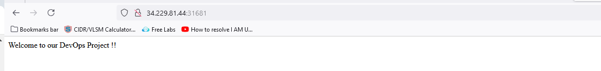


I want once CI-PINEPINE is completed then CD-PIPELINE should be triggered.

Go to CD-PIPELINE> Configure>Build Triggers| "Build after other projects are built" Here we will select the CI-PIPELINE.

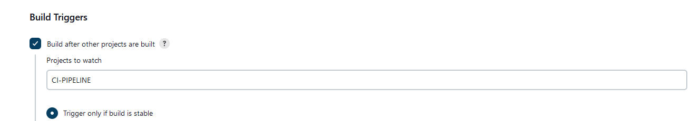

Fron Node Server.
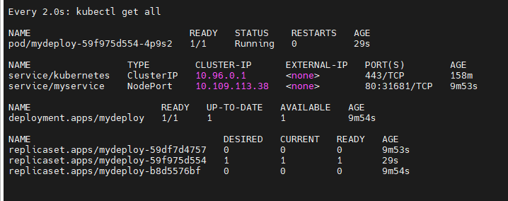


Now, we will do the fully automation for CI/CD.
 Now, we will comment out the approval.

 we will go to CI-PIPELINE and under BuildTriggers.
 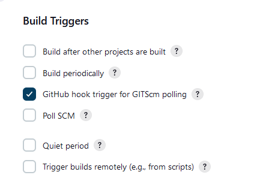

 we will create a webook trigger for this make it effective.

 will go the repo in github and go to settings >Webhook>
 Paylook URL : http://52.87.249.240:8080/github-webhook/

 content Type: application/json

secret <paste the token here> // We will generate it from Jenkins userprofile>configure> API Token.

Try to make any changes in files in Github and pipeline would be triggered automatically.

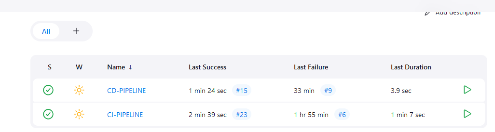

