# Deploying a YouTube Clone App with DevSecOps & DevOps tools like Jenkins using Shared Library, Docker and Kubernetes.
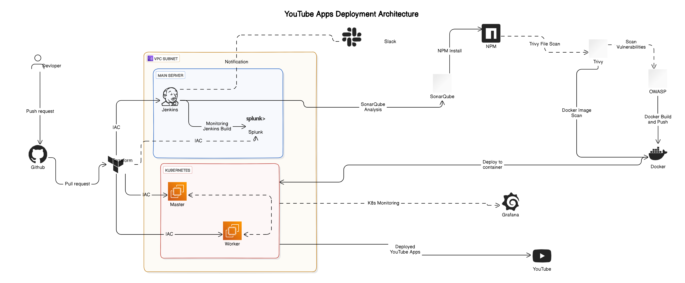

This blog will help you set up a secure DevSecOps pipeline for your project. Using tools like Kubernetes, Docker, SonarQube, Trivy, OWASP Dependency Check, Prometheus, Grafana, Jenkins (with a shared library), Splunk, Rapid API, and Slack notifications, we make it easy to create and manage your environment.

Environment Setup:

Step 1: Launch an Ubuntu instance for Jenkins, Trivy, Docker and SonarQube

-I am using Terraform to create a infrastrucutre. I have prepared the Terraform code.
+ clone the Terraform git [repo](https://github.com/mrbalraj007/DevOps_free_Bootcamp/tree/main/06.Real-Time-DevOps-Project/Terraform_Code) in your system.
+ Do the ```ls``` in a terminal, go to ```Terraform_code``` Folder, and initiate the following Terraform commands to run the infrastructure.
```bash
$ cd Terraform_Code
$ ls -l
total 20
drwxr-xr-x 1 bsingh 1049089    0 Jul 28 12:45 Code_IAC_Jenkins_Trivy_Docker/
drwxr-xr-x 1 bsingh 1049089    0 Jul 28 12:47 Code_IAC_Splunk/
-rw-r--r-- 1 bsingh 1049089  632 Jul 28 12:46 main.tf
```
Now, we have to run the following command
```bash
$ Terraform init
$ Terraform fmt  # for formatting
$ Terraform validate # for validate the codes
$ Terraform plan # for plan the Terraform
$ Terraform apply # to Apply the terraform code.
```
*Note:* __Once you apply the Terraform code, wait for 5 minutes to get both instances ready and configure them as below.__

Now, we will configure the Jenkins.
<EC2 Public IP Address:8080>
- To unlock the setup password
```bash
sudo cat /var/lib/jenkins/secrets/initialAdminPassword
```


- Dashboard for Jenkins


Now, we will try to access the SonarQube as it is accessible via 9000, Make sure add 9000 ports in the security group.

```bash
<ec2-public-ip:9000>
```


Dashboard of SonarQube


### Verify the Trivy version on Jenkins machine
```bash
$ trivy --version
Version: 0.53.0
```
### Configure Splunk
Verify the Public IP address of Splunk and open it in browser.
```basg
<splunk-public-ip:8000>
```


Log in using the username and password you set up when you created Splunk.

Dashboard for Splunk


+ Install the Splunk app for Jenkins <br> 
*You should have splunk webportal login credentails, if not then create your login credentails first*

In Splunk Dashboard > Click on Apps > Find more apps


Search for Jenkins in the search bar. When you see the Splunk app for Jenkins, click on install.


Click on ```go home```


- On the Splunk homepage, you will see that Jenkins has been added.


In the Splunk web interface, go to Settings > Data Inputs.


Click on HTTP Event Collector and Click on Global Settings

Set All tokens to enabled > Uncheck SSL enable > Use 8088 port and click on save


Now click on New token


Provide a Name and click on the next > Review > Click Submit


Click Start searching> Now let’s copy our token again> In the Splunk web interface, go to Settings > Data Inputs> Click on the HTTP event collector >Now copy your token and keep it safe.


* Add Splunk Plugin in Jenkins <br>
Go to Jenkins dashboard > Click on Manage Jenkins > Plugins > Available plugins > Search for Splunk and install it.


Now, Click on Manage Jenkins <br>
> System > Go to Splunk > Check to enable >  HTTP input host as SPLUNK PUBLIC IP > HTTP token that you generated in Splunk> Jenkins IP and apply.
 Don't forget to tick on Enable checkbox. 

if connect is failed then following the below steps on Splunk EC2 Machine.
```bash
ubuntu@ip-172-31-23-110:~$ sudo ufw allow 8088
Rules updated
Rules updated (v6)

ubuntu@ip-172-31-23-110:~$ sudo ufw status
Status: inactive

ubuntu@ip-172-31-23-110:~$ sudo ufw allow openSSH
Rules updated
Rules updated (v6)

ubuntu@ip-172-31-23-110:~$ sudo ufw allow 8000
Rules updated
Rules updated (v6)

ubuntu@ip-172-31-23-110:~$ sudo ufw status
Status: inactive

ubuntu@ip-172-31-23-110:~$ sudo ufw enable
Command may disrupt existing ssh connections. Proceed with operation (y|n)? y
Firewall is active and enabled on system startup
ubuntu@ip-172-31-23-110:~$
```
- Check Network Connectivity from Jenkins to Splunk
```sh
ping 52.204.146.179
telnet 52.204.146.179 8088
```
### Restart Splunk and Jenkins services to make it effective.

Procedure to restart *Jenkins* <br>
> Jenkins Public IP Address:8080/restart


Procedure to restart *Splunk* <br>
Click on Settings > Server controls > Restart splunk.


### On Jenkins Server, we will create a simple hello pipeline and will see if logs are visible in Splunk or not.


Now go to Splunk, click on the Jenkins app, and you will see some data from Jenkins.

> we can see the logs in splunk. :-)

If you want to see the more details logs then switch it to ```admin``` and you will see below <br>


## Integrate Slack for Notifications
If you don't have a Slack account, create one first. If you already have an account, log in. [Slack login](https://slack.com/signin#/signin)
 <br>
Create a Slack account and create a channel Named "Jenkins_Notification"


+ Install the Jenkins CI app on Slack <br>
> Go to Slack and click on your name > Select Settings and Administration > Click on Manage apps


search here "```Jenkins CI```" > Click on ```Add to Slack``` <Br>


Select the change name "Jenkins" and click on ```add Jenkins CI integration```


You will be sent to this page


### Install Slack Notification Plugin in Jenkins
 > Go to Jenkins Dashboard > Click on manage Jenkins > Plugins > Available plugins "Search for Slack Notification and install"


Now, we will be configure the credential <br>
> Click on Manage Jenkins –> Credentials > Global > Select kind as Secret Text > At Secret Section Provide Your Slack integration token credential ID> Id and description are optional and create


in Slack Step 3 it is mention the token.


> Click on Manage Jenkins > System > Go to the end of the page > Workspace > team subdomain > Credential –> Select your Credential for Slack > Default channel –> Provide your Channel name > Test connection > Click on Apply and save


You will get a notification as below on Slack app.


Add this to the pipeline
```bash
def COLOR_MAP = [
    'FAILURE' : 'danger',
    'SUCCESS' : 'good'
]
post {
    always {
        echo 'Slack Notifications'
        slackSend (
            channel: '#jenkins',   #change your channel name
            color: COLOR_MAP[currentBuild.currentResult],
            message: "*${currentBuild.currentResult}:* Job ${env.JOB_NAME} \n build ${env.BUILD_NUMBER} \n More info at: ${env.BUILD_URL}"
        )
    }
}
```
If you don't know how to do [Integrating Slack with Jenkins](https://www.youtube.com/watch?v=9ZUy3oHNgh8&t=0s)

- Sample pipeline with post action.
```bash
def COLOR_MAP = [
    'FAILURE' : 'danger',
    'SUCCESS' : 'good'
]


pipeline {
    agent any

    stages {
        stage('Hello') {
            steps {
                echo 'Hello World'
            }
        }
    }


post {
always {
    echo 'Slack Notifications'
    slackSend (
        channel: '#jenkins',
        color: COLOR_MAP[currentBuild.currentResult],
        message: "*${currentBuild.currentResult}:* Job ${env.JOB_NAME} \n build ${env.BUILD_NUMBER} \n More info at: ${env.BUILD_URL}"
    )
}
}
}
```

- Slack Notification


- Splunk Notification


### 1.a: Start Job [Ref link](https://www.jenkins.io/doc/book/pipeline/shared-libraries/)
Go to Jenkins dashboard and click on New Item.
Provide a name for the Job & click on Pipeline and click on OK.

2.b: Create a ```Jenkins shared library1``` in GitHub
Create a new repository in GitHub named
 
 ```Jenkins_shared_library1```

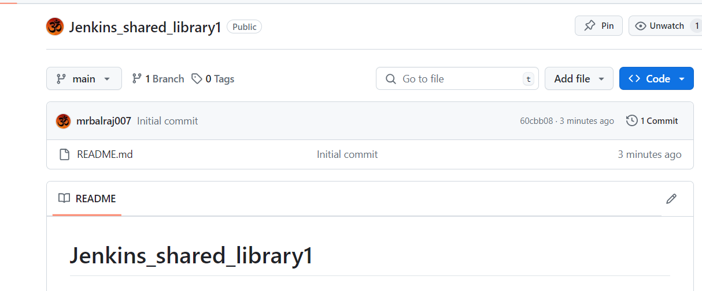

- Connect to your VS Code , Create a directory named ```Jenkins_shared_library1```,  Create a Vars directory inside it

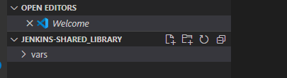

Open Terminal
Run the below commands to push to GitHub
```sh
echo "Welcome to my Jenkins_shared_library" >> README.md
git init
git add README.md
git commit -m "first commit"
git branch -M main
git push -u origin main
```

* Create ```cleanWorkspace.groovy``` file and add the below code
```sh
//cleanWorkspace.groovy //cleans workspace
def call() {
    cleanWs()
}
```
Create ```checkoutGit.groovy``` file and add the below code.
*Note-*we will be using this [```Youtube-clone-app```](https://github.com/mrbalraj007/Youtube-clone-app) repo

```sh
def call(String gitUrl, String gitBranch) {
    checkout([
        $class: 'GitSCM',
        branches: [[name: gitBranch]],
        userRemoteConfigs: [[url: gitUrl]]
    ])
}
```
Now push them to GitHub using the below commands from vs code
```sh
git add .
git commit -m "message"
git push origin main
```
* Add Jenkins shared library to Jenkins system
Go to Jenkins Dashboard > Click on Manage Jenkins > system > Search for ```Global Trusted Pipeline Libraries ``` and click on Add

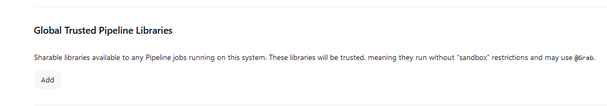

Now Provide a name that we have to call in our pipeline

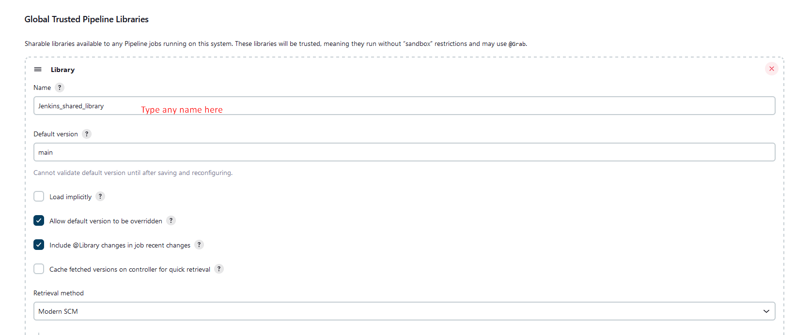
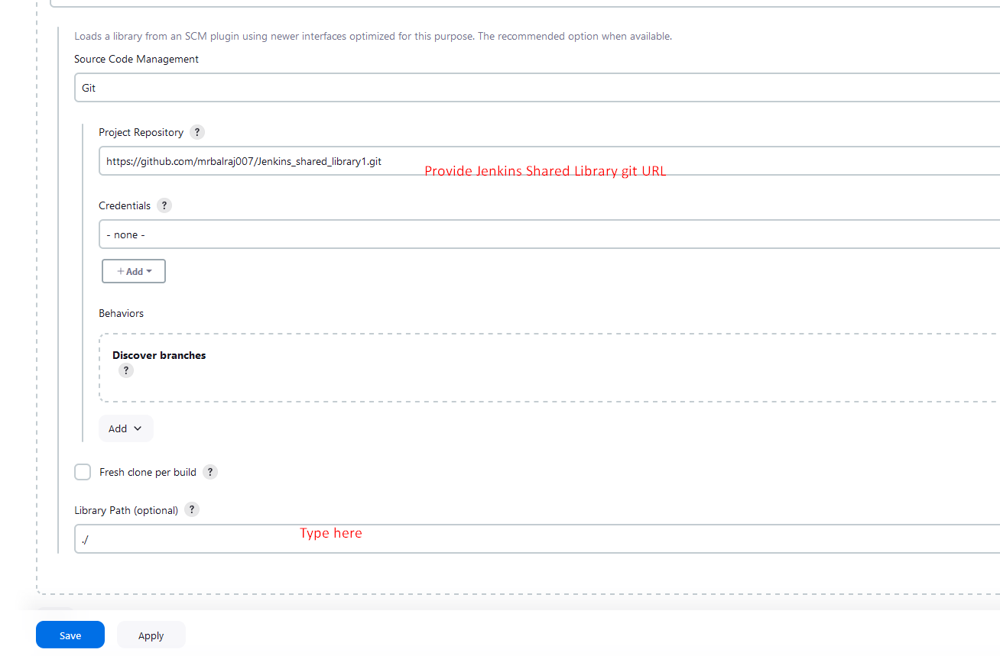

Click apply and save

Now, go to the your pipeline

+ Run Pipeline
Go to Jenkins Dashboard again & select the job and add the below pipeline
```sh
@Library('Jenkins_shared_library') _  //name used in jenkins system for library
def COLOR_MAP = [
    'FAILURE' : 'danger',
    'SUCCESS' : 'good'
]
pipeline{
    agent any
    parameters {
        choice(name: 'action', choices: 'create\ndelete', description: 'Select create or destroy.')
    }
    stages{
        stage('clean workspace'){
            steps{
                cleanWorkspace()
            }
        }
        stage('checkout from Git'){
            steps{
                checkoutGit('https://github.com/mrbalraj007/Youtube-clone-app.git', 'main')
            }
        }
     }
     post {
         always {
             echo 'Slack Notifications'
             slackSend (
                 channel: '#jenkins',   //change your channel name
                 color: COLOR_MAP[currentBuild.currentResult],
                 message: "*${currentBuild.currentResult}:* Job ${env.JOB_NAME} \n build ${env.BUILD_NUMBER} \n More info at: ${env.BUILD_URL}"
               )
           }
       }
   }
```
Build with parameters and build

here is the Stage view.

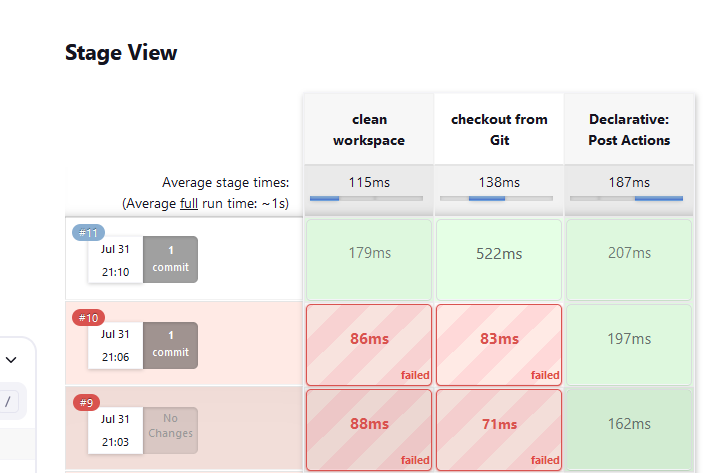

## Install Plugins like JDK, Sonarqube Scanner, NodeJs
> Install Plugin

Go to Manage Jenkins →Plugins → Available Plugins →

Install below plugins

1 → Eclipse Temurin Installer (Install without restart)

2 → SonarQube Scanner (Install without restart)

3 → NodeJs Plugin (Install Without restart)

## Configure Java and Nodejs in Global Tool Configuration

Goto Manage Jenkins → Tools → Install JDK(17) and NodeJs(16)→ Click on Apply and Save
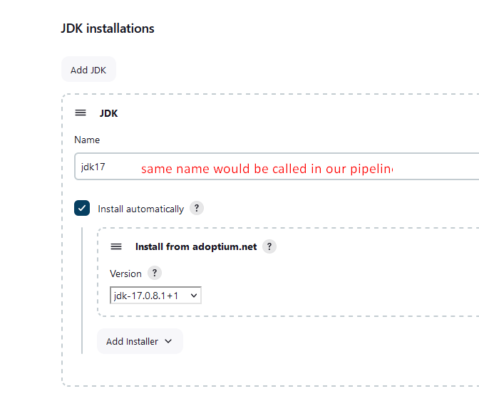
* Need to use the latest version of NodeJS
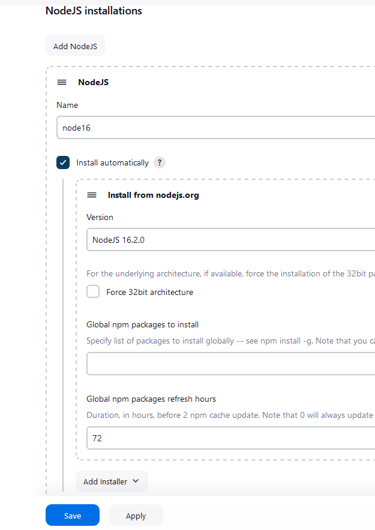

#### Step6C: Configure Sonar Server in Manage Jenkins

Grab the Public IP Address of your EC2 Instance, Sonarqube works on Port 9000, so <Public IP>:9000. Goto your Sonarqube Server. Click on Administration → Security → Users → Click on Tokens and Update Token → Give it a name → and click on Generate Token

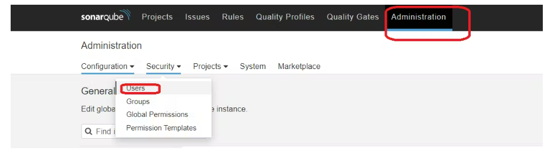

click on update Token

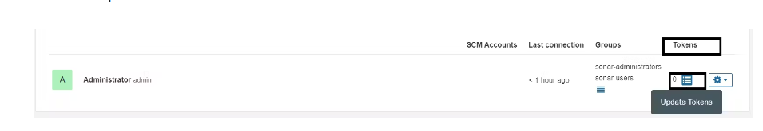

Create a token with a name and generate and notedown somewhere.

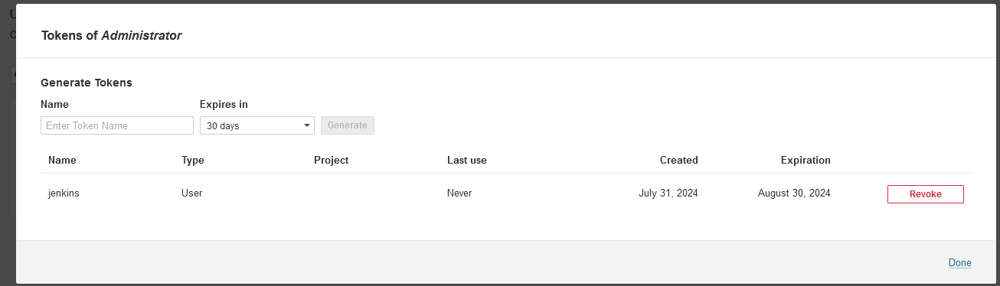

Goto Jenkins Dashboard → Manage Jenkins → Credentials → Add Secret Text. 
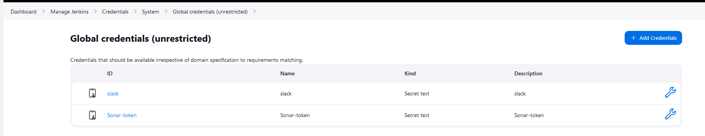

Now, go to Dashboard → Manage Jenkins → System and Add like the below image.
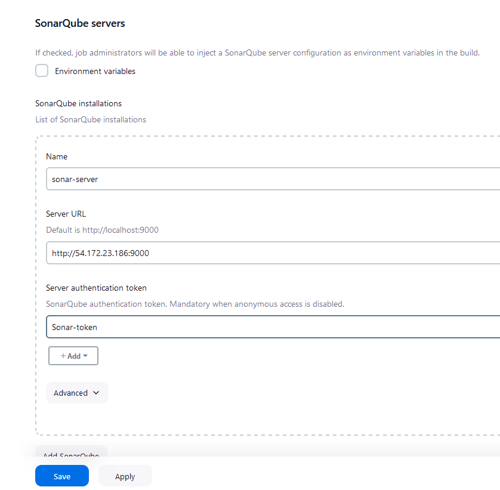
Click on Apply and Save

The Configure System option is used in Jenkins to configure different server
Global Tool Configuration is used to configure different tools that we install using Plugins

We will install a sonar scanner in the tools.
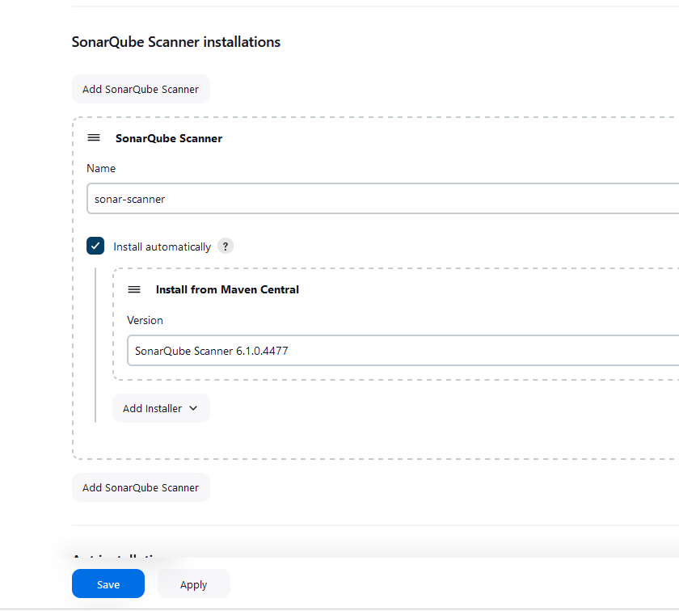

In the Sonarqube Dashboard add a quality gate also
Administration–> Configuration–>Webhooks > Click on Create
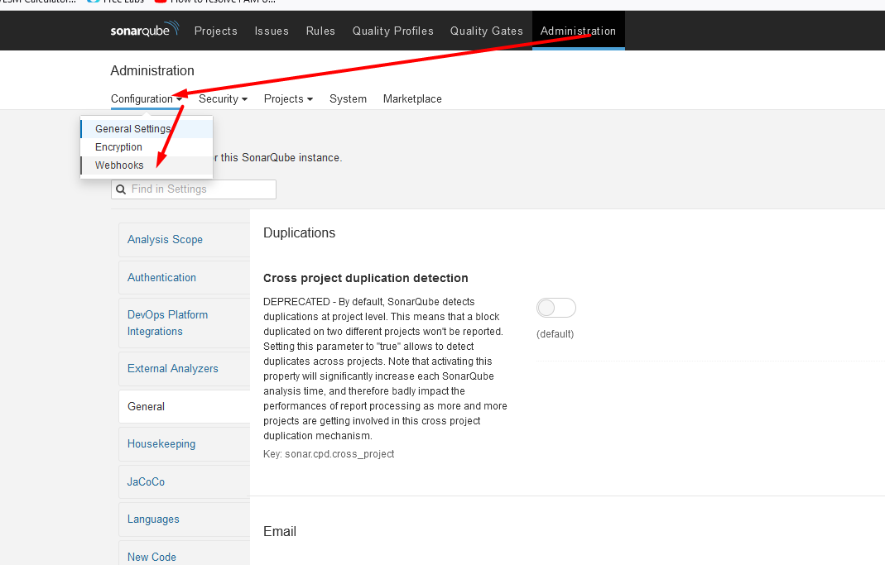

Add details
```sh
#in url section of quality gate
<http://jenkins-public-ip:8080>/sonarqube-webhook/
```
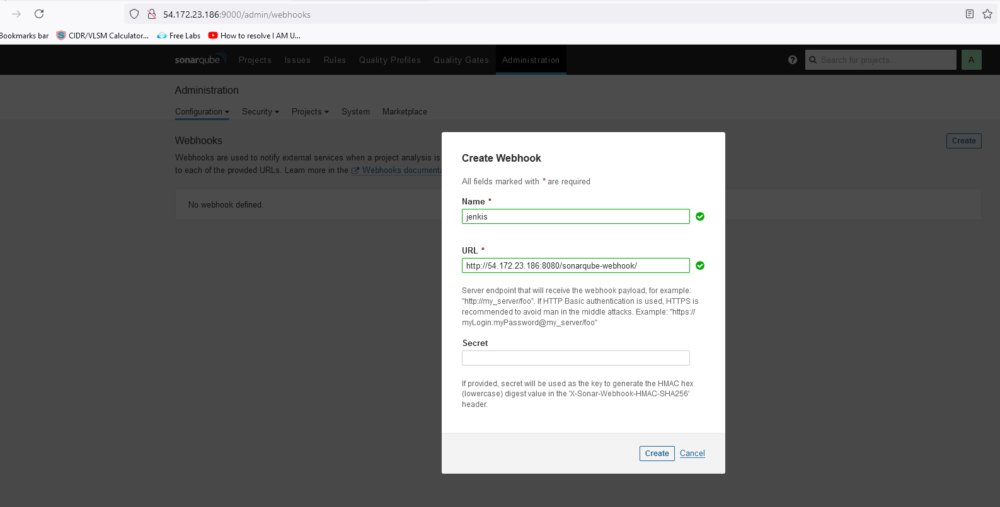

### Add New stages to the pipeline
Go to vs code and create a file ```sonarqubeAnalysis.groovy``` & add the below code and push to Jenkins shared library GitHub Repo.
```sh
def call() {
    withSonarQubeEnv('sonar-server') {
        sh ''' $SCANNER_HOME/bin/sonar-scanner -Dsonar.projectName=Youtube -Dsonar.projectKey=Youtube '''
    }
}
```

Create another file for qualityGate.groovy
```sh
def call(credentialsId) {
    waitForQualityGate abortPipeline: false, credentialsId: credentialsId
}
```

Create another file for npmInstall.groovy
```sh
def call() {
    sh 'npm install'
}
```
Push them to the GitHub Jenkins shared library
```sh
git add .
git commit -m "message"
git push origin main
```
Add these stages to the pipeline now
```sh
//under parameters
tools{
        jdk 'jdk17'
        nodejs 'node16'
    }
    environment {
        SCANNER_HOME=tool 'sonar-scanner'
    }
// add in stages
stage('sonarqube Analysis'){
        when { expression { params.action == 'create'}}
            steps{
                sonarqubeAnalysis()
            }
        }
        stage('sonarqube QualitGate'){
        when { expression { params.action == 'create'}}
            steps{
                script{
                    def credentialsId = 'Sonar-token'
                    qualityGate(credentialsId)
                }
            }
        }
        stage('Npm'){
        when { expression { params.action == 'create'}}
            steps{
                npmInstall()
            }
        }
```
Pipeline should be looks like
```yaml
@Library('Jenkins_shared_library') _
def COLOR_MAP = [
    'FAILURE' : 'danger',
    'SUCCESS' : 'good'
]
pipeline{
    agent any
    tools{
        jdk 'jdk17'
        nodejs 'node16'
    }
    environment {
        SCANNER_HOME=tool 'sonar-scanner'
    }
    parameters {
        choice(name: 'action', choices: 'create\ndelete', description: 'Select create or destroy.')
    }
    stages{
        stage('clean workspace'){
            steps{
                cleanWorkspace()
            }
        }
        stage('checkout from Git'){
            steps{
                checkoutGit('https://github.com/mrbalraj007/Youtube-clone-app.git', 'main')
            }
        }
        stage('sonarqube Analysis'){
        when { expression { params.action == 'create'}}
            steps{
                sonarqubeAnalysis()
            }
        }
        stage('sonarqube QualitGate'){
        when { expression { params.action == 'create'}}
            steps{
                script{
                    def credentialsId = 'Sonar-token'
                    qualityGate(credentialsId)
                }
            }
        }
        stage('Npm'){
        when { expression { params.action == 'create'}}
            steps{
                npmInstall()
            }
        }
     }
     post {
         always {
             echo 'Slack Notifications'
             slackSend (
                 channel: '#jenkins',
                 color: COLOR_MAP[currentBuild.currentResult],
                 message: "*${currentBuild.currentResult}:* Job ${env.JOB_NAME} \n build ${env.BUILD_NUMBER} \n More info at: ${env.BUILD_URL}"
               )
           }
       }
   }
```
Now, time to Build it again and see the Stage View.

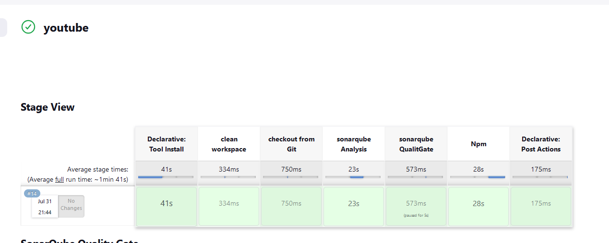


To see the report, you can go to Sonarqube Server and go to Projects.

You can see the report has been generated and the status shows as passed. You can see that there are 549 lines scanned. To see a detailed report, you can go to issues.
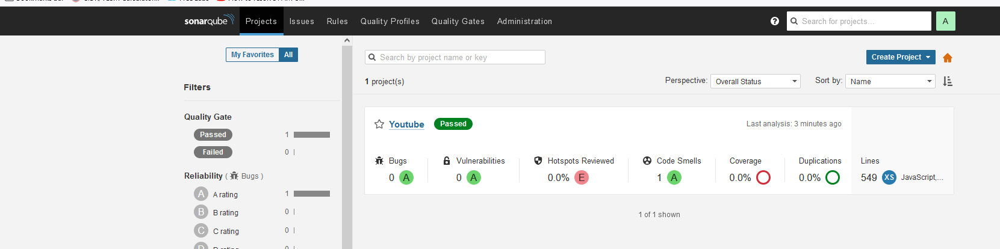

Slack Notification
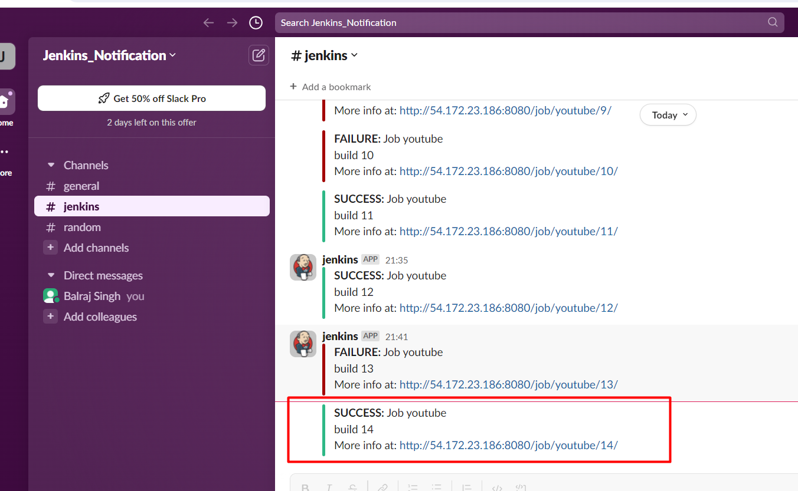


### Install OWASP Dependency Check Plugins
GotoDashboard → Manage Jenkins → Plugins → OWASP Dependency-Check. Click on it and install it without restart.


First, we configured the Plugin and next, we had to configure the Tool
Goto Dashboard → Manage Jenkins → Tools →
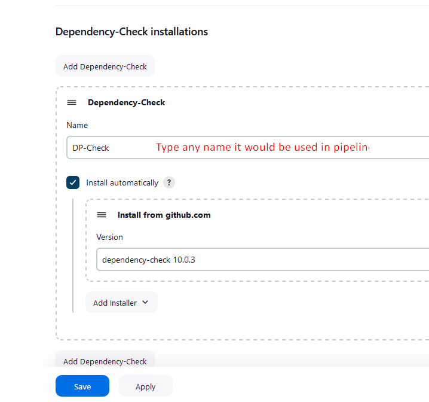
Click on Apply and Save here.

Create a file for trivyFs.groovy
```sh
def call() {
    sh 'trivy fs . > trivyfs.txt'
}
```
Push to GitHub
```sh
git add .
git commit -m "message"
git push origin main
```
Add the below stages to the Jenkins pipeline
```sh
stage('Trivy file scan'){
        when { expression { params.action == 'create'}}
            steps{
                trivyFs()
            }
        }
        stage('OWASP FS SCAN') {
        when { expression { params.action == 'create'}}
            steps {
                dependencyCheck additionalArguments: '--scan ./ --disableYarnAudit --disableNodeAudit', odcInstallation: 'DP-Check'
                dependencyCheckPublisher pattern: '**/dependency-check-report.xml'
            }
        }
```
Note-- Stage with the Dependency Check steps cannot be directly used inside a shared library. The main reason is that pipelines loaded from shared libraries have more restrictive script security by default. So the dependencyCheck and dependencyCheckPublisher steps would fail with rejected signature errors.

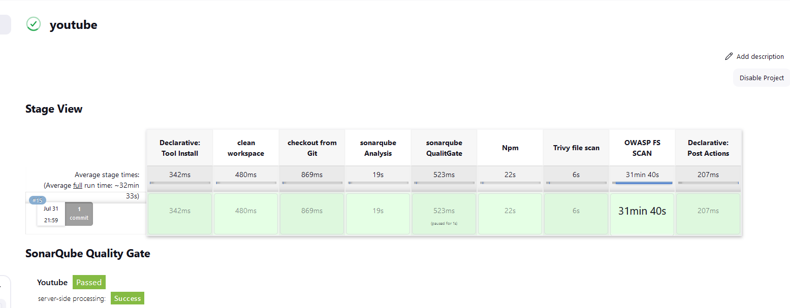

You will see that in status, a graph will also be generated and Vulnerabilities.

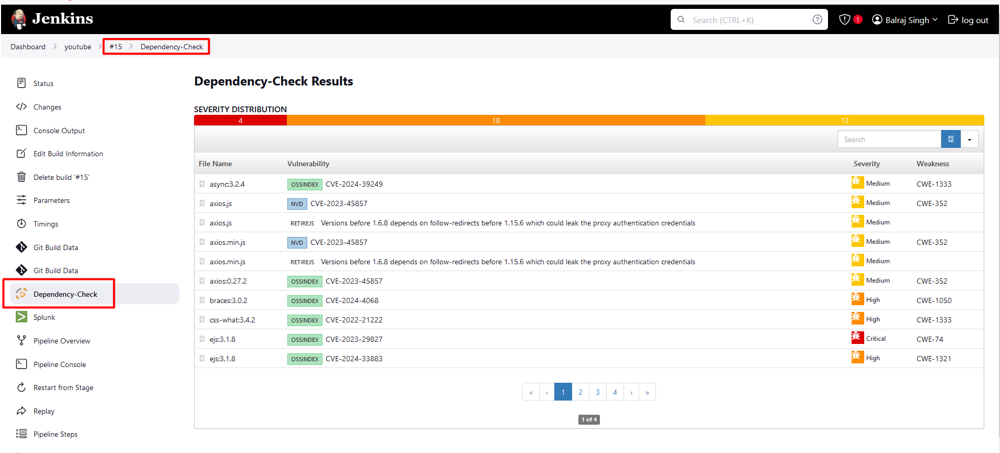


### Docker Image Build and Push
We need to install the Docker tool in our system, Goto Dashboard → Manage Plugins → Available plugins → Search for Docker and install these plugins
```sh
Docker
Docker Commons
Docker Pipeline
Docker API
docker-build-step
```
and click on install without restart

Add DockerHub Username and Password under Global Credentials
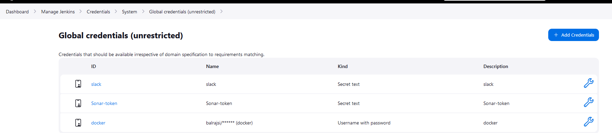

Now, goto Dashboard → Manage Jenkins → Tools →
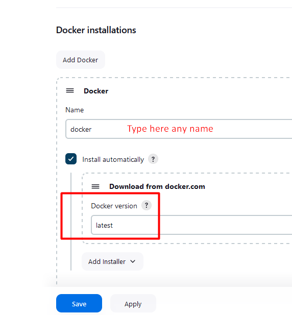

### Should have an __[rapidapi](https://rapidapi.com/)__ account.

"Once you have an account, your name will automatically appear in Rapid API."


In the search bar, type "YouTube" and choose "YouTube v3."


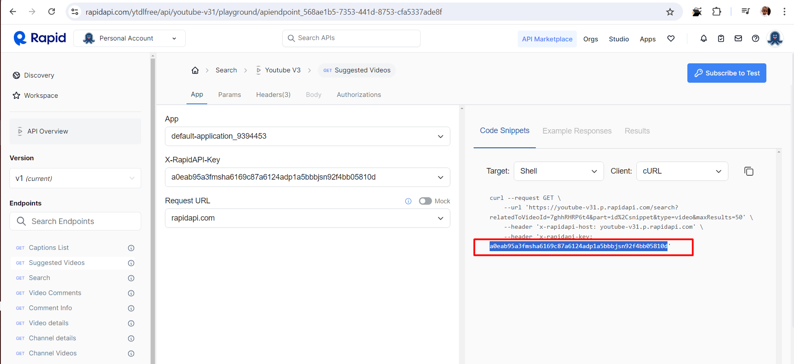

Copy API and use it in the groovy file

docker build –build-arg REACT_APP_RAPID_API_KEY=<API-KEY> -t ${imageName} .

Create a shared library file for dockerBuild.groovy
```sh
def call(String dockerHubUsername, String imageName) {
    // Build the Docker image
    sh "docker build --build-arg REACT_APP_RAPID_API_KEY=f0ead79813mshb0aa -t ${imageName} ."
     // Tag the Docker image
    sh "docker tag ${imageName} ${dockerHubUsername}/${imageName}:latest"
    // Push the Docker image
    withDockerRegistry([url: 'https://index.docker.io/v1/', credentialsId: 'docker']) {
        sh "docker push ${dockerHubUsername}/${imageName}:latest"
    }
}
```
Create another file for trivyImage.groovy
```sh
def call() {
    sh 'trivy image sevenajay/youtube:latest > trivyimage.txt'
}
```
Push the above files to the GitHub shared library.

Add this stage to your pipeline with parameters
```sh
#add inside parameter
 string(name: 'DOCKER_HUB_USERNAME', defaultValue: 'balrajsi', description: 'Docker Hub Username')
 string(name: 'IMAGE_NAME', defaultValue: 'youtube', description: 'Docker Image Name')
#stage
stage('Docker Build'){
        when { expression { params.action == 'create'}}
            steps{
                script{
                   def dockerHubUsername = params.DOCKER_HUB_USERNAME
                   def imageName = params.IMAGE_NAME
                   dockerBuild(dockerHubUsername, imageName)
                }
            }
        }
        stage('Trivy iamge'){
        when { expression { params.action == 'create'}}
            steps{
                trivyImage()
            }
        }
```

### Run the Docker container
Create a new file runContainer.groovy
```sh
def call(){
    sh "docker run -d --name youtube1 -p 3000:3000 balrajsi/youtube:latest"
}
```
Create Another file to remove container removeContainer.groovy
```sh
def call(){
    sh 'docker stop youtube1'
    sh 'docker rm youtube1'
}
```
Push them to the Shared library GitHub repo
```sh
git add .
git commit -m "message"
git push origin main
```
Add the below stages to the Pipeline
```sh
stage('Run container'){
        when { expression { params.action == 'create'}}
            steps{
                runContainer()
            }
        }
        stage('Remove container'){
        when { expression { params.action == 'delete'}}
            steps{
                removeContainer()
            }
        }
```
here is the updated pipeline so far
```sh
@Library('Jenkins_shared_library') _
def COLOR_MAP = [
    'FAILURE' : 'danger',
    'SUCCESS' : 'good'
]
pipeline{
    agent any
    tools{
        jdk 'jdk17'
        nodejs 'node16'
    }
    
    environment {
        SCANNER_HOME=tool 'sonar-scanner'
    }
    parameters {
        choice(name: 'action', choices: 'create\ndelete', description: 'Select create or destroy.')
        string(name: 'DOCKER_HUB_USERNAME', defaultValue: 'balrajsi', description: 'Docker Hub Username')
        string(name: 'IMAGE_NAME', defaultValue: 'youtube', description: 'Docker Image Name')
    }
    stages{
        stage('clean workspace'){
            steps{
                cleanWorkspace()
            }
        }
        stage('checkout from Git'){
            steps{
                checkoutGit('https://github.com/mrbalraj007/Youtube-clone-app.git', 'main')
            }
        }
        stage('sonarqube Analysis'){
        when { expression { params.action == 'create'}}
            steps{
                sonarqubeAnalysis()
            }
        }
        stage('sonarqube QualitGate'){
        when { expression { params.action == 'create'}}
            steps{
                script{
                    def credentialsId = 'Sonar-token'
                    qualityGate(credentialsId)
                }
            }
        }
        stage('Npm'){
        when { expression { params.action == 'create'}}
            steps{
                npmInstall()
            }
        }
        stage('Trivy file scan'){
        when { expression { params.action == 'create'}}
            steps{
                trivyFs()
            }
        }
        stage('OWASP FS SCAN') {
        when { expression { params.action == 'create'}}
            steps {
                dependencyCheck additionalArguments: '--scan ./ --disableYarnAudit --disableNodeAudit', odcInstallation: 'DP-Check'
                dependencyCheckPublisher pattern: '**/dependency-check-report.xml'
            }
        }
        stage('Docker Build'){
        when { expression { params.action == 'create'}}
            steps{
                script{
                   def dockerHubUsername = params.DOCKER_HUB_USERNAME
                   def imageName = params.IMAGE_NAME
                   dockerBuild(dockerHubUsername, imageName)
                }
            }
        }
        stage('Trivy iamge'){
        when { expression { params.action == 'create'}}
            steps{
                trivyImage()
            }
        }
        stage('Run container'){
        when { expression { params.action == 'create'}}
            steps{
                runContainer()
            }
        }
        stage('Remove container'){
        when { expression { params.action == 'delete'}}
            steps{
                removeContainer()
            }
        }
        
     }
     post {
         always {
             echo 'Slack Notifications'
             slackSend (
                 channel: '#jenkins',
                 color: COLOR_MAP[currentBuild.currentResult],
                 message: "*${currentBuild.currentResult}:* Job ${env.JOB_NAME} \n build ${env.BUILD_NUMBER} \n More info at: ${env.BUILD_URL}"
               )
           }
       }
   }
```

Build with parameters ‘create’
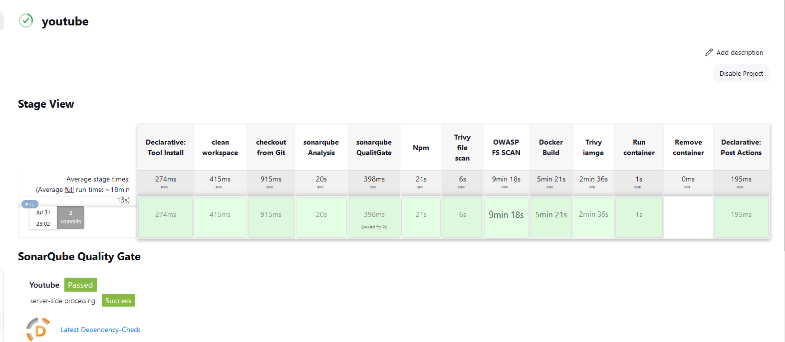
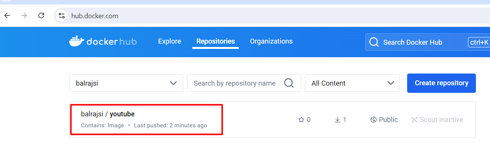


It will start the container
<public-ip-jenkins:3000>

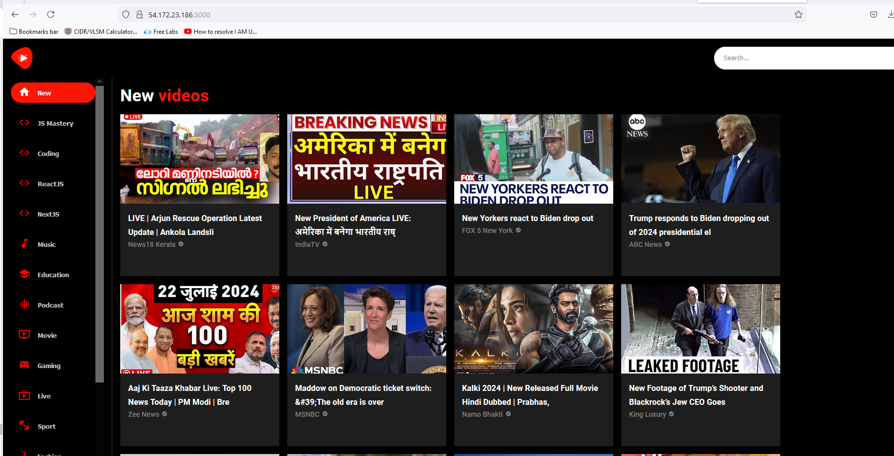

Build with parameters ‘delete’
It will stop and remove the Container

Delete view:
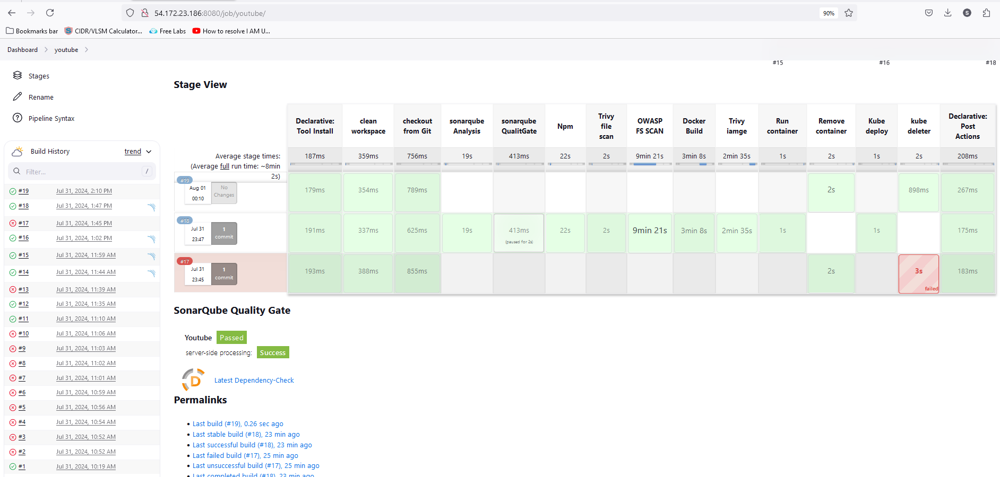

### Kubernetes Setup
Connect your machines to Putty or Mobaxtreme

Will create a Two Ubuntu ```t2.large```instances one for k8s master and the other one for worker.

Install Kubectl on Jenkins machine also.

#### Kubectl is to be installed on Jenkins
Connect your Jenkins machine

Create a shell script file kube.sh
```sh
sudo apt-get update -y

# Install AWS CLI
sudo apt-get install -y awscli, curl

# Install kubectl
curl -LO "https://dl.k8s.io/release/$(curl -L -s https://dl.k8s.io/release/stable.txt)/bin/linux/amd64/kubectl"
sudo install -o root -g root -m 0755 kubectl /usr/local/bin/kubectl
kubectl version --client
```
#### K8S Master-Slave setup

Will set the host name 

```sh
# Master Node
sudo hostnamectl set-hostname K8s-Master

# Worker Node
sudo hostnamectl set-hostname K8s-Worker
```
Will install the package on both Master & Node
```sh
sudo apt-get update
sudo apt-get install -y docker.io
sudo usermod –aG docker Ubuntu
newgrp docker
sudo chmod 777 /var/run/docker.sock
sudo apt-get update
# apt-transport-https may be a dummy package; if so, you can skip that package
sudo apt-get install -y apt-transport-https ca-certificates curl gpg
curl -fsSL https://pkgs.k8s.io/core:/stable:/v1.29/deb/Release.key | sudo gpg --dearmor -o /etc/apt/keyrings/kubernetes-apt-keyring.gpg
echo 'deb [signed-by=/etc/apt/keyrings/kubernetes-apt-keyring.gpg] https://pkgs.k8s.io/core:/stable:/v1.29/deb/ /' | sudo tee /etc/apt/sources.list.d/kubernetes.list
sudo apt-get update
sudo apt-get install -y kubelet kubeadm kubectl
sudo apt-mark hold kubelet kubeadm kubectl 
sudo snap install kube-apiserver
```
*Note*-if ask for password then presh enter and move on.

Now, we will run the following code on ```Master node only```
```sh
sudo kubeadm init --pod-network-cidr=10.244.0.0/16
# in case your in root exit from it and run below commands
mkdir -p $HOME/.kube
sudo cp -i /etc/kubernetes/admin.conf $HOME/.kube/config
sudo chown $(id -u):$(id -g) $HOME/.kube/config
kubectl apply -f https://raw.githubusercontent.com/coreos/flannel/master/Documentation/kube-flannel.yml
```
———-Worker Node————
sudo kubeadm join <master-node-ip>:<master-node-port> --token <token> --discovery-token-ca-cert-hash <hash>  --v=5

```sh
sudo kubeadm join 172.31.20.226:6443 --token 035jqv.haoqokd3166ocy8f         --discovery-token-ca-cert-hash sha256:938fa33276feb05b57db6231f546cea2a4a2b49b7574618737e02982cb7ceb7e --v=5
```

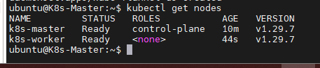

From the K8S-master download the config file which is under path
```sh
/home/ubuntu/.kube
```
copy it and save it in documents or another folder save it as secret-file.txt
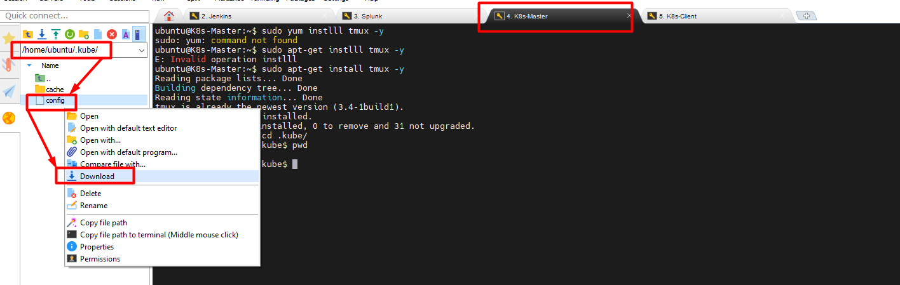

### On Jenkins Server 
Install Kubernetes Plugin,
```sh
Kubernetes Credentials	
Kubernetes
Kubernetes Client API
Kubernetes CLI
```

goto manage Jenkins –> manage credentials –> Click on Jenkins global –> add credentials
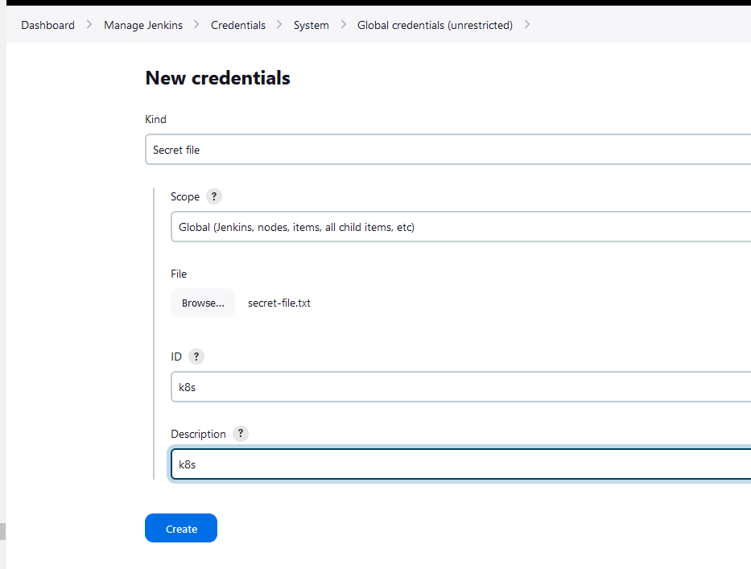

### Install Helm & Monitoring K8S using Prometheus and Grafana
On Kubernetes Master install the helm

```sh
curl -fsSL -o get_helm.sh https://raw.githubusercontent.com/helm/helm/main/scripts/get-helm-3
chmod 700 get_helm.sh
./get_helm.sh
```
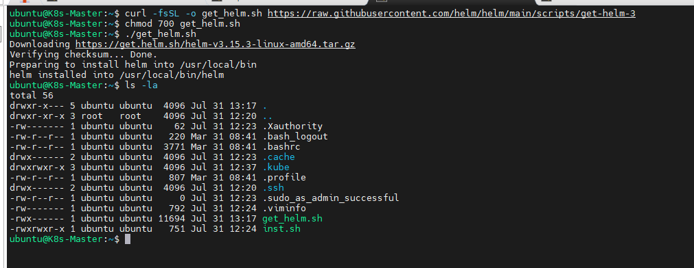

See the Helm version
```sh
helm version --client
```
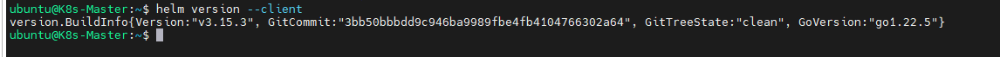

We need to add the Helm Stable Charts for your local client. Execute the below command:

```sh
helm repo add stable https://charts.helm.sh/stable
```
Add Prometheus Helm repo
```sh
helm repo add prometheus-community https://prometheus-community.github.io/helm-charts
```

Create Prometheus namespace
```sh
kubectl create namespace prometheus
```
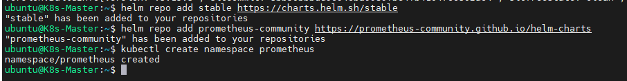

Install kube-Prometheus-stack
Below is the command to install kube-prometheus-stack. The helm repo kube-stack-Prometheus (formerly Prometheus-operator) comes with a Grafana deployment embedded.

Let’s check if the Prometheus and Grafana pods are running or not
```sh
kubectl get pods -n prometheus
```
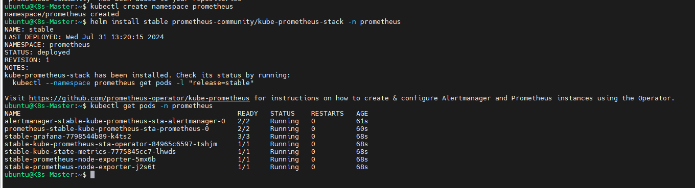

Now See the services
```sh
kubectl get svc -n prometheus
```
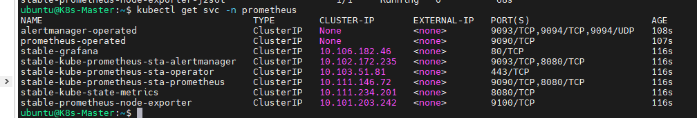

This confirms that Prometheus and grafana have been installed successfully using Helm.

To make Prometheus and grafana available outside the cluster, use LoadBalancer or NodePort instead of ClusterIP.

Edit Prometheus Service

```sh
kubectl edit svc stable-kube-prometheus-sta-prometheus -n prometheus
```
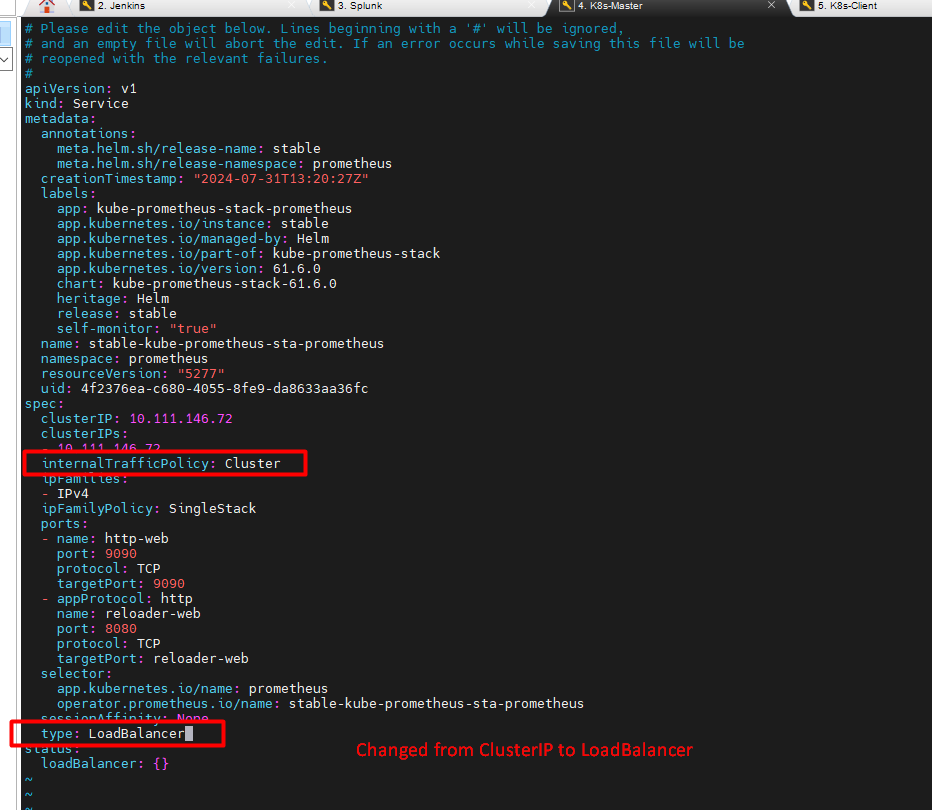

Edit Grafana Service
```sh
kubectl edit svc stable-grafana -n prometheus
```
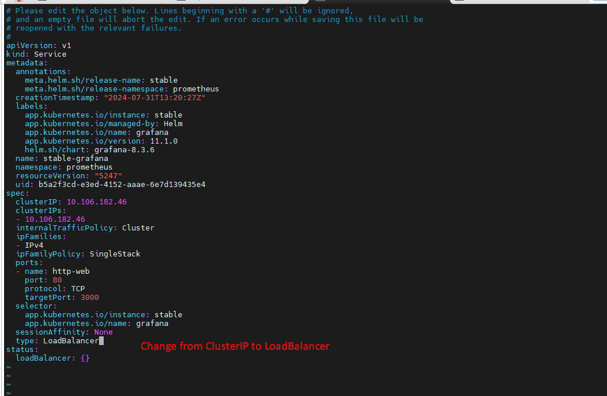

Verify if the service is changed to LoadBalancer and also get the Load BalancerPorts.
```sh
kubectl get svc -n prometheus
```
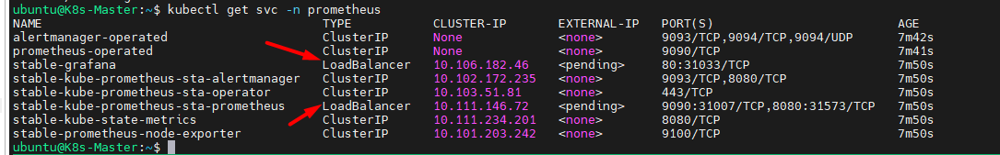

Access Grafana UI in the browser

Get the external IP from the above screenshot and put it in the browser
<k8s-master-public-ip:external-ip>

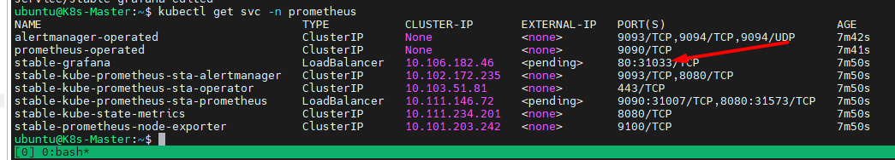

Login to Grafana
```sh
UserName: admin
Password: prom-operator
```
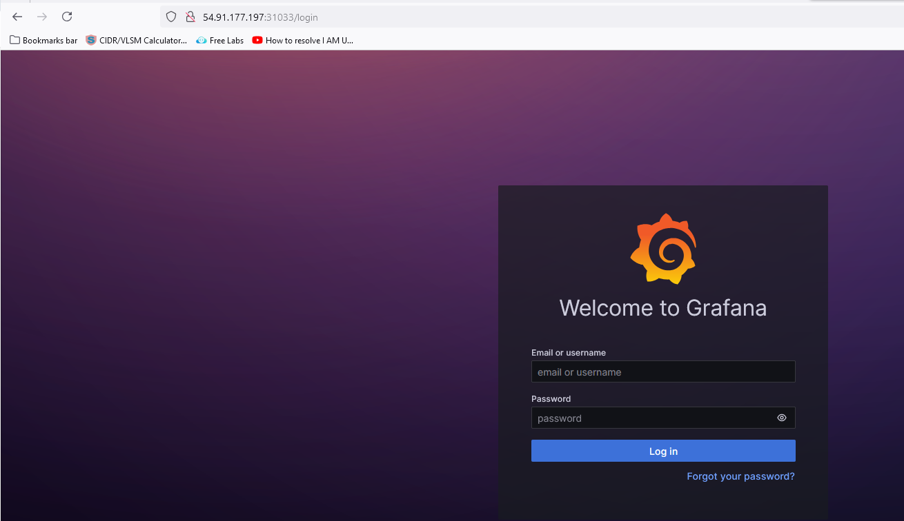

+ Create a Dashboard in Grafana

In Grafana, we can create various kinds of dashboards as per our needs.

How to Create Kubernetes Monitoring Dashboard?
For creating a dashboard to monitor the cluster:
Click the ‘+’ button on the left panel and select ‘Import’.
Enter the 15661 dashboard id under ```Grafana.com``` Dashboard.
Click ‘Load’.
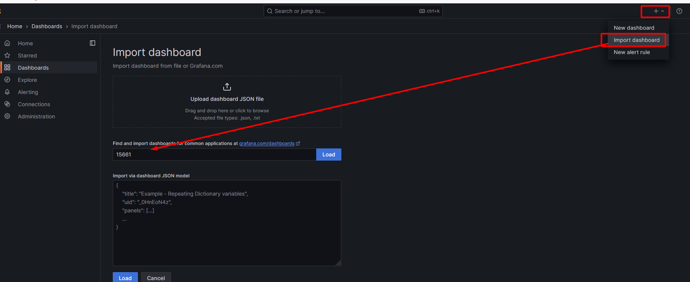

Select ‘Prometheus’ as the endpoint under the Prometheus data sources drop-down.
Click ‘Import’.

This will show the monitoring dashboard for all cluster nodes
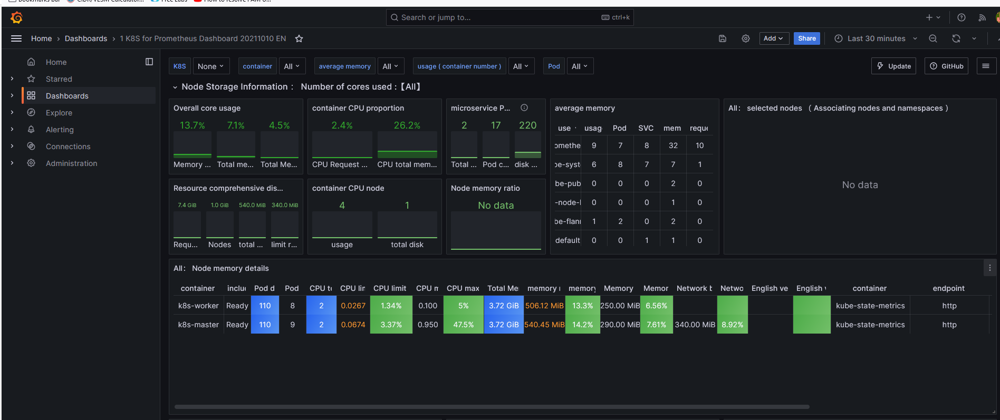

How to Create Kubernetes Cluster Monitoring Dashboard?

For creating a dashboard to monitor the cluster:

Click the ‘+’ button on the left panel and select ‘Import’.

Enter 3119 dashboard ID under Grafana.com Dashboard.

Click ‘Load’.

Select ‘Prometheus’ as the endpoint under the Prometheus data sources drop-down.

Click ‘Import’.

This will show the monitoring dashboard for all cluster nodes
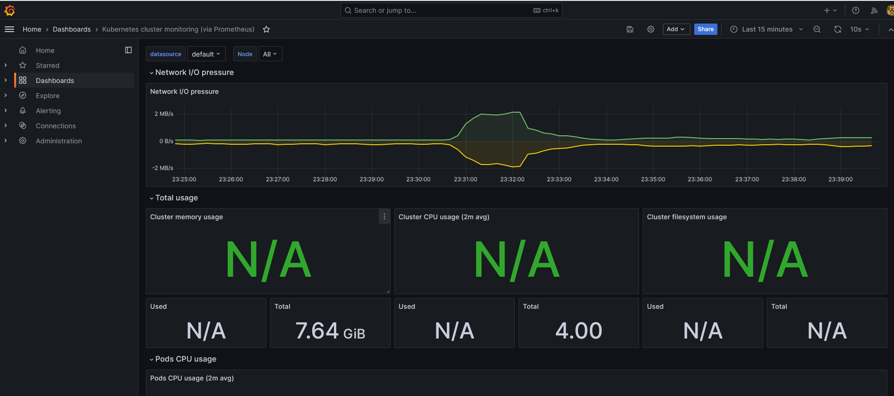

+ Create a POD Monitoring Dashboard

For creating a dashboard to monitor the cluster:

Click the ‘+’ button on the left panel and select ‘Import’.

Enter 6417 dashboard ID under Grafana.com Dashboard.

Click ‘Load’.

Select ‘Prometheus’ as the endpoint under the Prometheus data sources drop-down.

Click ‘Import’.
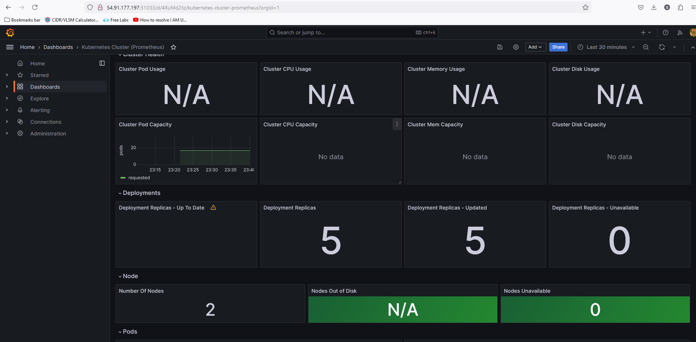


Step9E: K8S Deployment
Let’s Create a Shared Jenkins library file for K8s deploy and delete

Name kubeDeploy.groovy
```sh
def call() {
    withKubeConfig(caCertificate: '', clusterName: '', contextName: '', credentialsId: 'k8s', namespace: '', restrictKubeConfigAccess: false, serverUrl: '') {
        sh "kubectl apply -f deployment.yml"
    }
}
```
To delete deployment

Name kubeDelete.groovy
```sh
def call() {
    withKubeConfig(caCertificate: '', clusterName: '', contextName: '', credentialsId: 'k8s', namespace: '', restrictKubeConfigAccess: false, serverUrl: '') {
        sh "kubectl delete -f deployment.yml"
    }
}
```
Let’s push them to GitHub
```sh
git add .
git commit -m "message"
git push origin main
```
The final stage of the Pipeline

```sh
        stage('Kube deploy'){
        when { expression { params.action == 'create'}}
            steps{
                kubeDeploy()
            }
        }
        stage('kube deleter'){
        when { expression { params.action == 'delete'}}
            steps{
                kubeDelete()
            }
        }
```

Overall pipeline state
```sh
@Library('Jenkins_shared_library') _
def COLOR_MAP = [
    'FAILURE' : 'danger',
    'SUCCESS' : 'good'
]
pipeline{
    agent any
    tools{
        jdk 'jdk17'
        nodejs 'node16'
    }
    
    environment {
        SCANNER_HOME=tool 'sonar-scanner'
    }
    parameters {
        choice(name: 'action', choices: 'create\ndelete', description: 'Select create or destroy.')
        string(name: 'DOCKER_HUB_USERNAME', defaultValue: 'balrajsi', description: 'Docker Hub Username')
        string(name: 'IMAGE_NAME', defaultValue: 'youtube', description: 'Docker Image Name')
    }
    stages{
        stage('clean workspace'){
            steps{
                cleanWorkspace()
            }
        }
        stage('checkout from Git'){
            steps{
                checkoutGit('https://github.com/mrbalraj007/Youtube-clone-app.git', 'main')
            }
        }
        stage('sonarqube Analysis'){
        when { expression { params.action == 'create'}}
            steps{
                sonarqubeAnalysis()
            }
        }
        stage('sonarqube QualitGate'){
        when { expression { params.action == 'create'}}
            steps{
                script{
                    def credentialsId = 'Sonar-token'
                    qualityGate(credentialsId)
                }
            }
        }
        stage('Npm'){
        when { expression { params.action == 'create'}}
            steps{
                npmInstall()
            }
        }
        stage('Trivy file scan'){
        when { expression { params.action == 'create'}}
            steps{
                trivyFs()
            }
        }
        stage('OWASP FS SCAN') {
        when { expression { params.action == 'create'}}
            steps {
                dependencyCheck additionalArguments: '--scan ./ --disableYarnAudit --disableNodeAudit', odcInstallation: 'DP-Check'
                dependencyCheckPublisher pattern: '**/dependency-check-report.xml'
            }
        }
        stage('Docker Build'){
        when { expression { params.action == 'create'}}
            steps{
                script{
                   def dockerHubUsername = params.DOCKER_HUB_USERNAME
                   def imageName = params.IMAGE_NAME
                   dockerBuild(dockerHubUsername, imageName)
                }
            }
        }
        stage('Trivy iamge'){
        when { expression { params.action == 'create'}}
            steps{
                trivyImage()
            }
        }
        stage('Run container'){
        when { expression { params.action == 'create'}}
            steps{
                runContainer()
            }
        }
        stage('Remove container'){
        when { expression { params.action == 'delete'}}
            steps{
                removeContainer()
            }
        }
        stage('Kube deploy'){
        when { expression { params.action == 'create'}}
            steps{
                kubeDeploy()
            }
        }
        stage('kube deleter'){
        when { expression { params.action == 'delete'}}
            steps{
                kubeDelete()
            }
        }
        
     }
     post {
         always {
             echo 'Slack Notifications'
             slackSend (
                 channel: '#jenkins',
                 color: COLOR_MAP[currentBuild.currentResult],
                 message: "*${currentBuild.currentResult}:* Job ${env.JOB_NAME} \n build ${env.BUILD_NUMBER} \n More info at: ${env.BUILD_URL}"
               )
           }
       }
   }
```

It will apply the deployment

stage view
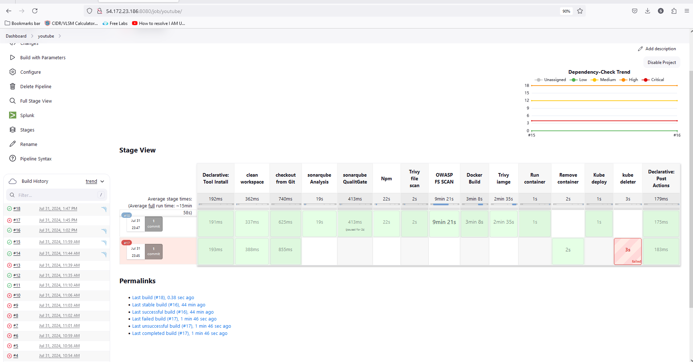


```sh
kubectl get all (or)
kubectl get svc
```
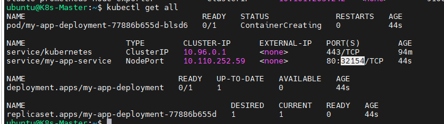

<kubernetes-worker-ip:svc port>


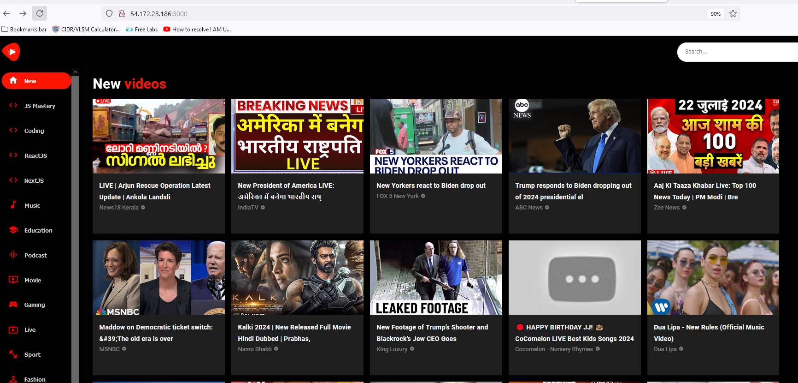

Delete view:


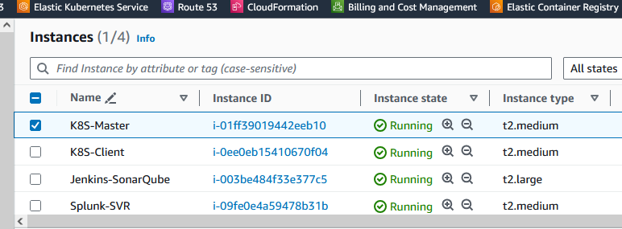