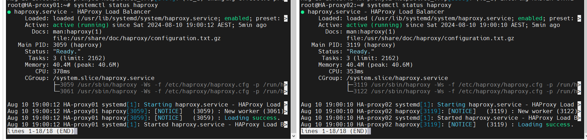
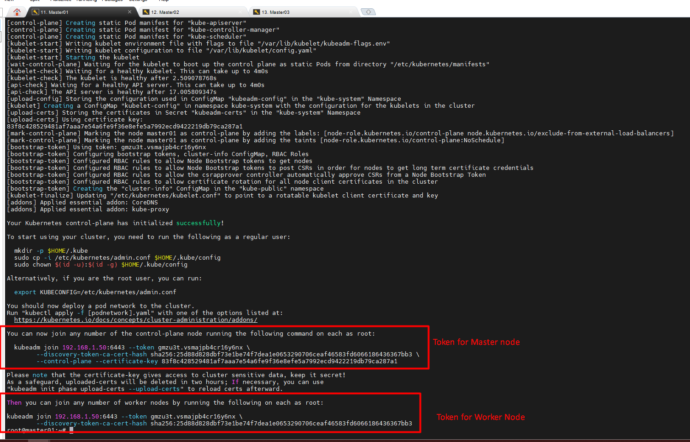
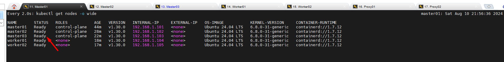
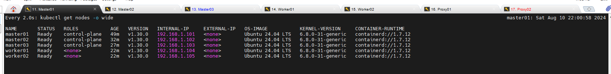

# <span style="color: Yellow;"> Setting up a highly available Kubernetes cluster with redundant load balancers using Keepalived and HAProxy </span>

In this blog, we'll walk you through the process of setting up a highly available Kubernetes cluster using Keepalived and HAProxy. The goal is to eliminate the single point of failure in your Kubernetes control plane by implementing redundancy in your load balancers and ensuring that your Kubernetes API server is always accessible.

## Introduction
Kubernetes is the go-to platform for container orchestration, but setting up a highly available (HA) Kubernetes cluster can be challenging. In this guide, we will create a Kubernetes cluster with multiple master nodes and redundant load balancers using Keepalived and HAProxy. This setup ensures that even if one of your load balancers fails, your cluster remains functional.

## Prerequisites
Before we begin, ensure you have the following:

A system running Linux with KVM (Kernel-based Virtual Machine) support.
Vagrant installed on your machine.
Basic knowledge of Kubernetes and its components.

## Overview of the Setup
We will set up a Kubernetes cluster with the following components:

Three Master Nodes: To ensure redundancy in the control plane.
Two Load Balancers: Implemented using HAProxy to distribute traffic to the master nodes.
Keepalived: To manage a virtual IP address that floats between the two load balancers, ensuring high availability.
Hardware Requirements
For this demo, each virtual machine will be configured as follows:

Masters and Workers: 2 CPUs, 2 GB RAM
Load Balancers: 1 CPU, 512 MB RAM
All virtual machines will run on Ubuntu 24.04 LTS with Kubernetes version 1.22.0.

Step-by-Step Guide
1. Setting Up the Virtual Machines
First, we'll create the necessary virtual machines using Vagrant and KVM. Below is a sample Vagrantfile configuration:

### Setting Up the HA Kubernetes Cluster

#### Prerequisites: 
Before you begin, ensure you have the following virtual machines (VMs) set up:

+ ```Two``` VM for HAProxy Load Balancer: HAProxy will distribute the load among the master nodes.
+ ```Three``` VMs for Master Nodes: These nodes will manage the worker nodes.
+ ```Two``` VMs for Worker Nodes: These nodes will run the application workloads.

### Lab Setup:

#### Configuring the Load Balancer
- Install HAProxy on your load balancer VM:
# Set up a Highly Available Kubernetes Cluster using kubeadm
Follow this documentation to set up a highly available Kubernetes cluster using __Ubuntu 24.04 LTS LTS__ with keepalived and haproxy

This documentation guides you in setting up a cluster with three master nodes, one worker node and two load balancer node using HAProxy and Keepalived.

## Environment Setup (VMware Workstation )
|Hostname|FQDN|IP|OS|RAM|CPU|
|----|----|----|----|----|----|
|HA-proxy01|HA-proxy01.singh.com|192.168.1.99|Ubuntu 24.04 LTS|2G|2|
|HA-proxy02|HA-proxy02.singh.com|192.168.1.100|Ubuntu 24.04 LTS|2G|2|
|Master01|master1.singh.com|192.168.1.101|Ubuntu 24.04 LTS|2G|2|
|Master02|master2.singh.com|192.168.1.102|Ubuntu 24.04 LTS|2G|2|
|Master03|master3.singh.com|192.168.1.103|Ubuntu 24.04 LTS|2G|2|
|Worker01|worker1.singh.com|192.168.1.201|Ubuntu 24.04 LTS|2G|2|
|Worker02|worker1.singh.com|192.168.1.201|Ubuntu 24.04 LTS|2G|2|

> * Password for the **root** account on all these virtual machines is **xxxxxxx**
> * Perform all the commands as root user unless otherwise specified

I have setup on ```Vmware Workstation```.


### Virtual IP managed by Keepalived on the load balancer nodes
|<span style="color: Yellow;"> Virtual IP</span>|
|----|
|<span style="color: Yellow;">192.168.1.50 <span>|

## Pre-requisites
If you want to try this in a virtualized environment on your workstation
* Virtualbox/VMware Workstation installed

## Set up <span style="color: red;"> load balancer nodes (loadbalancer1 & loadbalancer2)</span>

##### Install Keepalived & Haproxy

```bash
sudo -i
apt-get install -y curl
apt-get update && apt-get install -y keepalived haproxy
```
##### configure keepalived (Create the health check script)
On both Proxy nodes create the health check script ```/etc/keepalived/check_apiserver.sh```
```bash
sudo tee /etc/keepalived/check_apiserver.sh > /dev/null <<EOF
#!/bin/sh

errorExit() {
  echo "*** \$@" 1>&2
  exit 1
}

curl --silent --max-time 2 --insecure https://localhost:6443/ -o /dev/null || errorExit "Error GET https://localhost:6443/"
if ip addr | grep -q 192.168.1.50; then
  curl --silent --max-time 2 --insecure https://192.168.1.50:6443/ -o /dev/null || errorExit "Error GET https://192.168.1.50:6443/"
fi
EOF
sudo chmod +x /etc/keepalived/check_apiserver.sh

```
Interface name issue: Ensure that the interface name (```eth1``` in your config) exists on your system. You can check available network interfaces with: If not then adjust the config file accordingly.

```bash
ip link show

      or

ip a s
```
### in my Lab it is as below
```powershell
root@HA-proxy01:~# ip link show
1: lo: <LOOPBACK,UP,LOWER_UP> mtu 65536 qdisc noqueue state UNKNOWN mode DEFAULT group default qlen 1000
    link/loopback 00:00:00:00:00:00 brd 00:00:00:00:00:00
2: ens32: <BROADCAST,MULTICAST,UP,LOWER_UP> mtu 1500 qdisc pfifo_fast state UP mode DEFAULT group default qlen 1000
    link/ether 00:0c:29:33:50:8c brd ff:ff:ff:ff:ff:ff
    altname enp2s0
```

Adjust the connect name ```interface eth1``

Create keepalived config /etc/keepalived/keepalived.conf
```bash
sudo tee /etc/keepalived/keepalived.conf > /dev/null <<EOF
vrrp_script check_apiserver {
  script "/etc/keepalived/check_apiserver.sh"
  interval 3
  timeout 10
  fall 5
  rise 2
  weight -2
}

vrrp_instance VI_1 {
    state BACKUP
    interface ens32
    virtual_router_id 1
    priority 100
    advert_int 5
    authentication {
        auth_type PASS
        auth_pass mysecret
    }
    virtual_ipaddress {
        192.168.1.50
    }
    track_script {
        check_apiserver
    }
}
EOF
```
##### Enable & start keepalived service
```bash
sudo systemctl enable --now keepalived
```

##### Verify the ```Keepalived and Haproxy``` service status
```bash
systemctl status keepalived
systemctl status haproxy
```



##### To verify which one is master HA Proxy

```bash
journalctl -flu keepalived
```
> In my case my ```HA-proxy02``` become master.


##### Configure haproxy
On both load balancer nodes, configure HAProxy to forward traffic to the master nodes:
Edit the HAProxy configuration file ```/etc/haproxy/haproxy.cfg```
```
cat >> /etc/haproxy/haproxy.cfg <<EOF

frontend kubernetes-frontend
  bind *:6443
  mode tcp
  option tcplog
  default_backend kubernetes-backend

backend kubernetes-backend
  option httpchk GET /healthz
  http-check expect status 200
  mode tcp
  option ssl-hello-chk
  balance roundrobin
    server master1 192.168.1.101:6443 check fall 3 rise 2
    server master2 192.168.1.102:6443 check fall 3 rise 2
    server master3 192.168.1.103:6443 check fall 3 rise 2
EOF
```
##### Restart HAProxy to apply the configuration: (Enable & restart haproxy service)
```
systemctl enable haproxy && systemctl restart haproxy
```


## <span style="color: red;"> Pre-requisites </span> on all kubernetes nodes (masters & workers)

##### Disable swap (after reboot it would ramain disable state)
```bash
sudo -i
swapoff -a; sed -i '/swap/d' /etc/fstab
```
##### we will disable Firewall if it is enabled.
```bash
systemctl disable --now ufw
```
##### Enable and Load Kernel modules
```bash
{
cat >> /etc/modules-load.d/containerd.conf <<EOF
overlay
br_netfilter
EOF

modprobe overlay
modprobe br_netfilter
}
```


##### Add Kernel settings (If server rebooted then file would be auto added after reboot)
```bash
{
cat >>/etc/sysctl.d/kubernetes.conf<<EOF
net.bridge.bridge-nf-call-ip6tables = 1
net.bridge.bridge-nf-call-iptables  = 1
net.ipv4.ip_forward                 = 1
EOF

sysctl --system
}
```
##### Install containerd runtime
```bash
{
  apt update
  apt install -y containerd apt-transport-https
  mkdir /etc/containerd
  containerd config default > /etc/containerd/config.toml
  systemctl restart containerd
  systemctl enable containerd
}
```
#### Verify the containerd status and service
```bash
systemctl status containerd
containerd --version
journalctl -u containerd
```

##### Add apt repo for kubernetes & Install Kubernetes components

create a ```install_kube.sh``` file and paste the following content
```bash
cat >> install_kube.sh <<EOF
#!/bin/sh
sudo apt-get install -y apt-transport-https ca-certificates curl gnupg
sudo mkdir -p -m 755 /etc/apt/keyrings
curl -fsSL https://pkgs.k8s.io/core:/stable:/v1.30/deb/Release.key | sudo gpg --dearmor -o /etc/apt/keyrings/kubernetes-apt-keyring.gpg
echo 'deb [signed-by=/etc/apt/keyrings/kubernetes-apt-keyring.gpg] https://pkgs.k8s.io/core:/stable:/v1.30/deb/ /' | sudo tee /etc/apt/sources.list.d/kubernetes.list
sudo apt update
sudo apt install -y kubeadm=1.30.0-1.1 kubelet=1.30.0-1.1 kubectl=1.30.0-1.1
EOF
chmod +x install_kube.sh
```
run it 
```bash
./install_kube.sh
```

## <span style="color: red;"> Setup Bootstrap the cluster</span>

Now, SSH into one of the master nodes and initialize the Kubernetes cluster: On ```Master01``` [*You can choose any master node*]
##### <span style="color: Green;"> Initializing the Kubernetes Cluster </span>

```bash
sudo -i
# kubeadm init --control-plane-endpoint="192.168.1.50:6443" --upload-certs --pod-network-cidr=10.244.0.0/16
kubeadm init --control-plane-endpoint="192.168.1.50:6443" --upload-certs --apiserver-advertise-address=192.168.1.101 --pod-network-cidr=10.244.0.0/16
# as we are selecting master node then we will use IP address 192.168.1.101
```



Follow the output instructions to join the other master and worker nodes to the cluster.

```css
[kubelet-finalize] Updating "/etc/kubernetes/kubelet.conf" to point to a rotatable kubelet client certificate and key
[addons] Applied essential addon: CoreDNS
[addons] Applied essential addon: kube-proxy

Your Kubernetes control-plane has initialized successfully!

To start using your cluster, you need to run the following as a regular user:

  mkdir -p $HOME/.kube
  sudo cp -i /etc/kubernetes/admin.conf $HOME/.kube/config
  sudo chown $(id -u):$(id -g) $HOME/.kube/config

Alternatively, if you are the root user, you can run:

  export KUBECONFIG=/etc/kubernetes/admin.conf

You should now deploy a pod network to the cluster.
Run "kubectl apply -f [podnetwork].yaml" with one of the options listed at:
  https://kubernetes.io/docs/concepts/cluster-administration/addons/

You can now join any number of the control-plane node running the following command on each as root:

  kubeadm join 192.168.1.50:6443 --token gmzu3t.vsmajpb4cr16y6nx \
        --discovery-token-ca-cert-hash sha256:25d88d828dbf73e1be74f7dea1e0653290706ceaf46583fd6066186436367bb3 \
        --control-plane --certificate-key 83f8c428529481af7aaa7e54a6fe9f36e8efe5a7992ecd9422219db79ca287a1

Please note that the certificate-key gives access to cluster sensitive data, keep it secret!
As a safeguard, uploaded-certs will be deleted in two hours; If necessary, you can use
"kubeadm init phase upload-certs --upload-certs" to reload certs afterward.

Then you can join any number of worker nodes by running the following on each as root:

kubeadm join 192.168.1.50:6443 --token gmzu3t.vsmajpb4cr16y6nx \
        --discovery-token-ca-cert-hash sha256:25d88d828dbf73e1be74f7dea1e0653290706ceaf46583fd6066186436367bb3
```
#### On ```master01``` will run the following command.
```bash
 mkdir -p $HOME/.kube
sudo cp -i /etc/kubernetes/admin.conf $HOME/.kube/config
sudo chown $(id -u):$(id -g) $HOME/.kube/config
```

#### On ```Master01``` Deploy Calico network [you can choose any master, for my Lab, I am using ```Master01```]
```bash
sudo -i
# kubectl --kubeconfig=/etc/kubernetes/admin.conf create -f https://docs.projectcalico.org/v3.18/manifests/calico.yaml
wget https://raw.githubusercontent.com/projectcalico/calico/v3.28.1/manifests/calico.yaml
kubectl --kubeconfig=/etc/kubernetes/admin.conf apply -f calico.yaml

# Official Page - https://docs.tigera.io/calico/3.27/about/
```
 

 <span style="color: Yellow;">__Note__--> I was getting an error message while using ```v3.18```manifests for calico.yaml file and noticed that "The error message indicates that the ```PodDisruptionBudget``` resource in the calico.yaml manifest is using an outdated API version ```(policy/v1beta1)```. Kubernetes 1.21 and later versions have deprecated this version in favor of ```policy/v1```."

## Join other ```Master 02 & Master03``` nodes to the cluster
> Use the respective kubeadm join commands you copied from the output of kubeadm init command on the first master.

```bash
 kubeadm join 192.168.1.50:6443 --token gmzu3t.vsmajpb4cr16y6nx \
        --discovery-token-ca-cert-hash sha256:25d88d828dbf73e1be74f7dea1e0653290706ceaf46583fd6066186436367bb3 \
        --control-plane --certificate-key 83f8c428529481af7aaa7e54a6fe9f36e8efe5a7992ecd9422219db79ca287a1
```

Now, check it.
```bash
kubectl get pods -n kube-system
kubectl get nodes -o wide
```


> IMPORTANT: Don't forget the --apiserver-advertise-address option to the join command when you join the other master nodes, if you are using additional NIC then it need to use.

## Join worker nodes to the cluster
> Use the kubeadm join command you copied from the output of kubeadm init command on the first master
```bash
kubeadm join 192.168.1.50:6443 --token gmzu3t.vsmajpb4cr16y6nx \
        --discovery-token-ca-cert-hash sha256:25d88d828dbf73e1be74f7dea1e0653290706ceaf46583fd6066186436367bb3
````


Now, check it.
```bash
kubectl get pods -n kube-system
kubectl get nodes -o wide
```


## Verifying the cluster
```
kubectl cluster-info
kubectl get nodes
```
```bash
root@master01:~# kubectl cluster-info
Kubernetes control plane is running at https://192.168.1.50:6443
CoreDNS is running at https://192.168.1.50:6443/api/v1/namespaces/kube-system/services/kube-dns:dns/proxy

To further debug and diagnose cluster problems, use 'kubectl cluster-info dump'.
root@master01:~#
```
## Downloading kube config to your local machine
On your host machine
```
mkdir ~/.kube
scp root@192.168.1.101:/etc/kubernetes/admin.conf ~/.kube/config
```
Password for root account is "xxxxxxxxx"
#### Now, we will shutdown one master node and see the status.
I have choosed ```Master03``` and after shutdown the master03 below is the status.


Now, we will power on the master03 again and will shutdown the proxy to test.


For proxy verification, Currently HAproxy02 is holding the master role


Will shutdown the ```HAproxy02``` and test it out.

After HAProxy02 is power-off now, HAproxy01 has taken all the loads and no impact on the K8s Cluster.



PowerState of ```HAPRoxy02```


## Verifying the cluster
```
kubectl cluster-info
kubectl get nodes
```

If we stop the HAproxy services from HAProxy nodes, then we will lose the K8s connetivity for some time because we have given in check_apiserver that it will check for ```fall5```
```bash
 interval 3
  timeout 10
  fall 5
  rise 2
  weight -2
```
For testing purposes, we will power on ```HAProxy02```, and stop the services "haproxy" from ```HAproxy01``` on it, and see.


#### Conclusion
By following this guide, you've successfully set up a highly available Kubernetes cluster with redundant load balancers using Keepalived and HAProxy. This setup ensures that your Kubernetes API server remains accessible even if one of your load balancers goes down, providing greater resilience and reliability for your applications.

This approach can be further extended by adding more master nodes, worker nodes, and load balancers to meet your specific requirements.