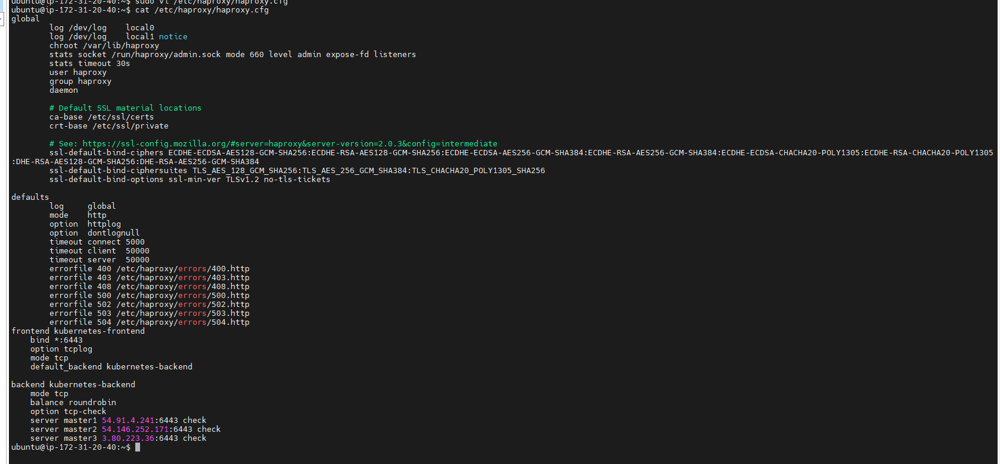
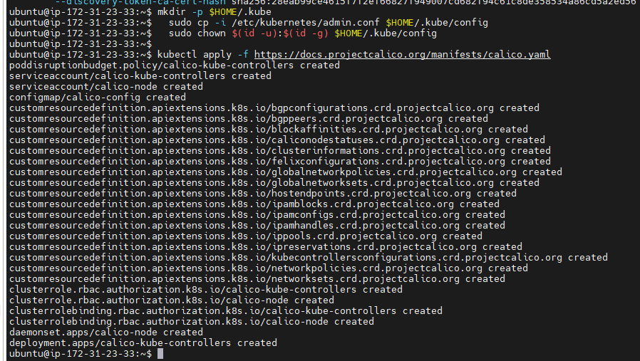
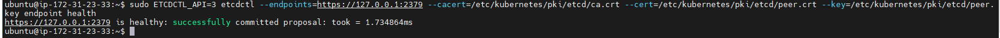
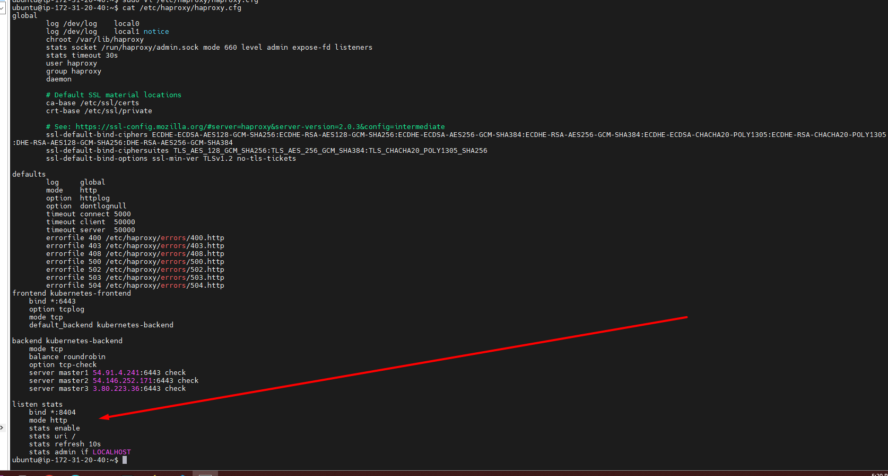
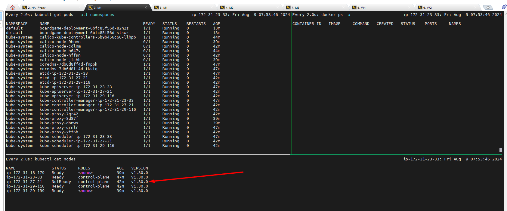

# Setting Up a Highly Available Kubernetes Cluster: A Step-by-Step Guide


In today's digital landscape, high availability (HA) is not just a luxury—it's a necessity. This principle is especially critical in Kubernetes clusters, where ensuring that your applications remain available even in the face of infrastructure failures is paramount. In this blog, we'll dive into setting up a highly available Kubernetes (K8s) cluster. Whether you're a DevOps enthusiast or a seasoned cloud architect, this guide will help you understand the importance of HA and walk you through the steps to set it up on a self-hosted Kubernetes cluster.


## Why Do You Need a Highly Available Kubernetes Cluster?
A standard Kubernetes cluster typically consists of a single master node that manages multiple worker nodes. The master node handles critical tasks like scheduling pods, maintaining the cluster state, and managing the API server. If this master node fails, the entire cluster can go down, leading to application downtime—a situation no business can afford.

To mitigate this risk, we set up a highly available Kubernetes cluster. In an HA setup, multiple master nodes share the load, ensuring that even if one or more master nodes fail, the cluster remains operational. This redundancy is achieved through a concept known as quorum, which we'll discuss in detail later.

## Understanding Quorum in HA Clusters
The concept of quorum is vital in HA clusters. Quorum refers to the minimum number of master nodes required to make decisions in the cluster. If the number of active master nodes falls below this threshold, the cluster can no longer function correctly.

### Calculating Quorum
To calculate the quorum, you can use the following formula:
```bash
Quorum = floor(n/2) + 1
```
Where n is the total number of master nodes. Let's look at a couple of examples to understand this better:

#### 3 Master Nodes Cluster:
- Quorum = floor(3/2) + 1 = 1 + 1 = 2
- If one master node fails, the remaining two nodes can still make decisions, keeping the cluster operational.
#### 5 Master Nodes Cluster:
- Quorum = floor(5/2) + 1 = 2 + 1 = 3
- Even if two master nodes fail, the cluster remains functional as long as the remaining three nodes are active.

In essence, the quorum ensures that the cluster can continue to operate correctly even in the event of node failures.

### Setting Up the HA Kubernetes Cluster

#### Prerequisites: 
Before you begin, ensure you have the following virtual machines (VMs) set up:

+ ```One``` VM for HAProxy Load Balancer: HAProxy will distribute the load among the master nodes.
+ ```Three``` VMs for Master Nodes: These nodes will manage the worker nodes.
+ ```Two``` VMs for Worker Nodes: These nodes will run the application workloads.

### Lab Setup:
1. Setting Up the Virtual Machines

First, we'll create the necessary virtual machines using terraform. Below is a sample terraform configuration:

Once you [clone repo](https://github.com/mrbalraj007/DevOps_free_Bootcamp.git) then go to folder *"07.Real-Time-DevOps-Project(Single_HA-I))/k8s-terraform-setup"* and run the terraform command.
```bash
cd k8s-terraform-setup/
$ ls -l
total 20
drwxr-xr-x 1 bsingh 1049089    0 Aug 11 11:43 HA_proxy_LB/
drwxr-xr-x 1 bsingh 1049089    0 Aug 11 11:46 Master_Worker_Setup/
-rw-r--r-- 1 bsingh 1049089  562 Aug 11 11:39 main.tf
```

You need to run ```main.tf``` file using following terraform command note-- make sure you will run main.tf not from inside the folders (HA_proxy_LB,Master_Worker_Setup)

```bash
cd \07.Real-Time-DevOps-Project(Fully_HA-Terraform-III)\k8s-terraform-setup


Mode                 LastWriteTime         Length Name
----                 -------------         ------ ----
da---l          11/08/24  11:43 AM                HA_proxy_LB
da---l          11/08/24  11:46 AM                Master_Worker_Setup
-a---l          09/08/24   4:03 PM            482 .gitignore
-a---l          11/08/24  11:39 AM            562 main.tf

# Now, run the following command.
terraform init
terraform fmt
terraform validate
terraform plan
terraform apply --auto-approve
```

| Server Name | Private IP Address | Public IP Address | OS |
|:-----------:|:------------:|:------------:|:------------:|
| LB-Proxy      | 192.168.1.100 |        | Ubuntu 24.04 LTS       |
| M01      | 192.168.1.101      |  | Ubuntu 24.04 LTS       |
| M02      | 192.168.1.102       | | Ubuntu 24.04 LTS       |
| M03      | 192.168.1.103        || Ubuntu 24.04 LTS       |
| W1      | 192.168.1.104        | |Ubuntu 24.04 LTS       |
| W2      | 192.168.1.105        || Ubuntu 24.04 LTS       |


#### Configuring the Load Balancer
- Install HAProxy on your load balancer VM:
```sh
sudo apt update
sudo apt install haproxy -y
```
- Configure HAProxy to distribute traffic among the master nodes. Edit the HAProxy configuration file:
```sh
sudo vi /etc/haproxy/haproxy.cfg
```
- Add the following lines, replacing MasterNodeIP with the IP addresses of your master nodes:
```bash
# frontend k8s-api
#     bind *:6443
#     default_backend k8s-masters

# backend k8s-masters
#     balance roundrobin
#     server master1 MasterNode1IP:6443 check
#     server master2 MasterNode2IP:6443 check
#     server master3 MasterNode3IP:6443 check
frontend kubernetes-frontend
    bind *:6443
    option tcplog
    mode tcp
    default_backend kubernetes-backend

backend kubernetes-backend
    mode tcp
    balance roundrobin
    option tcp-check
    server master1 <MASTER1_IP>:6443 check
    server master2 <MASTER2_IP>:6443 check
    server master3 <MASTER3_IP>:6443 check
```



- Restart HAProxy:
```bash
sudo systemctl restart haproxy
```

### Installing Kubernetes Components
Next, you'll install Docker, kubeadm, kubelet, and kubectl on ```all master and worker nodes```.

- Create a script to install these components:
```bash
vi install_k8s.sh
```

- Add the following content to the script:
```bash
# #!/bin/bash
# sudo apt-get update -y
# sudo apt-get install -y apt-transport-https ca-certificates curl
# sudo curl -fsSL https://download.docker.com/linux/ubuntu/gpg | sudo apt-key add -
# sudo add-apt-repository "deb [arch=amd64] https://download.docker.com/linux/ubuntu $(lsb_release -cs) stable"
# sudo apt-get update -y
# sudo apt-get install -y docker-ce
# sudo systemctl start docker
# sudo systemctl enable docker

# sudo curl -s https://packages.cloud.google.com/apt/doc/apt-key.gpg | sudo apt-key add -
# sudo apt-add-repository "deb http://apt.kubernetes.io/ kubernetes-xenial main"
# sudo apt-get update -y
# sudo apt-get install -y kubelet kubeadm kubectl
# sudo apt-mark hold kubelet kubeadm kubectl

#!/bin/bash
# To Turning off Swap
sudo swapoff -a
sudo sed -i '/ swap / s/^/#/' /etc/fstab
sudo apt-get update
sudo apt install docker.io -y
sudo chmod 666 /var/run/docker.sock
sudo apt-get install -y apt-transport-https ca-certificates curl gnupg
sudo mkdir -p -m 755 /etc/apt/keyrings
curl -fsSL https://pkgs.k8s.io/core:/stable:/v1.30/deb/Release.key | sudo gpg --dearmor -o /etc/apt/keyrings/kubernetes-apt-keyring.gpg
echo 'deb [signed-by=/etc/apt/keyrings/kubernetes-apt-keyring.gpg] https://pkgs.k8s.io/core:/stable:/v1.30/deb/ /' | sudo tee /etc/apt/sources.list.d/kubernetes.list
sudo apt update
sudo apt install -y kubeadm=1.30.0-1.1 kubelet=1.30.0-1.1 kubectl=1.30.0-1.1
```
- Run the script on all master and worker nodes:
```bash
chmod +x install_k8s.sh
./install_k8s.sh
```
### Initializing the Kubernetes Cluster
Now that the necessary components are installed, you can initialize the Kubernetes cluster on the first master node.

#### <span style="color: Green;"> Initialize the first master node (```M1```): </span>

- Check Kubelet Status

Run the following command to check the status of the kubelet service:
```bash
sudo systemctl status kubelet
```
- Replace LoadBalancerIP with the IP address of your HAProxy load balancer.
```bash
#kubeadm init --control-plane-endpoint "LoadBalancerIP:6443" --upload-certs
sudo kubeadm init --control-plane-endpoint "LOAD_BALANCER_IP:6443" --upload-certs --pod-network-cidr=10.244.0.0/16
```
```sh
sudo kubeadm init --control-plane-endpoint "3.91.39.241:6443" --upload-certs --pod-network-cidr=10.244.0.0/16
```
```sh
Your Kubernetes control-plane has initialized successfully!

To start using your cluster, you need to run the following as a regular user:

  mkdir -p $HOME/.kube
  sudo cp -i /etc/kubernetes/admin.conf $HOME/.kube/config
  sudo chown $(id -u):$(id -g) $HOME/.kube/config

Alternatively, if you are the root user, you can run:

  export KUBECONFIG=/etc/kubernetes/admin.conf

You should now deploy a pod network to the cluster.
Run "kubectl apply -f [podnetwork].yaml" with one of the options listed at:
  https://kubernetes.io/docs/concepts/cluster-administration/addons/

You can now join any number of the control-plane node running the following command on each as root:

  kubeadm join 3.91.39.241:6443 --token omm6m2.m3anj0goqnkpgosx \
        --discovery-token-ca-cert-hash sha256:28eab99ce4615f7f2ef66827f949007cd682f94c61c8de358534a86cd5a2ed56 \
        --control-plane --certificate-key 179f2f0f48103e0d28646450ec5d937dc6abb2bf2be274b8352fef5f5c427410

Please note that the certificate-key gives access to cluster sensitive data, keep it secret!
As a safeguard, uploaded-certs will be deleted in two hours; If necessary, you can use
"kubeadm init phase upload-certs --upload-certs" to reload certs afterward.

Then you can join any number of worker nodes by running the following on each as root:

kubeadm join 3.91.39.241:6443 --token omm6m2.m3anj0goqnkpgosx \
        --discovery-token-ca-cert-hash sha256:28eab99ce4615f7f2ef66827f949007cd682f94c61c8de358534a86cd5a2ed56

```


- Set up kubectl access:
```bash
mkdir -p $HOME/.kube
sudo cp -i /etc/kubernetes/admin.conf $HOME/.kube/config
sudo chown $(id -u):$(id -g) $HOME/.kube/config
```

- Install the network plugin (Calico):
```bash
kubectl apply -f https://docs.projectcalico.org/manifests/calico.yaml
```


### <span style="color: red;"> Joining Additional Master and Worker Nodes</span>
Retrieve the join command from the output of the kubeadm init command.

- Join the second and third master nodes using the join command: don't forget to add sudo infront of the command
```bash
sudo kubeadm join LoadBalancerIP:6443 --token <token> --discovery-token-ca-cert-hash sha256:<hash> --control-plane --certificate-key <key>
```
```bash
sudo kubeadm join 3.91.39.241:6443 --token omm6m2.m3anj0goqnkpgosx \
        --discovery-token-ca-cert-hash sha256:28eab99ce4615f7f2ef66827f949007cd682f94c61c8de358534a86cd5a2ed56 \
        --control-plane --certificate-key 179f2f0f48103e0d28646450ec5d937dc6abb2bf2be274b8352fef5f5c427410
```

After join second and third master nodes, we have to run the following command on each node.

```sh
  mkdir -p $HOME/.kube
  sudo cp -i /etc/kubernetes/admin.conf $HOME/.kube/config
  sudo chown $(id -u):$(id -g) $HOME/.kube/config
```
- Join the worker nodes using a similar join command:
```bash
sudo kubeadm join LoadBalancerIP:6443 --token <token> --discovery-token-ca-cert-hash sha256:<hash>
```

```sh
sudo kubeadm join 3.91.39.241:6443 --token omm6m2.m3anj0goqnkpgosx \
        --discovery-token-ca-cert-hash sha256:28eab99ce4615f7f2ef66827f949007cd682f94c61c8de358534a86cd5a2ed56
```

### Verify the Cluster

> Go to M1 node and run the following command

**Check the status of all nodes:**
   ```bash
   kubectl get nodes
   ```


**Check the status of all pods:**
  ```bash
  kubectl get pods --all-namespaces
  ```

By following these instructions, you will have created a highly available Kubernetes cluster with two master nodes, three worker nodes, and a load balancer that distributes traffic across the master nodes. This setting assures that if one master node dies, the other will still process API calls.

# Verification (following command should be run on all master nodes ```M1, M2 & M3```)

### Install etcdctl to verify the health check
**Install etcdctl using apt:**
  ```bash
   sudo apt-get update
   sudo apt-get install -y etcd-client
  ```

### Verify Etcd Cluster Health, It needs to run on all master nodes. 
**Check the health of the etcd cluster:**
```bash
sudo ETCDCTL_API=3 etcdctl --endpoints=https://127.0.0.1:2379 --cacert=/etc/kubernetes/pki/etcd/ca.crt --cert=/etc/kubernetes/pki/etcd/peer.crt --key=/etc/kubernetes/pki/etcd/peer.key endpoint health
```


**Check the cluster membership:**
```bash
sudo ETCDCTL_API=3 etcdctl --endpoints=https://127.0.0.1:2379 --cacert=/etc/kubernetes/pki/etcd/ca.crt --cert=/etc/kubernetes/pki/etcd/peer.crt --key=/etc/kubernetes/pki/etcd/peer.key member list
```


### Verify ```HAProxy``` Configuration and Functionality
**Configure HAProxy Stats:**
   - Add the stats configuration to `/etc/haproxy/haproxy.cfg`:
     ```haproxy
     listen stats
         bind *:8404
         mode http
         stats enable
         stats uri /
         stats refresh 10s
         stats admin if LOCALHOST
     ```


**Restart HAProxy:**
```bash
sudo systemctl restart haproxy
```
**Check HAProxy Stats:**
- Access the stats page at `http://<LOAD_BALANCER_IP>:8404`.
```sh
http://3.91.39.241:8404/
```


### Will do the deployment to check the functionality.

[Will use this yml file](https://github.com/mrbalraj007/Boardgame/blob/main/deployment-service.yaml)


will go to master 3
 will create a deploy.yml and paste the following conent
```powershell
apiVersion: apps/v1
kind: Deployment # Kubernetes resource kind we are creating
metadata:
  name: boardgame-deployment
spec:
  selector:
    matchLabels:
      app: boardgame
  replicas: 2 # Number of replicas that will be created for this deployment
  template:
    metadata:
      labels:
        app: boardgame
    spec:
      containers:
        - name: boardgame
          image: adijaiswal/boardgame:latest # Image that will be used to containers in the cluster
          imagePullPolicy: Always
          ports:
            - containerPort: 8080 # The port that the container is running on in the cluster


---

apiVersion: v1 # Kubernetes API version
kind: Service # Kubernetes resource kind we are creating
metadata: # Metadata of the resource kind we are creating
  name: boardgame-ssvc
spec:
  selector:
    app: boardgame
  ports:
    - protocol: "TCP"
      port: 8080 # The port that the service is running on in the cluster
      targetPort: 8080 # The port exposed by the service
  type: LoadBalancer # type of the service.

```
will deploy the file from master 3.
```sh
kubectl apply -f deploy.yml
```


View from Master 1


```sh
 kubectl get all
NAME                                        READY   STATUS    RESTARTS   AGE
pod/boardgame-deployment-6bfc85f56d-82n2z   1/1     Running   0          3m20s
pod/boardgame-deployment-6bfc85f56d-stswz   1/1     Running   0          3m5s

NAME                     TYPE           CLUSTER-IP    EXTERNAL-IP   PORT(S)          AGE
service/boardgame-ssvc   LoadBalancer   10.98.2.227   <pending>     8080:32499/TCP   5m38s
service/kubernetes       ClusterIP      10.96.0.1     <none>        443/TCP          36m

NAME                                   READY   UP-TO-DATE   AVAILABLE   AGE
deployment.apps/boardgame-deployment   2/2     2            2           5m38s

NAME                                              DESIRED   CURRENT   READY   AGE
replicaset.apps/boardgame-deployment-6bfc85f56d   2         2         2       3m20s
replicaset.apps/boardgame-deployment-7d7f76876f   0         0         0       5m38s

# describe the pod if needed.
ubuntu@ip-172-31-29-116:~$ kubectl describe pod boardgame-deployment-6bfc85f56d-82n2z
Name:             boardgame-deployment-6bfc85f56d-82n2z
Namespace:        default
Priority:         0
Service Account:  default
Node:             ip-172-31-18-179/172.31.18.179
Start Time:       Fri, 09 Aug 2024 07:39:55 +0000
Labels:           app=boardgame
                  pod-template-hash=6bfc85f56d
Annotations:      cni.projectcalico.org/containerID: 4980888e7b1752260904286e0611e7a9f01f79d59d03ef76e57380032f9d626d
                  cni.projectcalico.org/podIP: 10.244.224.2/32
                  cni.projectcalico.org/podIPs: 10.244.224.2/32
Status:           Running
IP:               10.244.224.2
IPs:
  IP:           10.244.224.2
Controlled By:  ReplicaSet/boardgame-deployment-6bfc85f56d
Containers:
  boardgame:
    Container ID:   containerd://adb82acb13786599710397ad328e021c7c447d656f91ad30334d58b3eb98a8dc
    Image:          adijaiswal/boardgame:latest
    Image ID:       docker.io/adijaiswal/boardgame@sha256:1fc859b0529657a73f8078a4590a21a2087310372d7e518e0adff67d55120f3d
    Port:           8080/TCP
    Host Port:      0/TCP
    State:          Running
      Started:      Fri, 09 Aug 2024 07:40:09 +0000
    Ready:          True
    Restart Count:  0
    Environment:    <none>
    Mounts:
      /var/run/secrets/kubernetes.io/serviceaccount from kube-api-access-9hp5f (ro)
Conditions:
  Type                        Status
  PodReadyToStartContainers   True
  Initialized                 True
  Ready                       True
  ContainersReady             True
  PodScheduled                True
Volumes:
  kube-api-access-9hp5f:
    Type:                    Projected (a volume that contains injected data from multiple sources)
    TokenExpirationSeconds:  3607
    ConfigMapName:           kube-root-ca.crt
    ConfigMapOptional:       <nil>
    DownwardAPI:             true
QoS Class:                   BestEffort
Node-Selectors:              <none>
Tolerations:                 node.kubernetes.io/not-ready:NoExecute op=Exists for 300s
                             node.kubernetes.io/unreachable:NoExecute op=Exists for 300s
Events:
  Type    Reason     Age    From               Message
  ----    ------     ----   ----               -------
  Normal  Scheduled  5m24s  default-scheduler  Successfully assigned default/boardgame-deployment-6bfc85f56d-82n2z to ip-172-31-18-179
  Normal  Pulling    5m24s  kubelet            Pulling image "adijaiswal/boardgame:latest"
  Normal  Pulled     5m11s  kubelet            Successfully pulled image "adijaiswal/boardgame:latest" in 12.748s (12.748s including waiting). Image size: 282836720 bytes.
  Normal  Created    5m10s  kubelet            Created container boardgame
  Normal  Started    5m10s  kubelet            Started container boardgame
ubuntu@ip-172-31-29-116:~$
```
since 172.31.18.179 is a worker 2 and will note it down the public IP address and will try to open it on broswer.
```sh
http://3.80.108.177:32499/
```


### Test High Availability
**Simulate Master Node Failure:**
We will run the command on master 02 to double verify.

   - Stop the kubelet service and Docker containers on one of the master nodes to simulate a failure:
     ```bash
     sudo systemctl stop kubelet
     sudo docker stop $(sudo docker ps -q)
     ```


**Verify Cluster Functionality:**
   - Check the status of the cluster from a worker node or the remaining master node:
     ```bash
     kubectl get nodes
     kubectl get pods --all-namespaces
     ```
   - The cluster should still show the remaining nodes as Ready, and the Kubernetes API should be accessible.



3. **HAProxy Routing:**
   - Ensure that HAProxy is routing traffic to the remaining master node. Check the stats page or use curl to test:
     ```bash
     curl -k https://<LOAD_BALANCER_IP>:6443/version
     ```
```sh
ubuntu@ip-172-31-27-21:~$ curl -k https://3.91.39.241:6443/version
{
  "major": "1",
  "minor": "30",
  "gitVersion": "v1.30.3",
  "gitCommit": "6fc0a69044f1ac4c13841ec4391224a2df241460",
  "gitTreeState": "clean",
  "buildDate": "2024-07-16T23:48:12Z",
  "goVersion": "go1.22.5",
  "compiler": "gc",
  "platform": "linux/amd64"
}ubuntu@ip-172-31-27-21:~$
```
### Summary
By installing `etcdctl` and using it to check the health and membership of the etcd cluster, you can ensure that your HA setup is working correctly. Additionally, configuring HAProxy to route traffic properly and simulating master node failures will help verify the resilience and high availability of your Kubernetes cluster.


### Conclusion
Setting up a highly available Kubernetes cluster ensures that your applications remain resilient and operational even in the event of infrastructure failures. By following the steps outlined in this guide, you can achieve a robust HA setup with multiple master nodes, managed by a load balancer. This configuration is crucial for production environments where downtime is not an option.

Whether you're deploying mission-critical applications or scaling your infrastructure, a highly available Kubernetes cluster is a foundation you can rely on. Keep experimenting, and happy clustering!