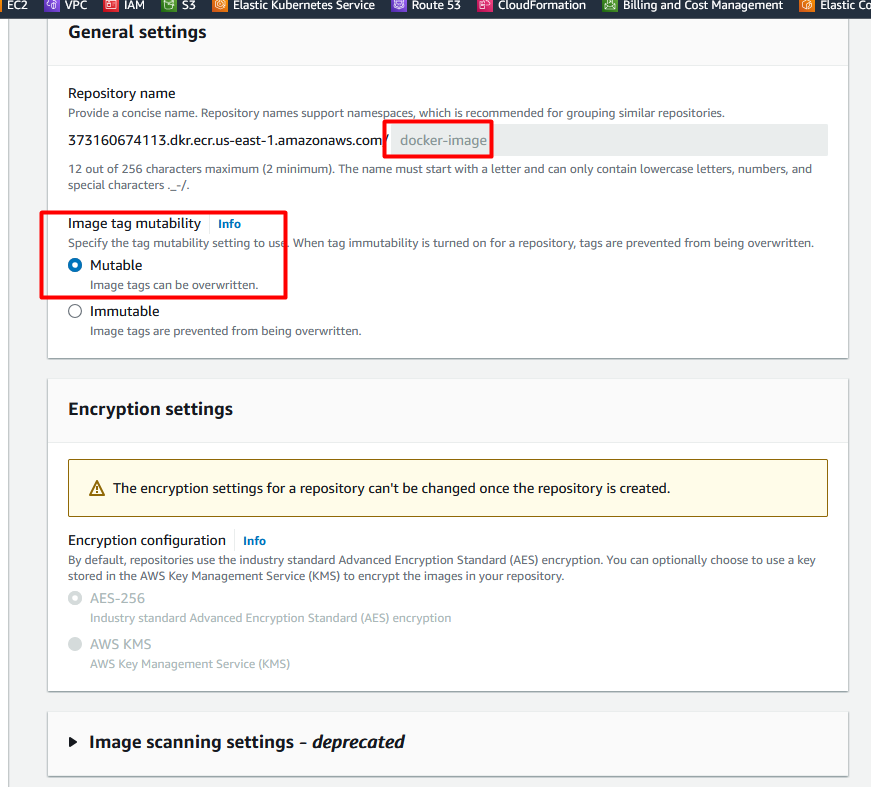
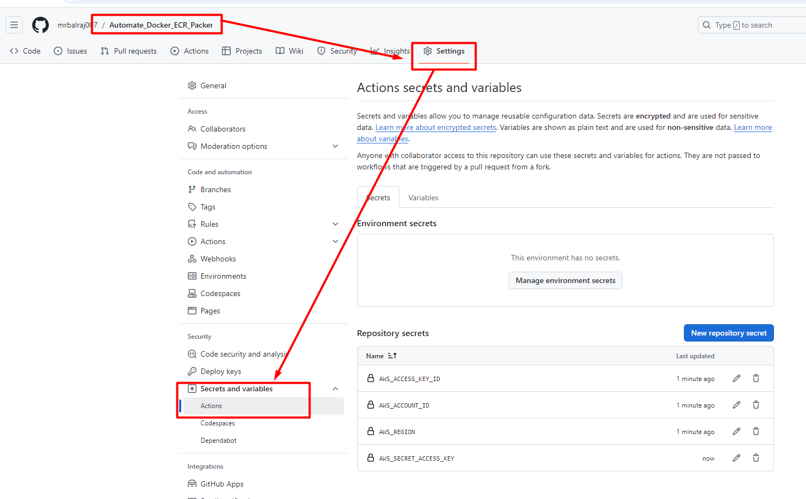
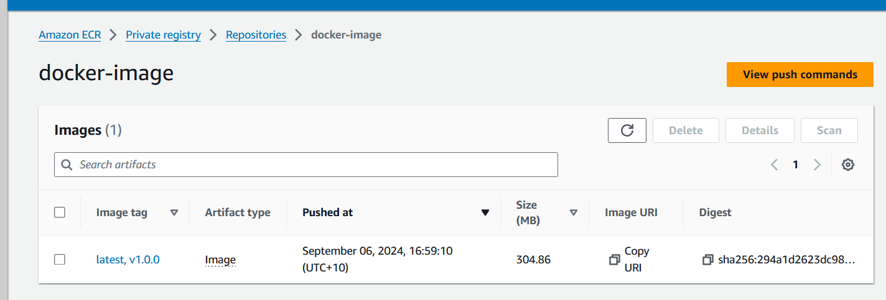
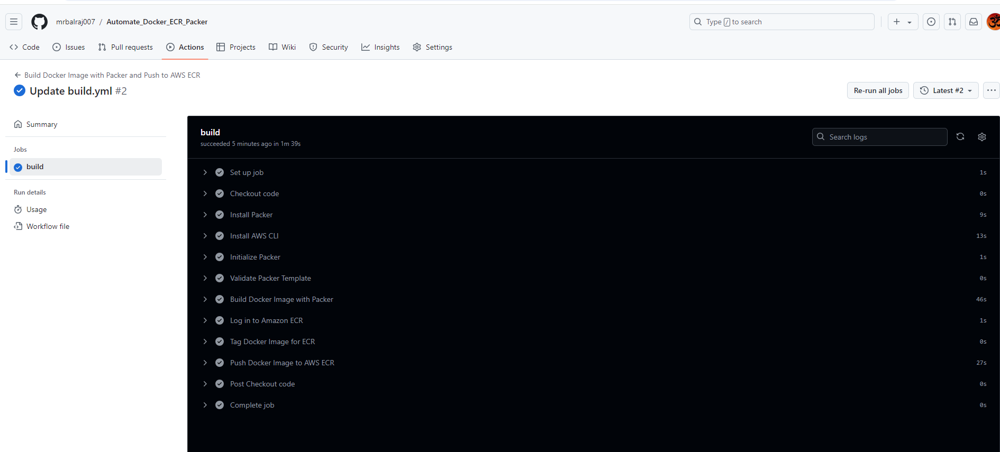

#  Automate Docker Image Deployment to AWS ECR Using GitHub Actions

In this session, we'll dive into automating the process of building Docker images using Packer and deploying them to Amazon ECR (Elastic Container Registry) with GitHub Actions. By the end of this, you'll understand how to create an ECR repository, set up credentials, build and tag a Docker image using Packer, and automate the entire workflow using GitHub Actions.

##  Prerequisites 
 
Before you start, ensure you have the following:
- [x] [Clone repository for terraform code](https://github.com/mrbalraj007/DevOps_free_Bootcamp/tree/main/09.Real-Time-DevOps-Project/Terraform_Code/04.Code_IAC_Terraform_box) 
- [x] [Code Repo](https://github.com/mrbalraj007/Automate_Docker_ECR_Packer.git)
- [x] AWS Account: Set up with IAM access (access key & secret key) for ECR.
- [x] GitHub Repository: A repository to hold your Packer configuration and GitHub Actions workflow.
- [x] Basic Knowledge of Docker: Familiarity with Docker images and containers.
- [x] Installed Tools: AWS CLI, GitHub Actions, and Packer installed on your local machine.

##  Key Steps Covered 

__01__. Create AWS ECR Repository:

- Set up a new ECR repository on AWS to store your Docker images.
- Generate an IAM user with appropriate permissions for pushing images to ECR.
- Store the IAM credentials securely for later use.

__02__. Set Up Packer Configuration:

- Write a Packer configuration file to build a Docker image.
- Use the base Ubuntu 20.04 image and install necessary packages.
- Tag the Docker image (e.g., latest, v1.0.0).
- Configure GitHub Actions Workflow:

__03__. Set up a GitHub Actions workflow that triggers on every commit.
- Install Packer and AWS CLI in the GitHub runner.
- Log in to AWS ECR using stored credentials and push the Docker image.

__04__. Store Secrets in GitHub:

- Store sensitive AWS credentials in GitHub Secrets (Access Key, Secret Key, Region, and Account ID).
  
__05__. Trigger Workflow and Validate:

- After committing code, GitHub Actions will automatically trigger the build, push the image, and update the ECR repository.
- Verify the Docker image in the ECR console.

##  Key Benefits of Using GitHub Actions for Docker Image Deployment 
- Automation: Every time you push changes to your repository, the GitHub Actions workflow will automatically build and deploy the Docker image to AWS ECR.
- Consistency: Using Packer ensures that the image-building process is consistent and reproducible.
- Integration: Direct integration between GitHub Actions and AWS services (ECR in this case) simplifies the CI/CD process.

##  What to Avoid 
- Exposing Credentials: Always store your credentials in secure locations like GitHub Secrets. Never hardcode sensitive information in your configuration files.
- Skipping Validation: Before pushing images, validate your Packer configuration to avoid issues during deployment.

##  Use Case: 
This approach is ideal for teams using Docker in production environments who want to automate the process of building, tagging, and pushing Docker images to AWS ECR. It’s particularly useful for DevOps teams practicing continuous integration and deployment (CI/CD) in cloud-native environments.

##  Conclusion 
By leveraging GitHub Actions, you can automate the Docker image build and deployment process to AWS ECR, ensuring a seamless CI/CD pipeline. Packer helps ensure your Docker images are built consistently, and GitHub Actions takes care of automating the entire process.

__Ref Link__

- [YouTube Link](https://www.youtube.com/watch?v=5HgGRqJ8Jlw&list=PLJcpyd04zn7rZtWrpoLrnzuDZ2zjmsMjz&index=88 "Automate Docker Image Deployment to AWS ECR Using GitHub Actions")
- [End-to-End Multibranch Pipeline Project Creation](https://www.jenkins.io/doc/tutorials/build-a-multibranch-pipeline-project/)
- [Jenkins Multibranch Pipeline With Git Tutorial](https://www.cloudbees.com/blog/jenkins-multibranch-pipeline-with-git-tutorial)
- [Set up kubectl and eksctl](https://docs.aws.amazon.com/eks/latest/userguide/install-kubectl.html)

