# <span style="color: Yellow;"> End-to-End Kubernetes Observability with ArgoCD, Prometheus, and Grafana on KinD</span>


This guide will help you set up Prometheus and Grafana on Kubernetes with ArgoCD, ideal for both beginners and experienced DevOps professionals. The project focuses on monitoring Kubernetes clusters using Prometheus (for metrics collection) and Grafana (for visualizing those metrics). We'll also briefly cover ArgoCD for continuous delivery and how to integrate these tools to create a robust observability platform.

## <span style="color: Yellow;"> What is KinD?
**KinD (Kubernetes in Docker)**

**Overview:**

**Purpose:** KinD is a tool for running local Kubernetes clusters using Docker container “nodes”.<br>
**Use Case:** Ideal for testing and developing Kubernetes features in a test environment.

**Advantages:**

- **Simplicity:** Creating and managing a local Kubernetes cluster is straightforward.
Ephemeral Nature: Clusters can be easily deleted after testing.

**Limitations:**

- **Not for Production:** KinD is not designed for production use.
- **Lacks Patching and Upgrades:** No supported way to maintain patching and upgrades.
- **Resource Restrictions:** Unable to provide functioning OOM metrics or other resource restriction features.
- ****Minimal Security:** **No additional security configurations are implemented.
**Single Machine: **Not intended to span multiple physical machines or be long-lived.

**Suitable Use-Cases:**

- **Kubernetes Development:** Developing Kubernetes itself.
- **Testing Changes: **Testing application or Kubernetes changes in a continuous integration environment.
- **Local Development: **Local Kubernetes cluster application development.
- **Cluster API:** Bootstrapping Cluster API.

If you would like to learn more about KinD and its use-cases, I recommend reading the [KinD project scope](https://kind.sigs.k8s.io/docs/contributing/project-scope/) document which outlines the project’s design and development priorities.


## <span style="color: Yellow;"> Prerequisites for This Project </span>
 
Before starting, make sure you have the following ready:
- [x] [Terraform Code](https://github.com/mrbalraj007/DevOps_free_Bootcamp/tree/main/12.Real-Time-DevOps-Project/Terraform_Code) 
- [x] [App Code Repo](https://github.com/mrbalraj007/k8s-kind-voting-app)
- [x] __Kubernetes Cluster__: A working Kubernetes cluster (KIND cluster or any managed Kubernetes service like EKS or GKE).
- [x] __Docker Installed__: To run KIND clusters inside Docker containers.
- [x] __Basic Understanding of Kubernetes__: Knowledge of namespaces, pods, and services.
- [x] __kubectl Installed__: For interacting with your Kubernetes cluster.
- [x] __ArgoCD Installed__: If you want to use GitOps practices for deploying applications.

## <span style="color: Yellow;"> Key Steps and Highlights</span>

Here’s what you’ll be doing in this project:

- __Port Forwarding with Prometheus__: Bind Prometheus to port 9090 and forward it to 0.0.0.0:9090. This allows you to access the Prometheus dashboard from your machine.
- __Expose Ports on Security Groups__: Open necessary ports (like 9090 for Prometheus and 3000 for Grafana) in your instance's security group to access them from outside.
- __Monitoring Services__: Verify that Kubernetes is sending data to Prometheus. You can check this in the Targets section of Prometheus.
- __PromQL Queries__: Use PromQL queries to monitor metrics like container CPU usage, network traffic, etc. You can execute these queries to analyze performance metrics.
- __Visualizing in Grafana__: After adding Prometheus as a data source in Grafana, create dashboards to visualize CPU, memory, and network usage over time.
- __Real-Time Monitoring__: Generate traffic or CPU load in your applications (like the voting app) to observe how Prometheus collects metrics and Grafana displays them.
- __Custom Dashboards__: Use pre-built Grafana dashboards by importing them through dashboard IDs, making it easier to visualize complex data without starting from scratch.


## <span style="color: Yellow;">Setting Up the Environment </span>
I have created a Terraform file to set up the entire environment, including the installation of required applications, tools, and the ArgoCD cluster automatically created.

<!-- <span style="color: cyan;"> __Note__&rArr;</span> I was using <span style="color: red;">```t3.medium```</span> and having performance issues; I was unable to run the pipeline, and it got stuck in between. So, I am now using ```t2.xlarge``` now. Also, you have to update ```your email address``` in the ```main.tf``` file so that topic for alerting can be created while creation the VM. -->

###### <span style="color: Yellow;">Setting Up the Virtual Machines (EC2)

First, we'll create the necessary virtual machines using ```terraform```. 

Below is a terraform configuration:

Once you [clone repo](https://github.com/mrbalraj007/DevOps_free_Bootcamp.git) then go to folder *<span style="color: cyan;">"12.Real-Time-DevOps-Project/Terraform_Code"</span>* and run the terraform command.
```bash
cd Terraform_Code/

$ ls -l
Mode                 LastWriteTime         Length Name
----                 -------------         ------ ----
da---l          25/09/24   7:32 PM                Terraform_Code
```

__<span style="color: Red;">Note__</span> &rArr; Make sure to run ```main.tf``` from inside the folders.

```bash
cd 11.Real-Time-DevOps-Project/Terraform_Code"

Mode                 LastWriteTime         Length Name
----                 -------------         ------ ----
-a---l          25/09/24   2:56 PM            500 .gitignore
-a---l          25/09/24   7:29 PM           4287 main.tf
```
You need to run ```main.tf``` file using following terraform command.

Now, run the following command.
```bash
terraform init
terraform fmt
terraform validate
terraform plan
terraform apply 
# Optional <terraform apply --auto-approve>
```
-------
Once you run the terraform command, then we will verify the following things to make sure everything is setup via a terraform.

###### <span style="color: cyan;"> Verify the Docker version
```bash
ubuntu@ip-172-31-95-197:~$ docker --version
Docker version 24.0.7, build 24.0.7-0ubuntu4.1


docker ps -a
ubuntu@ip-172-31-94-25:~$ docker ps
CONTAINER ID   IMAGE                  COMMAND                  CREATED         STATUS         PORTS                       NAMES
8436c820f163   kindest/node:v1.31.0   "/usr/local/bin/entr…"   4 minutes ago   Up 3 minutes   127.0.0.1:35147->6443/tcp   kind-control-plane
0d6ed793da0e   kindest/node:v1.31.0   "/usr/local/bin/entr…"   4 minutes ago   Up 3 minutes                               kind-worker
5146cf4dfd20   kindest/node:v1.31.0   "/usr/local/bin/entr…"   4 minutes ago   Up 3 minutes                               kind-worker2
```


###### <span style="color: Cyan;"> Inspect the ```Cloud-Init``` logs</span>: 
    Once connected to EC2 instance then you can check the status of the ```user_data``` script by inspecting the log files.

```bash
# Primary log file for cloud-init
sudo tail -f /var/log/cloud-init-output.log
```
- If the user_data script runs successfully, you will see output logs and any errors encountered during execution.
- If there’s an error, this log will provide clues about what failed.


<!-- Kind Cluster Name: The Kind cluster is explicitly named kind during creation to match the context setup (--name kind).
Kubeconfig Setup: The kind get kubeconfig command exports the Kubernetes cluster configuration to the correct location (/home/ubuntu/.kube/config) and sets the KUBECONFIG environment variable so that kubectl can interact with the Kind cluster.
Permissions for Kubeconfig: The ownership of the kubeconfig file is set to the ubuntu user to ensure it can be accessed and modified properly. -->

###### <span style="color: cyan;">Verify the KIND cluster and command to Test it:
After Terraform deploys the instance and the cluster is set up, you can SSH into the instance and run:

```bash
kubectl get nodes
kubectl cluster-info
kubectl config get-contexts
kubectl cluster-info --context kind-kind
```

## <span style="color: yellow;">Managing Docker and Kubernetes Pods

##### <span style="color: Cyan;">Check Docker containers running:</span>
```sh
docker ps
```
##### <span style="color: Cyan;">List all Kubernetes pods in all namespaces:</span>
```sh
kubectl get pods -A
```
- To get the existing namespace 
```sh
kubectl get namespace
```

### <span style="color: Yellow;">Setup Argo CD</span>

<!-- 
- ###### <span style="color: Cyan;">Create a namespace for Argo CD:
```sh
kubectl create namespace argocd
```
- ###### <span style="color: Cyan;"> Apply the Argo CD manifest:
```sh
kubectl apply -n argocd -f https://raw.githubusercontent.com/argoproj/argo-cd/stable/manifests/install.yaml
```
This will deploy a bunch of Kubernetes resources inside argocd namespace. Create this namespace if it’s not created.
This will deploy the ArgoCD server, along with other components such as the ArgoCD repo server, ArgoCD application controller, and the Redis cache.

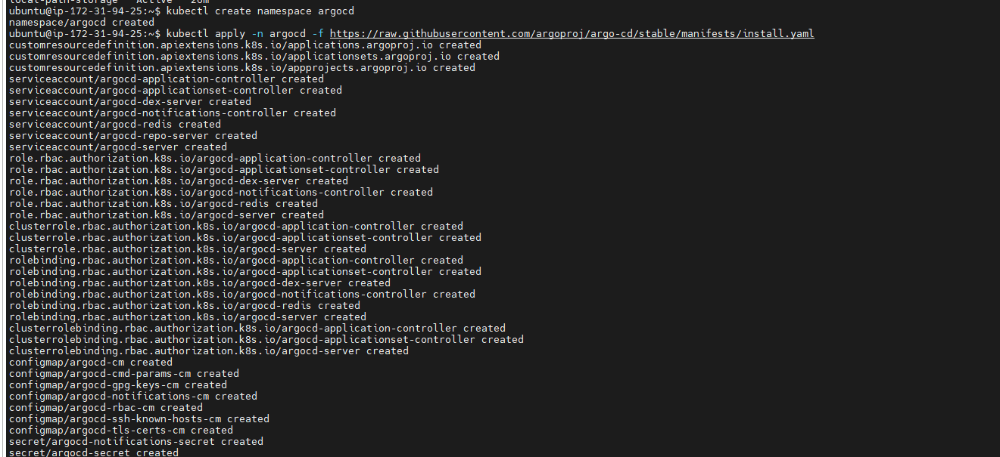 -->

##### <span style="color: Cyan;"> Verify all nodes in namespace argocd
```bash  
kubectl get pods -n argocd 
```  
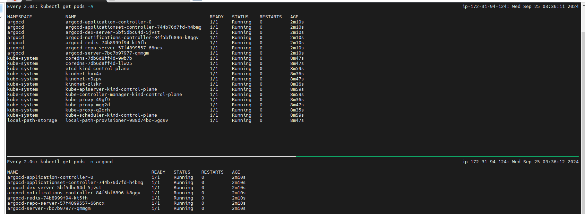

<details><summary><b><span style="color: Orange;">Troubleshooting for error CreateContainerConfigError/ImagePullBackOff</b></summary><br>
as I am getting CreateContainerConfigError/ImagePullBackOff, if you getting the same then follow the below procedure to troubleshoot.

```bash
kubectl get pods -n argocd
NAME                                                READY   STATUS                       RESTARTS   AGE
argocd-application-controller-0                     0/1     CreateContainerConfigError   0          6m17s
argocd-applicationset-controller-744b76d7fd-b4p4f   1/1     Running                      0          6m17s
argocd-dex-server-5bf5dbc64d-8lp29                  0/1     Init:ImagePullBackOff        0          6m17s
argocd-notifications-controller-84f5bf6896-ztq6q    1/1     Running                      0          6m17s
argocd-redis-74b8999f94-x5cp5                       0/1     Init:ImagePullBackOff        0          6m17s
argocd-repo-server-57f4899557-b4t87                 0/1     CreateContainerConfigError   0          6m17s
argocd-server-7bc7b97977-vh4kg                      0/1     ImagePullBackOff             0          6m17s

```
Below is the steps to futher Troubleshooting
**Check Image Details**: Run the following command to inspect the pod details:
```bash
kubectl describe pod <pod-name> -n argocd
```
Specifically, look for the Events section for more details about why the image cannot be pulled.

**Review Logs for More Clues:**
You can also check the logs of the pods to see if there are more specific error messages that can help pinpoint the issue:
```bash
kubectl logs <pod-name> -n argocd
```

**```Network or DNS Issues:```**
If your EC2 instance does not have proper internet access, it will not be able to pull images from DockerHub or other container registries. Ensure that your EC2 instance has internet access and can reach external container registries.

You can test connectivity by running:
```bash
curl -I https://registry.hub.docker.com
```
If there are connectivity issues, check the VPC configuration, security groups, and routing tables.

After researching the issue, it was discovered that there was insufficient disk space on the device. *Previously, I was utilizing ```8GB``` and edited that Terraform file to make it available ```30GB```.* 
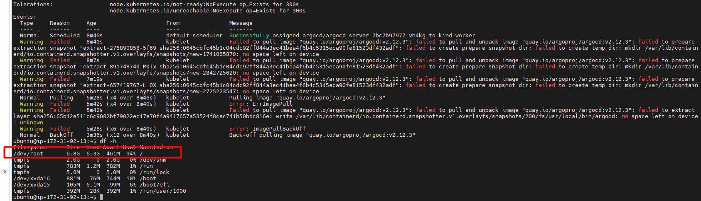

</details>

##### <span style="color: Cyan;"> Check services in Argo CD namespace:
```sh
kubectl get svc -n argocd
```
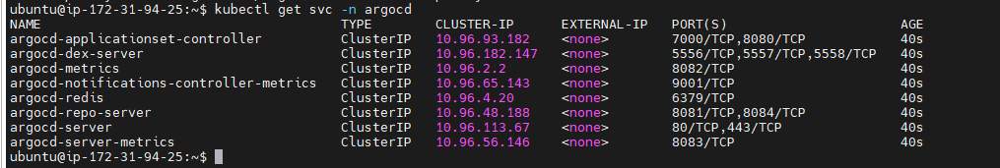

- Currently, it is set to ```clusterIP``` and we will change it to ```NodePort```
- Expose Argo CD server using NodePort:
```sh
kubectl patch svc argocd-server -n argocd -p '{"spec": {"type": "NodePort"}}'
```
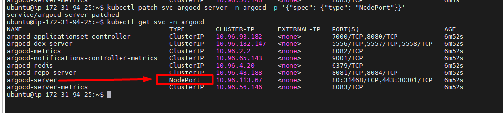

##### <span style="color: Cyan;">Forward ports to access Argo CD server:
```sh
kubectl port-forward -n argocd service/argocd-server 8443:443 --address=0.0.0.0 &
# kubectl port-forward -n argocd service/argocd-server 8443:443 &
```
Now, we will open in browser to access argocd.
```https://<public IP Address of EC2>: 8443```

https://18.212.179.217:8443
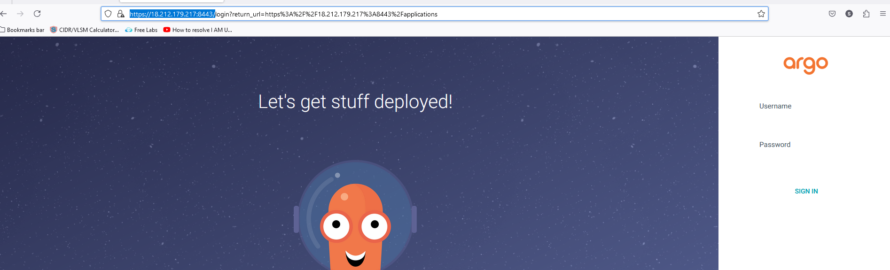

- Argo CD Initial Admin Password
##### <span style="color: Cyan;">Grab the password to login to the dashboard/Retrieve Argo CD admin password:
```sh
kubectl get secret -n argocd argocd-initial-admin-secret -o jsonpath="{.data.password}" | base64 -d && echo
```
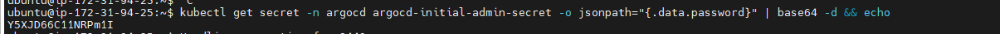

##### <span style="color: Cyan;">Configure the application in argocd
click on > applications>new apps><br>
Application Name: voting-app><br>
Project Name: default<br>
Sync Policy: Automatic <br>
Source>repogitory URL : https://github.com/mrbalraj007/k8s-kind-voting-app.git <br>
Revision: main<br>
Path: k8s-specifications    # path for your manifest file <br>
DESTINATION> Cluster URL : https://kubernetes.default.svc <br>
Namespace: default <br>
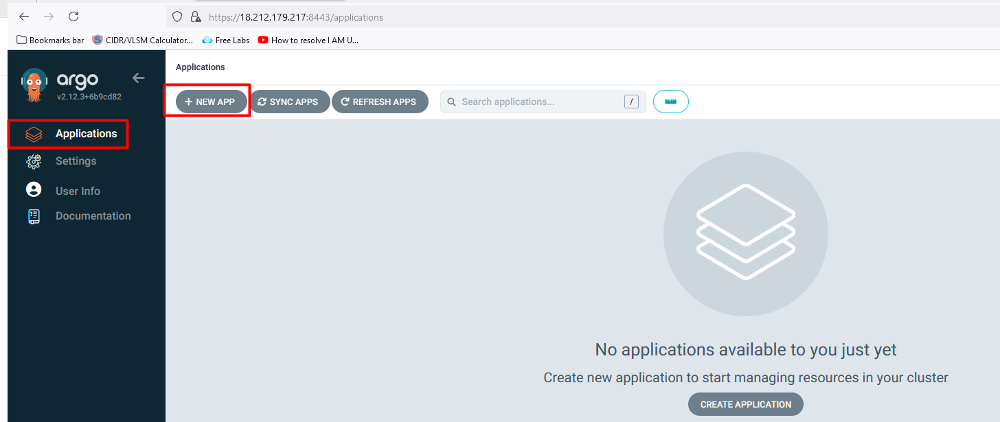
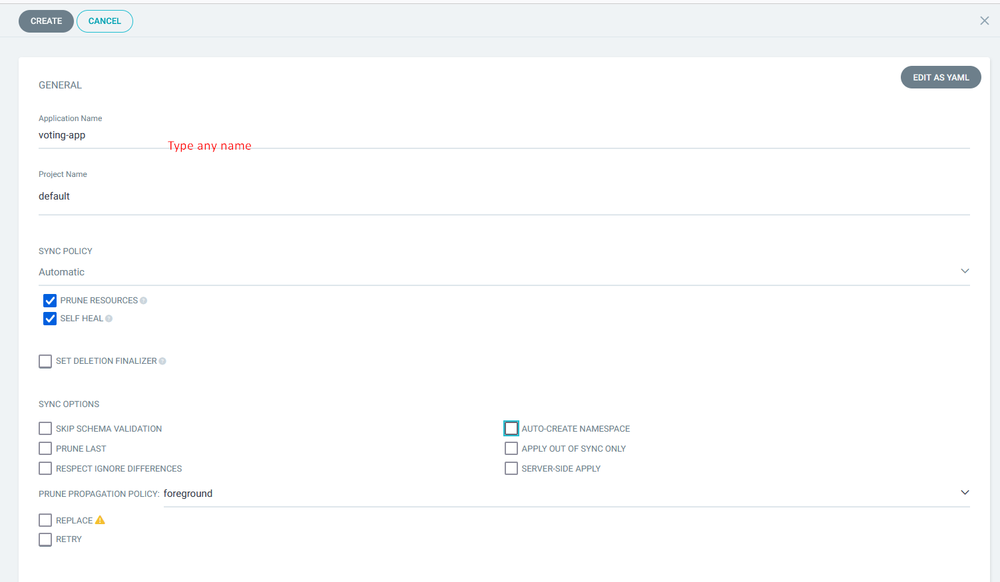
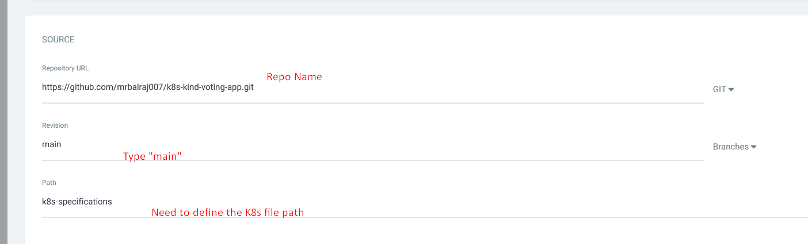
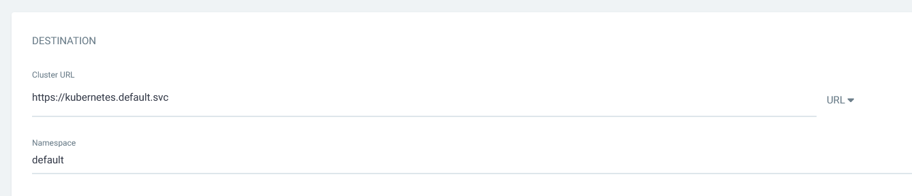

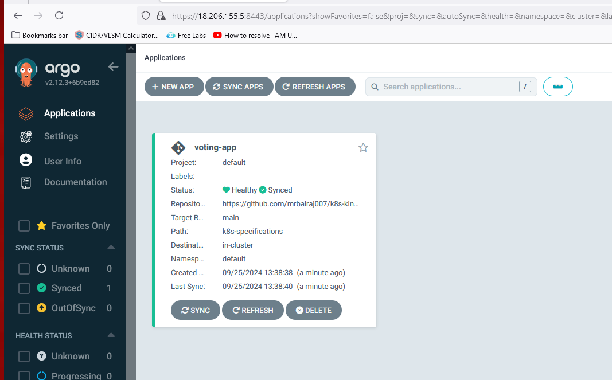
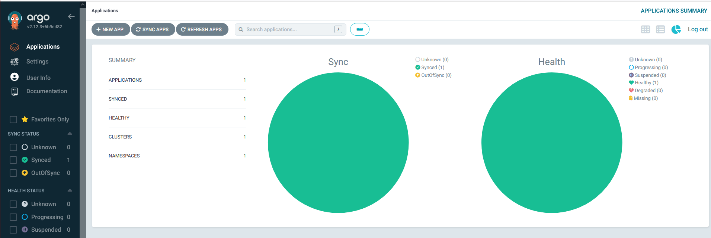

##### <span style="color: Cyan;">Validate the pods
```sh
kubectl get pods
```
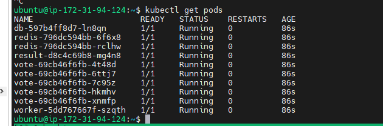


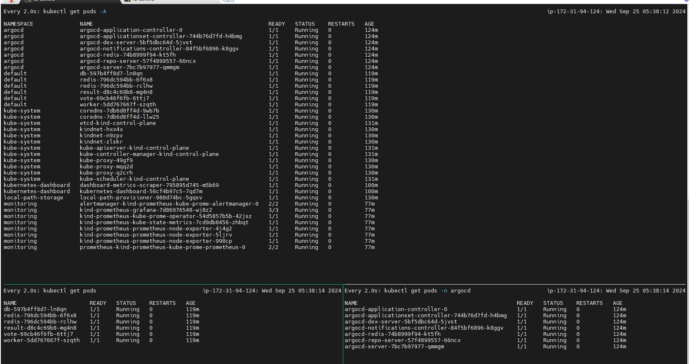

##### <span style="color: Cyan;">Verify the deployment
```sh
kubectl get deployments
```
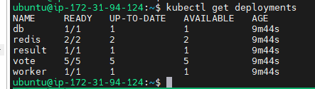

##### <span style="color: Cyan;">Verify the service 
```sh
kubectl get svc
```
```bash
kubectl get svc
NAME         TYPE        CLUSTER-IP      EXTERNAL-IP   PORT(S)          AGE
db           ClusterIP   10.96.201.0     <none>        5432/TCP         2m12s
kubernetes   ClusterIP   10.96.0.1       <none>        443/TCP          13m
redis        ClusterIP   10.96.65.124    <none>        6379/TCP         2m12s
result       NodePort    10.96.177.39    <none>        5001:31001/TCP   2m12s
vote         NodePort    10.96.239.136   <none>        5000:31000/TCP   2m12s
```

Now, we will do the port-forward to service ```Vote``` and ```results```
```sh
kubectl port-forward svc/vote 5000:5000 --address=0.0.0.0 &
```
```sh
kubectl port-forward svc/result 5001:5001 --address=0.0.0.0 &
```

##### <span style="color: Cyan;">Verify the ```vote``` & ```results``` in browser.
Now, we will open in browser to access services.

```http://<public IP Address of EC2>: 5000``` (vote) <br>
```http://<public IP Address of EC2>: 5001``` (result)

For Vote:
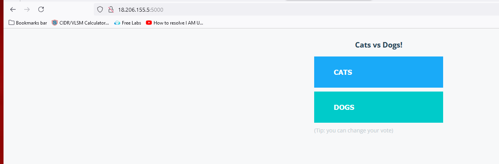
For result:
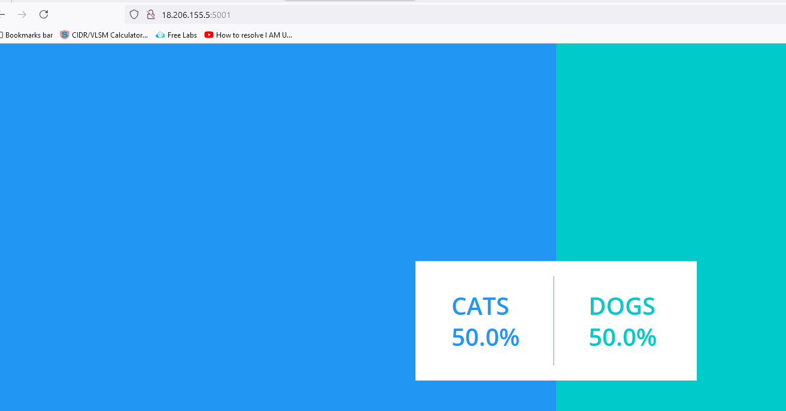

Click on any of the items on the voting page to see the results on the result page.
I clicked on dog, and the results are presented below.

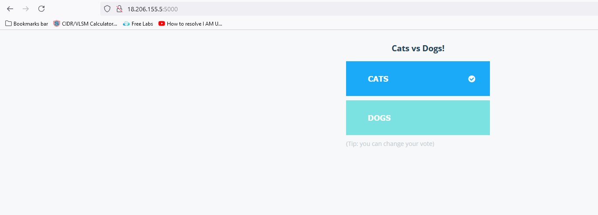

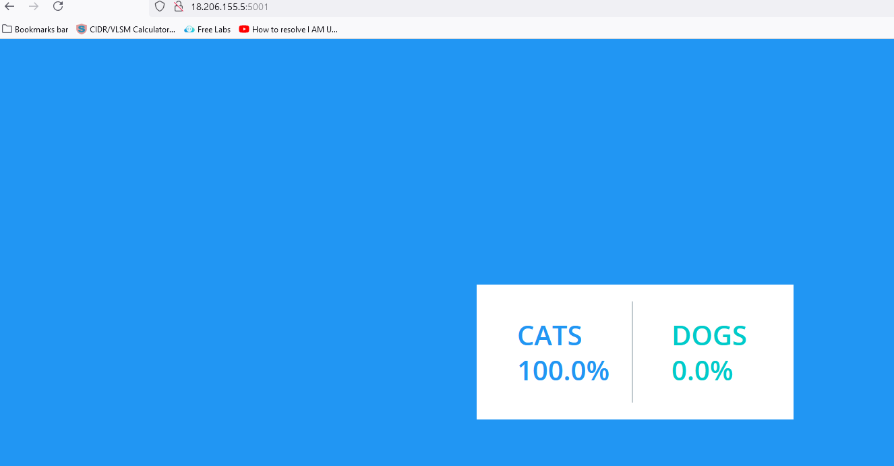

<span style="color: orange;">**We have successfully set up Argo CD on a Kubernetes cluster & deployed the applications automatically.**

### <span style="color: Cyan;">Deploy Kubernetes dashboard:
```sh
kubectl apply -f https://raw.githubusercontent.com/kubernetes/dashboard/v2.7.0/aio/deploy/recommended.yaml
```
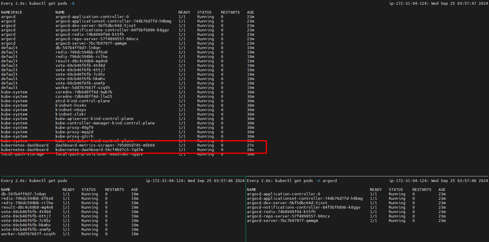

##### <span style="color: Cyan;">Create a admin user for Kubernetes dashboard: dashboard-adminuser.yml
```sh
apiVersion: v1
kind: ServiceAccount
metadata:
  name: admin-user
  namespace: kubernetes-dashboard
---
apiVersion: rbac.authorization.k8s.io/v1
kind: ClusterRoleBinding
metadata:
  name: admin-user
roleRef:
  apiGroup: rbac.authorization.k8s.io
  kind: ClusterRole
  name: cluster-admin
subjects:
- kind: ServiceAccount
  name: admin-user
  namespace: kubernetes-dashboard
```

```sh
kubectl apply -f dashboard-adminuser.yml
```
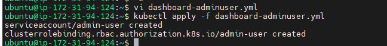


##### <span style="color: Cyan;">Create a token for dashboard access:
```sh
kubectl -n kubernetes-dashboard create token admin-user
```
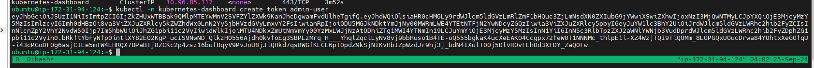

```csv
token:
eyJhbGciOiJSUzI1NiIsImtpZCI6IjZkZHUxWTBBak9QMlpMTEYwMnV2SVFZYlZXWk9KanJhcDgwamFvdUlheTgifQ.eyJhdWQiOlsiaHR0cHM6Ly9rdWJlcm5ldGVzLmRlZmF1bHQuc3ZjLmNsdXN0ZXIubG9jYWwiXSwiZXhwIjoxNzI3MjQwNTMyLCJpYXQiOjE3MjcyMzY5MzIsImlzcyI6Imh0dHBzOi8va3ViZXJuZXRlcy5kZWZhdWx0LnN2Yy5jbHVzdGVyLmxvY2FsIiwianRpIjoiODU5MGJkNDktYmJjNy00MWRmLWE4YTEtNTFjN2YwNDcyZGQzIiwia3ViZXJuZXRlcy5pbyI6eyJuYW1lc3BhY2UiOiJrdWJlcm5ldGVzLWRhc2hib2FyZCIsInNlcnZpY2VhY2NvdW50Ijp7Im5hbWUiOiJhZG1pbi11c2VyIiwidWlkIjoiMTU4NDkxZmUtNmVmYy00YzMxLWJjNzAtODhiZTg1MWI4YTNmIn19LCJuYmYiOjE3MjcyMzY5MzIsInN1YiI6InN5c3RlbTpzZXJ2aWNlYWNjb3VudDprdWJlcm5ldGVzLWRhc2hib2FyZDphZG1pbi11c2VyIn0.bRkftYbFyNfp0intiXY82EO2KgP_ucIS9NwND_QikzHO556Ajdh0kvfoEg3SBPLzMrq_H___YhqlZqclLyNv8vj9bbHuso1B4TE-oQ555bgkaK4ucXeEAKO4Ccgpx72feW0T1NNNMc_thlpE1i-XZ4WzjTQI9TiQOMm_8LOPGQxUOucDrwa84YUhtxXeGOfqU-i43cPGoDFOg6asjCIEe5mTW4LHRQX78PaBTj8ZCKc2p4zsz16buf8qyV9PvJoU8jJiQHkd7qs8WGfKLCL6pT0pdZ9kSjNIKvHbIZpWzdJr9hj3j_bdN4IXulT0Oj5DlvROvFLhDd3XFDY_ZaQ0Fw
```
Now, we have to port-forward to kubernets dashboard as well.
```sh
kubectl get svc -n kubernetes-dashboard
```
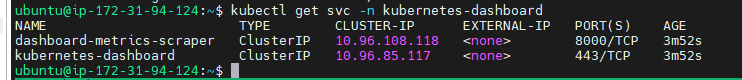
```sh
kubectl port-forward svc/kubernetes-dashboard -n kubernetes-dashboard 8080:443 --address=0.0.0.0 &
```

##### <span style="color: Cyan;">Verify the ```dashboard``` in browser.
Now, we will open in browser to access services.

```https://<public IP Address of EC2>: 8080``` 

You have to paste the token which you have generated above.
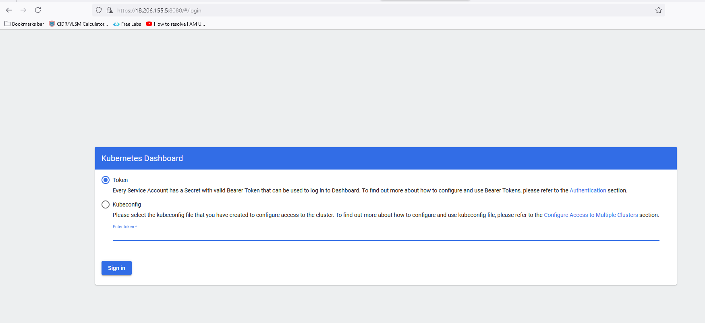

Here is the final dashboard view:
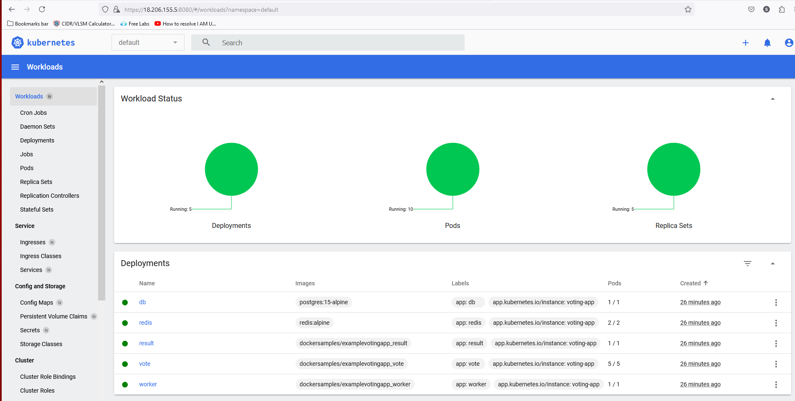


## <span style="color: Yellow;">Setting Up the Monitoring </span>
### <span style="color: cyan;">Install Helm
```sh
curl -fsSL -o get_helm.sh https://raw.githubusercontent.com/helm/helm/main/scripts/get-helm-3
chmod 700 get_helm.sh
./get_helm.sh
helm version
```
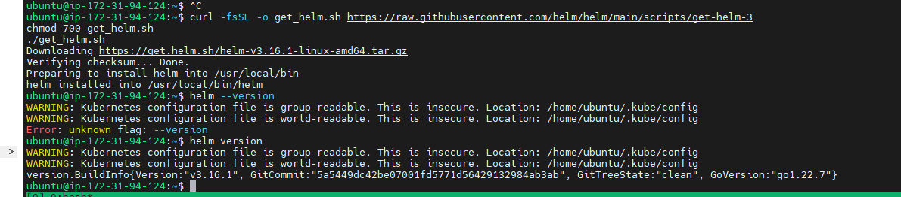

### <span style="color: cyan;">Adding all Prometheus charts in Helm, and creating namespace, services
```sh
# To add prometheus charts to Helm
helm repo add prometheus-community https://prometheus-community.github.io/helm-charts

# To view which helm chat is downloaded
helm repo list

# To install stable helm chat
helm repo add stable https://charts.helm.sh/stable

# To helm updated with latest chats
helm repo update

# To create a namespace "monitoring"
kubectl create namespace monitoring
# To install Grafana & prometheus using helm
helm install kind-prometheus prometheus-community/kube-prometheus-stack --namespace monitoring --set prometheus.service.nodePort=30000 --set prometheus.service.type=NodePort --set grafana.service.nodePort=31000 --set grafana.service.type=NodePort --set alertmanager.service.nodePort=32000 --set alertmanager.service.type=NodePort --set prometheus-node-exporter.service.nodePort=32001 --set prometheus-node-exporter.service.type=NodePort
kubectl get svc -n monitoring
kubectl get namespace
```
##### <span style="color: cyan;"> To view all pods in monitoring namespace.
```sh
kubectl get pods -n monitoring
```
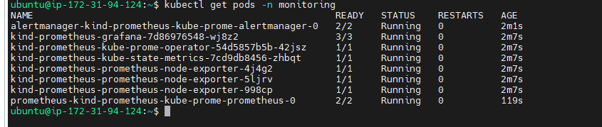
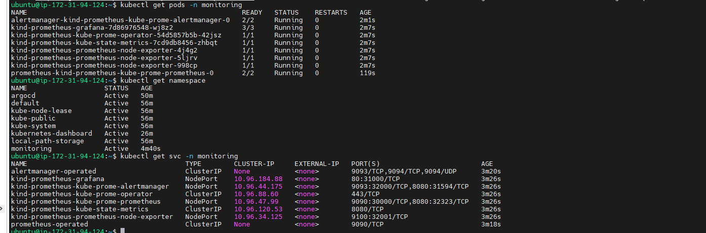

Over all Pods details.
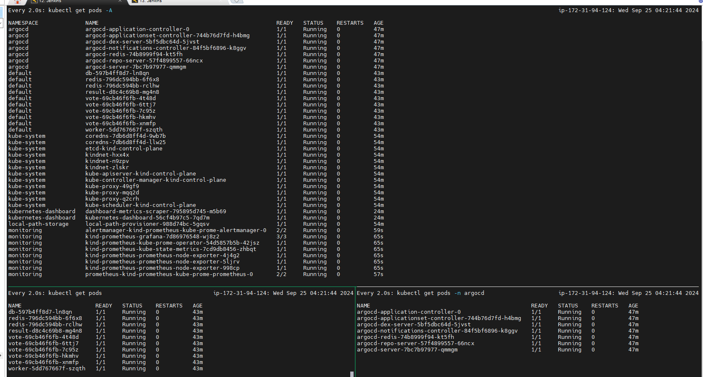


Now, we have to port-forward for ```kind-prometheus-kube-prome-prometheus``` & ```kind-prometheus-grafana```
```sh
kubectl get svc -n monitoring
```
```bash
 kubectl get svc -n monitoring
NAME                                       TYPE        CLUSTER-IP     EXTERNAL-IP   PORT(S)                         AGE
alertmanager-operated                      ClusterIP   None           <none>        9093/TCP,9094/TCP,9094/UDP      6m17s
kind-prometheus-grafana                    NodePort    10.96.184.88   <none>        80:31000/TCP                    6m23s
kind-prometheus-kube-prome-alertmanager    NodePort    10.96.44.175   <none>        9093:32000/TCP,8080:31594/TCP   6m23s
kind-prometheus-kube-prome-operator        ClusterIP   10.96.88.60    <none>        443/TCP                         6m23s
kind-prometheus-kube-prome-prometheus      NodePort    10.96.47.99    <none>        9090:30000/TCP,8080:32323/TCP   6m23s
kind-prometheus-kube-state-metrics         ClusterIP   10.96.120.53   <none>        8080/TCP                        6m23s
kind-prometheus-prometheus-node-exporter   NodePort    10.96.34.125   <none>        9100:32001/TCP                  6m23s
prometheus-operated                        ClusterIP   None           <none>        9090/TCP                        6m15s
```

For prometheus
```sh
kubectl port-forward svc/kind-prometheus-kube-prome-prometheus -n monitoring 9090:9090 --address=0.0.0.0 & 
```
##### <span style="color: Cyan;">Verify the ```prometheus``` in browser.
Now, we will open in browser to access services.
```http://<public IP Address of EC2>:9090``` 
```http://<public IP Address of EC2>:9090/metrics``` # it is sending to prometheus
http://18.206.155.5:9090/metrics 

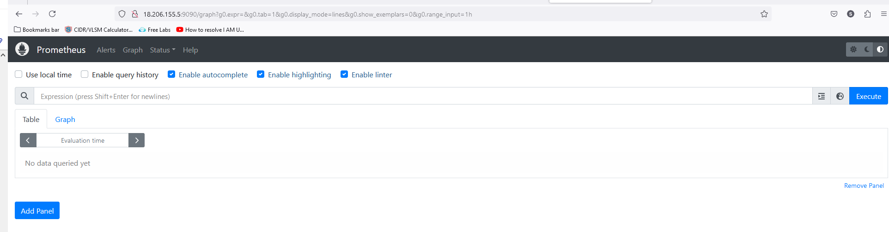
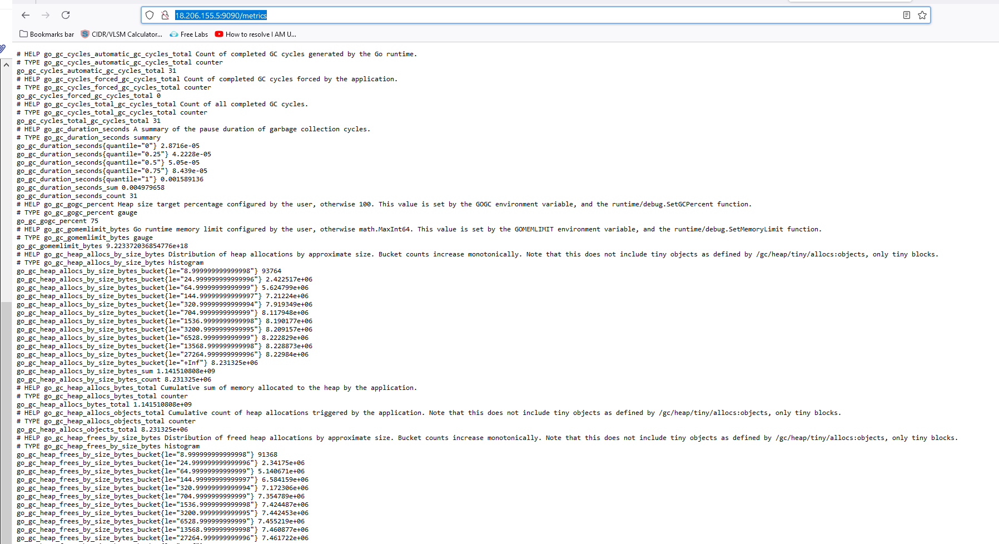

##### <span style="color: Cyan;">Prometheus Queries
paste the below query in expression on prometheus and click on execute
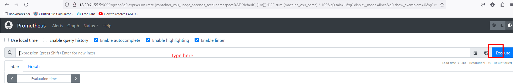

```sh
sum (rate (container_cpu_usage_seconds_total{namespace="default"}[1m])) / sum (machine_cpu_cores) * 100
```
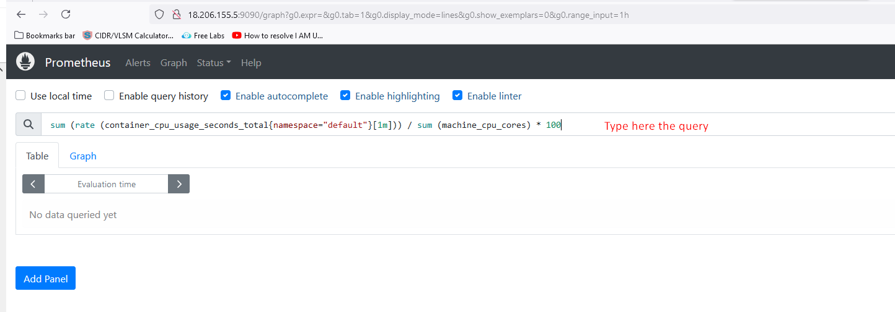

Now, click on the graph after excute the command
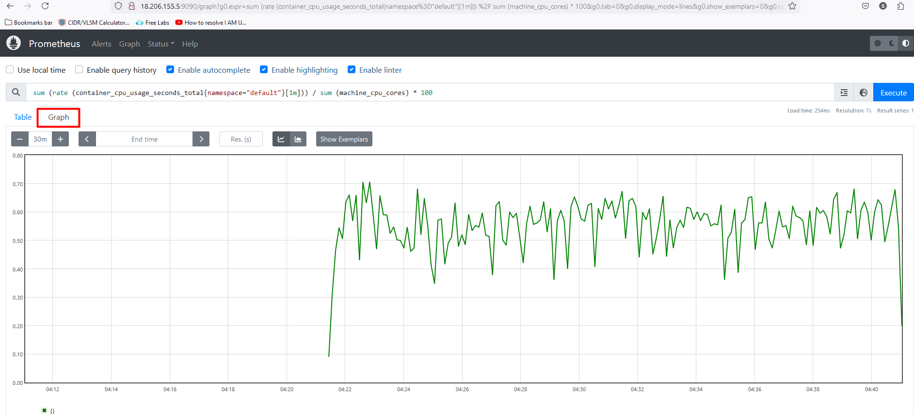

For network query- 
```sh
sum(rate(container_network_receive_bytes_total{namespace="default"}[5m])) by (pod)
sum(rate(container_network_transmit_bytes_total{namespace="default"}[5m])) by (pod)
```
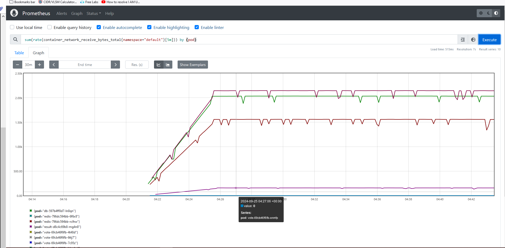

Now, we will use our vote service to see the traffic in prometheous.
```sh
kubectl get svc
NAME         TYPE        CLUSTER-IP      EXTERNAL-IP   PORT(S)          AGE
db           ClusterIP   10.96.201.0     <none>        5432/TCP         68m
kubernetes   ClusterIP   10.96.0.1       <none>        443/TCP          79m
redis        ClusterIP   10.96.65.124    <none>        6379/TCP         68m
result       NodePort    10.96.177.39    <none>        5001:31001/TCP   68m
vote         NodePort    10.96.239.136   <none>        5000:31002/TCP   68m
```
Exposing the ```Vote```app
```sh
kubectl port-forward svc/vote 5000:5000 --address=0.0.0.0 & 
```
If it is already exposed then don't need to perform.

### <span style="color: cyan;">Configure the Grafana
```sh
kubectl get svc -n monitoring
```
```bash
NAME                                       TYPE        CLUSTER-IP     EXTERNAL-IP   PORT(S)                         AGE
alertmanager-operated                      ClusterIP   None           <none>        9093/TCP,9094/TCP,9094/UDP      33m
kind-prometheus-grafana                    NodePort    10.96.184.88   <none>        80:31000/TCP                    33m
kind-prometheus-kube-prome-alertmanager    NodePort    10.96.44.175   <none>        9093:32000/TCP,8080:31594/TCP   33m
kind-prometheus-kube-prome-operator        ClusterIP   10.96.88.60    <none>        443/TCP                         33m
kind-prometheus-kube-prome-prometheus      NodePort    10.96.47.99    <none>        9090:30000/TCP,8080:32323/TCP   33m
kind-prometheus-kube-state-metrics         ClusterIP   10.96.120.53   <none>        8080/TCP                        33m
kind-prometheus-prometheus-node-exporter   NodePort    10.96.34.125   <none>        9100:32001/TCP                  33m
prometheus-operated                        ClusterIP   None           <none>        9090/TCP                        33m
```
For grafanan (expose port)
```bash
kubectl port-forward svc/kind-prometheus-grafana -n monitoring 3000:80 --address=0.0.0.0 &
```
##### <span style="color: Cyan;">Verify the ```Grafana``` in browser.
Now, we will open in browser to access services.<br>
```http://<public IP Address of EC2>:3000``` <br>
http://18.206.155.5:3000 <br>
username: admin<br>
Password: prom-operator

**Note**--> In grafana, we have to add data sources and create a dashboard.

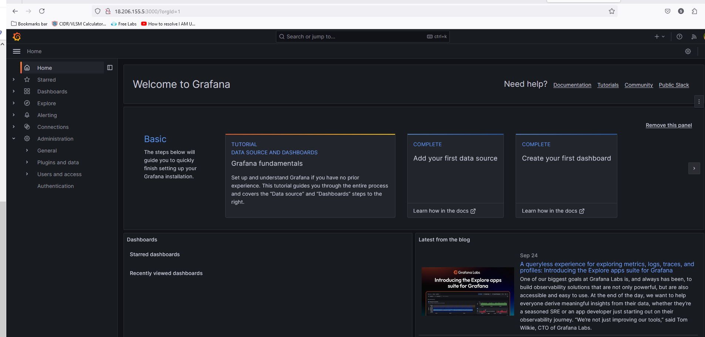

##### <span style="color: Cyan;">Creating a user in Grafana
- Now , we will create a test user and will give permission accordingly.<br>
  Home> Administration> Users and access> Users> create user

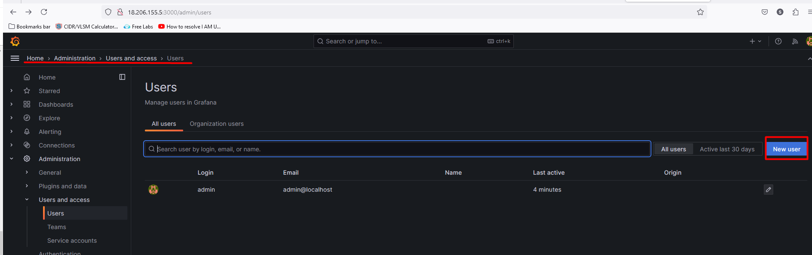

You can change the role as well, as per blow screenshot.
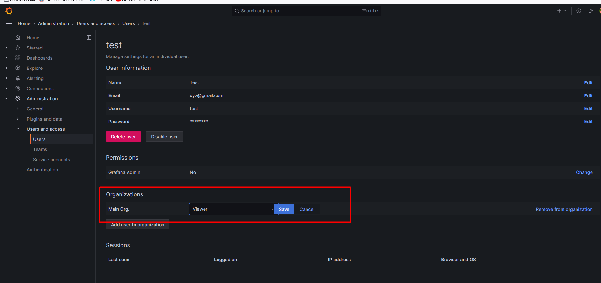

##### <span style="color: Cyan;">Creating a dashboard in Grafana<br>
Home> Connections> Data sources >Build a dashboard>add visualization> select the Prometheus

select the metrix, label filter.. Hit on run query>click save.

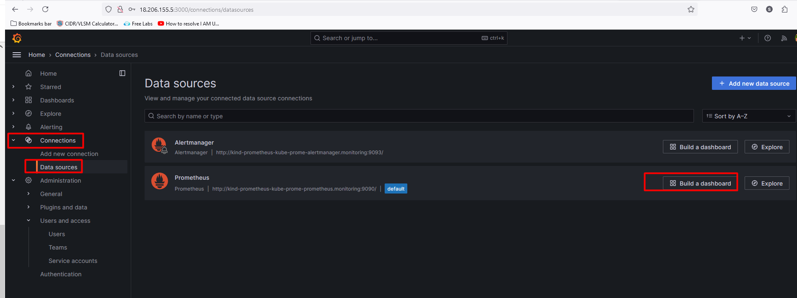
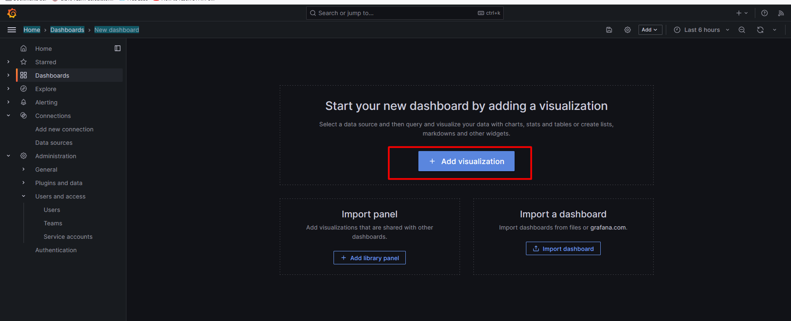
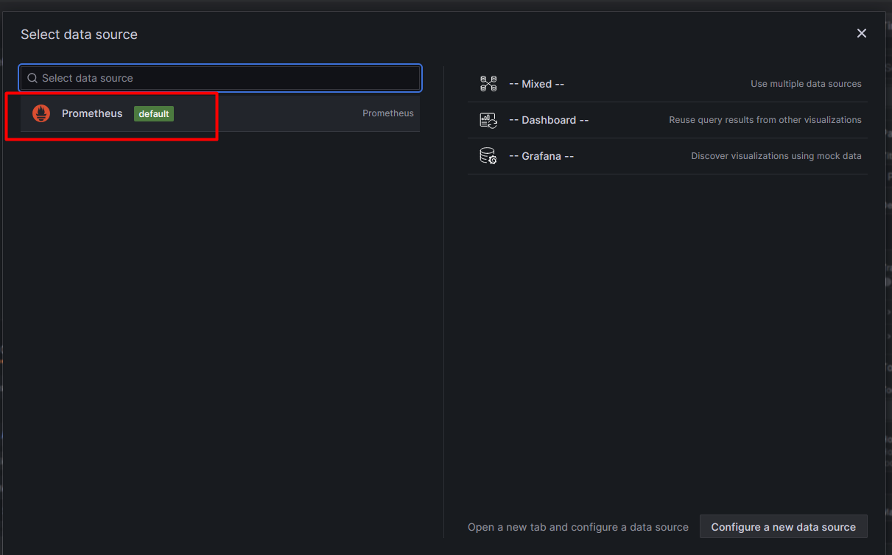
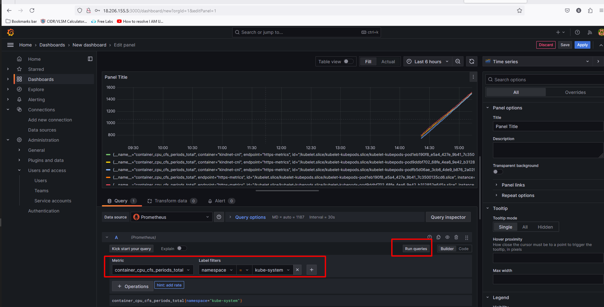

If you want to use the custom dashboard then do-
open google and reach "```grafana dashboard```"
 i choose this [dashboard](https://grafana.com/grafana/dashboards/15661-1-k8s-for-prometheus-dashboard-20211010/)
Click on ```Copy ID to clickboard```
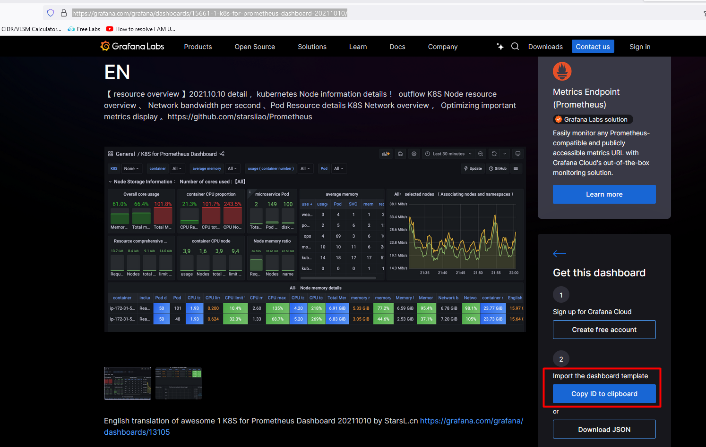

Now, go to Grafana dashboard.
 click on new> select Import> type the dashboard ID "15661" and click on load> select the prometheus as datasource and click on import.

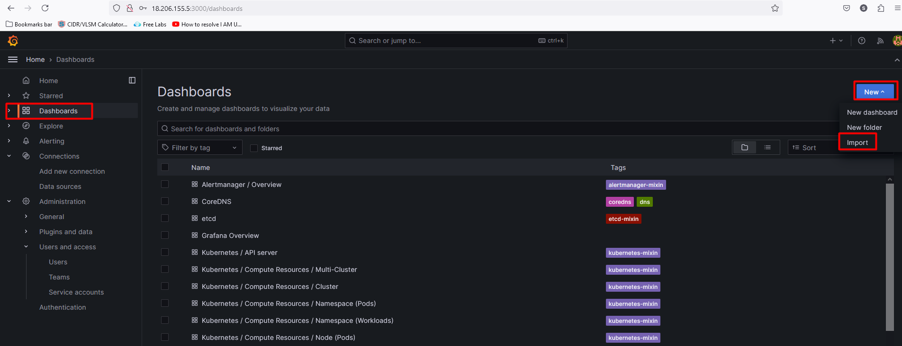
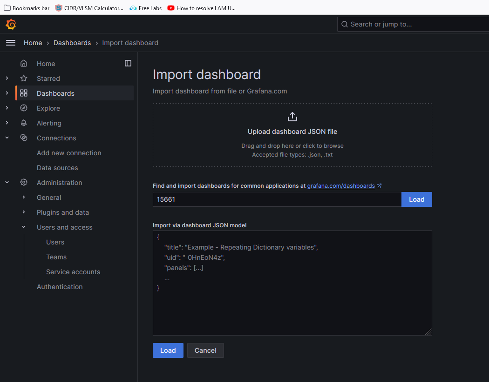
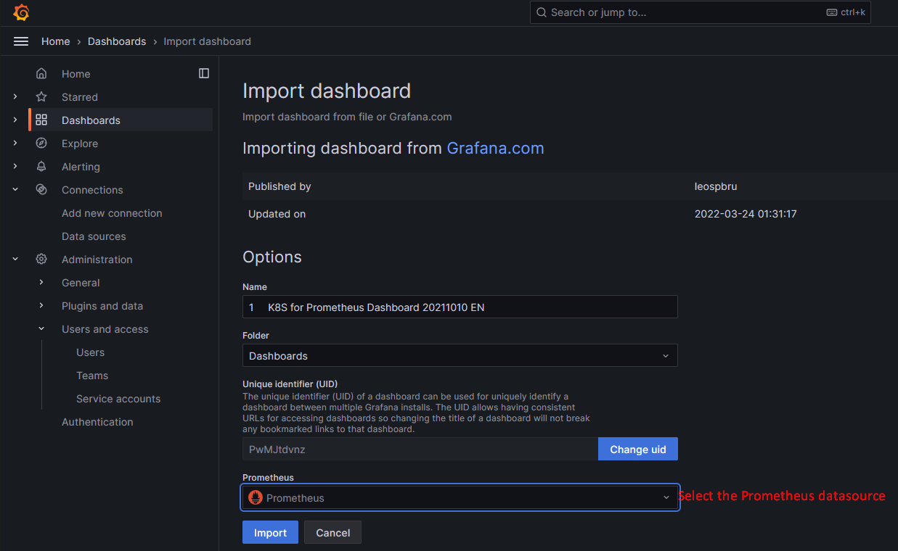

DashBoard
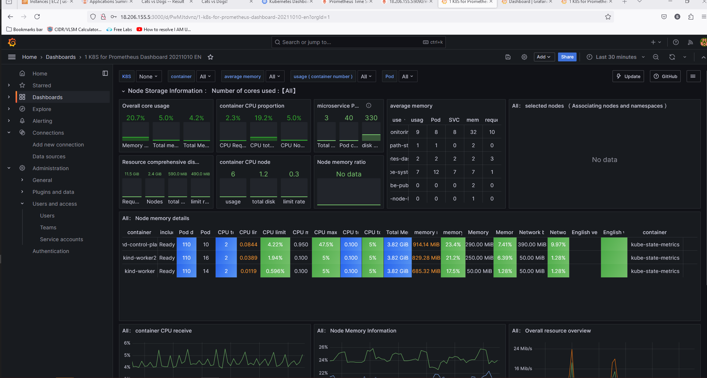


AWS Resources:
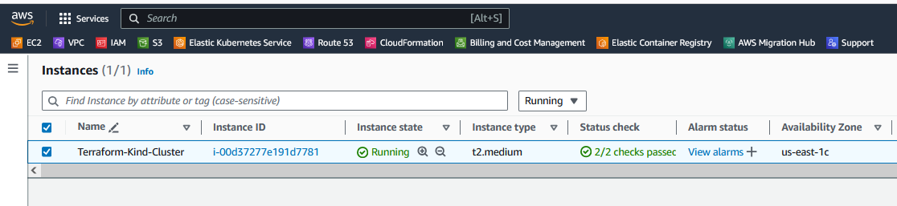


## <span style="color: Yellow;"> Environment Cleanup:
##### <span style="color: cyan;">Delete ArgoCD
To remove ArgoCD resources, it is recommended to delete the corresponding argocd namespace within the Kubernetes environment. This can be achieved by executing the following command:
```bash
kubectl delete namespace argocd
```
##### <span style="color: cyan;">Delete KinD Cluster
Once you have completed your testing, you may delete the KinD cluster by executing the following command, which will remove the associated Docker containers and volumes.
```bash
kind delete cluster --name argocd
```
*Note*:It is critical that the name of the cluster to be destroyed be supplied. In the current demonstration, a cluster with the name argocd was established, hence the same name must be supplied during the deletion procedure. Failure to supply the cluster name would result in the deletion of the default cluster, despite the fact that it does not exist. It is crucial to note that in such a scenario, no error notice will be provided, and the prompt will state that the cluster was successfully deleted. To minimize any potential interruption to test pipelines, we have conducted conversations with the KinD maintainers team and agreed that it is critical to mention the actual name of the cluster when deletion.

- As we are using Terraform, we will use the following command to delete the environment
```bash
terraform destroy --auto-approve
```
##### <span style="color: cyan;">Time to delete the Virtual machine.

Go to folder *<span style="color: cyan;">"12.Real-Time-DevOps-Project/Terraform_Code"</span>* and run the terraform command.
```bash
cd Terraform_Code/

$ ls -l
Mode                 LastWriteTime         Length Name
----                 -------------         ------ ----
da---l          25/09/24   9:48 PM                Terraform_Code

Terraform destroy --auto-approve
```
## <span style="color: Yellow;"> Key Takeaways</span>
- __Prometheus for Metrics Collection__: It's a time-series database that scrapes data from Kubernetes services.

- __Grafana for Visualization__: Allows you to create beautiful dashboards from the metrics data stored in Prometheus.

- __Real-Time Monitoring__: You can observe real-time performance metrics for CPU, memory, and network using the dashboards.

- __GitOps with ArgoCD__: ArgoCD makes deploying and managing applications on Kubernetes easier by automating continuous deployment.

## <span style="color: Yellow;"> What to Avoid </span>
- __Incorrect Port Forwarding__: Make sure you expose the correct ports for both Prometheus (9090) and Grafana (3000). Missing this can lead to connection issues.

- __Skipping Security Groups Configuration__: Always open the necessary ports in your cloud provider's security groups. Otherwise, the services won't be accessible externally.
- __Not Using PromQL Effectively__: PromQL can seem complex, but it's essential to retrieve valuable metrics like CPU or memory usage. Avoid using generic queries without understanding the context of your services.

## <span style="color: Yellow;"> Benefits of Using This Setup</span>
- __Improved Observability__: Combining Prometheus and Grafana gives you full observability over your Kubernetes clusters.
- __Real-Time Metrics__: You can monitor your services in real-time, making troubleshooting faster and more efficient.

- __Scalability__: This setup grows with your infrastructure, allowing you to monitor large-scale deployments with ease.

- __Cost-Efficient__: Both Prometheus and Grafana are open-source, providing a cost-effective solution for monitoring.

- __Ease of Use__: With Grafana's pre-built dashboards and PromQL's flexibility, it’s easy to get started and scale monitoring solutions.

__Ref Link__

- [Kubernetes With ArgoCD](https://www.youtube.com/watch?v=Kbvch_swZWA&list=PLJcpyd04zn7rZtWrpoLrnzuDZ2zjmsMjz&index=122 "Live DevOps Project on Kubernetes With ArgoCD For Freshers to Experienced")
- [Prometheus & Grafana Tutorial](https://www.youtube.com/watch?v=DXZUunEeHqM&list=PLJcpyd04zn7rZtWrpoLrnzuDZ2zjmsMjz&index=122 "Easiest Prometheus & Grafana Tutorial For DevOps on Kubernetes")
- [Kind](https://github.com/kubernetes-sigs/kind?tab=readme-ov-file)
- [Kind Documentation](https://kind.sigs.k8s.io/)
- [Kind Release version](https://github.com/kubernetes-sigs/kind/releases)


