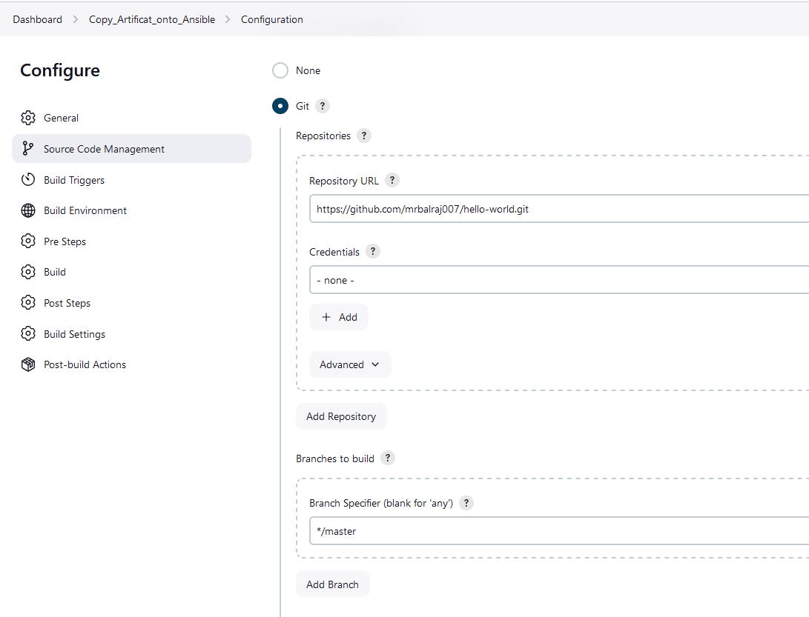
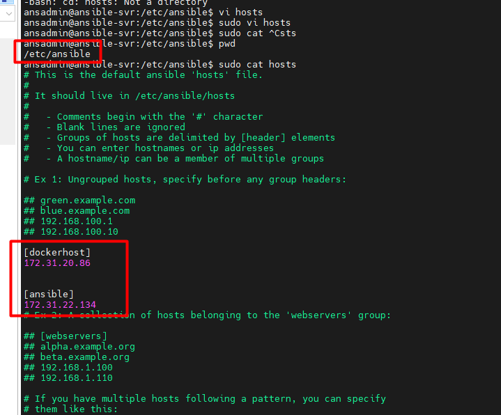
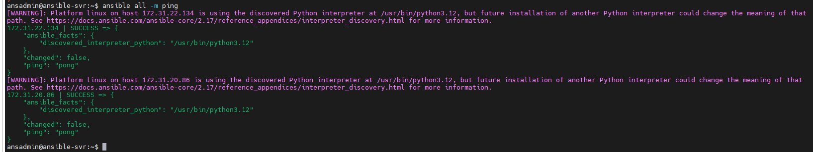
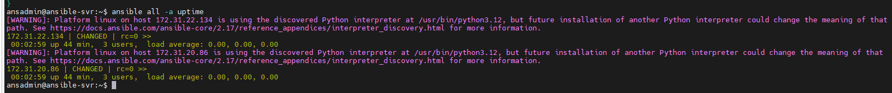

# <span style="color: Yellow;"> Seamless Application Deployment to Kubernetes Using a Fully Automated CI/CD Pipeline</span>


This project is about setting up an automated CI/CD pipeline for Kubernetes, which will deploy a Register App using Jenkins, Ansible, Docker Hub, and Kubernetes. The automation ensures that any change in the GitHub repository triggers the pipeline, which builds, tests, and deploys the application on Kubernetes.

## <span style="color: Yellow;"> Prerequisites </span>

Before diving into this project, here are some skills and tools you should be familiar with:

- [x] [Clone repository for terraform code](https://github.com/mrbalraj007/DevOps_free_Bootcamp/tree/main/17.Real-Time-DevOps-Project/Terraform_Code/Code_IAC_Terraform_box)<br>
  __Note__: Replace resource names and variables as per your requirement in terraform code
  - from k8s_setup_file/main.tf (i.e ```balraj```*).
  - from Virtual machine main.tf (i.e keyname- ```MYLABKEY```*)

- [x] [App Repo (Simple-DevOps-Project)](https://github.com/mrbalraj007/Simple-DevOps-Project)
- [x] [App Repo (Hello-World)](https://github.com/mrbalraj007/hello-world.git)

- [x] __Git and GitHub__: You'll need to know the basics of Git for version control and GitHub for managing your repository.
- [x] __Jenkins Installed__: You need a running Jenkins instance for continuous integration and deployment.
- [x] __Docker__: Familiarity with Docker is essential for building and managing container images.
- [x] __Kubernetes (AWS EKS)__: Set up a Kubernetes cluster where you will deploy your applications.
- [x] __SonarQube__: Installed for code quality checks.
- [x] __Maven__: Installed for building Java applications.

## <span style="color: Yellow;"> Step-by-Step Summary </span>
**Kubernetes and Deployment**
- Created Kubernetes deployment and service manifest files for Register App.
- Set the service name as virtual-tech-box-service and port 8080 for the app.
- Configured a LoadBalancer service type for public access.
  
**Ansible Configuration for Automation**
- Enabled password-based authentication on the bootstrap server.
- Added bootstrap server details in Ansible’s inventory file to allow management.
- Configured SSH key-based authentication from the Ansible server to the bootstrap server.
  
**Deployment Using Ansible Playbooks**
- Renamed existing playbooks for clarity, and created a new playbook kube_deploy.yml for deployment tasks.
*Tasks included:*
 - Deploying the application on Kubernetes.
 - Creating the service for the app.
 - Rolling out the deployment if there’s a new Docker image.
  
**Jenkins Configuration for CI/CD**
- CI Job: Configured Jenkins to poll the GitHub repository every minute for changes.
- CD Job: Triggered the Ansible playbook on the Ansible server for deployment on Kubernetes.
- Configured Docker image creation and push to Docker Hub in the CI job and automated deployment in the CD job.

**Testing the Pipeline**
- Made a test commit to the GitHub repository, which triggered the CI/CD pipeline automatically.
- Verified deployment by checking the Register App running on the Kubernetes service’s DNS.


## <span style="color: Yellow;">Setting Up the Infrastructure </span>
I have created a Terraform code to set up the entire infrastructure, including the installation of required applications, tools, and the EKS cluster automatically created.

**Note** &rArr;<span style="color: Green;"> EKS cluster creation will take approx. 10 to 15 minutes.

- &rArr; <span style="color: brown;">EC2 machines will be created named as ```"Jenkins-svr", "Tomcat-svr", "bootstrap-svr", "Ansible-svr", "Docker-svr".```
- &rArr;<span style="color: brown;"> Docker Install
- &rArr;<span style="color: brown;"> Ansible Install
- &rArr;<span style="color: brown;"> Tomcat Install
- &rArr;<span style="color: brown;"> Trivy Install
- &rArr;<span style="color: brown;"> EKS Cluster Setup

### <span style="color: Yellow;"> EC2 Instances creation

First, we'll create the necessary virtual machines using ```terraform```. 

Below is a terraform Code:

Once you [clone repo](https://github.com/mrbalraj007/DevOps_free_Bootcamp.git) then go to folder *<span style="color: cyan;">"17.Real-Time-DevOps-Project/Terraform_Code/Code_IAC_Terraform_box"</span>* and run the terraform command.
```bash
cd Terraform_Code/Code_IAC_Terraform_box

$ ls -l
da---l          07/10/24   4:43 PM                k8s_setup_file
da---l          07/10/24   4:01 PM                scripts
-a---l          29/09/24  10:44 AM            507 .gitignore
-a---l          09/10/24  10:57 AM           8351 main.tf
-a---l          16/07/21   4:53 PM           1696 MYLABKEY.pem
```

__<span style="color: Red;">Note__</span> &rArr; Make sure to run ```main.tf``` from inside the folders.

```bash
17.Real-Time-DevOps-Project/Terraform_Code/Code_IAC_Terraform_box/

da---l          07/10/24   4:43 PM                k8s_setup_file
da---l          07/10/24   4:01 PM                scripts
-a---l          29/09/24  10:44 AM            507 .gitignore
-a---l          09/10/24  10:57 AM           8351 main.tf
-a---l          16/07/21   4:53 PM           1696 MYLABKEY.pem
```
You need to run ```main.tf``` file using following terraform command.

Now, run the following command.
```bash
terraform init
terraform fmt
terraform validate
terraform plan
terraform apply 
# Optional <terraform apply --auto-approve>
```
-------

Once you run the terraform command, then we will verify the following things to make sure everything is setup via a terraform.

### <span style="color: Orange;"> Inspect the ```Cloud-Init``` logs</span>: 
Once connected to EC2 instance then you can check the status of the ```user_data``` script by inspecting the [log files]([cloud-init-output.log](https://github.com/user-attachments/files/17321314/cloud-init-output.log)).
```bash
# Primary log file for cloud-init
sudo tail -f /var/log/cloud-init-output.log
                    or 
sudo cat /var/log/cloud-init-output.log | more
```
- *If the user_data script runs successfully, you will see output logs and any errors encountered during execution.*
- *If there’s an error, this log will provide clues about what failed.*

Outcome of "```cloud-init-output.log```"

- From Terraform:


### <span style="color: cyan;"> Verify the Installation 

- [x] <span style="color: brown;"> Docker version
```bash
ubuntu@ip-172-31-95-197:~$ docker --version
Docker version 24.0.7, build 24.0.7-0ubuntu4.1


docker ps -a
ubuntu@ip-172-31-94-25:~$ docker ps
```

- [x] <span style="color: brown;"> trivy version
```bash
ubuntu@ip-172-31-89-97:~$ trivy version
Version: 0.55.2
```
- [x] <span style="color: brown;"> Helm version
```bash
ubuntu@ip-172-31-89-97:~$ helm version
version.BuildInfo{Version:"v3.16.1", GitCommit:"5a5449dc42be07001fd5771d56429132984ab3ab", GitTreeState:"clean", GoVersion:"go1.22.7"}
```
- [x] <span style="color: brown;"> Terraform version
```bash
ubuntu@ip-172-31-89-97:~$ terraform version
Terraform v1.9.6
on linux_amd64
```
- [x] <span style="color: brown;"> eksctl version
```bash
ubuntu@ip-172-31-89-97:~$ eksctl version
0.191.0
```
- [x] <span style="color: brown;"> kubectl version
```bash
ubuntu@ip-172-31-89-97:~$ kubectl version
Client Version: v1.31.1
Kustomize Version: v5.4.2
```
- [x] <span style="color: brown;"> aws cli version
```bash
ubuntu@ip-172-31-89-97:~$ aws version
usage: aws [options] <command> <subcommand> [<subcommand> ...] [parameters]
To see help text, you can run:
  aws help
  aws <command> help
  aws <command> <subcommand> help
```

- [x] <span style="color: brown;"> Verify the EKS cluster

On the ```bootstrap``` virtual machine, Go to directory ```k8s_setup_file``` and open the file ```cat apply.log``` to verify the cluster is created or not.
```sh
ubuntu@ip-172-31-90-126:~/k8s_setup_file$ pwd
/home/ubuntu/k8s_setup_file
ubuntu@ip-172-31-90-126:~/k8s_setup_file$ cd ..
```

After Terraform deploys on the instance, now it's time to setup the cluster. You can SSH into the instance and run:

```bash
aws eks update-kubeconfig --name <cluster-name> --region 
<region>
```
Once EKS cluster is setup then need to run the following command to make it intract with EKS.

```sh
aws eks update-kubeconfig --name balraj-cluster --region us-east-1
```
*The ```aws eks update-kubeconfig``` command is used to configure your local kubectl tool to interact with an Amazon EKS (Elastic Kubernetes Service) cluster. It updates or creates a kubeconfig file that contains the necessary authentication information to allow kubectl to communicate with your specified EKS cluster.*

<span style="color: Orange;"> What happens when you run this command:</span><br>
The AWS CLI retrieves the required connection information for the EKS cluster (such as the API server endpoint and certificate) and updates the kubeconfig file located at ```~/.kube/config (by default)```.
It configures the authentication details needed to connect kubectl to your EKS cluster using IAM roles.
After running this command, you will be able to interact with your EKS cluster using kubectl commands, such as ```kubectl get nodes``` or ```kubectl get pods```.

```sh
kubectl get nodes
kubectl cluster-info
kubectl config get-contexts
```


## <span style="color: yellow;"> Setup the Jenkins </span>
Go to Jenkins EC2 and run the following command 
Access Jenkins via ```http://<your-server-ip>:8080```. 

- Retrieve the initial admin password using:
```bash
sudo cat /var/lib/jenkins/secrets/initialAdminPassword
```


### <span style="color: cyan;"> Install the plugin in Jenkins </span>
Manage Jenkins > Plugins view> Under the Available tab, plugins available for download from the configured Update Center can be searched and considered:

```sh
Blue Ocean
Pipeline: Stage View
Maven Integration
Pipeline Maven Integration
Eclipse Temurin installer
Docker
Docker Pipeline
Kubernetes
Kubernetes CLI
SonarQube Scanner
```

### <span style="color: cyan;"> Integrate Maven with Jenkins </span>
- Run any job and verify that job is executing successfully.
- Create a below pipeline and build it and verify the outcomes.

- On Jenkins VM
```sh
sudo su - ansadmin
```
- Configure maven and java in Jenkins.<br>
    - Dashboard > Manage Jenkins> Tools


- Build Test job to verify that pipeline is working fine.
> Name: First-Job <br>
> Type: Maven Project<br>
> Git URL: https://github.com/mrbalraj007/hello-world.git<br>


<!-- 
Simple hello World
https://github.com/mrbalraj007/hello-world.git
- Setup Maven on Jenkins Server
- Setup Env variables
  JAVA_HOME, M2, M2_Home
-->

### <span style="color: cyan;">Set Up a Tomcat Server and Deploy Artifacts </span>

<!-- GIT URL: https://github.com/mrbalraj007/Simple-DevOps-Project -->
Try to open it in browser ```<Tomcat EC2 IP Address:8080>```

Click on "Manager App," and you’ll see an error message because it’s only accessible within the EC2 machine. To make it accessible from outside, we’ll adjust the settings as shown below.


On Tomcat EC2 instance

- Run the following command:
```bash
sudo su - ansadmin

ubuntu@tomcat-svr:~$ sudo find / -name context.xml

/opt/tomcat/webapps/docs/META-INF/context.xml
/opt/tomcat/webapps/host-manager/META-INF/context.xml
/opt/tomcat/webapps/manager/META-INF/context.xml
/opt/tomcat/webapps/examples/META-INF/context.xml
/opt/tomcat/conf/context.xml
ubuntu@tomcat-svr:~$
```

- Need to update these two file
```sh
/opt/tomcat/webapps/host-manager/META-INF/context.xml
/opt/tomcat/webapps/manager/META-INF/context.xml
```
- will take backup of both file, just in case we need to restore it.

```sh
ansadmin@tomcat-svr:~$ sudo cp /opt/tomcat/webapps/host-manager/META-INF/context.xml /opt/tomcat/webapps/host-manager/META-INF/context.xml.bak
ansadmin@tomcat-svr:~$ ls -l /opt/tomcat/webapps/host-manager/META-INF/
total 8
-rwxr-xr-x 1 tomcat tomcat 1351 Feb 27  2023 context.xml
-rwxr-xr-x 1 root   root   1351 Nov  5 01:24 context.xml.bak


ansadmin@tomcat-svr:~$ sudo cp /opt/tomcat/webapps/host-manager/META-INF/context.xml /opt/tomcat/webapps/manager/META-INF/context.xml.bak
ansadmin@tomcat-svr:~$ ls -l /opt/tomcat/webapps/manager/META-INF/
total 8
-rwxr-xr-x 1 tomcat tomcat 1352 Feb 27  2023 context.xml
-rwxr-xr-x 1 root   root   1352 Nov  5 01:25 context.xml.bak
ansadmin@tomcat-svr:~$
```

```bash
cat /opt/tomcat/webapps/host-manager/META-INF/context.xml
```


- You need to comment it out so that it can be seen from outside.

```bash
sudo sed -i '/<Valve className="org.apache.catalina.valves.RemoteAddrValve"/ s/^/<!-- /; /allow="127\\\.\\d\+\\.\\d\+\\.\\d+\|::1\|0:0:0:0:0:0:0:1" \/>/ s/$/ -->/' /opt/tomcat/webapps/host-manager/META-INF/context.xml

```
- Requested content would be comment it out as below.
```sh
# sudo vi /opt/tomcat/webapps/host-manager/META-INF/context.xml
  <!--  <Valve className="org.apache.catalina.valves.RemoteAddrValve"
  allow="127\.\d+\.\d+\.\d+|::1|0:0:0:0:0:0:0:1" />  -->
```


```bash
cat /opt/tomcat/webapps/manager/META-INF/context.xml
```


```sh
sudo sed -i '/<Valve className="org.apache.catalina.valves.RemoteAddrValve"/ s/^/<\!-- /; /allow="127\\\.\\d\+\\.\\d\+\\.\\d+\|::1\|0:0:0:0:0:0:0:1" \/>/ s/$/ -->/' /opt/tomcat/webapps/manager/META-INF/context.xml
```

- Requested content would be comment it out as below.
```bash
# sudo vi /opt/tomcat/webapps/manager/META-INF/context.xml
  <!--  <Valve className="org.apache.catalina.valves.RemoteAddrValve"
  allow="127\.\d+\.\d+\.\d+|::1|0:0:0:0:0:0:0:1" /> -->
```
now, we will restart the tomcat services.
```bash
sudo systemctl restart tomcat
```
Now, try to access it, and it will ask for a credential to login: ```<tomcatIPAddress:8080>```


Now, we need to setup a credential to login to the Tomcat server and will search ```tomcat-users.xml``` file on Tomcat server and apend as below
```bash
ubuntu@tomcat-svr:~$ sudo find / -name tomcat-users.xml
/opt/tomcat/conf/tomcat-users.xml
ubuntu@tomcat-svr:~$
```

- will take a back up of the file

```sh
sudo cp /opt/tomcat/conf/tomcat-users.xml /opt/tomcat/conf/tomcat-users.xml.bak

ls -l /opt/tomcat/conf/
-rwxr-xr-x 1 tomcat tomcat   2756 Feb 27  2023 tomcat-users.xml
-rwxr-xr-x 1 root   root     2756 Nov  5 01:42 tomcat-users.xml.bak
```
- add this content as below

Update users information in the tomcat-users.xml file goto tomcat home directory and Add below users to conf/tomcat-users.xml file
```bash
<role rolename="manager-gui"/>
<role rolename="manager-script"/>
<role rolename="manager-jmx"/>
<role rolename="manager-status"/>
<user username="admin" password="admin" roles="manager-gui, manager-script, manager-jmx, manager-status"/>
<user username="deployer" password="deployer" roles="manager-script"/>
<user username="tomcat" password="s3cret" roles="manager-gui"/>
```
- Command to apply:
```sh
sudo sed -i '/<\/tomcat-users>/i \
<role rolename="manager-gui"/>\n\
<role rolename="manager-script"/>\n\
<role rolename="manager-jmx"/>\n\
<role rolename="manager-status"/>\n\
<user username="admin" password="admin" roles="manager-gui,manager-script,manager-jmx,manager-status"/>\n\
<user username="deployer" password="deployer" roles="manager-script"/>\n\
<user username="tomcat" password="s3cret" roles="manager-gui"/>' /opt/tomcat/conf/tomcat-users.xml
```

- To verify the command
```sh
cat /opt/tomcat/conf/tomcat-users.xml
```
- Restart the tomcat services.
```bash
sudo systemctl restart tomcat
```
- Now, try to access it again.

    - Credentails would be ```admin/admin```

<!-- I am still getting the same error message

```bash
ubuntu@tomcat-svr:~$ sudo find / -name startup.sh
/opt/tomcat/bin/startup.sh
ubuntu@tomcat-svr:~$ sudo find / -name shutdown.sh
/opt/tomcat/bin/shutdown.sh
```
```bash
sudo /opt/tomcat/bin/shutdown.sh
sudo /opt/tomcat/bin/startup.sh
sudo systemctl restart tomcat
```

Live logs view
```
sudo tail -f /opt/tomcat/logs/catalina.out
``` -->


---------------------------
### <span style="color: cyan;"> Integrate Tomcat with Jenkins </span>

- install the following plugin in jenkins.
    - ```Deploy to container```


- Configure tomcat server with credentials
    >Dashboard> Manage Jenkins> Credentials>System> Global credentials (unrestricted)


- Build a new pipeline.


> name: build code deploy job<br>
> type: Maven project<br>
> GIT URL: https://github.com/mrbalraj007/hello-world.git


Select the ```Post-build Actions``` 


click on ```containers``` and select ```tomcat 9.x remote```


- enter the following info
  - **WAR/EAR files:** **/*.war
  - **Credentials:** select the credential which we have configured for tomcat (deployer)
  - **Tomcat URL:** <http://PublicIPAddress of Tomactserver:8080>


- Run the build Job again and validate the artifact on Tomcat server.


Once you refresh the tomcat web page and will noticed that ```webapps``` is created and click on it and will see the message.


Try to modify the code in github and build it again to double verify that updated content is reflected.

- Need to change this file:


Try to refresh the application: will see the updated content


Now, we will push the following new code to tomcat server:
https://www.w3schools.com/howto/howto_css_register_form.asp

- In [Github](https://github.com/mrbalraj007/hello-world.git), go to the following location and modify the code and commit it.


Congratulations :-) Updated code works.
=====================================

### <span style="color: cyan;"> Setup a Docker Server </span>

- Create a Docker container (Tomcat)

- On Docker System

- Pull tomcat image
 
```sh
sudo su - ansadmin
docker pull tomcat
```
```sh
ansadmin@docker-svr:~$ docker pull tomcat
Using default tag: latest
latest: Pulling from library/tomcat
ff65ddf9395b: Pull complete
1fffcd81c86b: Pull complete
23441222f0af: Pull complete
9ad70f2fec4f: Pull complete
eb1faaa4cea3: Pull complete
64473b717cff: Pull complete
4f4fb700ef54: Pull complete
ed0603f1436c: Pull complete
Digest: sha256:7e26fc3555d46ac4446763f182af86287308d6251b234b5a3428d255dbc59582
Status: Downloaded newer image for tomcat:latest
docker.io/library/tomcat:latest

ansadmin@docker-svr:~$ docker image ls
REPOSITORY   TAG       IMAGE ID       CREATED       SIZE
tomcat       latest    228690642041   3 weeks ago   470MB
```

- Create a container from tomcat image and verify it.
  
```sh
docker run -d --name tomcat-container -p 8081:8000 tomcat
```
```sh
ansadmin@docker-svr:~$ docker run -d --name tomcat-container -p 8081:8000 tomcat
65281ab56991e1bb7909719009c7fd5b9112d38ac9493d8ff677381272624460

ansadmin@docker-svr:~$ docker ps -la
CONTAINER ID   IMAGE     COMMAND             CREATED          STATUS          PORTS                                                   NAMES
65281ab56991   tomcat    "catalina.sh run"   22 seconds ago   Up 22 seconds   8080/tcp, 0.0.0.0:8081->8000/tcp, [::]:8081->8000/tcp   tomcat-container
```

try to access it on browser


we are unable to access it because we have to login into the container and move the directory from ```webapp.dist``` to ```webapps```.

- login into the container
```sh
docker container exec -it tomcat-container /bin/bash
```
```sh
ansadmin@docker-svr:~$ docker container exec -it tomcat-container /bin/bash

root@4969c2d31a08:/usr/local/tomcat# ls

bin  BUILDING.txt  conf  CONTRIBUTING.md  lib  LICENSE  logs  native-jni-lib  NOTICE  README.md  RELEASE-NOTES  RUNNING.txt  temp  webapps  webapps.dist  work

root@4969c2d31a08:/usr/local/tomcat# cd webapps
root@4969c2d31a08:/usr/local/tomcat/webapps# ls

root@4969c2d31a08:/usr/local/tomcat/webapps# cd ../webapps.dist/

root@4969c2d31a08:/usr/local/tomcat/webapps.dist# ls
docs  examples  host-manager  manager  ROOT

root@4969c2d31a08:/usr/local/tomcat/webapps.dist# cp -R * ../webapps

root@4969c2d31a08:/usr/local/tomcat/webapps.dist# cd ../..

root@4969c2d31a08:/usr/local# ls
bin  etc  games  include  lib  man  sbin  share  src  tomcat

root@4969c2d31a08:/usr/local# cd tomcat/

root@4969c2d31a08:/usr/local/tomcat# ls
bin  BUILDING.txt  conf  CONTRIBUTING.md  lib  LICENSE  logs  native-jni-lib  NOTICE  README.md  RELEASE-NOTES  RUNNING.txt  temp  webapps  webapps.dist  work

root@4969c2d31a08:/usr/local/tomcat# cd webapps

root@4969c2d31a08:/usr/local/tomcat/webapps# ls
docs  examples  host-manager  manager  ROOT
root@4969c2d31a08:/usr/local/tomcat/webapps#

exit
```
- Create Centos custom image from docker file.
```sh
cat Dockerfile
-------------------------------------------

FROM openjdk:11-jre-slim

# Create Tomcat directory
RUN mkdir /opt/tomcat

# Set working directory
WORKDIR /opt/tomcat

# Download and extract Tomcat
ADD https://dlcdn.apache.org/tomcat/tomcat-9/v9.0.97/bin/apache-tomcat-9.0.97.tar.gz .

# Extract Tomcat and move files
RUN tar -xvzf apache-tomcat-9.0.97.tar.gz && \
    mv apache-tomcat-9.0.97/* . && \
    rm -rf apache-tomcat-9.0.97 apache-tomcat-9.0.97.tar.gz

# Expose the Tomcat port
EXPOSE 8080

# Set the command to run Tomcat
CMD ["/opt/tomcat/bin/catalina.sh", "run"]
```

- <span style="color: Red;"> ***Error*** :
  
  - *I encountered the error message below and found that the Tomcat minor version had changed. If you are facing the same issue, you can use this URL to download the latest version of Tomcat.*
  - URL: https://dlcdn.apache.org/tomcat
```sh
  ansadmin@docker-svr:~$ docker build -t mytomcat .
[+] Building 0.2s (5/9)                                                                                                                docker:default
 => [internal] load build definition from Dockerfile                                                                                             0.0s
 => => transferring dockerfile: 567B                                                                                                             0.0s
 => [internal] load metadata for docker.io/library/openjdk:11-jre-slim                                                                           0.1s
 => [internal] load .dockerignore                                                                                                                0.0s
 => => transferring context: 2B                                                                                                                  0.0s
 => [1/5] FROM docker.io/library/openjdk:11-jre-slim@sha256:93af7df2308c5141a751c4830e6b6c5717db102b3b31f012ea29d842dc4f2b02                     0.0s
 => => resolve docker.io/library/openjdk:11-jre-slim@sha256:93af7df2308c5141a751c4830e6b6c5717db102b3b31f012ea29d842dc4f2b02                     0.0s
 => ERROR [4/5] ADD https://dlcdn.apache.org/tomcat/tomcat-9/v9.0.96/bin/apache-tomcat-9.0.96.tar.gz .                                           0.0s
------
 > [4/5] ADD https://dlcdn.apache.org/tomcat/tomcat-9/v9.0.96/bin/apache-tomcat-9.0.96.tar.gz .:
------
ERROR: failed to solve: failed to load cache key: invalid response status 404
  ```

- Build the image
```sh
docker build -t mytomcat .
```
```sh
ansadmin@docker-svr:~$ docker image ls
REPOSITORY   TAG       IMAGE ID       CREATED          SIZE
mytomcat     latest    43d8de92038e   19 seconds ago   254MB
tomcat       latest    228690642041   3 weeks ago      470MB
alpine       latest    91ef0af61f39   8 weeks ago      7.8MB
```
- <span style="color: Red;"> ***Troubleshooting***:
    
  - Check Network Connectivity:
      Ensure that your Docker daemon has internet access. You can check this by running a simple container and trying to ping an external website:
    ```bash
    docker run --rm alpine ping -c 4 google.com
    ```

```sh
ansadmin@docker-svr:~$ docker run -d --name mytomcat-server -p 8083:8000 mytomcat
0eeaf0b738e14b3cab0ac81311d78992cc849b5e5022c0f8080bfe7f8d4d0e45
ansadmin@docker-svr:~$ docker ps -a
CONTAINER ID   IMAGE      COMMAND                  CREATED         STATUS         PORTS                                                   NAMES
0eeaf0b738e1   mytomcat   "/opt/tomcat/bin/cat…"   6 seconds ago   Up 5 seconds   8080/tcp, 0.0.0.0:8083->8000/tcp, [::]:8083->8000/tcp   mytomcat-server
ansadmin@docker-svr:~$
```
- try to access it in browser
```sh
http://dockerpublicIPddress:8083/
```
You will still get same error message


- Clean all image and container.
```sh
docker stop $(docker ps -aq) && docker rm $(docker ps -aq) && docker rmi $(docker images -q) && docker volume prune -f && docker network prune -f
```

- Now, we will create a new image and container

```sh
cat Dockerfile
-----------------------------------------
FROM tomcat:latest

# Create Tomcat directory
RUN cp -R /usr/local/tomcat/webapps.dist/* /usr/local/tomcat/webapps
```
- Build the image
```sh
docker build -t mytomcat .
```
- Create a container
  
```sh
docker run -d --name mytomcat-server -p 8083:8080 mytomcat
```
- Try to access it one more time, and you will see the Tomcat web page is accessible.


### <span style="color: cyan;"> Integrated Docker with Jenkins </span>
<!-- - create a ```dockeradmin``` user
- add user into docker group
- install publish over ssh plugin
- add dockerhost to jenkins configure system

```sh
cat /etc/group


# Create user 'dockeradmin'
sudo useradd -m -s /bin/bash dockeradmin

# Set a password for 'dockeradmin'
echo "dockeradmin:test@123" | sudo chpasswd

# Add 'dockeradmin' to sudoers file
echo "dockeradmin ALL=(ALL) NOPASSWD:ALL" | sudo tee /etc/sudoers.d/dockeradmin


sudo usermod -aG docker dockeradmin
id dockeradmin
service sshd reload

sudo su - dockeradmin
dockeradmin@docker-svr:~$


to delete user 
sudo deluser dockeradmin
# useradd dockeradmin
# passwd dockeradmin
# test@123

``` -->
- Will install ```publish over ssh``` plugin in Jenkins.

- <span Style="color: yellow;">**On Jenkins Server**</span>

```sh
sudo su - ansadmin

ansadmin@Jenkins-svr:~$ ls -la
total 24
drwxr-x--- 3 ansadmin ansadmin 4096 Nov  5 01:04 .
drwxr-xr-x 4 root     root     4096 Nov  5 01:04 ..
-rw-r--r-- 1 ansadmin ansadmin  220 Mar 31  2024 .bash_logout
-rw-r--r-- 1 ansadmin ansadmin 3771 Mar 31  2024 .bashrc
-rw-r--r-- 1 ansadmin ansadmin  807 Mar 31  2024 .profile
drwx------ 2 ansadmin ansadmin 4096 Nov  5 01:04 .ssh
```
```sh
cat ~/.ssh/id_rsa.pub
```

- **Password less authentication from ```Jenkins``` to ```Docker```.**
  - <span Style="color: yellow;">On docker machine
```sh
sudo ls -la /home/ansadmin/.ssh/authorized_keys 
sudo touch /home/ansadmin/.ssh/authorized_keys
sudo ls -la /home/ansadmin/.ssh/authorized_keys
sudo chmod 600 /home/ansadmin/.ssh/authorized_keys
```
- Change the ownership from ```root``` to ```ansadmin```
```sh
ansadmin@docker-svr:~$ ls -la .ssh/
total 16
drwx------ 2 ansadmin ansadmin 4096 Nov  5 02:50 .
drwxr-x--- 4 ansadmin ansadmin 4096 Nov  5 02:33 ..
-rwx------ 1 root     root        0 Nov  5 02:50 authorized_keys
-rw------- 1 ansadmin ansadmin 1831 Nov  5 01:05 id_rsa
-rw-r--r-- 1 ansadmin ansadmin  401 Nov  5 01:05 id_rsa.pub
```
```sh
sudo chown ansadmin:ansadmin /home/ansadmin/.ssh/authorized_keys
```

```sh
ansadmin@docker-svr:~$ sudo chown ansadmin:ansadmin /home/ansadmin/.ssh/authorized_keys

ansadmin@docker-svr:~$ ls -la .ssh/
total 16
drwx------ 2 ansadmin ansadmin 4096 Nov  5 02:50 .
drwxr-x--- 4 ansadmin ansadmin 4096 Nov  5 02:33 ..
-rw------- 1 ansadmin ansadmin    0 Nov  5 02:50 authorized_keys
-rw------- 1 ansadmin ansadmin 1831 Nov  5 01:05 id_rsa
-rw-r--r-- 1 ansadmin ansadmin  401 Nov  5 01:05 id_rsa.pub
```
- Share the public key from ```Jenkins``` to ```Docker```

    - from Jenkins Server
        ```sh
        cat ~/.ssh/id_rsa.pub
        ```
On Docker Server
```sh
sudo echo "ssh-rsa AAAAB3NzaC1yc2EAAAADAQABAAABAQCZRbhOo4JbH+8/51dYlD/XkOj2aYG7XxRUHSf9wZSF84KIW0SnBLroOq4P2+mm2vkeN6k5CUEvvFUAdL1/6sgFkPGGrvRgDCNPXFVwfERuogUK9pqCSHbf0bV/3TOTWyhR9Frgjl8EGUU/qysxD0to0f5KoeK5ON0aA1m1/qzZw/Bz+LTt1NuZHyvccODsppGYCzFTxezwygypxuF0EWAnyBvA+blLozif6GOzNp6OyF0xriPhIDd8+mNaFSiP7AVAMPtUIMCQAkRv1nGk9faKiUZWBwpsykjqoS2Ox0UYChRSsbs9VRXQre/+mo+8xOP5UaykpGPx3TD+8+uClon/ ansadmin@Jenkins-svr" >> /home/ansadmin/.ssh/authorized_keys
```

- <span Style="color: cyan;">Validate access </spam>

Do the following testing from Jenkins Server

```sh
ssh ansadmin@dockerIP address

or

ssh 172.31.21.246 # if both EC2 instance are in same subnet/VPC
```


- <span Style="color: yellow;">Configure docker into Jenkins<br>
   > Dashboard> Manage Jenkins> System


- Validate the connection.

--------------------------------
### <span style="color: cyan;"> Build and Copy artifacts to Docker container

- On docker server
>  We have to create a folder "```docker-artifact```" inside the``` /opt``` folder and move Dockerfile in it and give permission accordingly.

```bash
sudo su - ansadmin
dockeradmin@docker-svr:~$ cd /opt
dockeradmin@docker-svr:/opt$ pwd
/opt

dockeradmin@docker-svr:/opt$ sudo mkdir docker-artifact
dockeradmin@docker-svr:/opt$ ls -l
total 8

drwx--x--x 4 root root 4096 Oct 25 11:10 containerd
drwxr-xr-x 2 root root 4096 Oct 25 12:33 docker-artifact
dockeradmin@docker-svr:/opt$ cd

dockeradmin@docker-svr:/opt$ sudo mv /home/ansadmin/Dockerfile /opt/docker-artifact
dockeradmin@docker-svr:/opt$ cd docker-artifact/
dockeradmin@docker-svr:/opt/docker-artifact$ ls -l
total 4
-rw-rw-r-- 1 ansadmin ansadmin 115 Oct 25 11:35 Dockerfile

```

Now, we have to change the ownership from root to dockeradmin

```sh
dockeradmin@docker-svr:/opt$ sudo chown -R ansadmin:ansadmin docker-artifact/

ansadmin@docker-svr:/opt$ ls -la
total 16
drwxr-xr-x  4 root     root     4096 Nov  5 03:11 .
drwxr-xr-x 22 root     root     4096 Nov  5 01:04 ..
drwx--x--x  4 root     root     4096 Nov  5 01:05 containerd
drwxr-xr-x  2 ansadmin ansadmin 4096 Nov  5 03:11 docker-artifact
```

- **Apend the existing pipeline for maven based** <br>
build name: build code deploy job<br>
type: Maven: <br>
GIT URL: https://github.com/mrbalraj007/hello-world.git


Append the pipeline and give the remote directory path.

> Source file: **webapp/target/*.war**<br>
> Remove Prefix: **webapp/target**<br>
> Remote Directory: **//opt//docker-artifact**


- Run the pipeling again and validate the ```warfile``` on docker machine as below


- Now, update the Dockerfile, so that artificat can be copied to new container.

<span style="color: cyan;"> On Docker EC2 Instance
```sh
ansadmin@docker-svr:/opt/docker-artifact$ pwd
/opt/docker-artifact

cat Dockerfile
------------------------------------------------
FROM tomcat:latest

# Create Tomcat directory
RUN cp -R /usr/local/tomcat/webapps.dist/* /usr/local/tomcat/webapps

# copy artifact
COPY ./*.war /usr/local/tomcat/webapps
```

### <span style="color: cyan;"> Automate build and deployemnt on docker container. </span>

Apend the pipeline ```Build Code Deploy Job``` and add the following in ```Exec command ```pipeline.

```sh
cd /opt/docker-artifact
docker build -t regapp:v1 .;
docker stop mytomcat-server;
docker rm mytomcat-server;
docker run -d --name mytomcat-server -p 8087:8080 regapp:v1
```


Note: In case build failed then rerun the pipeline then it would be executed successfully.


Results: 


### <span style="color: cyan;"> Ansible Server Setup and Create a container using Ansible. </span>
- On ansible node
> **Task** <br>
> add to hosts file<br>
> copy ssh keys to Docker server<br>
> test the connection 

--------------------------------------------

01. **add hosts in inventory file**. <br>
- Will create a entry in inventory
- add dockerhost IP address in inventory

Note- makesure, you will login with both server with same user as ```ansadmin``` from ```ansible``` to ```docker``` servers.

*File location*:  cat /etc/ansible/hosts

```sh
localhost
# [ansible]
# 172.31.30.244  # Private IP address of ansible serve
[docker]
172.31.21.246  # Private IP address of Docker server
```
        
1.  Copy ```SSH key``` from ```Ansible``` to ```Docker``` Server
```sh
sudo su - ansadmin
cat .ssh/id_rsa.pub
```
- <span style="color: cyan;">**On docker machine**
```sh
echo "ssh-rsa AAAAB3NzaC1yc2EAAAADAQABAAABAQDY1IuK7HKJF3P9Bc/jBUhKomZNpLc+tVqNhdkQMQr/8JglV+ECzMKsxLM/xL7kegWCIOLp9Tt2PTMK3nxRBAKz3Bqi/UwzmWamTXNCkmI6mJVHqHprcqdNScdrm4NeZ1Z2Q/OI4JXOeIJQjguPsWelGmQvvl2T5+MWlUErv1jvFgR9hDBIHf5bED5e/dGko9spSu5RCFSCIGNnBYgYEnYrCcywKHrtuFk8FWQKv1nan0RNCp0vDV7mFl0iUToyx90NrSFEi3QcjicC/880y+SRAKK8UJ+nnq2vI5yyxsg2otjNDtcbvqDQ0rzLp029cps3pYd+p/JF+H0NYb08XHUd ansadmin@ansible-svr" >> /home/ansadmin/.ssh/authorized_keys

- Verify access from Ansible Server.
```sh
ssh ansadmin@private IP address 

or

ssh private IP address  # if both instances are in same vpc.
```


2.  Copy ```SSH key``` to Localhost (Ansible)

```sh
sudo su - ansadmin
cat .ssh/id_rsa.pub
```
- On Ansible (local) machine
```sh
echo "ssh-rsa AAAAB3NzaC1yc2EAAAADAQABAAABAQDY1IuK7HKJF3P9Bc/jBUhKomZNpLc+tVqNhdkQMQr/8JglV+ECzMKsxLM/xL7kegWCIOLp9Tt2PTMK3nxRBAKz3Bqi/UwzmWamTXNCkmI6mJVHqHprcqdNScdrm4NeZ1Z2Q/OI4JXOeIJQjguPsWelGmQvvl2T5+MWlUErv1jvFgR9hDBIHf5bED5e/dGko9spSu5RCFSCIGNnBYgYEnYrCcywKHrtuFk8FWQKv1nan0RNCp0vDV7mFl0iUToyx90NrSFEi3QcjicC/880y+SRAKK8UJ+nnq2vI5yyxsg2otjNDtcbvqDQ0rzLp029cps3pYd+p/JF+H0NYb08XHUd ansadmin@ansible-svr" >> /home/ansadmin/.ssh/authorized_keys

- Verify access
```sh
ssh localhost
```


- Run the Ansible ADHOC-command
```sh
ansible all -m command -a uptime
```


<!-- ============
Run the following command to list all services related to SSH:
bash
Copy code
sudo systemctl list-units --type=service | grep ssh


Restart the Correct Service:

If the service is listed as ssh.service, you can restart it with:
```bash
sudo systemctl restart ssh.service
```
If it’s listed as sshd.service, use:
```bash
sudo systemctl restart sshd.service
```
Confirm SSH is Running:

Verify that SSH is active and running:
```bash
sudo systemctl status ssh
```

**************************************
Check Permissions on authorized_keys:

Ensure the .ssh directory and authorized_keys file have the right permissions:
```bash
chmod 700 /home/dockeradmin/.ssh
chmod 600 /home/dockeradmin/.ssh/authorized_keys
chown -R dockeradmin:dockeradmin /home/dockeradmin/.ssh
```
Test the SSH Connection:

Try connecting again from ansible-svr:
```bash
ssh -i /home/ansadmin/.ssh/id_ed25519 dockeradmin@172.31.20.86
```
============== -->
### <span style="color: cyan;"> Integrate ansible with Jenkins </span>

> Task
> 01. share the SSH key To Ansible server from Jenkins. 

- <span style="color: cyan;">On Ansible Server.
```sh
sudo su - ansadmin

sudo ls -la /home/ansadmin/.ssh/authorized_keys 
sudo touch /home/ansadmin/.ssh/authorized_keys
sudo ls -la /home/ansadmin/.ssh/authorized_keys
sudo chmod 600 /home/ansadmin/.ssh/authorized_keys
```
- Change the ownership from root to ```ansadmin```
```sh
ansadmin@docker-svr:~$ ls -la .ssh/
total 16
drwx------ 2 ansadmin ansadmin 4096 Nov  5 02:50 .
drwxr-x--- 4 ansadmin ansadmin 4096 Nov  5 02:33 ..
-rwx------ 1 root     root        0 Nov  5 02:50 authorized_keys
-rw------- 1 ansadmin ansadmin 1831 Nov  5 01:05 id_rsa
-rw-r--r-- 1 ansadmin ansadmin  401 Nov  5 01:05 id_rsa.pub
```

```sh
sudo chown ansadmin:ansadmin /home/ansadmin/.ssh/authorized_keys
```

```sh
ansadmin@docker-svr:~$ sudo chown ansadmin:ansadmin /home/ansadmin/.ssh/authorized_keys

ansadmin@docker-svr:~$ ls -la .ssh/
total 16
drwx------ 2 ansadmin ansadmin 4096 Nov  5 02:50 .
drwxr-x--- 4 ansadmin ansadmin 4096 Nov  5 02:33 ..
-rw------- 1 ansadmin ansadmin    0 Nov  5 02:50 authorized_keys
-rw------- 1 ansadmin ansadmin 1831 Nov  5 01:05 id_rsa
-rw-r--r-- 1 ansadmin ansadmin  401 Nov  5 01:05 id_rsa.pub
```
- <span style="color: cyan;">Share the public key from ```Jenkins``` to ```Ansible```

- On Jenkins Server
```sh
ansadmin@Jenkins-svr:~$ cat ~/.ssh/id_rsa.pub
ssh-rsa AAAAB3NzaC1yc2EAAAADAQABAAABAQCZRbhOo4JbH+8/51dYlD/XkOj2aYG7XxRUHSf9wZSF84KIW0SnBLroOq4P2+mm2vkeN6k5CUEvvFUAdL1/6sgFkPGGrvRgDCNPXFVwfERuogUK9pqCSHbf0bV/3TOTWyhR9Frgjl8EGUU/qysxD0to0f5KoeK5ON0aA1m1/qzZw/Bz+LTt1NuZHyvccODsppGYCzFTxezwygypxuF0EWAnyBvA+blLozif6GOzNp6OyF0xriPhIDd8+mNaFSiP7AVAMPtUIMCQAkRv1nGk9faKiUZWBwpsykjqoS2Ox0UYChRSsbs9VRXQre/+mo+8xOP5UaykpGPx3TD+8+uClon/ ansadmin@Jenkins-svr
```
- On Ansible Server.
```sh
sudo echo "ssh-rsa AAAAB3NzaC1yc2EAAAADAQABAAABAQCZRbhOo4JbH+8/51dYlD/XkOj2aYG7XxRUHSf9wZSF84KIW0SnBLroOq4P2+mm2vkeN6k5CUEvvFUAdL1/6sgFkPGGrvRgDCNPXFVwfERuogUK9pqCSHbf0bV/3TOTWyhR9Frgjl8EGUU/qysxD0to0f5KoeK5ON0aA1m1/qzZw/Bz+LTt1NuZHyvccODsppGYCzFTxezwygypxuF0EWAnyBvA+blLozif6GOzNp6OyF0xriPhIDd8+mNaFSiP7AVAMPtUIMCQAkRv1nGk9faKiUZWBwpsykjqoS2Ox0UYChRSsbs9VRXQre/+mo+8xOP5UaykpGPx3TD+8+uClon/ ansadmin@Jenkins-svr" >> /home/ansadmin/.ssh/authorized_keys
```
- <span style="color: cyan;">Verify access from Jenkins Server.
```sh
ssh privateIPAddress of Ansible server.
```


### <span style="color: cyan;"> Configure Ansible in Jenkins </span>
> Dashboard> Manage Jenkins> System


click on ```Test configuration```> Save.

<!-- - To test the pipeline build a new pipeline.
 -->

- <span style="color: cyan;">On Ansible Server
  
Will create a folder "```docker-artifact```" inside the ```/opt``` folder and give permission to user.

```bash
ansadmin@ansible-svr:$ cd /opt
ansadmin@ansible-svr:/opt$ sudo mkdir -p docker-artifact
ansadmin@ansible-svr:/opt$ ls -la -la
total 12
drwxr-xr-x  3 root root 4096 Oct 28 05:29 .
drwxr-xr-x 22 root root 4096 Oct 28 03:54 ..
drwxr-xr-x  2 root root 4096 Oct 28 05:29 docker-artifact

ansadmin@ansible-svr:/opt$ sudo chown ansadmin:ansadmin docker-artifact
ansadmin@ansible-svr:/opt$ ls -l
total 4
drwxr-xr-x 2 ansadmin ansadmin 4096 Oct 28 05:29 docker-artifact
ansadmin@ansible-svr:/opt$
```
Apend the existing pipeline ```Build Code Deploy Job``` and modify as below in **transfer set**


- run the pipeline and validate the ```warfile``` is copied or not.
  
- <span style="color: cyan;">from Ansible


**I can see artifacts copied from ```Jenkins``` to``` Ansible servers```.**

- build an image and create a container on ansible.

We have a Dockerfile located in ```/opt/docker-artifact/Dockerfile``` on the Docker server. We will use this Dockerfile to build a Docker image directly on the Ansible server

<!-- We have to copy the all content ```/opt/docker-artifact/Dockerfile``` from Docker server and will paste the content in the same location on Ansible server.  -->


We have a docker file in ```/opt/docker-artifact``` on ansible server and we will build an image on Ansible server with help of Docker file.

```bash
 cat Dockerfile
 ------------------------------------------
FROM tomcat:latest

# Create Tomcat directory
RUN cp -R /usr/local/tomcat/webapps.dist/* /usr/local/tomcat/webapps

# copy artifact
COPY ./*.war /usr/local/tomcat/webapps
```
Need to run the following command
```sh
cd /opt/docker-artifact
docker build -t regapp:v1 .
docker run -t --name regapp-server -p 8081:8080 regapp:v1
```

<!-- Error:
I am getting below error message:

```sh
docker ps
permission denied while trying to connect to the Docker daemon socket at unix:///var/run/docker.sock: Get "http://%2Fvar%2Frun%2Fdocker.sock/v1.24/containers/json": dial unix /var/run/docker.sock: connect: permission denied
```
Change the permission.
```sh
sudo chmod 777 /var/run/docker.sock
``` -->

Try to access it in browser 
  - Public IP address of Ansible server:8081


- Cleanup the docker image and container 
  - On Ansible Server
    ```sh
    docker stop $(docker ps -aq) && docker rm $(docker ps -aq) && docker rmi $(docker images -q) && docker volume prune -f && docker network prune -f 
    ```
<!-- will add both ansible and docker host group in inventory file like below

 -->

<!-- + copy ansible keys to ansible servers (local host)
_____________________
Add the Public Key to Local authorized_keys:

Ensure that ansadmin’s public key (id_ed25519.pub) is in ~/.ssh/authorized_keys on the local machine:

```bash
cat ~/.ssh/id_ed25519.pub >> ~/.ssh/authorized_keys
chmod 600 ~/.ssh/authorized_keys
 ls -l ~/.ssh
  137  sudo chown ansadmin:ansadmin .ssh/authorized_keys
  138  ls -l ~/.ssh
  139  ssh ansadmin@localhost
``` -->
<!-- 

 -->

- Write a playbook on Ansible server.
 > uncomment ansible entry from ```/etc/ansible/hosts``` file 
```sh
localhost
# [ansible]
# 172.31.30.244  # Private IP address of ansible serve
[docker]
172.31.89.173   # Private IP address of Docker server
```
>
Go to directory **/opt/docker-artifact**

Add the following play.
vi task.yml

```sh

---
- hosts: ansible
  tasks:
    - name: create a docker image
      command: docker build -t regapp:latest .
      args:
        chdir: /opt/docker-artifact
```

```sh
ansible-playbook task.yml -C  # to DRY run

ansible-playbook task.yml
```
- Outcomes

```sh
ansadmin@ansible-svr:/opt/docker-artifact$ ansible-playbook task.yml

PLAY [ansible] ******************************************************************************************************************************************************

TASK [Gathering Facts] **********************************************************************************************************************************************
[WARNING]: Platform linux on host 172.31.30.244 is using the discovered Python interpreter at /usr/bin/python3.12, but future installation of another Python
interpreter could change the meaning of that path. See https://docs.ansible.com/ansible-core/2.17/reference_appendices/interpreter_discovery.html for more
information.
ok: [172.31.30.244]

TASK [create a docker image] ****************************************************************************************************************************************
changed: [172.31.30.244]

PLAY RECAP **********************************************************************************************************************************************************
172.31.30.244              : ok=2    changed=1    unreachable=0    failed=0    skipped=0    rescued=0    ignored=0


ansadmin@ansible-svr:/opt/docker-artifact$ docker image ls
REPOSITORY   TAG       IMAGE ID       CREATED          SIZE
regapp       latest    8dbb1aafd145   13 seconds ago   476MB
tomcat       latest    228690642041   3 weeks ago      470MB

```
<!-- 

while running the playbook, I was getting below error message
```sh
ansadmin@ansible-svr:~/playbook$ docker image ls
permission denied while trying to connect to the Docker daemon socket at unix:///var/run/docker.sock: Get "http://%2Fvar%2Frun%2Fdocker.sock/v1.24/images/json": dial unix /var/run/docker.sock: connect: permission denied
```
Solution: 

```sh
Add ansadmin to the Docker Group:

Run the following command to add the user to the docker group, which allows access to the Docker daemon:
sudo usermod -aG docker ansadmin && newgrp docker

Verify Group Membership:

Confirm that ansadmin is now part of the docker group by running:
groups ansadmin

``` -->


- <span style="color: cyan;">Copy image to Dockerhub

   -  first, we need to login into ```dockerhub``` from ```ansible server```
        ```sh
        docker login -u <dockerhubvlogin ID>
        ```


Append the playbook to add tags and push to docker hub, update the playbook.

Note--. you must have login with ansadmin otherwise, you may not able to push the image to dockerhub.

vi task.yml
```sh
---
- hosts: ansible
  tasks:
    - name: create a docker image
      command: docker build -t regapp:latest .
      args:
        chdir: /opt/docker-artifact

    - name: create tag tpush image onto dockerhub
      command: docker tag regapp:latest balrajsi/regapp:latest

    - name: push docker image
      command: docker push balrajsi/regapp:latest
```
```sh
ansible-playbook task.yml
               or
ansible-playbook task.yml --limit 172.31.22.134
```


### <span style="color: cyan;"> To automate the ansible playbook in Jenkins.</span>
Apend the existing pipeline and add the following line in pipeline.


I run the pipeline and it is showing unstable.


I noticed that I have to define the ansible server and completed path of the playbook and run the pipeline again.


- Now, we will add task to create a container and pull image from docker hub.

> will pull image from Docker hub and will create a container on Docker server
  
- I have created a new playbook called container.yml.

On Ansible Server
```sh
 cat container.yml
---
- hosts: docker

  tasks:
    - name: create container
      command: docker run -d --name regapp-server -p 8082:8080 balrajsi/regapp:latest
```
```sh
ansible-playbook container.yml -C

ansible-playbook container.yml
```

I browse it and apps is accessible.


if you rerun the playbook then it would failed as below, saying that container already exists.


- We need to update the playbook to adjust the following requirement
> task
> 01. remove the existing container
> 02. remove existing image
> 03. create a new container

```sh
 cat container.yml
---
- hosts: docker
  tasks:
    - name: Stop existing container if running
      command: docker stop regapp-server
      ignore_errors: yes

    - name: Remove the container if it exists
      command: docker rm regapp-server
      ignore_errors: yes

    - name: Remove all images for balrajsi/regapp
      shell: docker images -q balrajsi/regapp | xargs -r docker rmi -f
      ignore_errors: yes

    - name: Pull the latest image
      command: docker pull balrajsi/regapp:latest

    - name: Create and start the container
      command: docker run -d --name regapp-server -p 8082:8080 balrajsi/regapp:latest
```
> The shell module is used with the command docker images -q balrajsi/regapp | xargs -r docker rmi -f to:<br>
> 
> List all image IDs related to balrajsi/regapp.<br>
> 
> Use xargs to delete each of these images, with -f to force the deletion.
> 
> This will remove all images, including those with <none> tags for balrajsi/regapp.


- <span style="color: cyan;"> Let's ```Automate``` the pipeline.


Now, add the following in ```exec command```- 
```sh
ansible-playbook /opt/docker-artifact/task.yml;
sleep 10;
ansible-playbook /opt/docker-artifact/container.yml
```


- Outcomes:


> public IP address of Docker EC2 instance :8082 # for Tomcat
> public IP address of Docker EC2 instance :8082/webapp # for application access

http://54.208.37.114:8082/

http://54.208.37.114:8082/webapp


We have deployed the container successfully, but still it has a problem. 

<span style="color: cyan;">**Problem Statement**:</span> everytime, container get terminated/stopped and image deleted and no HA for application.

<span style="color: orange;"> **Solution:**
- Container Management System and configure it HA availaiblity & fault Tolarance (Docker swarm or kubernetes).


<span style="color: yellow;">**Setup EKS cluster**

After Terraform deploys on the instance, now it's time to setup the cluster. You can SSH into the instance "bootstrap-svr" and run:

```bash
aws eks update-kubeconfig --name <cluster-name> --region 
<region>
```
Once EKS cluster is setup then need to run the following command to make it intract with EKS.

```sh
sudo su - ansadmin

aws eks update-kubeconfig --name balraj-cluster --region us-east-1
```
The ```aws eks update-kubeconfig``` command is used to configure your local kubectl tool to interact with an Amazon EKS (Elastic Kubernetes Service) cluster. It updates or creates a kubeconfig file that contains the necessary authentication information to allow kubectl to communicate with your specified EKS cluster.

<span style="color: Orange;"> What happens when you run this command:</span><br>
The AWS CLI retrieves the required connection information for the EKS cluster (such as the API server endpoint and certificate) and updates the kubeconfig file located at ~/.kube/config (by default).
It configures the authentication details needed to connect kubectl to your EKS cluster using IAM roles.
After running this command, you will be able to interact with your EKS cluster using kubectl commands, such as ```kubectl get nodes``` or ```kubectl get pods```.

```sh
kubectl get nodes
kubectl cluster-info
kubectl config get-contexts
```


```sh
**Repo URL:**
https://github.com/mrbalraj007/Simple-DevOps-Project/blob/master/Kubernetes/regapp-deploy.yml
https://github.com/mrbalraj007/Simple-DevOps-Project/blob/master/Kubernetes/regapp-service.yml
```
```sh
 cat regapp-deploy.yml
 --------------------------------
apiVersion: apps/v1
kind: Deployment
metadata:
  name: singh-regapp
  labels:
     app: regapp

spec:
  replicas: 2
  selector:
    matchLabels:
      app: regapp

  template:
    metadata:
      labels:
        app: regapp
    spec:
      containers:
      - name: regapp
        image: balrajsi/regapp
        imagePullPolicy: Always
        ports:
        - containerPort: 8080
  strategy:
    type: RollingUpdate
    rollingUpdate:
      maxSurge: 1
      maxUnavailable: 1
```


```sh
ubuntu@ip-172-31-34-2:~$ kubectl get all
NAME                 TYPE        CLUSTER-IP   EXTERNAL-IP   PORT(S)   AGE
service/kubernetes   ClusterIP   172.20.0.1   <none>        443/TCP   7m31s

ubuntu@ip-172-31-34-2:~$ kubectl get nodes
NAME                         STATUS   ROLES    AGE     VERSION
ip-10-0-1-35.ec2.internal    Ready    <none>   4m46s   v1.31.0-eks-a737599
ip-10-0-2-111.ec2.internal   Ready    <none>   4m49s   v1.31.0-eks-a737599
ip-10-0-2-200.ec2.internal   Ready    <none>   4m50s   v1.31.0-eks-a737599
ubuntu@ip-172-31-34-2:~$ kubectl cluster-info
Kubernetes control plane is running at https://E19F4781A98D52717F1E7711CE499650.gr7.us-east-1.eks.amazonaws.com
CoreDNS is running at https://E19F4781A98D52717F1E7711CE499650.gr7.us-east-1.eks.amazonaws.com/api/v1/namespaces/kube-system/services/kube-dns:dns/proxy

To further debug and diagnose cluster problems, use 'kubectl cluster-info dump'.
ubuntu@ip-172-31-34-2:~$ ls
k8s_setup_file
ubuntu@ip-172-31-34-2:~$ vi regapp-deploy.yml
ubuntu@ip-172-31-34-2:~$ kubectl apply -f regapp-deploy.yml
deployment.apps/singh-regapp created

ubuntu@ip-172-31-34-2:~$ kubectl get all
NAME                               READY   STATUS              RESTARTS   AGE
pod/singh-regapp-f6787dd68-9p8lq   1/1     Running             0          17s
pod/singh-regapp-f6787dd68-hlkzl   0/1     ContainerCreating   0          17s

NAME                 TYPE        CLUSTER-IP   EXTERNAL-IP   PORT(S)   AGE
service/kubernetes   ClusterIP   172.20.0.1   <none>        443/TCP   14m

NAME                           READY   UP-TO-DATE   AVAILABLE   AGE
deployment.apps/singh-regapp   1/2     2            1           17s

NAME                                     DESIRED   CURRENT   READY   AGE
replicaset.apps/singh-regapp-f6787dd68   2         2         1       17s

ubuntu@ip-172-31-34-2:~$ kubectl get pod -o wide
NAME                           READY   STATUS    RESTARTS   AGE   IP           NODE                         NOMINATED NODE   READINESS GATES
singh-regapp-f6787dd68-9p8lq   1/1     Running   0          48s   10.0.1.252   ip-10-0-1-35.ec2.internal    <none>           <none>
singh-regapp-f6787dd68-hlkzl   1/1     Running   0          48s   10.0.2.248   ip-10-0-2-200.ec2.internal   <none>           <none>
ubuntu@ip-172-31-34-2:~$
```

- To create a service
```sh
ubuntu@ip-172-31-34-2:~$ cat regapp-service.yml
apiVersion: v1
kind: Service
metadata:
  name: singh-service
  labels:
    app: regapp
spec:
  selector:
    app: regapp

  ports:
    - port: 8080
      targetPort: 8080

  type: LoadBalancer
```


```sh
ubuntu@ip-172-31-34-2:~$ ls -l
total 12
drwxr-xr-x 6 ubuntu ubuntu 4096 Oct 30 10:13 k8s_setup_file
-rw-rw-r-- 1 ubuntu ubuntu  481 Oct 30 10:21 regapp-deploy.yml
-rw-rw-r-- 1 ubuntu ubuntu  195 Oct 30 10:22 regapp-service.yml
ubuntu@ip-172-31-34-2:~$ kubectl apply -f regapp-service.yml
service/singh-service created

ubuntu@ip-172-31-34-2:~$ kubectl get all
NAME                               READY   STATUS    RESTARTS   AGE
pod/singh-regapp-f6787dd68-9p8lq   1/1     Running   0          2m42s
pod/singh-regapp-f6787dd68-hlkzl   1/1     Running   0          2m42s

NAME                    TYPE           CLUSTER-IP       EXTERNAL-IP                                                              PORT(S)          AGE
service/kubernetes      ClusterIP      172.20.0.1       <none>                                                                   443/TCP          16m
service/singh-service   LoadBalancer   172.20.182.136   abaa5583d8ba54f7f8f66242e89fd100-336899443.us-east-1.elb.amazonaws.com   8080:32600/TCP   23s

NAME                           READY   UP-TO-DATE   AVAILABLE   AGE
deployment.apps/singh-regapp   2/2     2            2           2m42s

NAME                                     DESIRED   CURRENT   READY   AGE
replicaset.apps/singh-regapp-f6787dd68   2         2         2       2m42s
ubuntu@ip-172-31-34-2:~$

```

- To verify the service
  ```sh
  kubectl describe service/singh-service
  ```
```sh
kubectl describe service/singh-service
-----------------------------------------------------------
Name:                     singh-service
Namespace:                default
Labels:                   app=regapp
Annotations:              <none>
Selector:                 app=regapp
Type:                     LoadBalancer
IP Family Policy:         SingleStack
IP Families:              IPv4
IP:                       172.20.182.136
IPs:                      172.20.182.136
LoadBalancer Ingress:     abaa5583d8ba54f7f8f66242e89fd100-336899443.us-east-1.elb.amazonaws.com
Port:                     <unset>  8080/TCP
TargetPort:               8080/TCP
NodePort:                 <unset>  32600/TCP
Endpoints:                10.0.2.248:8080,10.0.1.252:8080
Session Affinity:         None
External Traffic Policy:  Cluster
Internal Traffic Policy:  Cluster
Events:
  Type    Reason                Age    From                Message
  ----    ------                ----   ----                -------
  Normal  EnsuringLoadBalancer  2m17s  service-controller  Ensuring load balancer
  Normal  EnsuredLoadBalancer   2m14s  service-controller  Ensured load balancer

```
Try to access application in browser

```sh
abaa5583d8ba54f7f8f66242e89fd100-336899443.us-east-1.elb.amazonaws.com:8080/webapp
```


- <span style="color: yellow;">**Integrate Kubernets (Bootstrap Server) with Ansible.**
  
  - <span style="color: cyan;">On bootstap server, Verify the following things.
    + ansadmin exists
    + add ansadmin to sudoers files
    + Enable password based login

  - <span style="color: cyan;">On ansible Node
    + Add to hosts file (Bootstrap IP address) need to add in inventory file
    + copy ssh keys
    + test the connection.

<!-- ```sh
    sudo useradd -m -s /bin/bash ansadmin
    echo "ansadmin:password" | sudo chpasswd
    echo "ansadmin ALL=(ALL) NOPASSWD:ALL" | sudo tee /etc/sudoers.d/ansadmin

# Enable password-based SSH login
print_message "Configuring SSH for password-based authentication"
sudo sed -i 's/^#PasswordAuthentication no/PasswordAuthentication yes/' /etc/ssh/sshd_config
sudo sed -i 's/^#PasswordAuthentication yes/PasswordAuthentication yes/' /etc/ssh/sshd_config
sudo systemctl restart ssh
``` -->

login on to ansible server with ```ansadmin````

```sh
ubuntu@ansible-svr:~$ sudo su - ansadmin
ansadmin@ansible-svr:~$
```

- Rename the file name to ```docker_deployment.yml``` on directory docker-artifact/

<!-- ```sh
ansadmin@ansible-svr:~/playbook$ cp container.yml /opt/docker-artifact/
ansadmin@ansible-svr:~/playbook$ cp task.yml /opt/docker-artifact/
ansadmin@ansible-svr:~/playbook$

``` -->
```sh
ansadmin@ansible-svr:/opt/docker-artifact$ ls -la
total 24
drwxr-xr-x 2 ansadmin ansadmin 4096 Oct 30 10:39 .
drwxr-xr-x 4 root     root     4096 Oct 28 05:39 ..
-rw-rw-r-- 1 ansadmin ansadmin  172 Oct 28 05:40 Dockerfile
-rw-r--r-- 1 ansadmin ansadmin  450 Oct 30 10:38 container.yml
-rw-rw-r-- 1 ansadmin ansadmin  354 Oct 30 10:39 task.yml
-rw-rw-r-- 1 ansadmin ansadmin 2246 Oct 29 01:52 webapp.war
ansadmin@ansible-svr:/opt/docker-artifact$

nsadmin@ansible-svr:/opt/docker-artifact$ mv container.yml docker_deployment.yml
ansadmin@ansible-svr:/opt/docker-artifact$ ls -la
total 24
drwxr-xr-x 2 ansadmin ansadmin 4096 Oct 30 10:41 .
drwxr-xr-x 4 root     root     4096 Oct 28 05:39 ..
-rw-rw-r-- 1 ansadmin ansadmin  172 Oct 28 05:40 Dockerfile
-rw-r--r-- 1 ansadmin ansadmin  450 Oct 30 10:38 docker_deployment.yml
-rw-rw-r-- 1 ansadmin ansadmin  354 Oct 30 10:39 task.yml
-rw-rw-r-- 1 ansadmin ansadmin 2246 Oct 29 01:52 webapp.war
ansadmin@ansible-svr:/opt/docker-artifact$ cat task.yml
---
- hosts: ansible
  tasks:
    - name: create a docker image
      command: docker build -t regapp:latest .
      args:
        chdir: /opt/docker-artifact

    - name: create tag push image onto dockerhub
      command: docker tag regapp:latest balrajsi/regapp:latest

    - name: push docker image
      command: docker push balrajsi/regapp:latest
ansadmin@ansible-svr:/opt/docker-artifact$
```
- Get the public key which will be required to in next step.
    ```sh
    cat ~/.ssh/id_rsa.pub
    ssh-rsa AAAAB3NzaC1yc2EAAAADAQABAAABAQDY1IuK7HKJF3P9Bc/jBUhKomZNpLc+tVqNhdkQMQr/8JglV+ECzMKsxLM/xL7kegWCIOLp9Tt2PTMK3nxRBAKz3Bqi/UwzmWamTXNCkmI6mJVHqHprcqdNScdrm4NeZ1Z2Q/OI4JXOeIJQjguPsWelGmQvvl2T5+MWlUErv1jvFgR9hDBIHf5bED5e/dGko9spSu5RCFSCIGNnBYgYEnYrCcywKHrtuFk8FWQKv1nan0RNCp0vDV7mFl0iUToyx90NrSFEi3QcjicC/880y+SRAKK8UJ+nnq2vI5yyxsg2otjNDtcbvqDQ0rzLp029cps3pYd+p/JF+H0NYb08XHUd ansadmin@ansible-svr
    ```

- <span style="color: cyan;">On kubernets machine login with ansadmin and run the following command

    ```sh
    mkdir -p ~/.ssh && touch ~/.ssh/authorized_keys && echo "ssh-rsa AAAAB3NzaC1yc2EAAAADAQABAAABAQDY1IuK7HKJF3P9Bc/jBUhKomZNpLc+tVqNhdkQMQr/8JglV+ECzMKsxLM/xL7kegWCIOLp9Tt2PTMK3nxRBAKz3Bqi/UwzmWamTXNCkmI6mJVHqHprcqdNScdrm4NeZ1Z2Q/OI4JXOeIJQjguPsWelGmQvvl2T5+MWlUErv1jvFgR9hDBIHf5bED5e/dGko9spSu5RCFSCIGNnBYgYEnYrCcywKHrtuFk8FWQKv1nan0RNCp0vDV7mFl0iUToyx90NrSFEi3QcjicC/880y+SRAKK8UJ+nnq2vI5yyxsg2otjNDtcbvqDQ0rzLp029cps3pYd+p/JF+H0NYb08XHUd ansadmin@ansible-svr" >> ~/.ssh/authorized_keys chmod 600 ~/.ssh/authorized_keys
    ```
- Verify access from ```Ansible``` to ```bootstrap server```.

    + from ansible server
      ```sh
      ssh 172.31.81.82
      ```  


- Will update ```kubernets private IP address``` in host file (```/etc/ansible/hosts```) as below


- Try to ping all servers from ansible server.
```sh
ansible all -m ping
[WARNING]: Platform linux on host 172.31.34.2 is using the discovered Python interpreter at /usr/bin/python3.12, but future installation of another Python interpreter could change the meaning of that path.
See https://docs.ansible.com/ansible-core/2.17/reference_appendices/interpreter_discovery.html for more information.
172.31.34.2 | SUCCESS => {
    "ansible_facts": {
        "discovered_interpreter_python": "/usr/bin/python3.12"
    },
    "changed": false,
    "ping": "pong"
}
[WARNING]: Platform linux on host 172.31.22.134 is using the discovered Python interpreter at /usr/bin/python3.12, but future installation of another Python interpreter could change the meaning of that
path. See https://docs.ansible.com/ansible-core/2.17/reference_appendices/interpreter_discovery.html for more information.
172.31.22.134 | SUCCESS => {
    "ansible_facts": {
        "discovered_interpreter_python": "/usr/bin/python3.12"
    },
    "changed": false,
    "ping": "pong"
}
[WARNING]: Platform linux on host localhost is using the discovered Python interpreter at /usr/bin/python3.12, but future installation of another Python interpreter could change the meaning of that path.
See https://docs.ansible.com/ansible-core/2.17/reference_appendices/interpreter_discovery.html for more information.
localhost | SUCCESS => {
    "ansible_facts": {
        "discovered_interpreter_python": "/usr/bin/python3.12"
    },
    "changed": false,
    "ping": "pong"
}
172.31.20.86 | UNREACHABLE! => {
    "changed": false,
    "msg": "Failed to connect to the host via ssh: ssh: connect to host 172.31.20.86 port 22: No route to host",
    "unreachable": true
}
ansadmin@ansible-svr:/opt/docker-artifact$

------------------------------------------------------------------
+ ansible all -a uptime

[WARNING]: Platform linux on host 172.31.34.2 is using the discovered Python interpreter at /usr/bin/python3.12, but future installation of another Python interpreter could change the meaning of that path.
See https://docs.ansible.com/ansible-core/2.17/reference_appendices/interpreter_discovery.html for more information.
172.31.34.2 | CHANGED | rc=0 >>
 10:55:48 up 55 min,  5 users,  load average: 0.34, 0.36, 0.31
[WARNING]: Platform linux on host 172.31.22.134 is using the discovered Python interpreter at /usr/bin/python3.12, but future installation of another Python interpreter could change the meaning of that
path. See https://docs.ansible.com/ansible-core/2.17/reference_appendices/interpreter_discovery.html for more information.
172.31.22.134 | CHANGED | rc=0 >>
 10:55:49 up 23 min,  4 users,  load average: 0.06, 0.03, 0.01
[WARNING]: Platform linux on host localhost is using the discovered Python interpreter at /usr/bin/python3.12, but future installation of another Python interpreter could change the meaning of that path.
See https://docs.ansible.com/ansible-core/2.17/reference_appendices/interpreter_discovery.html for more information.
localhost | CHANGED | rc=0 >>
 10:55:49 up 23 min,  4 users,  load average: 0.06, 0.03, 0.01
172.31.20.86 | UNREACHABLE! => {
    "changed": false,
    "msg": "Failed to connect to the host via ssh: ssh: connect to host 172.31.20.86 port 22: No route to host",
    "unreachable": true
}

````
- Delete the existing services/deployment on kubernets if running any.
  - From``` Bootstap Server```
    ```sh
    ansadmin@ip-172-31-34-2:~$ kubectl delete -f regapp-service.yml  -f regapp-deploy.yml
    E1030 11:05:22.346941   24345 memcache.go:265] "Unhandled Error" err="couldn't get current server API group list: Get \"http://localhost:8080/api?timeout=32s\": dial tcp 127.0.0.1:8080: connect: connection refused"
    E1030 11:05:22.349374   24345 memcache.go:265] "Unhandled Error" err="couldn't get current server API group list: Get \"http://localhost:8080/api?timeout=32s\": dial tcp 127.0.0.1:8080: connect: connection refused"
    unable to recognize "regapp-service.yml": Get "http://localhost:8080/api?timeout=32s": dial tcp 127.0.0.1:8080: connect: connection refused
    unable to recognize "regapp-deploy.yml": Get "http://localhost:8080/api?timeout=32s": dial tcp 127.0.0.1:8080: connect: connection refused
    ansadmin@ip-172-31-34-2:~$ exit
    logout
    ubuntu@ip-172-31-34-2:~$ kubectl delete -f regapp-service.yml  -f regapp-deploy.yml
    service "singh-service" deleted
    deployment.apps "singh-regapp" deleted
    ubuntu@ip-172-31-34-2:~$
    ```

- <span style="color: yellow;">**Deploy ```deployment and service``` using ansible.**

- From Ansible server
```sh
ubuntu@ansible-svr:/opt/docker-artifact$ cat kube_deploy.yml
---
- hosts: kubernetes
  tasks:
    - name: deploy regapp on kubernetes
      command: kubectl apply -f /home/ansadmin/regapp-deploy.yml  # we need to defile fine complete path of the file which running on kuberners

ubuntu@ansible-svr:/opt/docker-artifact$ cat kube_service.yml
---
- hosts: kubernetes
  tasks:
    - name: deploy regapp on kubernets
      command: kubectl apply -f /home/ansadmin/regapp-service.yml # we need to define the complete path of the file.
ubuntu@ansible-svr:/opt/docker-artifact$

```
- Run the playbook
    ```sh
    cd /opt/docker-artifact/
    ansible-playbook kube_deploy.yml
    ```
```sh
ansible-playbook kube_deploy.yml
PLAY [kubernetes] ********************************************************************************************************************************************************************************************
TASK [Gathering Facts] ***************************************************************************************************************************************************************************************
[WARNING]: Platform linux on host 172.31.34.2 is using the discovered Python interpreter at /usr/bin/python3.12, but future installation of another Python interpreter could change the meaning of that path.
See https://docs.ansible.com/ansible-core/2.17/reference_appendices/interpreter_discovery.html for more information.
ok: [172.31.34.2]

TASK [deploy regapp on kubernetes] ***************************************************************************************************************************************************************************
fatal: [172.31.34.2]: FAILED! => {"changed": true, "cmd": ["kubectl", "apply", "-f", "/home/ansadmin/regapp-deploy.yml"], "delta": "0:00:00.094222", "end": "2024-10-30 11:08:46.366405", "msg": "non-zero return code", "rc": 1, "start": "2024-10-30 11:08:46.272183", "stderr": "error: error validating \"/home/ansadmin/regapp-deploy.yml\": error validating data: failed to download openapi: Get \"http://localhost:8080/openapi/v2?timeout=32s\": dial tcp 127.0.0.1:8080: connect: connection refused; if you choose to ignore these errors, turn validation off with --validate=false", "stderr_lines": ["error: error validating \"/home/ansadmin/regapp-deploy.yml\": error validating data: failed to download openapi: Get \"http://localhost:8080/openapi/v2?timeout=32s\": dial tcp 127.0.0.1:8080: connect: connection refused; if you choose to ignore these errors, turn validation off with --validate=false"], "stdout": "", "stdout_lines": []}

PLAY RECAP ***************************************************************************************************************************************************************************************************
172.31.34.2                : ok=1    changed=0    unreachable=0    failed=1    skipped=0    rescued=0    ignored=0
```

I got error and below is the solution.
**Solution**: as I was using ansadmin and we have to give persmission 

```sh
ansadmin@ip-172-31-34-2:~$ aws eks update-kubeconfig --name balraj-cluster --region us-east-1

Added new context arn:aws:eks:us-east-1:373160674113:cluster/balraj-cluster to /home/ansadmin/.kube/config
```

I run playbook it again

```sh
ansadmin@ansible-svr:/opt/docker-artifact$ ansible-playbook kube_deploy.yml

PLAY [kubernetes] ********************************************************************************************************************************************************************************************

TASK [Gathering Facts] ***************************************************************************************************************************************************************************************
[WARNING]: Platform linux on host 172.31.34.2 is using the discovered Python interpreter at /usr/bin/python3.12, but future installation of another Python interpreter could change the meaning of that path.
See https://docs.ansible.com/ansible-core/2.17/reference_appendices/interpreter_discovery.html for more information.
ok: [172.31.34.2]

TASK [deploy regapp on kubernetes] ***************************************************************************************************************************************************************************
changed: [172.31.34.2]

PLAY RECAP ***************************************************************************************************************************************************************************************************
172.31.34.2                : ok=2    changed=1    unreachable=0    failed=0    skipped=0    rescued=0    ignored=0

```
- view from kubernets servers


- now, run ```service``` playbook on ansilbe server.
```sh
ansadmin@ansible-svr:/opt/docker-artifact$ ansible-playbook kube_service.yml

PLAY [kubernetes] ********************************************************************************************************************************************************************************************

TASK [Gathering Facts] ***************************************************************************************************************************************************************************************
[WARNING]: Platform linux on host 172.31.34.2 is using the discovered Python interpreter at /usr/bin/python3.12, but future installation of another Python interpreter could change the meaning of that path.
See https://docs.ansible.com/ansible-core/2.17/reference_appendices/interpreter_discovery.html for more information.
ok: [172.31.34.2]

TASK [deploy regapp on kubernets] ****************************************************************************************************************************************************************************
changed: [172.31.34.2]

PLAY RECAP ***************************************************************************************************************************************************************************************************
172.31.34.2                : ok=2    changed=1    unreachable=0    failed=0    skipped=0    rescued=0    ignored=0
```


```sh
http://a86cae209e1e345c09fc9bfa1fc6738c-890978031.us-east-1.elb.amazonaws.com:8080/webapp/
```
Hurray :-) Application is accessible now.


- Delete all existing services and deployment from ```bootstrap server```.

```sh
ansadmin@bootstrap-svr:~$ kubectl delete service/singh-service
service "singh-service" deleted

ansadmin@bootstrap-svr:~$ kubectl delete deployment.apps/singh-regapp
deployment.apps "singh-regapp" deleted

```

- <span style="color: yellow;"> **Create jenkins deployment job for Kubernerts**
  
    - build a new pipeline as below
  - 
        name: RegApp_CD_Job
        Type: freestyle project
        choose ":send build artifacts over ssh" from post-build actions.
        Below thing need to update in pipeline.

```sh
ansible-playbook /opt/docker-artifact/kube_deploy.yml;
ansible-playbook /opt/docker-artifact/kube_service.yml
```


- Run the pipeline
 

- <span style="color: Orange;"> *The CD job is now working as expected. Next, we will set up a complete CI/CD pipeline to fully automate the process*.

- will create a new build pipeline as below
```sh
Name: RegApp_CI_Job
Copyfrom: Build Code Deploy Job
```
don't forget to update the file name in ```exec command``` as we have renamed it as below.

```sh
cd /opt/docker-artifact;
ansible-playbook task.yml;
sleep 10;
ansible-playbook docker_deployment.yml   # file name earlier was container.
```


- Run the pipeline and you will notice it's completed successfully.
  

- Now, we will configure CD job on CI task.

  - Select the pipeline "```RegApp_CI_Job```" and click on "```Add Post-build action``` and choose "```build other projects```" 


and select pipeline as ```RegApp_CD_Job```


- Run the pipeline``` RegApp_CI_Job```


- Update the playbook as below and try to rerun it.
```sh
nsadmin@ansible-svr:/opt/docker-artifact$ cat kube_service.yml
---
- hosts: kubernetes
  tasks:
    - name: deploy regapp on kubernets
      command: kubectl apply -f /home/ansadmin/regapp-service.yml # we need to define the complete path of the file.

    # the following play in your playbook  
    - name: update deployment with new pods if image updated in docker hub
      command: kubectl rollout restart deployment.apps/singh-regapp
ansadmin@ansible-svr:/opt/docker-artifact$
```
- State from K8s


Application is accessible and working fine :-)


### <span style="color: Yellow;"> Resources used in AWS:


- EC2 instances


- EKS Cluster 


## <span style="color: Yellow;"> Environment Cleanup:
- As we are using Terraform, we will use the following command to delete 

- __Delete all deployment/Service__ first
    - ```sh
        kubectl delete service/singh-service
        kubectl delete deployment.apps/singh-regapp
        ```
    

   - __```EKS cluster```__ second
   - then delete the __```virtual machine```__.


#### To delete ```AWS EKS cluster```
   -   Login into the bootstrap EC2 instance and change the directory to /k8s_setup_file, and run the following command to delete the cluste.
```bash
sudo su - ubuntu
cd /k8s_setup_file
sudo terraform destroy --auto-approve
```


#### Now, time to delete the ```Virtual machine```.
Go to folder *<span style="color: cyan;">"17.Real-Time-DevOps-Project/Terraform_Code/Code_IAC_Terraform_box"</span>* and run the terraform command.
```bash
cd Terraform_Code/

$ ls -l
Mode                 LastWriteTime         Length Name
----                 -------------         ------ ----
da---l          26/09/24   9:48 AM                Code_IAC_Terraform_box

Terraform destroy --auto-approve
```


## <span style="color: Yellow;"> Conclusion

References
For a deeper understanding and detailed steps on similar setups, feel free to check the following technical blogs:


__Ref Link__

- [YouTube Link](https://www.youtube.com/watch?v=5_s7EmZWz78)
- [Docker Image Module](https://docs.ansible.com/ansible/2.8/modules/docker_image_module.html)

- [Kubernetes Setup](https://kubernetes.io/docs/setup/)

- [Minimum IAM policies](https://eksctl.io/usage/minimum-iam-policies/#)

- [Amazon EKS identity-based policy examples](https://docs.aws.amazon.com/eks/latest/userguide/security-iam-id-based-policy-examples.html)

- [Set up kubectl and eksctl](https://docs.aws.amazon.com/eks/latest/userguide/install-kubectl.html)

- [Maven installation](https://maven.apache.org/install.html)
- [Maven LifeCycle](https://maven.apache.org/guides/introduction/introduction-to-the-lifecycle.html)
<!-- 
```sh
terraform apply -target="aws_instance.jenkins_svr"
``` -->


