# It needs to be run on MasterNode
```bash
#!/bin/bash
set -e

echo "=== STOPPING kubelet & containerd ==="
sudo systemctl stop kubelet 2>/dev/null || true
sudo systemctl stop containerd 2>/dev/null || true

echo "=== REMOVING old containerd & Kubernetes data ==="
sudo apt remove -y containerd containerd.io kubeadm kubelet kubectl cri-tools || true
sudo rm -rf /etc/containerd /var/lib/containerd /run/containerd
sudo rm -rf /etc/kubernetes /var/lib/kubelet ~/.kube
sudo rm -rf /etc/cni/net.d /opt/cni/bin/* /run/flannel

echo "=== INSTALLING Docker repo (for containerd.io) ==="
sudo apt update
sudo apt install -y ca-certificates curl gnupg lsb-release

sudo mkdir -p /etc/apt/keyrings
curl -fsSL https://download.docker.com/linux/ubuntu/gpg \
 | sudo gpg --dearmor -o /etc/apt/keyrings/docker.gpg
sudo chmod a+r /etc/apt/keyrings/docker.gpg

echo \
"deb [arch=$(dpkg --print-architecture) signed-by=/etc/apt/keyrings/docker.gpg] \
 https://download.docker.com/linux/ubuntu $(lsb_release -cs) stable" \
 | sudo tee /etc/apt/sources.list.d/docker.list > /dev/null

echo "=== INSTALLING containerd.io ==="
sudo apt update
sudo apt install -y containerd.io

echo "=== GENERATING FIXED containerd config (systemd_cgroup=true, pause=3.9) ==="
sudo containerd config default | sudo tee /etc/containerd/config.toml >/dev/null

sudo sed -i 's/SystemdCgroup = false/SystemdCgroup = true/' /etc/containerd/config.toml
sudo sed -i 's|sandbox_image = .*|sandbox_image = "registry.k8s.io/pause:3.9"|' /etc/containerd/config.toml

echo "=== RESTARTING containerd ==="
sudo systemctl restart containerd
sudo systemctl enable containerd

echo "=== DISABLING SWAP (required for kubelet) ==="
sudo swapoff -a
sudo sed -i '/swap/d' /etc/fstab
sudo sysctl -w net.ipv4.ip_forward=1
echo "net.ipv4.ip_forward=1" | sudo tee /etc/sysctl.d/99-k8s-ipforward.conf >/dev/null
sudo sysctl --system

echo "=== INSTALLING Kubernetes 1.30 (kubeadm/kubelet/kubectl) ==="
sudo mkdir -p /etc/apt/keyrings
curl -fsSL https://pkgs.k8s.io/core:/stable:/v1.30/deb/Release.key \
 | sudo gpg --dearmor -o /etc/apt/keyrings/kubernetes.gpg

echo \
"deb [signed-by=/etc/apt/keyrings/kubernetes.gpg] \
 https://pkgs.k8s.io/core:/stable:/v1.30/deb/ /" \
 | sudo tee /etc/apt/sources.list.d/kubernetes.list >/dev/null

sudo apt update
sudo apt install -y kubeadm kubelet kubectl cri-tools
sudo apt-mark hold kubeadm kubelet kubectl

echo "=== VERIFYING containerd cgroup mode ==="
grep -R "SystemdCgroup" /etc/containerd/config.toml
sudo crictl info | grep -i systemd || true

echo "=== RESETTING kubeadm ==="
sudo kubeadm reset -f || true
sudo rm -rf /etc/cni/net.d/* /run/flannel || true

echo "=== STARTING kubeadm init ==="
sudo kubeadm init --pod-network-cidr=192.168.0.0/16

echo "=== CONFIGURING kubectl ==="
mkdir -p $HOME/.kube
sudo cp /etc/kubernetes/admin.conf $HOME/.kube/config
sudo chown $(id -u):$(id -g) $HOME/.kube/config

echo "=== INSTALLING CALICO CNI ==="
sudo sysctl -w net.ipv4.conf.all.rp_filter=0
sudo sysctl -w net.ipv4.conf.default.rp_filter=0

kubectl apply -f https://raw.githubusercontent.com/projectcalico/calico/v3.26.1/manifests/calico.yaml

echo ""
echo "✅ MASTER NODE INSTALLATION COMPLETE"
echo "✅ Run this on workers to join:"
echo "    kubeadm token create --print-join-command"
```

```bash

kubectl get nodes
kubectl get pods -A
kubectl describe node $(hostname)
```

### 1. Join worker nodes
On the master, run:
```Shell
kubeadm token create --print-join-command
```

WORKER NODE SCRIPT — SAVE AS worker-join.sh
```bash
#!/bin/bash
set -e

echo "=============================================="
echo "     WORKER NODE — FULL CONTAINERD REPAIR     "
echo "=============================================="

echo "=== 1) STOP SERVICES ==="
sudo systemctl stop kubelet 2>/dev/null || true
sudo systemctl stop containerd 2>/dev/null || true

echo "=== 2) DISABLE FIREWALL COMPLETELY ==="
# Disable ufw if installed
if command -v ufw >/dev/null 2>&1 ; then
    sudo ufw disable || true
fi

# Flush iptables
sudo iptables -F || true
sudo iptables -X || true
sudo iptables -t nat -F || true
sudo iptables -t nat -X || true
sudo iptables -t mangle -F || true
sudo iptables -t mangle -X || true

# Set default ACCEPT
sudo iptables -P INPUT ACCEPT
sudo iptables -P FORWARD ACCEPT
sudo iptables -P OUTPUT ACCEPT

echo "✅ Firewall disabled and iptables flushed"

echo "=== 3) KILL ALL containerd / shim PROCESSES ==="
sudo pkill -9 containerd 2>/dev/null || true
sudo pkill -9 containerd-shim 2>/dev/null || true
sudo pkill -9 containerd-shim-runc-v2 2>/dev/null || true
sudo pkill -9 kubelet 2>/dev/null || true

echo "=== 4) FORCE UNMOUNT ALL containerd MOUNTS ==="
for m in $(mount | grep containerd | awk '{print $3}'); do
  echo "Unmounting $m"
  sudo umount -l "$m" 2>/dev/null || true
done

echo "=== 5) DELETE ALL containerd DIRECTORIES ==="
sudo rm -rf /run/containerd
sudo rm -rf /var/lib/containerd
sudo rm -rf /etc/containerd

echo "=== 6) DELETE ALL Kubernetes state ==="
sudo kubeadm reset -f || true
sudo rm -rf /etc/kubernetes
sudo rm -rf /var/lib/kubelet
sudo rm -rf ~/.kube

echo "=== 7) DELETE ALL CNI PLUGINS & STATE ==="
sudo rm -rf /etc/cni/net.d
sudo rm -rf /var/lib/cni
sudo rm -rf /run/flannel
sudo rm -f /opt/cni/bin/flannel*
sudo rm -f /opt/cni/bin/loopback

echo "=== 8) INSTALL DOCKER REPO (required for containerd.io) ==="
sudo apt update
sudo apt install -y ca-certificates curl gnupg lsb-release

sudo mkdir -p /etc/apt/keyrings
curl -fsSL https://download.docker.com/linux/ubuntu/gpg \
 | sudo gpg --dearmor -o /etc/apt/keyrings/docker.gpg
sudo chmod a+r /etc/apt/keyrings/docker.gpg

echo \
"deb [arch=$(dpkg --print-architecture) signed-by=/etc/apt/keyrings/docker.gpg] \
 https://download.docker.com/linux/ubuntu $(lsb_release -cs) stable" \
 | sudo tee /etc/apt/sources.list.d/docker.list > /dev/null

echo "=== 9) INSTALL containerd.io ==="
sudo apt update -y
sudo apt install -y containerd.io

echo "=== 10) GENERATE containerd CONFIG ==="
sudo mkdir -p /etc/containerd
sudo containerd config default | sudo tee /etc/containerd/config.toml >/dev/null

sudo sed -i 's/SystemdCgroup = false/SystemdCgroup = true/' /etc/containerd/config.toml
sudo sed -i 's|sandbox_image = .*|sandbox_image = "registry.k8s.io/pause:3.9"|' \
    /etc/containerd/config.toml

echo "=== 11) INSTALL KUBERNETES REPO ==="
curl -fsSL https://pkgs.k8s.io/core:/stable:/v1.30/deb/Release.key \
 | sudo gpg --dearmor -o /etc/apt/keyrings/kubernetes.gpg

echo \
"deb [signed-by=/etc/apt/keyrings/kubernetes.gpg] \
 https://pkgs.k8s.io/core:/stable:/v1.30/deb/ /" \
 | sudo tee /etc/apt/sources.list.d/kubernetes.list > /dev/null

echo "=== 12) INSTALL kubeadm, kubelet, kubectl ==="
sudo apt update
sudo apt install -y kubeadm kubelet kubectl cri-tools
sudo apt-mark hold kubeadm kubelet kubectl

echo "=== 13) DISABLE SWAP ==="
sudo swapoff -a
sudo sed -i '/swap/d' /etc/fstab

echo "=== 14) ENABLE IPv4 FORWARDING ==="
sudo sysctl -w net.ipv4.ip_forward=1
echo "net.ipv4.ip_forward = 1" | sudo tee /etc/sysctl.d/99-k8s-ipforward.conf >/dev/null
sudo sysctl --system

echo "=== 15) START containerd ==="
sudo systemctl daemon-reload
sudo systemctl start containerd
sudo systemctl enable containerd

sleep 3

echo "=== 16) VERIFY containerd.sock ==="
if [ ! -S /run/containerd/containerd.sock ]; then
    echo "❌ containerd.sock STILL missing — containerd failed to start"
    echo "Check logs with: sudo journalctl -xeu containerd"
    exit 1
fi

echo "✅ containerd.sock is PRESENT — containerd is healthy"

echo "=== 17) START kubelet ==="
sudo systemctl restart kubelet 2>/dev/null || true

echo ""
echo "=============================================="
echo "✅ WORKER NODE READY FOR JOIN"
echo "✅ Firewall disabled"
echo "✅ Swap disabled"
echo "✅ IPv4 forwarding enabled"
echo "✅ containerd + kubeadm installed"
echo ""
echo "Run your join command now:"
echo "kubeadm join <control-plane-ip>:6443 --token <token> --discovery-token-ca-cert-hash <hash>"
echo "=============================================="

```


Note-:  Just replace the JOIN COMMAND placeholder at the bottom with the one from your master. 

```bash
kubectl get nodes -o wide
kubectl get pods -A -o wide
kubectl get svc -
```

sudo ufw allow ssh
sudo ufw enable
sudo ufw status

Disable the firewall on worker nodes.

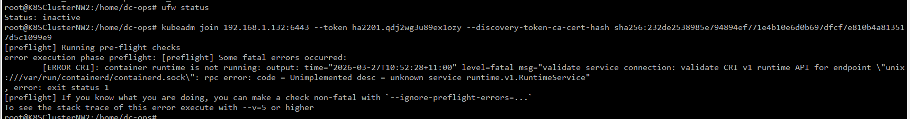

## Run these commands on the `second worker` ONLY:
✅ STEP 1 — Regenerate a fresh containerd config

```Shell
sudo rm -f /etc/containerd/config.tomlsudo containerd config default | sudo tee /etc/containerd/config.toml    ```


✅ STEP 2 — Enable systemd_cgroup (mandatory for Kubernetes)
```Shell
sudo sed -i 's/SystemdCgroup = false/SystemdCgroup = true/' \    /etc/containerd/config.toml
```

✅ STEP 3 — Update pause image (mandatory for kubeadm)
```Shell
sudo sed -i 's|sandbox_image = .*|sandbox_image = "registry.k8s.io/pause:3.9"|' \    /etc/containerd/config.toml
```

✅ STEP 4 — Restart containerd
```Shell
sudo systemctl restart containerd
```
Wait 2 seconds and test:
```Shell
sudo ctr versionsudo crictl info
```
✅ Must NOT show “Unimplemented RuntimeService”

✅ STEP 5 — Restart kubelet
```Shell
sudo systemctl restart kubelet
```

✅ STEP 6 — Now join again
Shellkubeadm join 192.168.1.132:6443 --token ha2201.qdj2wg3u89ex1ozy --discovery-token-ca-cert-hash sha256:232de2538985e794894ef771e4b10e6d0b697dfcf7e810b4a813517d5c1099e9Show more lines
✅ This time it will pass preflight.


Step 1 — Disable SWAP
```bash
sudo swapoff -a
sudo sed -i '/ swap / s/^/#/' /etc/fstab
```


```bash
#!/bin/bash

sudo apt-get update

sudo apt install docker.io -y

sudo chmod 666 /var/run/docker.sock

sudo apt-get install -y apt-transport-https ca-certificates curl gnupg

sudo mkdir -p -m 755 /etc/apt/yrings

curl -fsSL https://pkgs.k8s.io/core:/stable:/v1.30/deb/Release.key | sudo gpg --dearmor -o /etc/apt/keyrings/kubernetes-apt-keyring.gpg

echo 'deb [signed-by=/etc/apt/keyrings/kubernetes-apt-keyring.gpg] https://pkgs.k8s.io/core:/stable:/v1.30/deb/ /' | sudo tee /etc/apt/sources.list.d/kubernetes.list

sudo apt update

sudo apt install -y kubeadm=1.30.0-1.1 kubelet=1.30.0-1.1 kubectl=1.30.0-1.1
```
#On master node

```bash
sudo kubeadm init --pod-network-cidr=10.244.0.0/16
```
It will create a CIDR and token, we will connect our worker node to master node.

I am getting below error message:
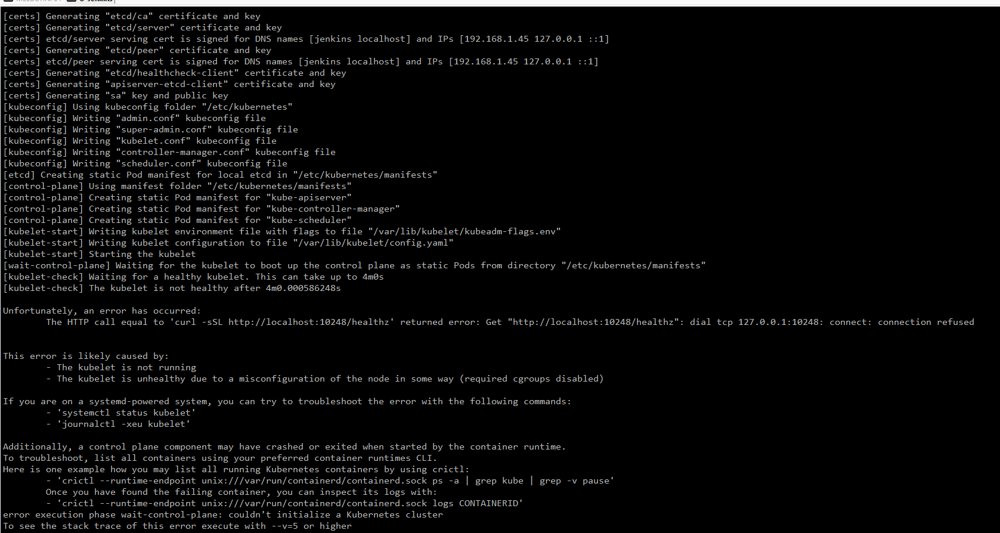


```bash
-------------------MasterNode------------------
sudo kubeadm init --pod-network-cidr=10.244.0.0/16

# The output of above command to run in worker nodes
mkdir -p $HOME/.kube
sudo cp -i /etc/kubernetes/admin.conf $HOME/.kube/config
sudo chown $(id -u):$(id -g) $HOME/.kube/config

kubectl apply -fhttps://raw.githubusercontent.com/projectcalico/calico/v3.24.0/manifests/calico.yaml

kubectl apply -fhttps://raw.githubusercontent.com/kubernetes/ingress-nginx/controller-v0.49.0/deploy/static/provider/baremetal/deploy.yaml
```

Troubleshooting

Root Cause
The `kubeadm init` command is trying to verify that the kubelet service is healthy by making an HTTP request to `http://localhost:10248/healthz`. The connection is being refused, meaning the kubelet either:

- Never started
- Crashed during startup
- Is misconfigured and can't initialize
## Why This Happens
Common causes on your system:

01. Swap is enabled — Kubernetes requires swap to be disabled. The warning message shows: `[WARNING Swap]: swap is supported for cgroup v2 only; the NodeSwap feature gate of the kubelet is beta but disabled by default`

02. Missing kernel modules — Kubernetes needs specific kernel modules loaded for networking and cgroups

03. cgroups misconfiguration — The system might not have proper cgroup setup for kubelet to function

04. Runtime (Docker/containerd) issues — The container runtime may not be properly configured or running

### Diagnosis Steps
To identify the exact problem, run:
```bash
# Check kubelet service status
systemctl status kubelet

# View detailed kubelet logs
journalctl -xeu kubelet

# Check if swap is enabled
free -h
swapon --show

# Check system requirements
cat /proc/sys/net/ipv4/ip_forward  # Should be 1
```
Common Fixes
1. Disable swap (most common fix):
```bash
sudo swapoff -a
```
2. Load required kernel modules:
```bash
cat <<EOF | sudo tee /etc/modules-load.d/k8s.conf
overlay
br_netfilter
EOF
sudo modprobe overlay
sudo modprobe br_netfilter
```
3. Configure sysctl settings:
```bash
cat <<EOF | sudo tee /etc/sysctl.d/k8s.conf
net.bridge.bridge-nf-call-iptables = 1
net.bridge.bridge-nf-call-ip6tables = 1
net.ipv4.ip_forward = 1
EOF
sudo sysctl --system
```
After applying these fixes, try kubeadm init again.

When I ran the above command again then got below
```bash
dc-ops@jenkins:~$ sudo kubeadm init --pod-network-cidr=10.244.0.0/16
I0325 11:59:31.847030 52570 version.go:256] remote version is much newer: v1.35.3; falling back to: stable-1.30
[init] Using Kubernetes version: v1.30.14
[preflight] Running pre-flight checks
error execution phase preflight: [preflight] Some fatal errors occurred:
[ERROR Port-6443]: Port 6443 is in use
[ERROR Port-10259]: Port 10259 is in use
[ERROR Port-10257]: Port 10257 is in use
[ERROR FileAvailable--etc-kubernetes-manifests-kube-apiserver.yaml]: /etc/kubernetes/manifests/kube-apiserver.yaml already exists
[ERROR FileAvailable--etc-kubernetes-manifests-kube-controller-manager.yaml]: /etc/kubernetes/manifests/kube-controller-manager.yaml already exists
[ERROR FileAvailable--etc-kubernetes-manifests-kube-scheduler.yaml]: /etc/kubernetes/manifests/kube-scheduler.yaml already exists
[ERROR FileAvailable--etc-kubernetes-manifests-etcd.yaml]: /etc/kubernetes/manifests/etcd.yaml already exists
[ERROR Port-10250]: Port 10250 is in use
[ERROR Port-2379]: Port 2379 is in use
[ERROR Port-2380]: Port 2380 is in use
[ERROR DirAvailable--var-lib-etcd]: /var/lib/etcd is not empty
[preflight] If you know what you are doing, you can make a check non-fatal with --ignore-preflight-errors=...
To see the stack trace of this error execute with --v=5 or higher
```
This error indicates that Kubernetes was already partially (or fully) initialized on this system. The ports are occupied and the manifest files already exist, so kubeadm init can't run again.

Option 1: Reset and Reinitialize (Start Fresh)
If you want to start over, reset the cluster first:

```bash
# Reset kubeadm
sudo kubeadm reset -f

# Clean up related directories
sudo rm -rf /etc/kubernetes /var/lib/etcd
sudo mkdir -p /var/lib/etcd

# Restart kubelet
sudo systemctl restart kubelet

# Now run kubeadm init again
sudo kubeadm init --pod-network-cidr=10.244.0.0/16
```
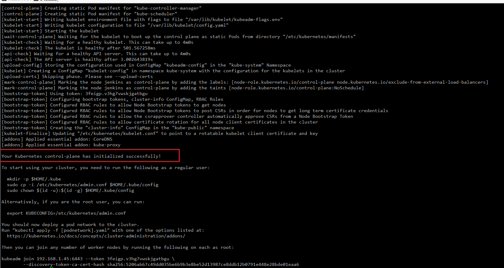

Option 2: Proceed with Existing Cluster (Recommended)
If the previous initialization succeeded, skip the kubeadm init step and proceed directly to cluster configuration:

```bash
# Setup kubeconfig
mkdir -p $HOME/.kube
sudo cp -i /etc/kubernetes/admin.conf $HOME/.kube/config
sudo chown $(id -u):$(id -g) $HOME/.kube/config

# Install network plugin (Calico)
kubectl apply -f https://raw.githubusercontent.com/projectcalico/calico/v3.24.0/manifests/calico.yaml

# Install Ingress Controller
kubectl apply -f https://raw.githubusercontent.com/kubernetes/ingress-nginx/controller-v0.49.0/deploy/static/provider/baremetal/deploy.yaml

# Verify cluster is running
kubectl get nodes
kubectl get pods --all-namespaces
```
Check if the cluster is already working by running:
```bash
kubectl get nodes
```

# Install network plugin (Calico)
```bash
kubectl apply -f https://raw.githubusercontent.com/projectcalico/calico/v3.24.0/manifests/calico.yaml
```
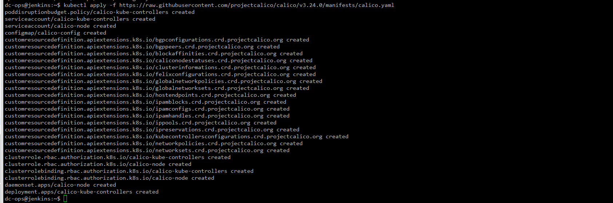


 Debug Bay (if repeat failure)
1. `kubectl get pods -n kube-system -o wide`
2. `sudo crictl ps -a` (or Docker container list)
3. `journalctl -u kubelet -n 100`
4. check each crash reason:
`kubectl logs -n kube-system -l component=kube-apiserver` (if API ephemeral)
`sudo cat /var/log/pods/`... etc

 Final sanity check after fix
```bash
kubectl get nodes
kubectl get pods -n kube-system
kubectl cluster-info
```
 If you want clean re-try (very safe here)
 ```bash
 sudo kubeadm reset -f
sudo rm -rf /etc/kubernetes /var/lib/etcd /var/lib/kubelet /etc/cni/net.d
sudo systemctl restart kubelet
init again:
sudo kubeadm init --pod-network-cidr=10.244.0.0/16
apply Calico (after API is healthy):
kubectl apply -f https://raw.githubusercontent.com/projectcalico/calico/v3.24.0/manifests/calico.yaml
 ```

```bash

crictl ps -a | grep kube-apiserver
crictl logs $(crictl ps -a | grep kube-apiserver | awk '{print $1}') --tail=80
```


Now, Cluster status

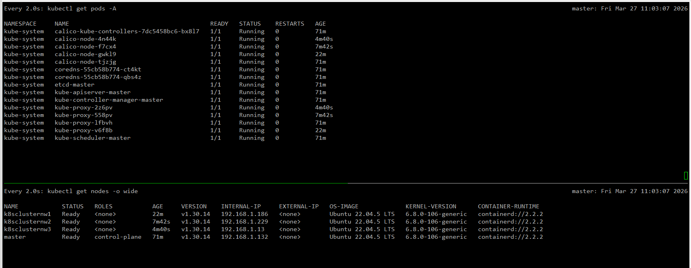

### server cluster role and binding

- On Master Node:


### Step-by-Step Process

#### 1. Apply ServiceAccount, Role, and RoleBinding YAML Files

Save the following YAML configurations in separate files and apply them.

##### admin-sa.yaml
```yaml
apiVersion: v1
kind: ServiceAccount
metadata:
  name: admin
  namespace: default
---
apiVersion: rbac.authorization.k8s.io/v1
kind: ClusterRole
metadata:
  name: admin-role
rules:
  - apiGroups: ["*"]
    resources: ["*"]
    verbs: ["*"]
---
apiVersion: rbac.authorization.k8s.io/v1
kind: ClusterRoleBinding
metadata:
  name: admin-rolebinding
roleRef:
  apiGroup: rbac.authorization.k8s.io
  kind: ClusterRole
  name: admin-role
subjects:
  - kind: ServiceAccount
    name: admin
    namespace: default
```

##### general-sa.yaml
```yaml
apiVersion: v1
kind: ServiceAccount
metadata:
  name: general
  namespace: default
---
apiVersion: rbac.authorization.k8s.io/v1
kind: ClusterRole
metadata:
  name: general-role
rules:
  - apiGroups: [""]
    resources: ["pods", "services", "endpoints", "namespaces"]
    verbs: ["get", "list", "watch"]
  - apiGroups: ["apps", "extensions"]
    resources: ["deployments", "replicasets", "daemonsets", "statefulsets"]
    verbs: ["get", "list", "watch"]
  - apiGroups: ["batch"]
    resources: ["jobs", "cronjobs"]
    verbs: ["get", "list", "watch"]
---
apiVersion: rbac.authorization.k8s.io/v1
kind: ClusterRoleBinding
metadata:
  name: general-rolebinding
roleRef:
  apiGroup: rbac.authorization.k8s.io
  kind: ClusterRole
  name: general-role
subjects:
  - kind: ServiceAccount
    name: general
    namespace: default
```

##### others-sa.yaml
```yaml
apiVersion: v1
kind: ServiceAccount
metadata:
  name: others
  namespace: default
---
apiVersion: rbac.authorization.k8s.io/v1
kind: ClusterRole
metadata:
  name: others-role
rules:
  - apiGroups: [""]
    resources: ["namespaces"]
    verbs: ["get", "list", "watch"]
---
apiVersion: rbac.authorization.k8s.io/v1
kind: ClusterRoleBinding
metadata:
  name: others-rolebinding
roleRef:
  apiGroup: rbac.authorization.k8s.io
  kind: ClusterRole
  name: others-role
subjects:
  - kind: ServiceAccount
    name: others
    namespace: default
```

Apply these configurations:
```sh
kubectl apply -f admin-sa.yaml
kubectl apply -f general-sa.yaml
kubectl apply -f others-sa.yaml
```
Now we will create a three namespace called `NS1, NS2 and NS3`

```bash
kubectl create namespace ns1
kubectl create namespace ns2
kubectl create namespace ns2
```

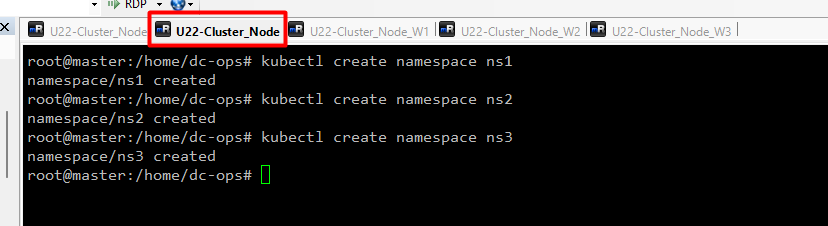

- now we will deploy on Namespace [ns2] using following command
  
```bash
root@master:/home/dc-ops# kubectl apply -f ds.yaml -n ns2
deployment.apps/boardgame-deployment created
service/boardgame-ssvc created
```
watch kubectl get pods -A -o wide
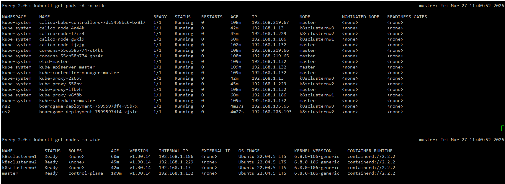


# we have to create a kubeconfig for each sa-account so that that config file can be used for authentication purpose.


#### 2. Generate Tokens for ServiceAccounts

```sh
# For Admin Service Account
kubectl -n default create token admin

# For General Service Account
kubectl -n default create token general

# For Others Service Account
kubectl -n default create token others
```
Do this one to get `kubeconfig` file

```bash
cat ~/.kube/config
```
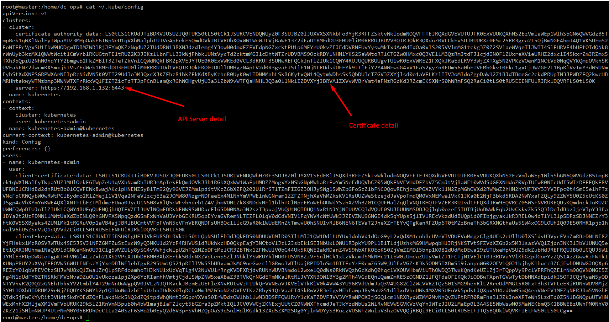


You can use [yamllink](https://www.yamllint.com/) to validate your config file
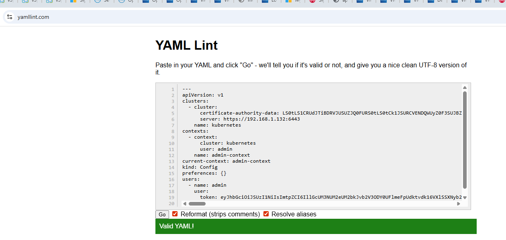

On the `worker Node 3` follow this one


#### 3. Create Kubeconfig Files

Use the tokens generated in the previous step to create kubeconfig files for each ServiceAccount.

##### Example: admin-kubeconfig.yaml
Save this content to `admin-kubeconfig.yaml`:
```yaml
apiVersion: v1
clusters:
- cluster:
    certificate-authority-data: LS0tLS1CRUdJTiBDRVJUSUZJQ0FURS0tLS0tCk1JSURCVENDQWUyZ0F3SUJBZ0lJZCt1WDRNSjVsVUl3RFFZSktvWklodmNOQVFFTEJRQXdGVEVUTUJFR0ExVUUKQXhNS2EzVmlaWEp1WlhSbGN6QWVGdzB5TkRBM01UTXhOakkxTXpkYUZ3MHpOREEzTVRFeE5qTXdNemRhTUJVeApFekFSQmdOVkJBTVRDbXQxWW1WeWJtVjBaWE13Z2dFaU1BMEdDU3FHU0liM0RRRUJBUVVBQTRJQkR3QXdnZ0VLCkFvSUJBUURVU3NOMGxEbWhFUlZFOE92MTBKeFFTeTBydXVOOTJxNkhRMGN6VU5PZTFuckdPNGZKY0FGdmNYSG0KM2FCR0J1V0lQOGtvWUNwUEhnVjd5NjYxR2ZqU0UrUnpYb2tHcTY3ZldFZng1bFJScUVHTjByL0kvcndQY2pPagpoazh5R0RObnRzU2hnbzhsZUVWYk5YNkNhcWltRDFGMGxiejk1YUg3VEhiZ3k4RFU1V1NzRk9PWVlWWmdlSDg2Cm5kK3gveG5VMUdwbkhLbFV0VDlnQldrSTI4b1pFZG4yS21zbHlNMVpjeFF4cGd0NldtV0VGc1lDZHJUeDZTa0oKZ1dseHE3alZUNHNISktKRFo5bXUxQkFLalZneVcxT0Z5SEFRWWZhWURGS093NjFrNjJhNkdHdk96S05sYS90YQpheSt1M2Z2cUYxaFNldGp6NlJZQ0NFMjl1aElWQWdNQkFBR2pXVEJYTUE0R0ExVWREd0VCL3dRRUF3SUNwREFQCkJnTlZIUk1CQWY4RUJUQURBUUgvTUIwR0ExVWREZ1FXQkJSYmdWMkdkS01lSnF3YVlQSk1JeVJ5d28raU56QVYKQmdOVkhSRUVEakFNZ2dwcmRXSmxjbTVsZEdWek1BMEdDU3FHU0liM0RRRUJDd1VBQTRJQkFRQ3ZtQXlnaXQ3SwpLdGZYRDBzcmxTVS84ODYzMEJXNStWQ0pMSTUwaFUzNTNGM1lJY2FEd3V1NDBGY2RMdUgyM2pHV0ozWnZOYWo2Ck1Qa3ZGWHNxbUZpOXJIME82UTU0K0NCRTZuUmRBelplblo1Nmg1QlFyZmIyNmdUYVVrMWVMM3daV2dGTWRvOEYKeGJFVFhxbXRRSDFpU1ZmakRuN3RXWXdpVVp0VmFwZGY4LzBwWEdnY01jdjZOcy9xRHJ5bjY0d2wrTlk0VENscwpZYXJ1WmQ4blkrM010bGxwQ0VYajJGOEN5V3diaXBRN1p1ZG14cURVZ242aGQ3MTVWWmo1Zml2aXFISnQzdUZxCldBa3B4Y0Q1eUEyNHF0RXpGcUVYUjhmOFRYRzZKZFpvTmtKUGxEODBiQjhjRlVRcTgxWkZPaHhnV3NzNGxoZGQKYnFTelZLU0tYckFICi0tLS0tRU5EIENFUlRJRklDQVRFLS0tLS0K
    server: https://172.31.45.104:6443  # Your K8s API server endpoint
  name: kubernetes
contexts:
- context:
    cluster: kubernetes
    user: admin
  name: admin-context
current-context: admin-context
kind: Config
preferences: {}
users:
- name: admin
  user:
    token: <admin-token>  # Replace with the generated token
```

Replace `<admin-token>` with the actual token generated for the `admin` ServiceAccount.

Repeat this process for the `general` and `others` ServiceAccounts, creating separate kubeconfig files.

##### general-kubeconfig.yaml
Save this content to `general-kubeconfig.yaml`:
```yaml
apiVersion: v1
clusters:
- cluster:
    certificate-authority-data: LS0tLS1CRUdJTiBDRVJUSU # Replace your certificate
    server: https://172.31.45.104:6443  # Your K8s API server endpoint
  name: kubernetes
contexts:
- context:
    cluster: kubernetes
    user: general
  name: general-context
current-context: general-context
kind: Config
preferences: {}
users:
- name: general
  user:
    token: <general-token>  # Replace with the generated token
```

##### others-kubeconfig.yaml
Save this content to `others-kubeconfig.yaml`:
```yaml
apiVersion: v1
clusters:
- cluster:
    certificate-authority-data: LS0tLS1CRUdJTiBDRVJUSUZJQ0FURS0tLS0tCk1JSURCVENDQWUyZ0F3SUJBZ0lJZCt1WDRNSjVsVUl3RFFZSktvWklodmNOQVFFTEJRQXdGVEVUTUJFR0ExVUUKQXhNS2EzVmlaWEp1WlhSbGN6QWVGdzB5TkRBM01UTXhOakkxTXpkYUZ3MHpOREEzTVRFeE5qTXdNemRhTUJVeApFekFSQmdOVkJBTVRDbXQxWW1WeWJtVjBaWE13Z2dFaU1BMEdDU3FHU0liM0RRRUJBUVVBQTRJQkR3QXdnZ0VLCkFvSUJBUURVU3NOMGxEbWhFUlZFOE92MTBKeFFTeTBydXVOOTJxNkhRMGN6VU5PZTFuckdPNGZKY0FGdmNYSG0KM2FCR0J1V0lQOGtvWUNwUEhnVjd5NjYxR2ZqU0UrUnpYb2tHcTY3ZldFZng1bFJScUVHTjByL0kvcndQY2pPagpoazh5R0RObnRzU2hnbzhsZUVWYk5YNkNhcWltRDFGMGxiejk1YUg3VEhiZ3k4RFU1V1NzRk9PWVlWWmdlSDg2Cm5kK3gveG5VMUdwbkhLbFV0VDlnQldrSTI4b1pFZG4yS21zbHlNMVpjeFF4cGd0NldtV0VGc1lDZHJUeDZTa0oKZ1dseHE3alZUNHNISktKRFo5bXUxQkFLalZneVcxT0Z5SEFRWWZhWURGS093NjFrNjJhNkdHdk96S05sYS90YQpheSt1M2Z2cUYxaFNldGp6NlJZQ0NFMjl1aElWQWdNQkFBR2pXVEJYTUE0R0ExVWREd0VCL3dRRUF3SUNwREFQCkJnTlZIUk1CQWY4RUJUQURBUUgvTUIwR0ExVWREZ1FXQkJSYmdWMkdkS01lSnF3YVlQSk1JeVJ5d28raU56QVYKQmdOVkhSRUVEakFNZ2dwcmRXSmxjbTVsZEdWek1BMEdDU3FHU0liM0RRRUJDd1VBQTRJQkFRQ3ZtQXlnaXQ3SwpLdGZYRDBzcmxTVS84ODYzMEJXNStWQ0pMSTUwaFUzNTNGM1lJY2FEd3V1NDBGY2RMdUgyM2pHV0ozWnZOYWo2Ck1Qa3ZGWHNxbUZpOXJIME82UTU0K0NCRTZuUmRBelplblo1Nmg1QlFyZmIyNmdUYVVrMWVMM3daV2dGTWRvOEYKeGJFVFhxbXRRSDFpU1ZmakRuN3RXWXdpVVp0VmFwZGY4LzBwWEdnY01jdjZOcy9xRHJ5bjY0d2wrTlk0VENscwpZYXJ1WmQ4blkrM010bGxwQ0VYajJGOEN5V3diaXBRN1p1ZG14cURVZ242aGQ3MTVWWmo1Zml2aXFISnQzdUZxCldBa3B4Y0Q1eUEyNHF0RXpGcUVYUjhmOFRYRzZKZFpvTmtKUGxEODBiQjhjRlVRcTgxWkZPaHhnV3NzNGxoZGQKYnFTelZLU

0tYckFICi0tLS0tRU5EIENFUlRJRklDQVRFLS0tLS0K
    server: https://172.31.45.104:6443  # Your K8s API server endpoint
  name: kubernetes
contexts:
- context:
    cluster: kubernetes
    user: others
  name: others-context
current-context: others-context
kind: Config
preferences: {}
users:
- name: others
  user:
    token: <others-token>  # Replace with the generated token
```

#### 4. Use the Kubeconfig Files

Set the `KUBECONFIG` environment variable to point to the desired kubeconfig file.

```sh
export KUBECONFIG=/path/to/admin-kubeconfig.yaml
```

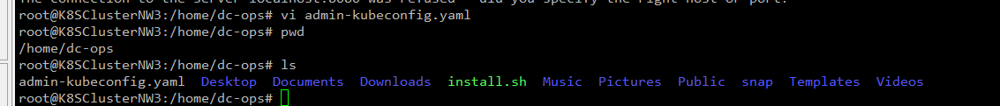

You can now use `kubectl` with the permissions of the `admin` ServiceAccount. Similarly, switch the `KUBECONFIG` environment variable to point to `general-kubeconfig.yaml` or `others-kubeconfig.yaml` to use the respective ServiceAccounts.

Earlier I was getting error message while access the cluder from node3 now I can see

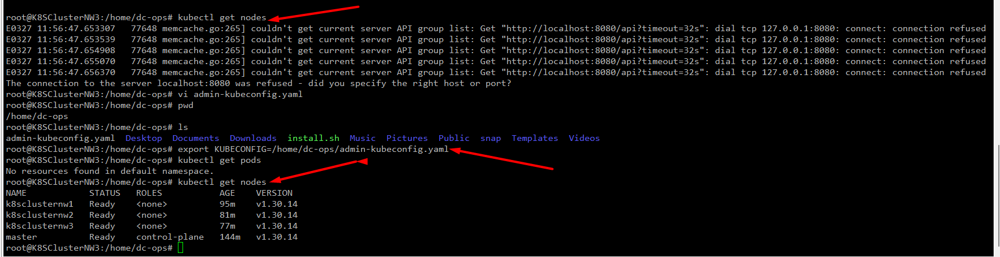

```bash
kubectl get all -n ns2
```
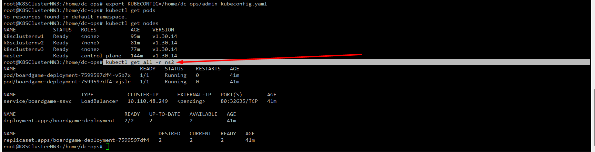

Also, try to delete the pod and it works with admin config
```bash
root@K8SClusterNW3:/home/dc-ops# kubectl delete pod/boardgame-deployment-7599597df4-v5b7x -n ns2
pod "boardgame-deployment-7599597df4-v5b7x" deleted
```

#### Example Commands:

```sh
# Use the admin kubeconfig
export KUBECONFIG=/path/to/admin-kubeconfig.yaml
kubectl get pods

# Switch to general kubeconfig
export KUBECONFIG=/path/to/general-kubeconfig.yaml
kubectl get pods

# Switch to others kubeconfig
export KUBECONFIG=/path/to/others-kubeconfig.yaml
kubectl get namespaces
```


On `WokderNode2`

we will test the `general role`

#Switch to general kubeconfig
```bash
export KUBECONFIG=/path/to/general-kubeconfig.yaml
```
kubectl get pods

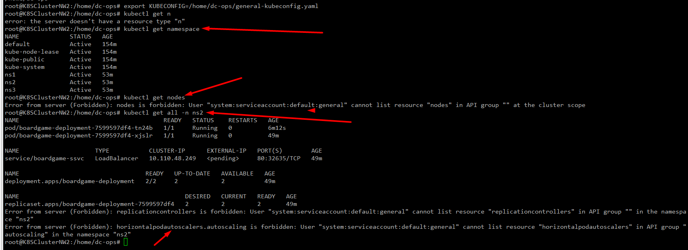

as you can see we have very limited permission on cluster because of the role.

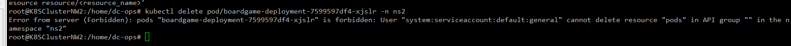
we can't delete any pod as well because of the service role.

on `workernode1`

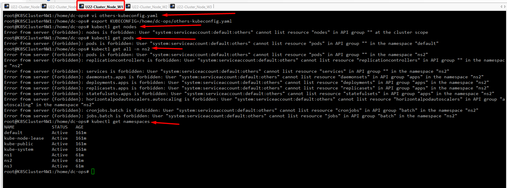


- https://github.com/derailed/k9s
- https://k9scli.io/topics/install/
- [How to Install K9s on Ubuntu: A Step-by-Step Guide](https://dev.to/dm8ry/how-to-install-k9s-on-ubuntu-a-step-by-step-guide-2f98
)

To install K9s on master node to view in GUI
```sh
curl -sS https://webinstall.dev/k9s | bash
export PATH=$PATH:$HOME/.local/bin
```
To start the k9s type in terminal as below
```bash
k9s
```
 How to know which command need to run then type
 ```sh
 ?
```
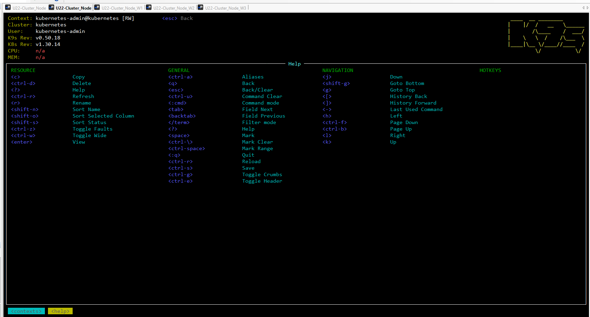

```sh
RESOURCE                                           GENERAL                                           NAVIGATION                                         HOTKEYS                           │
│ <c>                 Copy                           <ctrl-a>                Aliases                   <j>                   Down                                                           │
│ <ctrl-d>            Delete                         <q>                     Back                      <shift-g>             Goto Bottom                                                    │
│ <?>                 Help                           <esc>                   Back/Clear                <g>                   Goto Top                                                       │
│ <ctrl-r>            Refresh                        <ctrl-u>                Command Clear             <[>                   History Back                                                   │
│ <r>                 Rename                         <:cmd>                  Command mode              <]>                   History Forward                                                │
│ <shift-n>           Sort Name                      <tab>                   Field Next                <->                   Last Used Command                                              │
│ <shift-o>           Sort Selected Column           <backtab>               Field Previous            <h>                   Left                                                           │
│ <shift-s>           Sort Status                    </term>                 Filter mode               <ctrl-f>              Page Down                                                      │
│ <ctrl-z>            Toggle Faults                  <?>                     Help                      <ctrl-b>              Page Up                                                        │
│ <ctrl-w>            Toggle Wide                    <space>                 Mark                      <l>                   Right                                                          │
│ <enter>             View                           <ctrl-\>                Mark Clear                <k>                   Up                                                             │
│                                                    <ctrl-space>            Mark Range                                                                                                     │
│                                                    <:q>                    Quit                                                                                                           │
│                                                    <ctrl-r>                Reload                                                                                                         │
│                                                    <ctrl-s>                Save                                                                                                           │
│                                                    <ctrl-g>                Toggle Crumbs                                                                                                  │
│                                                    <ctrl-e>                Toggle Header                                                                                                  │
│                                                                                                                           
```
presh `esc` from keyboard to exit

Type `"colon :` to check anything

`Ctl+a` = to view all


- [K9 in Kubernetes | The Ultimate Kubernetes Tool](https://www.youtube.com/watch?v=Yhd5igKy7iQ)

- [Youtbe command for K9s ](https://www.youtube.com/watch?v=GlZKLS9K_BE)

- Command for K9s
  - `q` for `backward`
  - Shift+ : - for search "ctx -for cluster"


https://kubernetes.io/docs/tasks/administer-cluster/kubeadm/kubeadm-upgrade/


kubectl drain k8sclusternw1 --ignore-daemonsets --delete-emptydir-data


sudo rm /etc/apt/sources.list.d/kubernetes.list 2>/dev/null || true

✅ 1. Remove any old Kubernetes repo (important)
Shellsudo rm /etc/apt/sources.list.d/kubernetes.list 2>/dev/null || trueShow more lines
Also remove old keys (optional but recommended):
Shellsudo rm /etc/apt/trusted.gpg.d/kubernetes.gpg 2>/dev/null || true``Show more lines

✅ 2. Add the correct v1.31 repo
Shellcat <<EOF | sudo tee /etc/apt/sources.list.d/kubernetes.listdeb https://pkgs.k8s.io/core:/stable:/v1.31/deb/ /EOFShow more lines

✅ 3. Add the GPG key
Shellsudo curl -fsSL https://pkgs.k8s.io/core:/stable:/v1.31/deb/Release.key \    | sudo gpg --dearmor -o /etc/apt/trusted.gpg.d/kubernetes.gpgShow more lines

✅ 4. Update apt
Shellsudo apt updateShow more lines
You should now see:
Get: https://pkgs.k8s.io/core:/stable:/v1.31/deb InRelease


✅ 5. Confirm kubeadm versions are available
Shellapt-cache madison kubeadmShow more lines
Expected:
kubeadm | 1.31.14-1.1 | https://pkgs.k8s.io/core:/stable:/v1.31/deb  Packages
...


✅ 6. Install kubeadm 1.31.14‑1.1
Shellsudo apt-mark unhold kubeadmsudo apt install -y kubeadm=1.31.14-1.1Show more lines
Now check:
Shellkubeadm versionShow more lines
Expected:
kubeadm version: v1.31.14


✅ After fixing this, continue worker upgrade steps
Once kubeadm is installed:
Shellsudo kubeadm upgrade nodeShow more lines
Then upgrade kubelet + kubectl:
Shellsudo apt-mark unhold kubelet kubectlsudo apt install kubelet=1.31.14-1.1 kubectl=1.31.14-1.1sudo systemctl daemon-reloadsudo systemctl restart kubeletShow more lines
Then uncordon:
Shellkubectl uncordon k8sclusternw1Show more lines

✅ Want me to verify your worker repo?
Paste this command output from the worker node:
Shellcat /etc/apt/sources.list.d/kubernetes.listShow more lines
I can confirm whether the repo is correct before you proceed.


Want me to verify your worker repo?
Paste this command output from the worker node:
Shellcat /etc/apt/sources.list.d/kubernetes.list


# <span style="color: Yellow;"> Automated AWS DevOps CI/CD Pipeline for Amazon Prime Clone</span>


In today’s fast-paced tech world, automating application deployment and infrastructure management is crucial. This project demonstrates how to set up a complete CI/CD pipeline, use AWS EKS for Kubernetes deployment, and integrate Grafana and Prometheus for monitoring, all using Terraform for infrastructure management. By automating everything, you reduce the need for manual intervention and improve the speed and reliability of your deployments.

## <span style="color: Yellow;"> Prerequisites </span>

Before diving into this project, here are some skills and tools you should be familiar with:

- [x] [Clone repository for terraform code](https://github.com/mrbalraj007/DevOps_free_Bootcamp/tree/main/19.Real-Time-DevOps-Project/Terraform_Code/Code_IAC_Terraform_box)<br>
  __Note__: Replace resource names and variables as per your requirement in terraform code
  - from k8s_setup_file/main.tf (i.e ```balraj```*).
  - from Virtual machine main.tf (i.e keyname- ```MYLABKEY```*)

- [x] [App Repo (Simple-DevOps-Project)](https://github.com/mrbalraj007/Amazon-Prime-Clone-Project.git)


- [x] __AWS Account__: You’ll need an AWS account to create resources like EC2 instances, EKS clusters, and more.
- [x] __Terraform Knowledge__: Familiarity with Terraform to provision, manage, and clean up infrastructure.
- [x] __Basic Kubernetes (EKS)__: A basic understanding of Kubernetes, especially Amazon EKS, to deploy and manage containers.
- [x] __Docker Knowledge__: Basic knowledge of Docker for containerizing applications.
- [x] __Grafana & Prometheus__: Understanding of these tools to monitor applications and track performance.
- [x] __Jenkins__: Knowledge of Jenkins for building and automating the CI/CD pipeline.
- [x] __GitHub__: Experience with GitHub for version control and managing repositories.
- [x] __Command-Line Tools__: Basic comfort with using the command line for managing infrastructure and services.

## <span style="color: Yellow;">Setting Up the Infrastructure </span>

I have created a Terraform code to set up the entire infrastructure, including the installation of required applications, tools, and the EKS cluster automatically created.

**Note** &rArr;<span style="color: Green;"> ```EKS cluster``` creation will take approx. 10 to 15 minutes.

- &rArr; <span style="color: brown;">EC2 machines will be created named as ```"Jenkins-svr"```
- &rArr;<span style="color: brown;"> Jenkins Install
- &rArr;<span style="color: brown;"> Docker Install
- &rArr;<span style="color: brown;"> Trivy Install
- &rArr;<span style="color: brown;"> helm Install
- &rArr;<span style="color: brown;"> Grafan Install using Helm
- &rArr;<span style="color: brown;"> Prometheus Install using Helm
- &rArr;<span style="color: brown;"> AWS Cli Install
- &rArr;<span style="color: brown;"> Terraform Install
- &rArr;<span style="color: brown;"> EKS Cluster Setup

### <span style="color: Yellow;"> EC2 Instances creation

First, we'll create the necessary virtual machines using ```terraform``` code. 

Below is a terraform Code:

Once you [clone repo](https://github.com/mrbalraj007/DevOps_free_Bootcamp.git) then go to folder *<span style="color: cyan;">"19.Real-Time-DevOps-Project/Terraform_Code/Code_IAC_Terraform_box"</span>* and run the terraform command.
```bash
cd Terraform_Code/Code_IAC_Terraform_box

$ ls -l
dar--l          13/12/24  11:23 AM                All_Pipelines
dar--l          12/12/24   4:38 PM                k8s_setup_file
dar--l          11/12/24   2:48 PM                scripts
-a---l          11/12/24   2:47 PM            507 .gitignore
-a---l          13/12/24   9:00 AM           7238 main.tf
-a---l          11/12/24   2:47 PM           8828 main.txt
-a---l          11/12/24   2:47 PM           1674 MYLABKEY.pem
-a---l          11/12/24   2:47 PM            438 variables.tf
```

__<span style="color: Red;">Note__</span> &rArr; Make sure to run ```main.tf``` from inside the folders.

```bash
19.Real-Time-DevOps-Project/Terraform_Code/Code_IAC_Terraform_box/

dar--l          13/12/24  11:23 AM                All_Pipelines
dar--l          12/12/24   4:38 PM                k8s_setup_file
dar--l          11/12/24   2:48 PM                scripts
-a---l          11/12/24   2:47 PM            507 .gitignore
-a---l          13/12/24   9:00 AM           7238 main.tf
-a---l          11/12/24   2:47 PM           8828 main.txt
-a---l          11/12/24   2:47 PM           1674 MYLABKEY.pem
-a---l          11/12/24   2:47 PM            438 variables.tf
```
You need to run ```main.tf``` file using following terraform command.

Now, run the following command.
```bash
terraform init
terraform fmt
terraform validate
terraform plan
terraform apply 
# Optional <terraform apply --auto-approve>
```
-------

Once you run the terraform command, then we will verify the following things to make sure everything is setup via a terraform.

### <span style="color: Orange;"> Inspect the ```Cloud-Init``` logs</span>: 
Once connected to EC2 instance then you can check the status of the ```user_data``` script by inspecting the [log files](https://github.com/mrbalraj007/DevOps_free_Bootcamp/blob/main/19.Real-Time-DevOps-Project/cloud-init-output.log).
```bash
# Primary log file for cloud-init
sudo tail -f /var/log/cloud-init-output.log
                    or 
sudo cat /var/log/cloud-init-output.log | more
```
- *If the user_data script runs successfully, you will see output logs and any errors encountered during execution.*
- *If there’s an error, this log will provide clues about what failed.*

Outcome of "```cloud-init-output.log```"

- From Terraform:


### <span style="color: cyan;"> Verify the Installation 

- [x] <span style="color: brown;"> Docker version
```bash
ubuntu@ip-172-31-95-197:~$ docker --version
Docker version 24.0.7, build 24.0.7-0ubuntu4.1


docker ps -a
ubuntu@ip-172-31-94-25:~$ docker ps
```

- [x] <span style="color: brown;"> trivy version
```bash
ubuntu@ip-172-31-89-97:~$ trivy version
Version: 0.55.2
```
- [x] <span style="color: brown;"> Helm version
```bash
ubuntu@ip-172-31-89-97:~$ helm version
version.BuildInfo{Version:"v3.16.1", GitCommit:"5a5449dc42be07001fd5771d56429132984ab3ab", GitTreeState:"clean", GoVersion:"go1.22.7"}
```
- [x] <span style="color: brown;"> Terraform version
```bash
ubuntu@ip-172-31-89-97:~$ terraform version
Terraform v1.9.6
on linux_amd64
```
- [x] <span style="color: brown;"> eksctl version
```bash
ubuntu@ip-172-31-89-97:~$ eksctl version
0.191.0
```
- [x] <span style="color: brown;"> kubectl version
```bash
ubuntu@ip-172-31-89-97:~$ kubectl version
Client Version: v1.31.1
Kustomize Version: v5.4.2
```
- [x] <span style="color: brown;"> aws cli version
```bash
ubuntu@ip-172-31-89-97:~$ aws version
usage: aws [options] <command> <subcommand> [<subcommand> ...] [parameters]
To see help text, you can run:
  aws help
  aws <command> help
  aws <command> <subcommand> help
```

- [x] <span style="color: brown;"> Verify the EKS cluster

On the ```jenkins``` virtual machine, Go to directory ```k8s_setup_file``` and open the file ```cat apply.log``` to verify the cluster is created or not.
```sh
ubuntu@ip-172-31-90-126:~/k8s_setup_file$ pwd
/home/ubuntu/k8s_setup_file
ubuntu@ip-172-31-90-126:~/k8s_setup_file$ cd ..
```

After Terraform deploys on the instance, now it's time to setup the cluster. You can SSH into the instance and run:

```bash
aws eks update-kubeconfig --name <cluster-name> --region 
<region>
```
Once EKS cluster is setup then need to run the following command to make it intract with EKS.

```sh
aws eks update-kubeconfig --name balraj-cluster --region us-east-1
```
*The ```aws eks update-kubeconfig``` command is used to configure your local kubectl tool to interact with an Amazon EKS (Elastic Kubernetes Service) cluster. It updates or creates a kubeconfig file that contains the necessary authentication information to allow kubectl to communicate with your specified EKS cluster.*

<span style="color: Orange;"> What happens when you run this command:</span><br>
The AWS CLI retrieves the required connection information for the EKS cluster (such as the API server endpoint and certificate) and updates the kubeconfig file located at ```~/.kube/config (by default)```.
It configures the authentication details needed to connect kubectl to your EKS cluster using IAM roles.
After running this command, you will be able to interact with your EKS cluster using kubectl commands, such as ```kubectl get nodes``` or ```kubectl get pods```.

```sh
kubectl get nodes
kubectl cluster-info
kubectl config get-contexts
```


## <span style="color: yellow;"> Setup the Jenkins </span>
Go to Jenkins EC2 and run the following command 
Access Jenkins via ```http://<your-server-ip>:8080```. 

- Retrieve the initial admin password using:
```bash
sudo cat /var/lib/jenkins/secrets/initialAdminPassword
```


### <span style="color: cyan;"> Install plugin in Jenkins </span>
```sh
Manage Jenkins > Plugins view> Under the Available tab, plugins available for download from the configured Update Center can be searched and considered:
```
Following plugin needs to be installed.
```sh
SonarQube Scanner
NodeJS
Pipeline: Stage View
Blue Ocean
Eclipse Temurin installer
Docker
Docker Commons
Docker Pipeline
Docker API
docker-build-step
Prometheus metrics
```
**Note**&rArr; Restart the jenkins to make it effective plugin.

####  <span style="color: cyan;"> Create ```Webhook``` in SonarQube
    - <publicIPaddressofJenkins:9000>
- Click on 
  - Administration>Configuration>webooks
  - **Name**: sonarqube-webhook
  - **URL**: <publicIPaddressofJenkins:8080/sonarqube-webhook>
  


####  <span style="color: cyan;"> Create a token in SonarQube
  - Administration>Security>Users>Create a new token
  


####  <span style="color: yellow;"> Configure Sonarqube credential in Jenkins</span>.
```
Dashboard> Manage Jenkins> Credentials> System> Global credentials (unrestricted)
```


####  <span style="color: yellow;"> Configure AWS credential (Access & Secret Keys) in Jenkins
```
Dashboard> Manage Jenkins> Credentials> System> Global credentials (unrestricted)
```


####  <span style="color: cyan;"> Configure/Integrate SonarQube in Jenkins</span>
```
Dashboard > Manage Jenkins > System
```


####  <span style="color: cyan;"> Configure JDK , Sonar scanner, and Node JS</span>
- To configure ```JDK```
```
Dashboard> Manage Jenkins> Tools
```


- To configure ```SonarQube Scanner```
```
Dashboard > Manage Jenkins > Tools
```


- To configure ```Node JS```
```
Dashboard > Manage Jenkins > Tools
```


<span style="color: Red;"> **Note**</span> &rArr; We have to select ```NodeJS 16.20.0``` as per project required. it won't work on ```NodeJs23.x```

- To configure ```Docker```
```
Dashboard > Manage Jenkins > Tools
```


#### <span style="color: orange;">  Build a pipeline.</span>

  - Here is the [Pipeline Script](https://github.com/mrbalraj007/DevOps_free_Bootcamp/blob/main/19.Real-Time-DevOps-Project/Terraform_Code/Code_IAC_Terraform_box/All_Pipelines/Pipeline_CI.md)

- Build deployment pipeline.


Run the pipeline; the first time it would fail, and rerun it with parameters.

- I ran the pipeline but it failed with below error message.


**Solution:**
```sh
sudo su - ansadmin
sudo usermod -aG docker $USER && newgrp docker
sudo usermod -aG docker jenkins && newgrp docker
```
*I ran the pipeline but it failed with same error message and I found the below solution.*

**Solution:** 

jenkins service need to be restarted.
```bash
sudo systemctl restart jenkins
```

I reran the pipeline, and it went well, and the build got completed successfully.


Build status: 


- Application status in SonarQube


**Quality Gate** Status is failed because of NodeJS mismatch version, as I was using the latest version of Nodes (23.x).


- I removed the nodes js 23.x and installed ```nodejs16```.
- <span style="color: red;">**Note: &rArr; You won't be facing this issue because I have updated the Terraform code.**</span>
```sh
sudo apt-get remove -y nodejs

curl -fsSL https://deb.nodesource.com/setup_16.x | sudo -E bash -
sudo apt-get install -y nodejs
```

Rerun the pipeline and change the quality gate status to passed from failed.


```sh
Cleanup Old Images from ECR checks if there are more than 3 images in the repository and deletes the old ones if necessary.
```


### <span style="color: orange;"> Setup ArgoCD </span>

- Run the following commands to verify the ```Pods``` and ```services type```

```sh
kubectl get pods -n argocd
kubectl get svc -n argocd

kubectl get pods -n prometheus
kubectl get service -n prometheus
```

```sh
ubuntu@bootstrap-svr:~$ kubectl get pods -n argocd
NAME                                                READY   STATUS    RESTARTS   AGE
argocd-application-controller-0                     1/1     Running   0          40m
argocd-applicationset-controller-64f6bd6456-79k4l   1/1     Running   0          40m
argocd-dex-server-5fdcd9df8b-85dl7                  1/1     Running   0          40m
argocd-notifications-controller-778495d96f-lsmww    1/1     Running   0          40m
argocd-redis-69fd8bd669-qd4qs                       1/1     Running   0          40m
argocd-repo-server-75567c944-cwrdv                  1/1     Running   0          40m
argocd-server-5c768cdd96-wh4t5                      1/1     Running   0          40m

ubuntu@bootstrap-svr:~$ kubectl get svc -n argocd
NAME                                      TYPE        CLUSTER-IP       EXTERNAL-IP   PORT(S)                      AGE
argocd-applicationset-controller          ClusterIP   172.20.37.85     <none>        7000/TCP,8080/TCP            41m
argocd-dex-server                         ClusterIP   172.20.185.246   <none>        5556/TCP,5557/TCP,5558/TCP   41m
argocd-metrics                            ClusterIP   172.20.6.170     <none>        8082/TCP                     41m
argocd-notifications-controller-metrics   ClusterIP   172.20.36.121    <none>        9001/TCP                     41m
argocd-redis                              ClusterIP   172.20.104.129   <none>        6379/TCP                     41m
argocd-repo-server                        ClusterIP   172.20.184.189   <none>        8081/TCP,8084/TCP            41m
argocd-server                             ClusterIP   172.20.150.224   <none>        80/TCP,443/TCP               41m
argocd-server-metrics                     ClusterIP   172.20.208.97    <none>        8083/TCP                     41m
ubuntu@bootstrap-svr:~$

```

```sh
ubuntu@bootstrap-svr:~$ kubectl get pods -n prometheus
NAME                                                     READY   STATUS    RESTARTS   AGE
alertmanager-stable-kube-prometheus-sta-alertmanager-0   2/2     Running   0          42m
prometheus-stable-kube-prometheus-sta-prometheus-0       2/2     Running   0          42m
stable-grafana-6c67f4cb8d-k4bpb                          3/3     Running   0          42m
stable-kube-prometheus-sta-operator-74dcfb4f9c-2vwqr     1/1     Running   0          42m
stable-kube-state-metrics-6d6d5fcb75-w8k4l               1/1     Running   0          42m
stable-prometheus-node-exporter-8tqgh                    1/1     Running   0          42m
stable-prometheus-node-exporter-jkkkf                    1/1     Running   0          42m

ubuntu@bootstrap-svr:~$ kubectl get service -n prometheus
NAME                                      TYPE        CLUSTER-IP      EXTERNAL-IP   PORT(S)                      AGE
alertmanager-operated                     ClusterIP   None            <none>        9093/TCP,9094/TCP,9094/UDP   42m
prometheus-operated                       ClusterIP   None            <none>        9090/TCP                     42m
stable-grafana                            ClusterIP   172.20.21.160   <none>        80/TCP                       42m
stable-kube-prometheus-sta-alertmanager   ClusterIP   172.20.20.12    <none>        9093/TCP,8080/TCP            42m
stable-kube-prometheus-sta-operator       ClusterIP   172.20.69.94    <none>        443/TCP                      42m
stable-kube-prometheus-sta-prometheus     ClusterIP   172.20.199.20   <none>        9090/TCP,8080/TCP            42m
stable-kube-state-metrics                 ClusterIP   172.20.52.146   <none>        8080/TCP                     42m
stable-prometheus-node-exporter           ClusterIP   172.20.40.154   <none>        9100/TCP                     42m
```

- Run these commands to change the service type from ```ClusterIP``` to ```LoadBalancer```.
```sh
kubectl patch svc stable-kube-prometheus-sta-prometheus -n prometheus -p '{"spec": {"type": "LoadBalancer"}}'
kubectl patch svc stable-grafana -n prometheus -p '{"spec": {"type": "LoadBalancer"}}'
kubectl patch svc argocd-server -n argocd -p '{"spec": {"type": "LoadBalancer"}}'
```
Verify status now.


- Now, time to run the script to get ArgoCD and Grafana access details.

[Here is the access script](https://github.com/mrbalraj007/DevOps_free_Bootcamp/blob/main/19.Real-Time-DevOps-Project/Terraform_Code/Code_IAC_Terraform_box/All_Pipelines/access.sh)

Once you access the ArgoCD URL and create an application
 - **Application Name**: amazon-prime-app
 - **Project Name**: default
 - **Sync Policy**: Automatic (Select Prune Resources and SelfHeal)
 - **Repository URL**: https://github.com/mrbalraj007/Amazon-Prime-Clone-Project.git
 - **Revison**: main
 - **Path**: k8s_files (where Kubernetes files reside)
 - **cluster URL**: Select default cluster
 - **Namespace**: default


- Update the **latest image** name in ```deployment.yml```


**Verify the apps Status**


**Verify Pods & service status**


Click on the hostnames (URL details) from the service and access it in the browser.
```
http://af70e2590416f4788be765b667bb8175-2006799998.us-east-1.elb.amazonaws.com:3000/
```


Congratulations :-) the application is working and accessible.


- Access Prometheus/Grafana and create a custom dashboard in Prometheus/Grafana.
  


Dashboard in Grafana


### <span style="color: yellow;"> Cleanup the images and deployment using the pipeline.</span>

- Here is the [Updated pipeline](https://github.com/mrbalraj007/DevOps_free_Bootcamp/blob/main/19.Real-Time-DevOps-Project/Terraform_Code/Code_IAC_Terraform_box/All_Pipelines/Cleanup.md)


*Pipeline would be partially failed because KMS will take some days to get it deleted automatically.*


- Verify the pods and services in EKS. If it is not deleted, then change the service back to ClusterIP and rerun the pipeline.

```sh
kubectl patch svc stable-kube-prometheus-sta-prometheus -n prometheus -p '{"spec": {"type": "ClusterIP"}}'
kubectl patch svc stable-grafana -n prometheus -p '{"spec": {"type": "ClusterIP"}}'
kubectl patch svc argocd-server -n argocd -p '{"spec": {"type": "ClusterIP"}}'
kubectl patch svc singh-app -p '{"spec": {"type": "ClusterIP"}}'
```
<!-- 

```sh
Verify the Outputs in the EKS Module: Check the documentation or code for the terraform-aws-modules/eks/aws module version 19.15.1 you are using. The correct output might not be cluster_id but something else like eks_cluster_id, cluster_name, etc.

To confirm:

Look into .terraform/modules/eks/outputs.tf.
Identify the exact name of the output variable for the cluster name.
```


```sh
Run the following command outside the Jenkins pipeline to verify connectivity and status:
bash
Copy code
aws eks --region us-east-1 describe-cluster --name balraj-cluster
``` -->


## <span style="color: Yellow;"> Environment Cleanup:
- As we are using Terraform, we will use the following command to delete 

- __Delete all deployment/Service__ first
    - ```sh
        kubectl delete deployment.apps/singh-app
        kubectl delete service singh-app
        kubectl delete service/singh-service
        ```
   - __```EKS cluster```__ second
   - then delete the __```virtual machine```__.


#### To delete ```AWS EKS cluster```
   -   Login into the bootstrap EC2 instance and change the directory to /k8s_setup_file, and run the following command to delete the cluste.
```bash
sudo su - ubuntu
cd /k8s_setup_file
sudo terraform destroy --auto-approve
```


#### Now, time to delete the ```Virtual machine```.
Go to folder *<span style="color: cyan;">"19.Real-Time-DevOps-Project/Terraform_Code/Code_IAC_Terraform_box"</span>* and run the terraform command.
```bash
cd Terraform_Code/

$ ls -l
Mode                 LastWriteTime         Length Name
----                 -------------         ------ ----
da---l          26/09/24   9:48 AM                Code_IAC_Terraform_box

Terraform destroy --auto-approve
```

## <span style="color: Yellow;"> Conclusion

By combining Terraform, Jenkins, EKS, Docker, and monitoring tools like Grafana and Prometheus, this project automates the entire process of infrastructure management, application deployment, and monitoring. The use of a cleanup pipeline ensures that resources are removed when no longer needed, helping to reduce costs. This approach offers a scalable, efficient, and cost-effective solution for modern application deployment and management.


__Ref Link:__

- [Youtube VideoLink](https://www.youtube.com/watch?v=Gd9Aofx-iLI&t=7808s)

- [Install Terraform](https://developer.hashicorp.com/terraform/tutorials/aws-get-started/install-cli)

- [Install AWS Cli](https://docs.aws.amazon.com/cli/latest/userguide/getting-started-install.html)

- [EKS Create-repository](https://docs.aws.amazon.com/cli/latest/reference/ecr/create-repository.html)

- [EKS describe-repositories](https://docs.aws.amazon.com/cli/latest/reference/ecr/describe-repositories.html)

- [AWS configure](https://docs.aws.amazon.com/cli/latest/reference/configure/set.html)

- [Jenkins-environment-variables-1](https://phoenixnap.com/kb/jenkins-environment-variables)
- [Jenkins-environment-variables-2](https://devopsqa.wordpress.com/2019/11/19/list-of-available-jenkins-environment-variables/)
