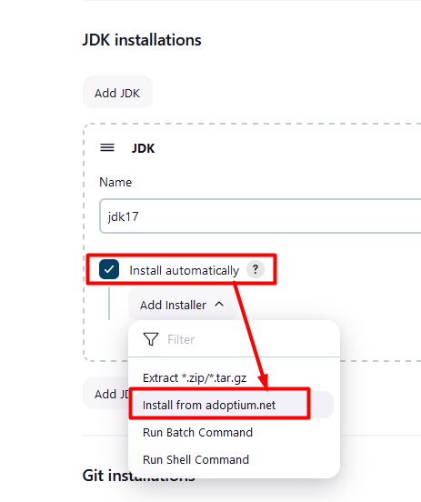
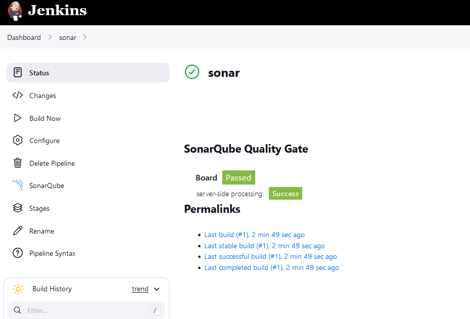
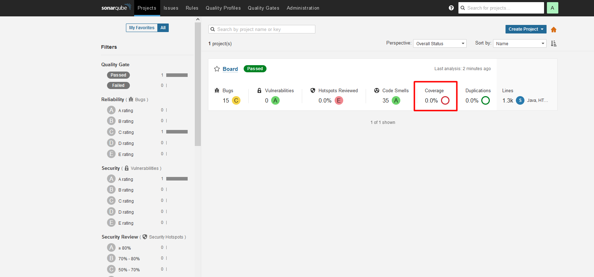
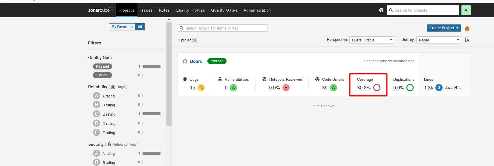
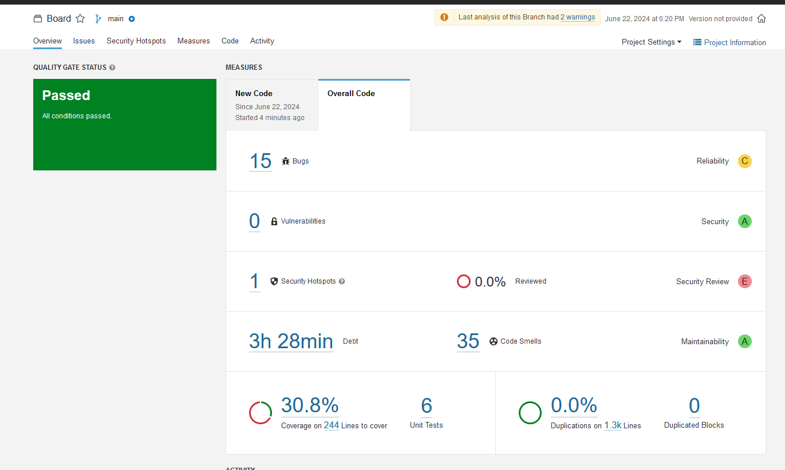

# Install SonarQube
Wil install java
sudo apt install openjdk-17-jre-headless 

sudo apt  install docker.io
Ø Add your user to the Docker group:
```bash
sudo usermod -aG docker $USER
```
in my lab, I am using this one
```bash
ubuntu@ip-172-31-60-173:~$ sudo ls -l /var/run/docker.sock
srw-rw---- 1 root docker 0 Jun 22 07:55 /var/run/docker.sock

ubuntu@ip-172-31-60-173:~$ sudo chmod 666 /var/run/docker.sock

ubuntu@ip-172-31-60-173:~$ sudo ls -l /var/run/docker.sock
srw-rw-rw- 1 root docker 0 Jun 22 07:55 /var/run/docker.sock
```
docker run -d --name sonarqube -p 9000:9000 sonarqube:lts-community

```bash
$ docker run -d --name sonarqube -p 9000:9000 sonarqube:lts-community
Unable to find image 'sonarqube:lts-community' locally
lts-community: Pulling from library/sonarqube
2ec76a50fe7c: Pull complete
fab7f202453a: Pull complete
ee59ca42def8: Pull complete
2ce2282f972f: Pull complete
d2a9e456ba82: Pull complete
71c8a5659a0c: Pull complete
7a2728c832b0: Pull complete
4f4fb700ef54: Pull complete
Digest: sha256:11ddd66bdeee203327c444af17252075284a0b6b7db24e5aa1d3cd48eadd7681
Status: Downloaded newer image for sonarqube:lts-community
8842924b4a1b3267a6af5534e4f149c405f38988b12fa0eeb65f74965b86cc21
```
```bash
$ docker ps
CONTAINER ID   IMAGE                     COMMAND                  CREATED         STATUS         PORTS                                       NAMES
8842924b4a1b   sonarqube:lts-community   "/opt/sonarqube/dock…"   2 minutes ago   Up 2 minutes   0.0.0.0:9000->9000/tcp, :::9000->9000/tcp   sonarqube
```

Will access it via host IP addrss:9000 port
By default user and password is "admin".


default login credential is ```admin``` 

we will install two plugin (SonarQube Scanner & Eclipse Temurin installer)


- we are configuring it now
> - 01. first we have configure the java



> - 02. configure the sonar scanner

> - 03. configure the maven


will create a pipeline.


will generate the token from SonarQ to configure in Jenkins.


#### will use this project:
 https://github.com/jaiswaladi246/Boardgame

now, we will confiugre it in Jenkins.


Now, we will configure the sonar server


```bash
pipeline {
    agent any
    
    tools {
        maven 'maven3'
        jdk 'jdk17'
    }
    environment {
        SCANNER_HOME= tool 'sonar-scanner'
    }
    stages {
        stage('Git Checkout') {
            steps {
                git branch: 'main', url: 'https://github.com/jaiswaladi246/Boardgame'
            }
        }
        stage('compile') {
            steps {
                sh 'mvn compile'
            }
        }
        stage('test') {
            steps {
                sh 'mvn test'
            }
        }
        stage('sonar') {
            steps {
                withSonarQubeEnv('sonar-server') {
                    sh "$SCANNER_HOME/bin/sonar-scanner -Dsonar.projectName=Board -Dsonar.projectKey=BoardKey -Dsonar.java.binaries=target"
                }
            }
        }
         stage('Build') {
            steps {
                sh 'mvn package'
            }
        }
        
    }
}
```



 still empty, we need to rerun the command.



Overall, code
