# Install SonarQube


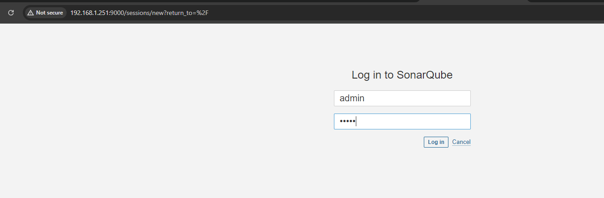

default login credential is ```admin``` 

we will install two plugin (SonarQube Scanner & Eclipse Temurin installer)
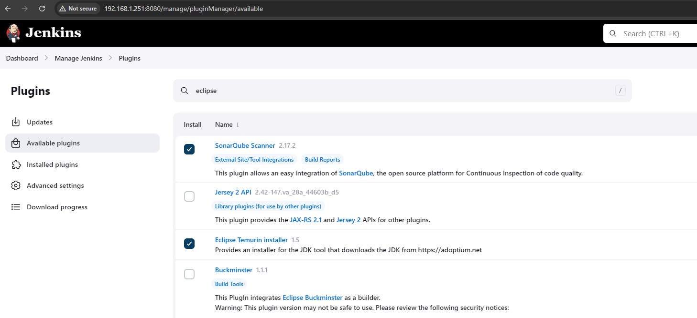

- we are configuring it now
> - 01. first we have configure the java
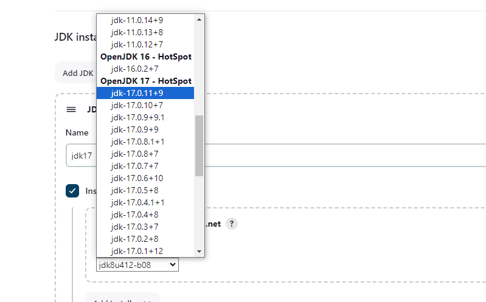
> - 02. configure the sonar scanner
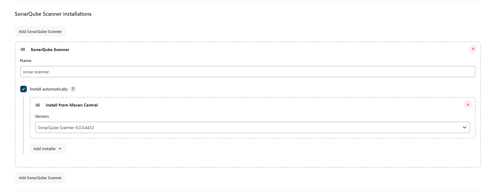
> - 03. configure the maven
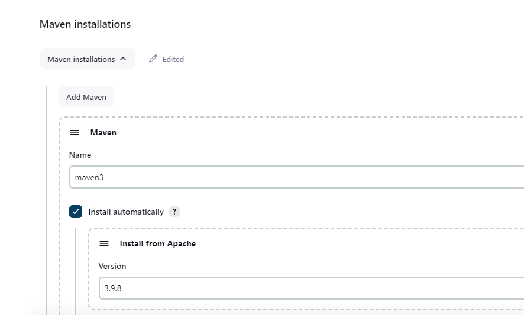

will create a pipeline.
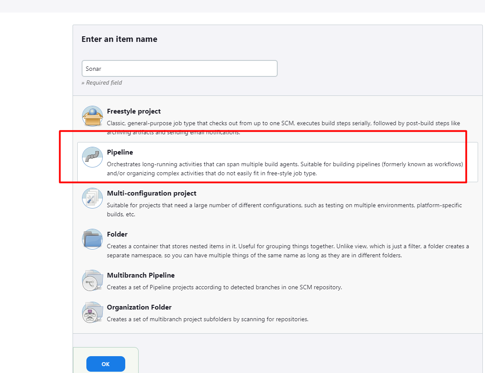

will generate the token from SonarQ to configure in Jenkins.
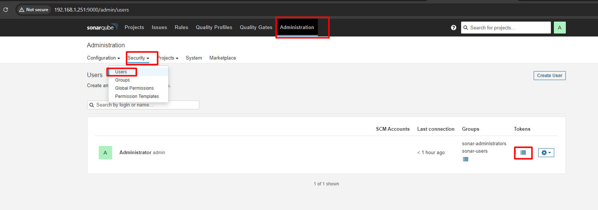

now, we will confiugre it in Jenkins.
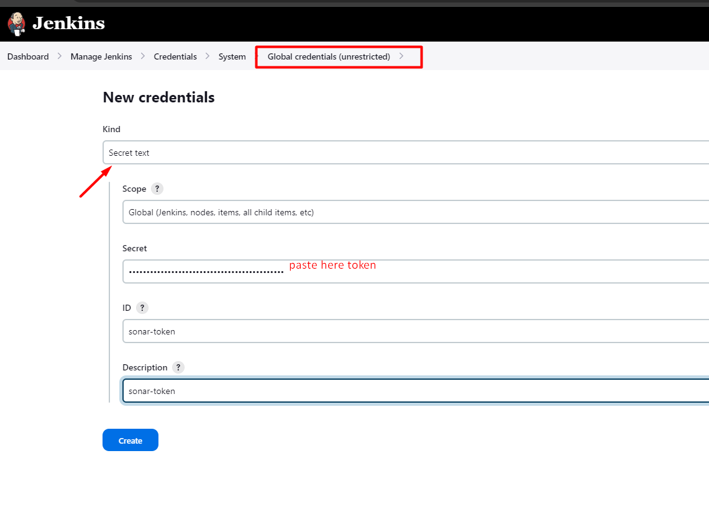

Now, we will configure the sonar server
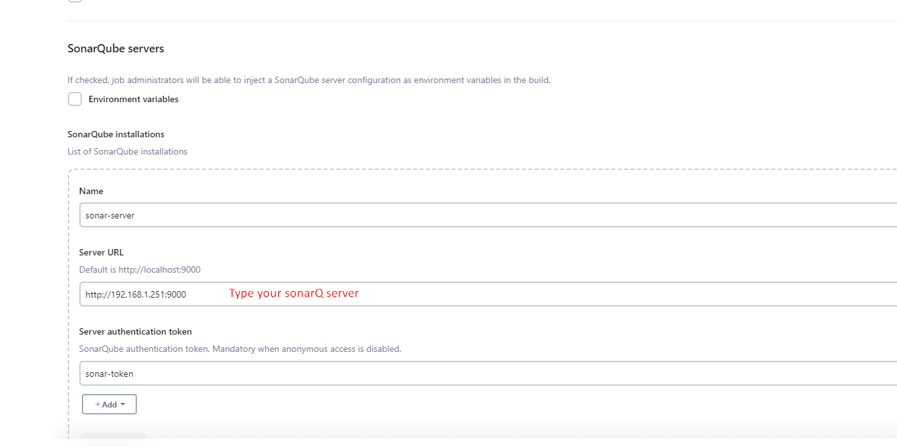


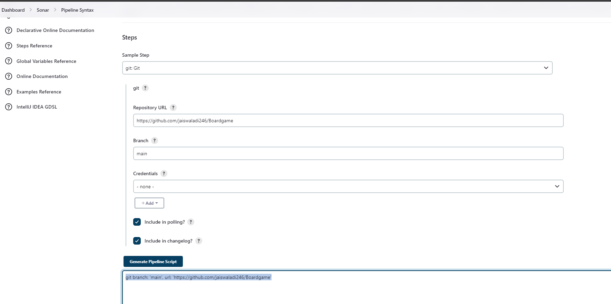

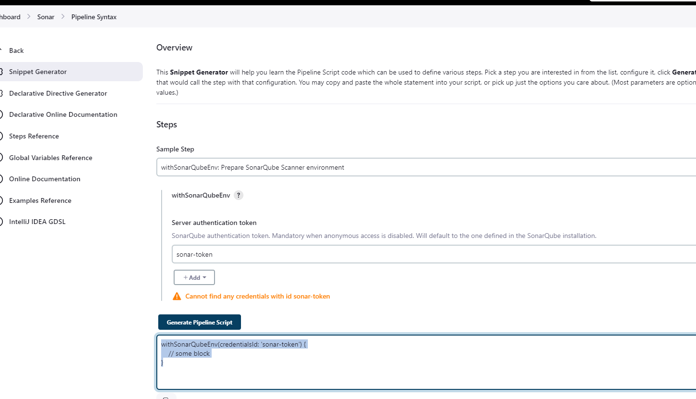


```bash
pipeline {
    agent any
    
    tools {
        maven 'maven3'
        jdk 'jdk17'
    }
    environment{
        SCANNER_HOME= tool 'sonar-scanner'
    }
    stages {
        stage('Git CheckOut') {
            steps {
                git branch: 'main', url: 'https://github.com/jaiswaladi246/Boardgame'    
            }
        }
        
        stage('Compile') {
            steps {
                sh "mvn compile"
            }
        }
        
        stage('Test') {
            steps {
                sh "mvn test"
            }
        }
        
        stage('Sonar') {
            steps {
                withSonarQubeEnv('sonar-server') {
                sh "$SCANNER_HOME/bin/sonar-scanner -Dsonar.projectName=Board -Dsonar.projectkey=Boardkey -Dsonar.java.binaries=target"    
                }
            }
        }
         stage('Build') {
            steps {
                sh "mvn package"
            }
        }
        
        
    }
}

```