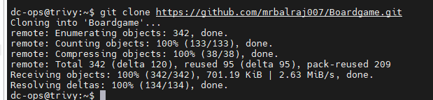
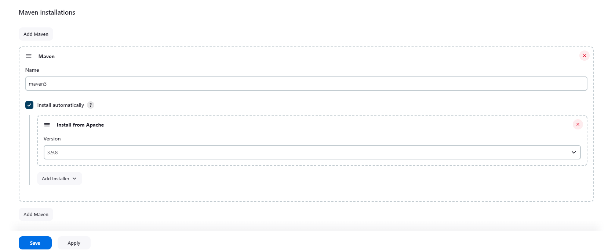
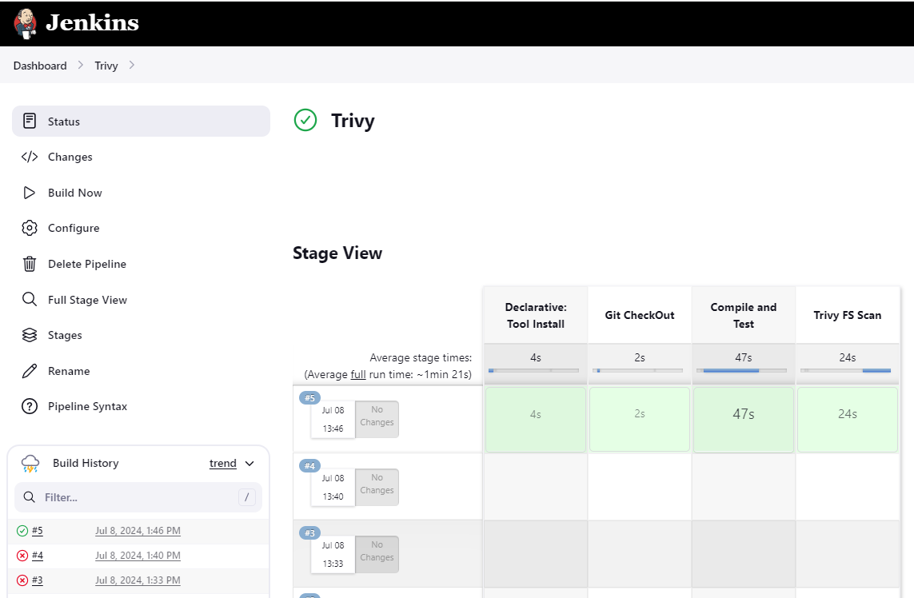
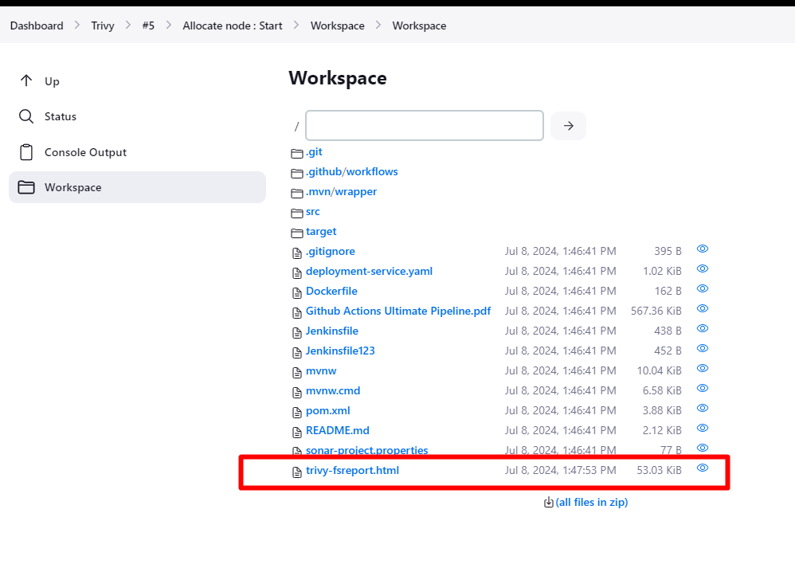
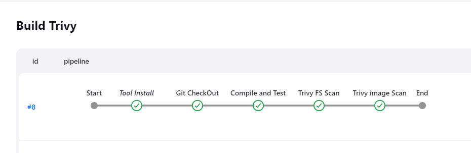
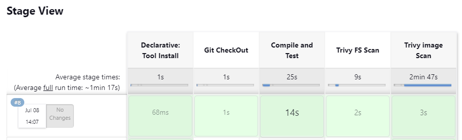
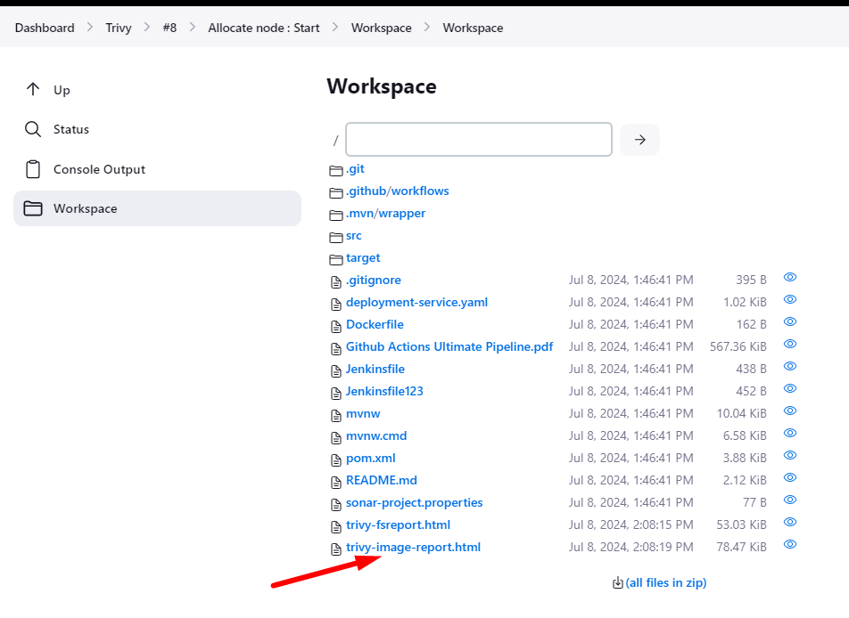

# What is Trivy tool and how to use it?
---

## About Trivy:

__Trivy__, developed by Aqua Security, is an open-source vulnerability scanner specifically designed for container images. It stands out for its ease of use, efficiency, and comprehensive scanning capabilities. Trivy is a valuable tool for developers and operations teams who aim to maintain secure containerized environments by identifying vulnerabilities and misconfigurations.

### Use Cases for Trivy:

- Early Detection of Vulnerabilities: By integrating Trivy into CI/CD pipelines, organizations can detect vulnerabilities in container images at the earliest possible stage. This helps in maintaining a robust security posture and reduces the cost and effort required to address vulnerabilities later in the lifecycle.

- Compliance and Auditing: Trivy’s comprehensive scanning capabilities help organizations adhere to security policies and regulatory requirements. It provides detailed reports on vulnerabilities, which are essential for auditing and compliance purposes.

- Securing Container Registries: Scanning images in container registries ensures that only secure and compliant images are available for deployment. This minimizes the risk of deploying vulnerable images to production environments.

- Runtime Security: In Kubernetes environments, Trivy can continuously monitor running containers for vulnerabilities, ensuring that any newly discovered vulnerabilities are promptly identified and addressed.

### Benefits of Using Trivy:

- Ease of Use: Trivy is designed with simplicity in mind, making it easy to integrate into various workflows. It requires minimal configuration and can be used with a single command, making it accessible to developers and security teams alike.

- Comprehensive Scanning: Trivy performs thorough scans of container images, including operating system packages and application dependencies. It covers a wide range of vulnerabilities, providing a comprehensive security assessment.

- Speed and Efficiency: Trivy is optimized for speed, allowing for quick scans without compromising accuracy. This is crucial in CI/CD environments where speed and efficiency are paramount.

- Open Source and Community Support: As an open-source tool, Trivy benefits from a vibrant community that contributes to its development and maintenance. This ensures continuous improvement and up-to-date vulnerability databases.

- Integration Capabilities: Trivy integrates seamlessly with popular CI/CD tools, container registries, and Kubernetes, providing flexibility and ease of adoption in various environments.

__*Environment Setup:*__

| Host Name | IP Address | OS |
|:-----------:|:------------:|:------------:|
| trivy    |    192.168.1.60     | Ubuntu 24.04 LTS |

<span style="color: red;">*__Note__*</span>--> Will install ```jenkins``` on same machine as plug-in is not available for ```trivy```


### How to install it: 
[Ref Link](https://aquasecurity.github.io/trivy/v0.18.3/installation/)

```powershell
sudo apt-get install wget apt-transport-https gnupg lsb-release
wget -qO - https://aquasecurity.github.io/trivy-repo/deb/public.key | sudo apt-key add -
echo deb https://aquasecurity.github.io/trivy-repo/deb $(lsb_release -sc) main | sudo tee -a /etc/apt/sources.list.d/trivy.list
sudo apt-get update -y
sudo apt-get install trivy -y
```

- will use the repo and will clone it on trivy machine: ```git clone https://github.com/mrbalraj007/Boardgame.git```



```Boardgame``` folder is created and will scan it.

will run the following command:
```sh
trivy fs .
```

*To properly set the outcome in the report*
```sh
trivy fs --format table -o trivy-fsreport.html .
```


#### Install docker
- Will install the docker on same ```trivy``` machine and will the permission as below 
```sh
sudo apt  install docker.io -y

# To change the ownership to current user
sudo chown $USER /var/run/docker.sock

# Add your user to the Docker group:
sudo usermod -aG docker $USER
```

#### Verify Docker version
```powershell
docker --version
Docker version 24.0.7, build 24.0.7-0ubuntu4
```

- <span style="color: yellow;"> Will pull the image and will scan it:</span> ```image=sonarqube:lts-community```
```sh
docker pull sonarqube:lts-community
```
#### <span style="color: red;">Now, We will scan the docker image.</span>

- Will scan the docker image:
```powershell
trivy image --format table -o trivy-image-report.html sonarqube:lts-community
```

### Using Jenkins:

- configure the ```maven``` first.

Dashboard > Manage Jenkins> Tools:

click on add under Maven installations.
```bash
name: maven3
Version: 3.9.8
```



will use Jenkins on the same server and create a declarative pipeline.

- <span style="color: red;">Here we have scan the FS only </span>
```bash
pipeline {
    agent any
    tools {
        maven 'maven3'
          } 
    stages {
        stage('Git CheckOut') {
            steps {
                git branch: 'main', url: 'https://github.com/mrbalraj007/Boardgame.git'
            }
        }
    stage('Compile and Test') {
            steps {
                sh 'mvn test'
            }
        } 
    stage('Trivy FS Scan') {
            steps {
                sh 'trivy fs --format table -o trivy-fsreport.html .'
            }
        }
    }
}
```
- Pipeline executed succesfully.


- output generated in workspace.


- <span style="color: yellow;">Here we have scan the FS + Docker image </span>
```sh
pipeline {
    agent any
    tools {
        maven 'maven3'
          } 
    stages {
        stage('Git CheckOut') {
            steps {
                git branch: 'main', url: 'https://github.com/mrbalraj007/Boardgame.git'
            }
        }
    stage('Compile and Test') {
            steps {
                sh 'mvn test'
            }
        } 
    stage('Trivy FS Scan') {
            steps {
                sh 'trivy fs --format table -o trivy-fsreport.html .'
            }
        }
    stage('Trivy image Scan') {
            steps {
                sh 'trivy image --format table -o trivy-image-report.html sonarqube:lts-community'
            }
        }
    }
}
```

Pipeline Status:




Workspace:



