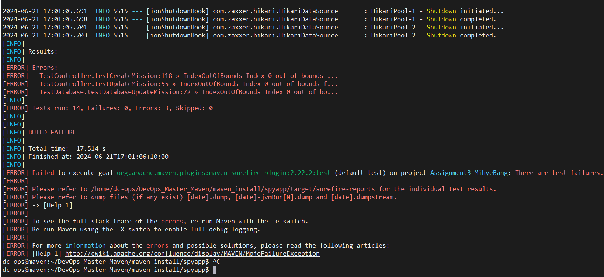
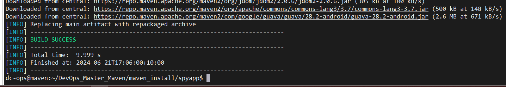

# Maven LifeCycle


#### Environment Setup
```bash
Hostname: maven
IP Address: 192.168.1.250
```

*Password Less Authentication*

```bash
sudoers file
path=/etc/sudoers 
dev-ops ALL=(ALL) NOPASSWD: ALL

cat /etc/sudoers | grep -i "dev-ops"
echo "dev-ops ALL=(ALL) NOPASSWD: ALL" >> /etc/sudoers
cat /etc/sudoers | grep -i "dev-ops"

cat /etc/ssh/sshd_config | grep "PasswordAuthentication"
echo "PasswordAuthentication yes" >> /etc/ssh/sshd_config
cat /etc/ssh/sshd_config | grep "PasswordAuthentication"

cat /etc/ssh/sshd_config | grep "PermitRootLogin"
echo "PermitRootLogin yes"  >> /etc/ssh/sshd_config
cat /etc/ssh/sshd_config | grep "PermitRootLogin"
```

*Restart the sshd reservices.*
```
systemctl restart sshd
systemctl daemon-reload

or 

Restart the sshd service In Ubuntu
/etc/init.d/ssh restart
sudo service ssh restart
sudo restart ssh
```

### first update the package so that it would be ready for available.
```bash
sudo apt-get update
```

Install the git because I'll cloning my Github Repo: 
```bash
sudo apt-get install git -y
```

- will verify ```java``` is avaliable or not because to install ```maven``` java should be installed on the system.
```bash
$ java
Command 'java' not found, but can be installed with:
sudo apt install default-jre              # version 2:1.17-75, or
sudo apt install openjdk-17-jre-headless  # version 17.0.10~6ea-1
sudo apt install openjdk-11-jre-headless  # version 11.0.21+9-0ubuntu1
sudo apt install openjdk-19-jre-headless  # version 19.0.2+7-4
sudo apt install openjdk-20-jre-headless  # version 20.0.2+9-1
sudo apt install openjdk-21-jre-headless  # version 21.0.1+12-3
sudo apt install openjdk-22-jre-headless  # version 22~22ea-1
sudo apt install openjdk-8-jre-headless   # version 8u392-ga-1
```
- Install the Java
```bash
$ sudo apt install openjdk-17-jre-headless -y
```

- verify the java version
```bash
$ java --version
openjdk 17.0.11 2024-04-16
OpenJDK Runtime Environment (build 17.0.11+9-Ubuntu-1)
OpenJDK 64-Bit Server VM (build 17.0.11+9-Ubuntu-1, mixed mode, sharing)
```

verify maven install or not
```bash
$ mvn
Command 'mvn' not found, but can be installed with:
sudo apt install maven
```

will install the maven
```bash
$ sudo apt install maven -y
```

- maven version
```bash
$ mvn --version
Apache Maven 3.8.7
Maven home: /usr/share/maven
Java version: 17.0.11, vendor: Ubuntu, runtime: /usr/lib/jvm/java-17-openjdk-amd64
Default locale: en_US, platform encoding: UTF-8
OS name: "linux", version: "6.8.0-31-generic", arch: "amd64", family: "unix"
```

#### Maven Project

[Will clone the project](https://github.com/shackverse/spyapp)

will goto ```spyapp``` folder and run the following command:

```bash
$ cd spyapp/

$ mvn compile
```


* - compile will let you know wheather any source code error (Syntex based) in code or not.
* - make sure, you will the compile where there pom.xl file exists.

*How to test* ```(will do the compile then do the test)```.

```
 ls
mvnw  mvnw.cmd  pom.xml  README.md  src  target
```
```bash
$ mvn test
```
Note:- *it will download the depency which is required for testing*



I am getting error message because there is in issue in code, we have ```two``` option here.
- 1. we can inform ```developer/testing team``` about the code having issue
- 2. or we can ignore the test.

How to skip the testing by using these parameter(```-DskipTests=true```)
```bash
$ mvn package -DskipTests=true
```


after running the package and skipping the testing, will see what have changes.

* target folder created now and inside the target folder you will get ```.jar``` file.
```bash
$ cd target/

$/target$ ls -l
total 23704
-rw-rw-r-- 1 dc-ops dc-ops 24230652 Jun 21 17:06 Assignment3_MihyeBang-0.0.1-SNAPSHOT.jar # this file is generated.
-rw-rw-r-- 1 dc-ops dc-ops    10759 Jun 21 17:05 Assignment3_MihyeBang-0.0.1-SNAPSHOT.jar.original
drwxrwxr-x 4 dc-ops dc-ops     4096 Jun 21 16:54 classes
drwxrwxr-x 3 dc-ops dc-ops     4096 Jun 21 16:54 generated-sources
drwxrwxr-x 3 dc-ops dc-ops     4096 Jun 21 17:00 generated-test-sources
drwxrwxr-x 2 dc-ops dc-ops     4096 Jun 21 17:05 maven-archiver
drwxrwxr-x 3 dc-ops dc-ops     4096 Jun 21 16:54 maven-status
drwxrwxr-x 2 dc-ops dc-ops     4096 Jun 21 17:01 surefire-reports
drwxrwxr-x 3 dc-ops dc-ops     4096 Jun 21 17:00 test-classes
```
we can run the jar file by using below- 

we are still in ```target``` folder and will execute command from there.
```bash
$ java -jar Assignment3_MihyeBang-0.0.1-SNAPSHOT.jar
```


now, we will try to access it ```http://192.168.1.250:8080/``` and it's accessible.


* application is working fine.

Note-- In package, all the artificates are store in target folder.


- now, we will install
 will out from target folder and current path is:
```bash
 /spyapp$ ls -l
total 36
-rw-rw-r-- 1 dc-ops dc-ops 10070 Jun 21 16:46 mvnw
-rw-rw-r-- 1 dc-ops dc-ops  6608 Jun 21 16:46 mvnw.cmd
-rw-rw-r-- 1 dc-ops dc-ops  1968 Jun 21 16:46 pom.xml
-rw-rw-r-- 1 dc-ops dc-ops   656 Jun 21 16:46 README.md
drwxrwxr-x 4 dc-ops dc-ops  4096 Jun 21 16:46 src
drwxrwxr-x 9 dc-ops dc-ops  4096 Jun 21 17:06 target
```
```bash
$ mvn install -DskipTests=true
```


Now, we will see in deploy:

If you want to clean the target folder then you need to run the below:
```bash
mvn clean package -DskipTests=true
```
